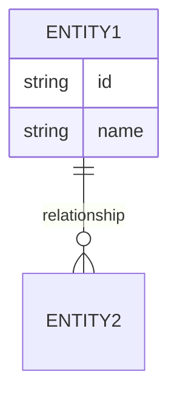

# Feature: [Feature Name]

## Overview

[2-3 sentence description of the feature] [Explain the business value and target users]

## User Stories

### US-XXX-001: [Story Title]

**As a** [type of user]  
**I want to** [action/goal]  
**So that** [benefit/value]

**Acceptance Criteria:**

- [ ] Criterion 1 - specific and testable
- [ ] Criterion 2 - specific and testable
- [ ] Criterion 3 - specific and testable

**Priority:** High | Medium | Low  
**Estimate:** [Story points or time]

### US-XXX-002: [Another Story Title]

**As a** [type of user]  
**I want to** [action/goal]  
**So that** [benefit/value]

**Acceptance Criteria:**

- [ ] Criterion 1
- [ ] Criterion 2

## Use Cases

### UC-XXX-001: [Use Case Name]

**Actor:** [Primary Actor]  
**Goal:** [What the actor wants to achieve]

**Preconditions:**

- [Condition that must be true before starting]
- [Another precondition]

**Main Flow:**

1. [First step - actor action]
2. [System response]
3. [Next actor action]
4. [System response]
5. [Final step]

**Postconditions:**

- [State after successful completion]
- [Another postcondition]

**Alternative Flows:**

**3a. [Error condition]:**

1. System shows [error message]
2. Actor [corrective action]
3. Return to step 3

**Exceptional Flows:**

**At any time. [Exception condition]:**

1. System [handles exception]
2. Use case ends

## Technical Considerations

### Architecture

```typescript
// Key interfaces/types
interface [EntityName] {
  id: string;
  // Add properties
}

// DTOs
interface [CreateDto] {
  // Add properties
}
```

### Dependencies

| Service/Module | Purpose            | Impact if Unavailable |
| -------------- | ------------------ | --------------------- |
| [Service Name] | [What it provides] | [Impact]              |

### Security Requirements

- [Security requirement 1]
- [Security requirement 2]

### Performance Requirements

- [Performance metric 1]
- [Performance metric 2]

### Data Model



## API Specification

### Endpoints

**POST /api/v1/[resource]**

Create a new [resource].

```json
{
  "field1": "value",
  "field2": "value"
}
```

**Response 201 Created:**

```json
{
  "id": "uuid",
  "field1": "value",
  "field2": "value",
  "createdAt": "2026-02-13T00:00:00Z"
}
```

**Error Responses:**

| Status | Condition     | Response                                             |
| ------ | ------------- | ---------------------------------------------------- |
| 400    | Invalid input | `{ "error": "Validation failed", "details": [...] }` |
| 409    | Conflict      | `{ "error": "Resource already exists" }`             |

## Testing Strategy

### Unit Tests

- [ ] Test [component] with valid input
- [ ] Test [component] with invalid input
- [ ] Test error handling

### Integration Tests

- [ ] Test [integration point 1]
- [ ] Test [integration point 2]

### E2E Tests

- [ ] Test complete user flow

## Risks and Mitigation

| Risk               | Probability     | Impact          | Mitigation        |
| ------------------ | --------------- | --------------- | ----------------- |
| [Risk description] | High/Medium/Low | High/Medium/Low | [How to mitigate] |

## Dependencies and Blocking Items

- [ ] Dependency 1 - [Status]
- [ ] Dependency 2 - [Status]

## Open Questions

1. [Question 1]?
2. [Question 2]?

## References

- [Related Feature](../XXY-related-feature/feature.md)
- [ADR-NNN: Related Decision](../../adrs/NNN-decision.md)
- [External Reference](https://example.com)

## Changelog

| Date       | Version | Change        | Author |
| ---------- | ------- | ------------- | ------ |
| 2026-02-13 | 0.1     | Initial draft | [Name] |

---

**Author:** [Team/Person Name]  
**Created:** [YYYY-MM-DD]  
**Last Updated:** [YYYY-MM-DD]  
**Status:** Draft | In Review | Approved | Implemented
