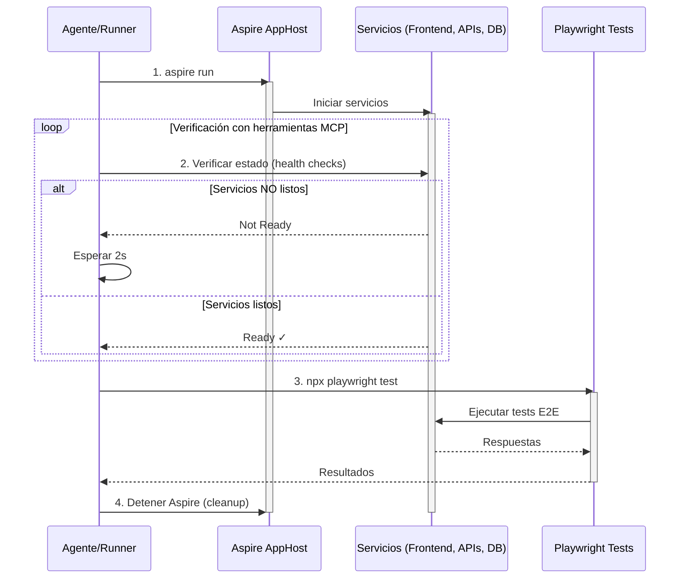

# Playwright E2E Testing

## When to Use

- Testing critical user journeys end-to-end
- Validating frontend behavior across browsers
- Automating UI regression testing
- Testing frontend integration with backend APIs
- Generating test reports with screenshots and traces
- The user or an agent needs to automate UI testing

## Quick Start

```bash
# Install Playwright
npm install -D @playwright/test
npx playwright install

# Or for .NET projects
dotnet add package Microsoft.Playwright
pwsh bin/Debug/net8.0/playwright.ps1 install

# Run tests
npx playwright test
# or: dotnet test
```

## Project Structure

```text
tests/e2e/
├── playwright.config.ts
├── tests/
│   ├── authentication/
│   │   ├── login.spec.ts
│   │   └── logout.spec.ts
│   ├── time-tracking/
│   │   ├── create-entry.spec.ts
│   │   └── edit-entry.spec.ts
│   └── reports/
│       └── generate-report.spec.ts
├── fixtures/
│   ├── test-users.ts
│   └── test-data.ts
└── utils/
    ├── page-objects/
    │   ├── LoginPage.ts
    │   ├── DashboardPage.ts
    │   └── TimeEntryPage.ts
    └── helpers.ts
```

## Playwright Configuration (TypeScript)

Ver ejemplo completo: [playwright.config.ts](examples/playwright.config.ts)

Características clave:

- **Ejecución paralela**: Tests ejecutados en paralelo para mayor velocidad
- **Reintentos**: Configuración de reintentos automáticos en CI
- **Reportes**: HTML, JUnit y JSON para diferentes consumidores
- **Múltiples navegadores**: Chromium, Firefox, WebKit y mobile
- **Servidor web**: Arranque automático del servidor de desarrollo

## Page Object Model

Ver ejemplo completo: [LoginPage.ts](examples/LoginPage.ts)

El patrón Page Object Model (POM) proporciona:

- **Encapsulación**: Lógica de la página en una sola clase
- **Reutilización**: Métodos compartidos entre tests
- **Mantenibilidad**: Cambios en un solo lugar
- **Legibilidad**: Tests más expresivos y fáciles de entender

## Test Example (TypeScript)

Ver ejemplo completo: [login.spec.ts](examples/login.spec.ts)

Características del ejemplo:

- **Estructura AAA**: Arrange-Act-Assert para claridad
- **Page Objects**: Uso de POM para reutilización
- **Multiple escenarios**: Happy path y casos de error
- **Hooks**: `beforeEach` para configuración común

## API Mocking

Ver ejemplo completo: [api-mocking.spec.ts](examples/api-mocking.spec.ts)

El mocking de APIs permite:

- **Tests aislados**: No depender del backend real
- **Casos de error**: Simular fallos sin afectar el sistema
- **Velocidad**: Tests más rápidos sin llamadas reales
- **Determinismo**: Resultados predecibles y repetibles

## Fixtures for Test Data

Ver ejemplo completo: [test-users.ts](examples/test-users.ts)

Las fixtures de Playwright proporcionan:

- **Setup/Teardown automático**: Login y logout gestionados
- **Reutilización**: Estado compartido entre tests
- **Type-safety**: TypeScript para fixtures tipadas
- **Composición**: Combinar múltiples fixtures

## Visual Regression Testing

Ver ejemplo completo: [visual-regression.spec.ts](examples/visual-regression.spec.ts)

El testing visual captura:

- **Screenshots**: Comparación pixel a pixel
- **Regresiones visuales**: Detecta cambios no intencionados
- **Cross-browser**: Validación en múltiples navegadores
- **Tolerancia**: Configuración de diferencias aceptables

## Accessibility Testing

Ver ejemplo completo: [accessibility.spec.ts](examples/accessibility.spec.ts)

Testing de accesibilidad con Axe:

- **Estándares WCAG**: Validación de cumplimiento
- **Automatización**: Detecta problemas comunes
- **Integración**: Fácil integración con Playwright
- **Reportes**: Detalle de violaciones encontradas

Instalación: `npm install -D @axe-core/playwright`

## Playwright for .NET

Ver ejemplo completo: [LoginTests.cs](examples/LoginTests.cs)

Playwright para .NET ofrece:

- **API nativa**: Uso idiomático de C# y .NET
- **NUnit/MSTest/xUnit**: Integración con frameworks de testing
- **Async/await**: Patrón asíncrono de .NET
- **Type-safety**: Fuertemente tipado

Instalación:

```bash
dotnet add package Microsoft.Playwright
dotnet add package Microsoft.Playwright.NUnit
pwsh bin/Debug/net8.0/playwright.ps1 install
```

## Running Tests

```bash
# Run all tests
npx playwright test

# Run specific test file
npx playwright test login.spec.ts

# Run in headed mode (see browser)
npx playwright test --headed

# Run specific browser
npx playwright test --project=chromium

# Debug mode
npx playwright test --debug

# Generate HTML report
npx playwright show-report

# Update snapshots
npx playwright test --update-snapshots

# .NET
dotnet test
dotnet test --filter "FullyQualifiedName~Login"
```

## E2E Testing with Aspire

Cuando se utiliza [.NET Aspire](https://learn.microsoft.com/en-us/dotnet/aspire/) para orquestar
servicios distribuidos, el proceso de ejecución de pruebas E2E requiere coordinación entre múltiples
herramientas MCP y verificación del estado de los servicios.

**ARQUITECTURA CLAVE**: El agente/runner que coordina la ejecución es responsable de iniciar Aspire
y verificar que los servicios están listos ANTES de ejecutar Playwright. Playwright NO debe tener
lógica de espera de Aspire.

� **Documentación de Referencia**:

- 🤖 **[Guía para Agentes](examples/AGENT-GUIDE.md)** - Si eres un agente de IA ejecutando tests,
  LEE ESTO PRIMERO
- 🎯 **[Flujo E2E Completo](examples/ASPIRE-E2E-FLOW.md)** - Referencia rápida del flujo paso a paso

#### 🤖 Resumen para Agentes

Si eres un agente de IA coordinando tests E2E, tu única responsabilidad es ejecutar este flujo en
orden:

1. **Iniciar Aspire**: `aspire run` o `aspire run --project <path>`
2. **Esperar servicios**: Usar herramientas MCP de Aspire para verificar que TODOS los servicios
   están `Running` y `Healthy`
3. **Ejecutar Playwright**: `npx playwright test` (solo cuando servicios están listos)
4. **Cleanup**: `pkill -f aspire` o equivalente (en bloque `finally`)

**¿Qué NO debes hacer?**

- ❌ NO ejecutes Playwright antes de verificar servicios
- ❌ NO delegues la espera de servicios a Playwright
- ❌ NO modifiques playwright.config para añadir lógica de espera
- ❌ NO olvides detener Aspire al finalizar

**Plantilla mínima**:

```typescript
try {
  exec("aspire run");
  await aspire.waitForServices({ timeout: 120000 }); // TU responsabilidad
  await execAsync("npx playwright test"); // Solo cuando listo
} finally {
  await execAsync("pkill -f aspire"); // Siempre cleanup
}
```

📖 **[Leer guía completa con ejemplos y troubleshooting](examples/AGENT-GUIDE.md)**

### Flujo de Ejecución Correcto



**Pasos del flujo**:

1. **El runner inicia Aspire**: `aspire run`
2. **El runner espera servicios**: Usando herramientas MCP de Aspire, verifica que todos los
   servicios están `Running` y `Healthy`
3. **El runner ejecuta Playwright**: Solo cuando TODOS los servicios están listos, ejecuta
   `npx playwright test`
4. **Playwright ejecuta tests**: Sin lógica de espera, simplemente ejecuta tests porque los
   servicios ya están disponibles
5. **El runner hace cleanup**: Detiene Aspire al finalizar (en bloque `finally`)

### Requisitos Previos

Asegúrate de tener disponibles las siguientes herramientas MCP:

- **Aspire MCP Tools** - Para gestionar el AppHost y verificar estado de servicios
- **Playwright MCP Tools** - Para ejecutar tests de UI
- **Angular MCP Tools** - Para interactuar con la aplicación Angular (si aplica)
- **PrimeNG MCP Tools** - Para componentes UI de PrimeNG (si aplica)
- **Context7 MCP Tools** - Para contexto de documentación (opcional)

### Proceso de Ejecución

#### 1. Iniciar Aspire AppHost

Primero, inicia la aplicación usando Aspire:

```bash
# Iniciar todos los servicios con Aspire
aspire run
```

Alternativamente, si tienes un proyecto específico de AppHost:

```bash
aspire run --project src/backend/AppHost/Peritec.AppHost.csproj
```

#### 2. Verificar Estado de Servicios

**CRÍTICO**: Antes de ejecutar tests, verifica que todos los servicios están listos usando las
herramientas MCP de Aspire.

Ver ejemplo: [aspire-mcp-verify-services.ts](examples/aspire-mcp-verify-services.ts)

Verifica especialmente:

- ✅ **Frontend**: La aplicación Angular está servida y responde
- ✅ **Backend APIs**: Todos los servicios de backend están escuchando
- ✅ **Database**: SQL Server u otras bases de datos están disponibles
- ✅ **Health Checks**: Todos los endpoints `/health` retornan 200 OK

#### 3. Ejecutar Tests de Playwright

Solo cuando **TODOS** los servicios estén confirmados como disponibles, ejecuta los tests E2E:

```bash
# Ejecutar tests con Playwright
npx playwright test

# O usar herramientas MCP de Playwright
# Las herramientas MCP pueden proporcionar mejor integración y reporting
```

### Ejemplo de Workflow Completo (Agente/Runner)

Ver ejemplo completo: [aspire-e2e-runner.ts](examples/aspire-e2e-runner.ts)

**IMPORTANTE**: Este runner/agente es quien tiene la responsabilidad de coordinación:

- **Inicio de Aspire**: Comando `aspire run` ejecutado automáticamente
- **Verificación de servicios**: Loop que espera hasta que servicios estén disponibles usando
  herramientas MCP de Aspire
- **Ejecución de tests**: Lanza Playwright (`npx playwright test`) **SOLO** cuando todo está listo
- **Cleanup automático**: Detiene Aspire en el bloque finally
- **Manejo de errores**: Logging claro y códigos de salida apropiados

Playwright se ejecuta cuando los servicios ya están disponibles, por lo que no necesita lógica de
espera.

### Playwright Config para Aspire

Ver ejemplo completo: [playwright.config.aspire.ts](examples/playwright.config.aspire.ts)

Características clave:

- **Sin webServer**: Aspire ya gestiona el ciclo de vida de servicios (el runner inicia Aspire)
- **Timeouts largos**: 15s para acciones, 30s para navegación (servicios distribuidos pueden ser más
  lentos)
- **SIN global setup de espera**: El runner ya verificó que servicios están listos
- **Variables de entorno**: URLs dinámicas desde Aspire

**CRÍTICO**: Esta configuración asume que el agente/runner ya ha iniciado Aspire y verificado que
todos los servicios están disponibles.

### Global Setup para Aspire (Opcional)

Ver ejemplo completo: [aspire-global-setup.ts](examples/aspire-global-setup.ts)

**NOTA**: Este archivo es OPCIONAL y simplificado intencionalmente.

Este global setup es solo un sanity check mínimo porque:

- **El runner ya verificó**: El agente/runner ya se aseguró de que servicios están listos
- **No debe esperar**: Playwright NO debe tener lógica de espera de Aspire
- **Solo logging**: Muestra la configuración y confía en que el runner hizo su trabajo

**La responsabilidad de verificar servicios es del agente/runner, NO de Playwright.**

### Best Practices con Aspire

- ✅ **El runner verifica**: El agente/runner debe verificar que servicios están ready antes de
  ejecutar Playwright
- ✅ **Playwright NO espera**: Playwright no debe tener lógica de espera de Aspire, solo ejecuta
  tests
- ✅ **Usar herramientas MCP de Aspire**: Para verificar estado de servicios en el runner
- ✅ **Health checks**: Implementar endpoints `/health` en todos los servicios
- ✅ **Timeouts generosos**: Servicios distribuidos pueden tardar en arrancar (configurar en el
  runner)
- ✅ **Cleanup automático**: Detener Aspire después de tests (en finally block)
- ✅ **Variables de entorno**: Usar Aspire para inyectar URLs de servicios
- ❌ **No usar webServer**: Aspire ya gestiona el ciclo de vida de servicios
- ❌ **No hardcodear URLs**: Obtener URLs dinámicamente de Aspire

### Troubleshooting

**Problema**: Tests fallan con "Connection refused"

- ✅ Verificar que Aspire está ejecutándose: `aspire status`
- ✅ Comprobar logs de Aspire Dashboard: `http://localhost:15888`
- ✅ Verificar puertos en uso: `netstat -ano | findstr :4200`

**Problema**: Frontend no responde a tiempo

- ✅ Aumentar timeout en el runner (NO en Playwright)
- ✅ Verificar que el build de Angular completó
- ✅ Revisar logs de Aspire para el servicio frontend

**Problema**: Tests intermitentes

- ✅ Añadir `waitForLoadState('networkidle')` en tests
- ✅ Verificar que base de datos está reseteada entre tests
- ✅ Usar fixtures de Playwright para estado aislado

### ❌ Errores Comunes (Anti-patterns)

**ERROR 1: Poner lógica de espera en Playwright**

```typescript
// ❌ MAL - NO hacer esto en playwright.config.ts
export default defineConfig({
  globalSetup: "./wait-for-aspire.ts", // ❌ Responsabilidad del runner
  webServer: {
    // ❌ Aspire ya gestiona esto
    command: "aspire run",
    port: 4200,
  },
});
```

```typescript
// ✅ BIEN - Configuración correcta para Aspire
export default defineConfig({
  // Sin webServer, sin globalSetup de espera
  use: {
    baseURL: process.env.FRONTEND_URL || "http://localhost:4200",
  },
});
```

**ERROR 2: Ejecutar Playwright antes de verificar servicios**

```typescript
// ❌ MAL - Ejecutar sin verificar
async function runTests() {
  exec("aspire run");
  await execAsync("npx playwright test"); // ❌ Servicios pueden no estar listos
}
```

```typescript
// ✅ BIEN - Verificar antes de ejecutar
async function runTests() {
  exec("aspire run");
  await waitForServices({
    /* ... */
  }); // ✅ Esperar servicios
  await execAsync("npx playwright test"); // ✅ Ahora sí
}
```

**ERROR 3: No hacer cleanup de Aspire**

```typescript
// ❌ MAL - Sin cleanup
async function runTests() {
  exec("aspire run");
  await waitForServices();
  await execAsync("npx playwright test");
  // ❌ Aspire sigue ejecutándose
}
```

```typescript
// ✅ BIEN - Cleanup garantizado
async function runTests() {
  try {
    exec("aspire run");
    await waitForServices();
    await execAsync("npx playwright test");
  } finally {
    await execAsync("pkill -f aspire"); // ✅ Siempre detener
  }
}
```

**ERROR 4: Hardcodear URLs en tests**

```typescript
// ❌ MAL - URL hardcodeada
test("should load page", async ({ page }) => {
  await page.goto("http://localhost:4200"); // ❌ Frágil
});
```

```typescript
// ✅ BIEN - Usar baseURL de configuración
test("should load page", async ({ page }) => {
  await page.goto("/"); // ✅ Usa baseURL del config
});
```

### ✅ Checklist para Agentes que Ejecutan Tests E2E con Aspire

Cuando un agente coordina la ejecución de tests E2E con Aspire, debe seguir este checklist:

**Antes de ejecutar tests**:

- [ ] Iniciar Aspire: `aspire run --project <path>`
- [ ] Usar herramientas MCP de Aspire para verificar estado de servicios
- [ ] Esperar hasta que TODOS los servicios estén `Running` y `Healthy`
- [ ] Verificar health checks: `/health` retorna 200 OK para cada servicio
- [ ] Confirmar que frontend responde correctamente (ej: http://localhost:4200)

**Durante la ejecución**:

- [ ] Ejecutar Playwright: `npx playwright test` (cuando servicios están listos)
- [ ] NO intentar iniciar servicios manualmente
- [ ] NO modificar configuración de Playwright para añadir esperas

**Después de ejecutar tests**:

- [ ] Revisar resultados de tests (éxito/fallo)
- [ ] Detener Aspire: `pkill -f aspire` o equivalente
- [ ] Verificar que procesos se detuvieron correctamente
- [ ] Reportar resultados al usuario

**Si algo falla**:

- [ ] Revisar logs de Aspire Dashboard: http://localhost:15888
- [ ] Verificar que puertos no están en uso por otros procesos
- [ ] Aumentar timeout si servicios tardan en iniciar
- [ ] Consultar sección de Troubleshooting en este skill

## Best Practices

### Locators

- ✅ Use role-based selectors: `page.getByRole('button', { name: 'Submit' })`
- ✅ Use labels: `page.getByLabel('Email')`
- ✅ Use test IDs for dynamic content: `page.getByTestId('user-menu')`
- ❌ Avoid CSS selectors tied to implementation: `.css-xyz-123`
- ❌ Avoid XPath when possible

### Assertions

- ✅ Use auto-waiting assertions: `expect(locator).toBeVisible()`
- ✅ Check state, not implementation: test what user sees
- ✅ Use soft assertions for multiple checks
- ❌ Don't use `sleep()` or arbitrary waits

### Test Organization

- ✅ One user journey per test file
- ✅ Use Page Object Model for reusability
- ✅ Use fixtures for authentication
- ✅ Keep tests independent
- ❌ Don't share state between tests
- ❌ Don't test implementation details

### Performance

- ✅ Run tests in parallel
- ✅ Use `waitForLoadState('networkidle')` carefully
- ✅ Mock external dependencies
- ✅ Take screenshots/videos only on failure
- ❌ Don't run full test suite on every commit

## Integration with CI/CD

Ver ejemplo completo: [e2e-tests.yml](examples/e2e-tests.yml)

La configuración de CI/CD incluye:

- **Instalación automática**: Browsers y dependencias
- **Runners específicos**: Ubuntu optimizado para tests
- **Artefactos**: Preservación de reportes y screenshots
- **Parallel execution**: Multiple workers para velocidad

## References

- [Playwright Documentation](https://playwright.dev/)
- [Playwright for .NET](https://playwright.dev/dotnet/)
- [Best Practices](https://playwright.dev/docs/best-practices)
- [Accessibility Testing](https://playwright.dev/docs/accessibility-testing)
