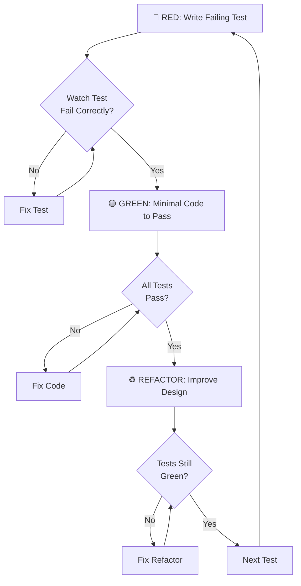
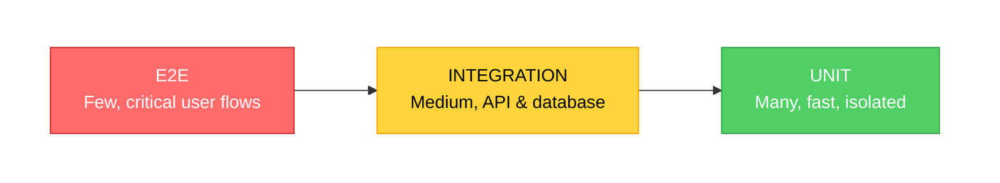

# TDD Workflow - Test-Driven Development

## The Iron Law

**NO PRODUCTION CODE WITHOUT A FAILING TEST FIRST**

This is not a suggestion. This is the foundation.

- Write test FIRST → Watch it FAIL → Write code to pass it
- Code before test? DELETE IT. Start over.
- Test passes immediately? You tested existing behavior. Fix test.
- Skip watching test fail? You don't know if it tests anything.

**Violating the letter of the Iron Law is violating its spirit.**

## When to Activate This Skill

Use TDD for:

- ✅ **New features** - Before any implementation code
- ✅ **Bug fixes** - Write failing test reproducing bug first
- ✅ **Refactoring** - Tests prove behavior preserved
- ✅ **Feature requests** - Tests document requirements
- ✅ **Performance improvements** - Tests prevent regressions

**Do NOT skip TDD for:**

- ❌ "Simple" changes (simple code breaks too)
- ❌ "Quick fixes" (untested fixes create more bugs)
- ❌ "Prototypes" (prototypes become production)
- ❌ "Exploratory code" (explore, then DELETE and start with TDD)

## Red-Green-Refactor Cycle



### 🔴 RED - Write Failing Test

**Before ANY production code:**

1. Write test describing desired behavior
2. **VERIFY IT FAILS** - actually run it and see red
3. Confirm it fails for the RIGHT reason (missing feature, not typo)

```typescript
// ❌ WRONG: No test yet, writing code first
function retryOperation(fn) {
  /* ... */
}

// ✅ CORRECT: Test FIRST
test("retries operation 3 times before failing", async () => {
  let attempts = 0;
  const operation = async () => {
    attempts++;
    if (attempts < 3) throw new Error("fail");
    return "success";
  };

  const result = await retryOperation(operation);

  expect(result).toBe("success");
  expect(attempts).toBe(3);
});

// NOW run test and watch it fail: "retryOperation is not defined"
```

**Mandatory: Watch Test Fail**

```bash
npm test path/to/test.test.ts
# MUST see: FAIL ✗ retries operation 3 times before failing
```

**Red Flags:**

- Test passes immediately = you tested existing code, not new requirement
- Test errors (not fails) = fix syntax, then make it fail correctly
- Didn't run test = you don't know if it works

### 🟢 GREEN - Minimal Code to Pass

Write **simplest code** to make test pass. Don't:

- Add features not tested
- Optimize prematurely
- Refactor other code
- "Improve" beyond the test

```typescript
// ✅ CORRECT: Just enough to pass
async function retryOperation<T>(fn: () => Promise<T>): Promise<T> {
  for (let i = 0; i < 3; i++) {
    try {
      return await fn();
    } catch (e) {
      if (i === 2) throw e;
    }
  }
  throw new Error("unreachable");
}

// ❌ WRONG: Over-engineered (YAGNI)
async function retryOperation<T>(
  fn: () => Promise<T>,
  options?: {
    maxRetries?: number;
    backoff?: "linear" | "exponential";
    onRetry?: (attempt: number) => void;
  }
): Promise<T> {
  // Too much! Test only required 3 retries.
}
```

**Mandatory: Watch Test Pass**

```bash
npm test
# MUST see: PASS ✓ retries operation 3 times before failing
```

### ♻️ REFACTOR - Improve Design

**Only after tests are green:**

- Remove duplication
- Improve names
- Extract helpers
- Optimize (if needed)

**Keep tests green.** Run tests after each refactor step.

**Don't add behavior.** Refactor = same behavior, better code.

```typescript
// After refactor
async function retryOperation<T>(operation: () => Promise<T>, maxAttempts: number = 3): Promise<T> {
  let lastError: Error;

  for (let attempt = 1; attempt <= maxAttempts; attempt++) {
    try {
      return await operation();
    } catch (error) {
      lastError = error as Error;
      if (attempt === maxAttempts) throw lastError;
    }
  }

  throw lastError!;
}
```

Then REPEAT cycle for next behavior.

## Core Principles

### 1. Test BEFORE Code - Always

**Why:**

- Tests-first = unbiased requirements testing
- Tests-after = biased implementation verification
- Watching tests fail proves they work

### 2. Coverage Requirement: 80%+

**Minimum Coverage:**

- **Unit Tests**: 80%+ line coverage
- **Integration Tests**: All API endpoints, repositories
- **E2E Tests**: Critical user journeys

**Why:** Below 80% means too much untested code. Production bugs waiting to happen.

### 3. Three Test Types (Test Pyramid)



- **Unit**: 70% of tests - Fast, isolated, pure logic
- **Integration**: 20% of tests - APIs, database, services
- **E2E**: 10% of tests - User journeys via Playwright

### 4. Good Test Qualities

| Quality          | Means                                          |
| ---------------- | ---------------------------------------------- |
| **Minimal**      | Tests ONE behavior (split if "and" in name)    |
| **Clear**        | Name describes exact behavior tested           |
| **Fast**         | Milliseconds (unit), seconds (integration)     |
| **Real**         | Tests real code, minimal mocking               |
| **Shows Intent** | Demonstrates desired API from user perspective |

## 7-Step TDD Workflow

### Step 1: Write User Journey

```text
As a [role]
I want to [action]
So that [benefit]

Example:
As a developer
I want to retry failed operations automatically
So that transient errors don't cause permanent failures
```

### Step 2: Generate Test Cases

Break user journey into specific test cases:

```typescript
describe("retryOperation", () => {
  it("returns result on first success");
  it("retries up to 3 times before failing");
  it("throws error after 3 failed attempts");
  it("does not retry if operation succeeds");
  it("preserves original error message on final failure");
});
```

### Step 3: Write First Failing Test

Pick simplest case. Write test. **Watch it fail.**

```typescript
it("returns result on first success", async () => {
  const operation = async () => "success";

  const result = await retryOperation(operation);

  expect(result).toBe("success");
});

// Run: npm test
// See: FAIL ✗ returns result on first success
//      ReferenceError: retryOperation is not defined
```

### Step 4: Write Minimal Code

Just enough to pass THIS test.

```typescript
async function retryOperation<T>(fn: () => Promise<T>): Promise<T> {
  return await fn(); // Minimal for first test
}

// Run: npm test
// See: PASS ✓ returns result on first success
```

### Step 5: Refactor

Improve code while keeping tests green.

### Step 6: Repeat for Next Test

Write next failing test → minimal code → refactor → repeat.

### Step 7: Verify Coverage

```bash
npm run test:coverage
# Verify: All statements 80%+, Branches 80%+, Functions 80%+, Lines 80%+
```

## Quick Test Type Reference

### Unit Tests (Jest/Vitest)

```typescript
import { render, screen, fireEvent } from '@testing-library/react'
import { Button } from './Button'

describe('Button', () => {
  it('calls onClick when clicked', () => {
    const handleClick = jest.fn()
    render(<Button onClick={handleClick}>Click</Button>)

    fireEvent.click(screen.getByRole('button'))

    expect(handleClick).toHaveBeenCalledTimes(1)
  })
})
```

**See:** [testing-patterns.md](./references/testing-patterns.md) for comprehensive unit test
examples including Good/Bad patterns, C#/.NET examples, and best practices.

### Integration Tests (API)

```typescript
describe("GET /api/markets", () => {
  it("returns markets successfully", async () => {
    const response = await GET(new NextRequest("http://localhost/api/markets"));
    const data = await response.json();

    expect(response.status).toBe(200);
    expect(data.success).toBe(true);
    expect(Array.isArray(data.data)).toBe(true);
  });
});
```

**See:** [testing-patterns.md](./references/testing-patterns.md) for API integration patterns,
database testing, and .NET controller tests.

### E2E Tests (Playwright)

```typescript
test("user can search markets", async ({ page }) => {
  await page.goto("/");
  await page.fill('input[placeholder="Search"]', "election");
  await page.waitForTimeout(600); // debounce

  const results = page.locator('[data-testid="market-card"]');
  await expect(results).toHaveCount(5, { timeout: 5000 });
});
```

**See:** [testing-patterns.md](./references/testing-patterns.md) for complete E2E patterns including
authentication flows, form submissions, and multi-step user journeys.

## Mocking External Services

**Principle:** Use real implementations when possible. Mock only external dependencies.

### When to Mock

- ✅ External APIs (third-party services)
- ✅ Payment gateways, email services
- ✅ AI models (OpenAI, embeddings)
- ✅ Time-sensitive operations

### When NOT to Mock

- ❌ Internal business logic
- ❌ Databases (use Testcontainers)
- ❌ Simple utilities

### Quick Mock Example

```typescript
// Mock external API
jest.mock("@/lib/openai", () => ({
  generateEmbedding: jest.fn(() =>
    Promise.resolve(
      new Array(1536).fill(0.1) // Mock embedding
    )
  ),
}));

// Test uses mocked dependency
const embedding = await generateEmbedding("test");
expect(embedding).toHaveLength(1536);
```

**See:** [mocking-guide.md](./references/mocking-guide.md) for complete mocking patterns including
Supabase, Redis, OpenAI, HTTP clients, Entity Framework, and time mocking.

## Coverage Verification

### Run Coverage Report

```bash
# JavaScript/TypeScript
npm run test:coverage

# .NET
dotnet test /p:CollectCoverage=true /p:CoverageReportsDirectory=./coverage
```

### Enforce Thresholds

```json
{
  "jest": {
    "coverageThresholds": {
      "global": {
        "branches": 80,
        "functions": 80,
        "lines": 80,
        "statements": 80
      }
    }
  }
}
```

```xml
<!-- .NET: coverlet.runsettings -->
<RunSettings>
  <DataCollectionRunSettings>
    <DataCollectors>
      <DataCollector friendlyName="XPlat code coverage">
        <Configuration>
          <Threshold>80</Threshold>
          <ThresholdType>line,branch,method</ThresholdType>
        </Configuration>
      </DataCollector>
    </DataCollectors>
  </DataCollectionRunSettings>
</RunSettings>
```

## Common Mistakes & Anti-Patterns

### ❌ Testing Implementation Details

```typescript
// WRONG: Couples test to implementation
expect(component.state.count).toBe(5);
```

### ✅ Test User-Visible Behavior

```typescript
// CORRECT: Tests actual behavior
expect(screen.getByText("Count: 5")).toBeInTheDocument();
```

### ❌ Multiple Concerns Per Test

```typescript
// WRONG: Too many things
it("validates email and domain and whitespace and special chars", () => {});
```

### ✅ One Thing Per Test

```typescript
// CORRECT: Single responsibility
it("rejects email with invalid domain", () => {});
it("rejects email with leading whitespace", () => {});
```

**See:** [anti-patterns.md](./references/anti-patterns.md) for comprehensive guide including why
test-first order matters, common rationalizations debunked, and red flags to watch for.

## Why Test-First Order Matters

**"I'll write tests after to verify it works"**

- Tests passing immediately prove nothing
- Might test wrong thing or miss edge cases
- Never saw it catch the bug
- **Solution:** Test FIRST, watch it FAIL, then code

**"Already manually tested"**

- Ad-hoc, no record, can't re-run
- "It worked when I tried it" ≠ comprehensive
- **Solution:** Automated tests are systematic and repeatable

**"Deleting hours of work is wasteful"**

- Sunk cost fallacy
- Code without verified tests = technical debt
- **Solution:** Delete and rewrite with TDD = high confidence

**"TDD will slow me down"**

- TDD faster than debugging production bugs
- Prevents regressions, enables refactoring
- **Solution:** TDD IS pragmatic

**See:** [anti-patterns.md](./references/anti-patterns.md) for complete explanations and more
rationalizations.

## Test File Organization

```text
src/
├── components/
│   ├── Button/
│   │   ├── Button.tsx
│   │   ├── Button.test.tsx       # Unit tests
│   │   └── Button.stories.tsx    # Storybook
├── app/
│   └── api/
│       └── markets/
│           ├── route.ts
│           └── route.test.ts      # Integration tests
└── e2e/
    ├── markets.spec.ts            # E2E tests
    ├── trading.spec.ts
    └── auth.spec.ts
```

## Prevention Checklist

Before writing production code:

- [ ] Have I written a FAILING test first?
- [ ] Did I RUN the test and SEE it fail?
- [ ] Did it fail for the RIGHT reason (missing feature, not typo)?
- [ ] Am I writing MINIMAL code to pass the test?
- [ ] After green, did I REFACTOR?
- [ ] Do all tests still PASS after refactor?
- [ ] Am I at 80%+ coverage?

**If you answer "no" to ANY:** STOP. Fix it before continuing.

## References

- **[testing-patterns.md](./references/testing-patterns.md)** - Comprehensive test examples for
  Unit, Integration, and E2E tests with Good/Bad patterns
- **[mocking-guide.md](./references/mocking-guide.md)** - Complete mocking strategies for Supabase,
  Redis, OpenAI, HTTP, databases, and time
- **[anti-patterns.md](./references/anti-patterns.md)** - Why test-first matters, common
  rationalizations debunked, red flags, and enforcement strategies

---

**Remember:** Test FIRST. Watch it FAIL. Write code. Watch it PASS. Refactor. Repeat.

The Iron Law is not negotiable.
