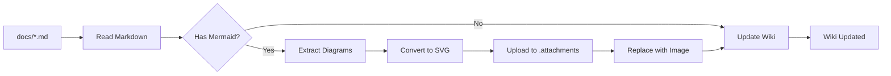
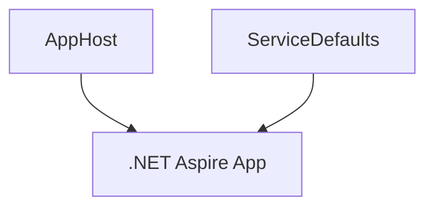

# Azure Wiki Agent Skill

Synchronize project documentation from `docs/` folder to Azure DevOps wiki with automatic Mermaid diagram conversion to SVG.

## Overview

This skill enables seamless publishing of project documentation to Azure DevOps wiki while handling the conversion of Mermaid diagrams (which Azure DevOps wiki doesn't support natively) into SVG images.

### Key Features

- ✅ **Automatic Sync**: Publish markdown files from `docs/` to Azure DevOps wiki
- ✅ **Mermaid Conversion**: Convert Mermaid diagrams to SVG for wiki compatibility
- ✅ **Structure Preservation**: Maintain folder hierarchy and navigation order
- ✅ **Bidirectional Updates**: Keep docs/ and wiki in sync
- ✅ **MCP Integration**: Use Azure DevOps MCP tools for programmatic access
- ✅ **Git-based Workflow**: Upload attachments via wiki repository

## Quick Start

### Prerequisites

Install required tools:

```powershell
# Mermaid CLI
npm install -g @mermaid-js/mermaid-cli

# Azure DevOps CLI (if not installed)
# https://learn.microsoft.com/cli/azure/install-azure-cli

# Configure PAT
$env:AZURE_DEVOPS_EXT_PAT = "your-personal-access-token"

# Set default project
az devops configure -d project="Registro Horario"
```

### Basic Usage

```powershell
# Sync single document
.\scripts\powershell\Sync-DocsToWiki.ps1 `
  -SourcePath "docs/architecture-overview.md"

# Sync entire docs folder
.\scripts\powershell\Sync-DocsToWiki.ps1 `
  -SourcePath "docs/" `
  -Recursive

# Preview changes (dry run)
.\scripts\powershell\Sync-DocsToWiki.ps1 `
  -SourcePath "docs/" `
  -Recursive `
  -DryRun
```

## Documentation Structure

```
.github/skills/azure-wiki-agent/
├── SKILL.md                          # Complete skill documentation
├── README.md                         # This file
├── examples/
│   ├── README.md                     # Usage examples and troubleshooting
│   └── example-mermaid.md           # Sample document with diagrams
└── templates/
    └── order-file-template.md       # Wiki navigation ordering

scripts/powershell/
└── Sync-DocsToWiki.ps1              # Main sync script

docs/                                 # Source documentation
├── architecture-overview.md
├── adr/
│   ├── .order                       # Controls page order in wiki
│   ├── ADR-0001-*.md
│   └── ADR-0002-*.md
└── observability/
    └── opentelemetry-guide.md
```

## How It Works

### Workflow Overview



### Step-by-Step Process

1. **Read Source**: Load markdown file from `docs/` folder
2. **Extract Mermaid**: Find all ` ```mermaid ` code blocks
3. **Convert to SVG**: Use `mmdc` CLI to generate SVG files
4. **Upload SVGs**: Push to wiki repository's `.attachments/` folder
5. **Update Content**: Replace Mermaid blocks with ``
6. **Create/Update Page**: Publish to wiki using MCP tools or Azure CLI

## Examples

### Example 1: ADR Documentation

**Source**: `docs/adr/ADR-0001-adopt-dotnet-aspire.md`

Contains Mermaid architecture diagram:

````markdown
## Architecture


````

````

**After Sync**: Wiki page at `/Documentation/ADR/ADR-0001-Adopt-DotNet-Aspire`

- Diagram converted to `ADR-0001-diagram-1.svg`
- Uploaded to `/.attachments/`
- Markdown shows: ``

### Example 2: Bulk ADR Sync

```powershell
# Sync all ADRs maintaining order
.\scripts\powershell\Sync-DocsToWiki.ps1 `
  -SourcePath "docs/adr/" `
  -Recursive

# Result:
# ✓ ADR-0001-adopt-dotnet-aspire.md → /Documentation/ADR/ADR-0001
# ✓ ADR-0002-azure-architecture.md → /Documentation/ADR/ADR-0002
# ✓ ADR-0003-opentelemetry.md → /Documentation/ADR/ADR-0003
# ✓ .order → /Documentation/ADR/.order
````

## Using MCP Tools

### Available Tools

Load wiki tools first:

```powershell
tool_search_tool_regex -pattern "mcp_azure_devops_wiki"
```

Key tools:

- `mcp_azure_devops_wiki_list_wikis` - List all project wikis
- `mcp_azure_devops_wiki_list_pages` - List pages in wiki
- `mcp_azure_devops_wiki_get_page_content` - Read page content
- `mcp_azure_devops_wiki_create_or_update_page` - Publish/update page
- `mcp_azure_devops_wiki_get_page` - Get page metadata (ETag for updates)

### Example: Create Wiki Page

```javascript
// Load tool first
tool_search_tool_regex('wiki.*create');

// Create page
await mcp_azure_devops_wiki_create_or_update_page({
  wikiIdentifier: 'Registro-Horario.wiki',
  project: 'Registro Horario',
  path: '/Documentation/My-New-Page',
  content: '# My New Page\n\nContent here...',
});
```

## Configuration

### Environment Variables

```powershell
# Azure DevOps PAT (required)
$env:AZURE_DEVOPS_EXT_PAT = "your-pat-token"
```

Or create `.env` file:

```
AZURE_DEVOPS_EXT_PAT=your-pat-token
```

### Script Parameters

| Parameter        | Description                     | Default                 |
| ---------------- | ------------------------------- | ----------------------- |
| `SourcePath`     | Path to markdown file or folder | Required                |
| `WikiIdentifier` | Wiki ID                         | `Registro-Horario.wiki` |
| `Project`        | Azure DevOps project name       | `Registro Horario`      |
| `Recursive`      | Process subdirectories          | `$false`                |
| `DryRun`         | Preview without changes         | `$false`                |

## Best Practices

### Documentation Organization

```
docs/
├── README.md                    # Overview
├── architecture-overview.md
├── adr/                        # ADRs in subfolder
│   ├── .order                  # Navigation order
│   ├── README.md
│   └── ADR-*.md
└── observability/
    ├── .order
    └── *.md
```

### Mermaid Diagram Guidelines

```powershell
# Recommended mmdc settings
mmdc -i input.mmd -o output.svg `
  -t dark `              # Dark theme
  -b transparent `       # Transparent background
  -s 2 `                 # 2x scale for clarity
  --outputFormat svg
```

### Wiki Path Conventions

- Use `/Documentation/` as root prefix
- Replace spaces with dashes: `Architecture-Overview`
- Match file structure: `docs/adr/ADR-001.md` → `/Documentation/ADR/ADR-001`

## Troubleshooting

### Common Issues

**Issue**: `mmdc: command not found`

```powershell
npm install -g @mermaid-js/mermaid-cli
mmdc --version
```

**Issue**: PAT authentication fails

```powershell
# Verify PAT is set
if (-not $env:AZURE_DEVOPS_EXT_PAT) {
    Write-Error "PAT not configured"
}

# Test connection
az devops project show --project "Registro Horario"
```

**Issue**: Mermaid syntax error

```powershell
# Validate diagram
mmdc -i test.mmd -o test.svg --quiet
if ($LASTEXITCODE -ne 0) {
    Get-Content test.mmd  # Show problematic code
}
```

**Issue**: Wiki page ETag mismatch

```javascript
// Get current page first
const page = await mcp_azure_devops_wiki_get_page({
  wikiIdentifier: 'Registro-Horario.wiki',
  path: '/Documentation/My-Page',
});

// Use ETag in update
await mcp_azure_devops_wiki_create_or_update_page({
  wikiIdentifier: 'Registro-Horario.wiki',
  path: '/Documentation/My-Page',
  content: newContent,
  etag: page.eTag,
});
```

## Resources

### Documentation

- **[SKILL.md](SKILL.md)** - Complete skill documentation with all workflows
- **[examples/README.md](examples/README.md)** - Usage examples and troubleshooting
- **[templates/order-file-template.md](templates/order-file-template.md)** - Wiki navigation ordering

### External Links

- [Azure DevOps Wiki Docs](https://learn.microsoft.com/azure/devops/project/wiki/)
- [Mermaid Documentation](https://mermaid.js.org/)
- [Mermaid CLI](https://github.com/mermaid-js/mermaid-cli)
- [Azure CLI DevOps Extension](https://learn.microsoft.com/cli/azure/devops)

### Related Skills

- [bolt-framework](.github/skills/bolt-framework/SKILL.md) - AURORA methodology
- [azure-devops-sync](.github/skills/azure-devops-sync/SKILL.md) - Work item sync
- [markdown-formatting](.github/skills/markdown-formatting/SKILL.md) - Markdown standards

## Contributing

To improve this skill:

1. Test with real documentation
2. Report issues or suggest improvements
3. Add examples for new use cases
4. Update documentation with findings

## Version History

- **v1.0.0** (2026-02-15) - Initial release
  - Basic sync functionality
  - Mermaid to SVG conversion
  - MCP tool integration
  - Order file support

---

**Skill**: azure-wiki-agent  
**Domain**: Azure DevOps Wiki Integration  
**AURORA**: 1.0.0+
