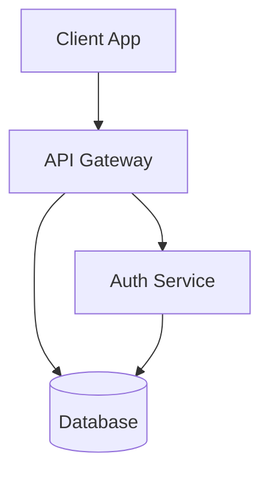

# Azure Wiki Agent - Examples

This folder contains examples and utilities for synchronizing documentation to Azure DevOps wiki.

## Quick Examples

### Example 1: Sync Single Document

```powershell
# Sync architecture overview to wiki
.\scripts\powershell\Sync-DocsToWiki.ps1 `
  -SourcePath "docs/architecture-overview.md"
```

### Example 2: Sync All ADRs

```powershell
# Sync all Architecture Decision Records
.\scripts\powershell\Sync-DocsToWiki.ps1 `
  -SourcePath "docs/adr/" `
  -Recursive
```

### Example 3: Dry Run

```powershell
# Preview what would be synced without making changes
.\scripts\powershell\Sync-DocsToWiki.ps1 `
  -SourcePath "docs/" `
  -Recursive `
  -DryRun
```

## Using MCP Tools

### List Available Wikis

```powershell
# Search for wiki tools
tool_search_tool_regex -pattern "mcp_azure_devops_wiki"

# List wikis
mcp_azure_devops_wiki_list_wikis -project "Registro Horario"
```

### Create/Update Wiki Page

```powershell
# Load wiki tools first
tool_search_tool_regex -pattern "wiki.*create"

# Create or update a page
mcp_azure_devops_wiki_create_or_update_page `
  -wikiIdentifier "Registro-Horario.wiki" `
  -project "Registro Horario" `
  -path "/Documentation/My-Page" `
  -content "# My Page\n\nContent here..."
```

### Get Page Content

```powershell
# Read existing wiki page
mcp_azure_devops_wiki_get_page_content `
  -wikiIdentifier "Registro-Horario.wiki" `
  -project "Registro Horario" `
  -path "/Documentation/Architecture"
```

## Mermaid Diagram Conversion

### Example Document with Mermaid

**Source**: `docs/example-with-diagram.md`

````markdown
# Architecture Overview

Our system uses a microservices architecture:


````

## Components

- **Client**: Angular frontend
- **API Gateway**: .NET Aspire
- **Auth Service**: Entra ID integration

````

### Conversion Process

1. **Extract Mermaid blocks**:
   ```powershell
   $pattern = '(?s)```mermaid\s+(.*?)```'
   $matches = Select-String -Path "docs/example.md" -Pattern $pattern -AllMatches
````

2. **Convert to SVG**:

   ```powershell
   foreach ($match in $matches.Matches) {
     $mermaidCode = $match.Groups[1].Value
     $mermaidCode | Out-File -FilePath "temp.mmd" -Encoding UTF8

     mmdc -i temp.mmd -o diagram.svg -t dark -b transparent -s 2
   }
   ```

3. **Replace in content**:
   ```powershell
   $content = $content -replace $pattern, ''
   ```

### Manual SVG Upload

If automatic upload is not configured, manually upload SVGs:

```powershell
# 1. Clone wiki repository
git clone https://dev.azure.com/jdmveira/Registro%20Horario/_git/Registro-Horario.wiki

# 2. Create .attachments folder if needed
New-Item -ItemType Directory -Force -Path "Registro-Horario.wiki/.attachments"

# 3. Copy SVG files
Copy-Item "*.svg" "Registro-Horario.wiki/.attachments/"

# 4. Commit and push
cd Registro-Horario.wiki
git add .attachments/
git commit -m "docs: Add architecture diagrams"
git push origin wikiMaster
```

## Wiki Structure Best Practices

### Folder Organization

```
Wiki Root
├── Documentation/
│   ├── Architecture/
│   │   ├── Overview
│   │   └── Quickstart
│   ├── ADR/
│   │   ├── .order                          # Controls page order
│   │   ├── ADR-0001-Adopt-DotNet-Aspire
│   │   ├── ADR-0002-Azure-Architecture
│   │   └── ADR-0003-OpenTelemetry
│   └── Observability/
│       ├── Overview
│       └── OpenTelemetry-Guide
└── .attachments/
    ├── architecture-diagram-1.svg
    └── opentelemetry-diagram-1.svg
```

### Creating Order Files

Control page order in wiki navigation:

**`.order` file content**:

```
ADR-0001-Adopt-DotNet-Aspire
ADR-0002-Azure-Architecture
ADR-0003-OpenTelemetry
```

**Upload order file**:

```powershell
mcp_azure_devops_wiki_create_or_update_page `
  -wikiIdentifier "Registro-Horario.wiki" `
  -project "Registro Horario" `
  -path "/Documentation/ADR/.order" `
  -content (Get-Content "docs/adr/.order" -Raw)
```

## Troubleshooting

### Issue: mmdc command not found

**Solution**:

```powershell
npm install -g @mermaid-js/mermaid-cli
mmdc --version  # Verify installation
```

### Issue: PAT not configured

**Solution**:

```powershell
# Option 1: Set environment variable
$env:AZURE_DEVOPS_EXT_PAT = "your-personal-access-token"

# Option 2: Add to .env file
echo "AZURE_DEVOPS_EXT_PAT=your-token" >> .env
```

### Issue: Wiki page already exists

The script uses `create-or-update` which handles both cases automatically.

### Issue: Mermaid syntax error

**Validate syntax before conversion**:

```powershell
mmdc -i test.mmd -o test.svg --quiet
if ($LASTEXITCODE -ne 0) {
  Write-Error "Invalid Mermaid syntax"
  Get-Content test.mmd
}
```

## Automated Sync with GitHub Actions

Create `.github/workflows/sync-wiki.yml`:

```yaml
name: Sync Documentation to Wiki

on:
  push:
    branches: [main]
    paths:
      - 'docs/**'

jobs:
  sync:
    runs-on: windows-latest
    steps:
      - uses: actions/checkout@v4

      - name: Setup Node.js
        uses: actions/setup-node@v4
        with:
          node-version: '20'

      - name: Install Mermaid CLI
        run: npm install -g @mermaid-js/mermaid-cli

      - name: Sync to Wiki
        env:
          AZURE_DEVOPS_EXT_PAT: ${{ secrets.AZURE_DEVOPS_PAT }}
        run: |
          .\scripts\powershell\Sync-DocsToWiki.ps1 `
            -SourcePath "docs/" `
            -Recursive
```

## Using with Copilot

### Ask Copilot to sync documentation

```
@workspaceSync the architecture overview document to Azure DevOps wiki
```

Copilot will automatically:

1. Load the `azure-wiki-agent` skill
2. Read the source document
3. Convert any Mermaid diagrams
4. Update the wiki page

### Ask Copilot to create a new wiki page

```
@workspace Create a new wiki page for the deployment guide
```

Copilot will:

1. Ask for the content location
2. Suggest appropriate wiki path
3. Convert diagrams if needed
4. Create the page

## References

- [SKILL.md](../SKILL.md) - Complete skill documentation
- [Azure DevOps Wiki Docs](https://learn.microsoft.com/azure/devops/project/wiki/)
- [Mermaid Documentation](https://mermaid.js.org/)
- [Mermaid CLI](https://github.com/mermaid-js/mermaid-cli)
