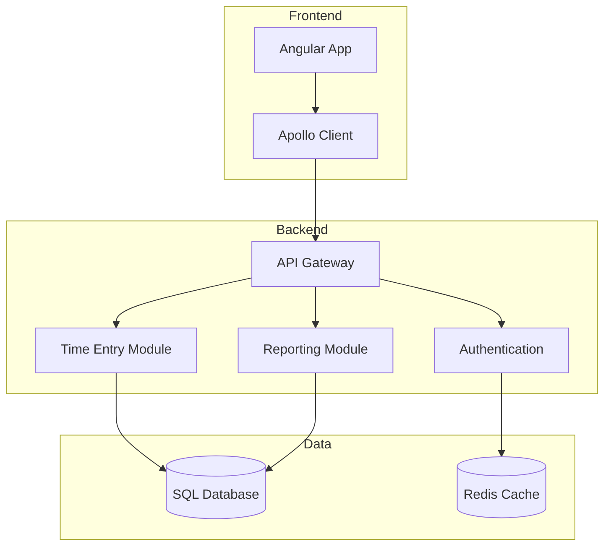
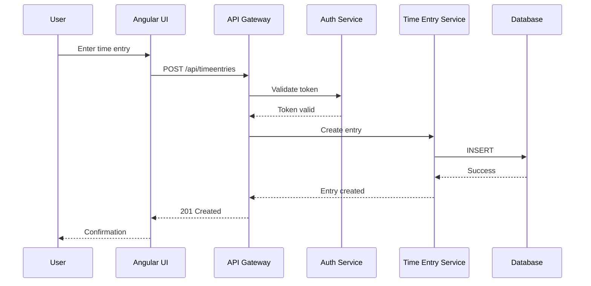
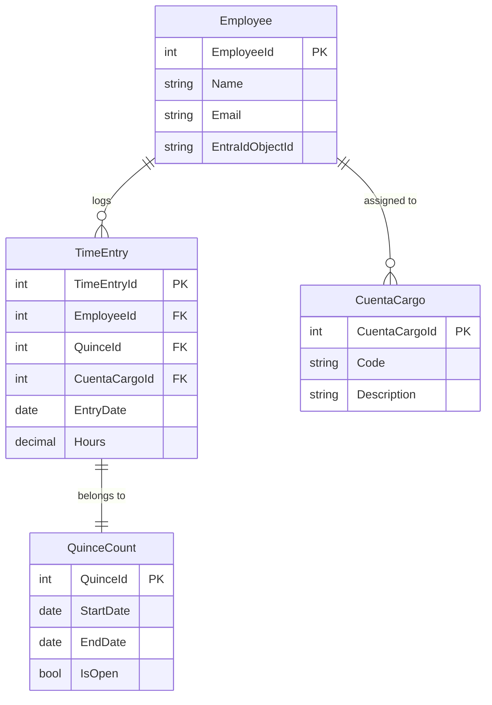

# Example: Architecture with Mermaid Diagram

This document demonstrates how Mermaid diagrams are converted when syncing to Azure DevOps wiki.

## System Architecture

The Registro Horario application follows a clean architecture pattern:



## Component Flow

When a user logs time, the following sequence occurs:



## Data Model



## After Conversion

When this document is synced to Azure DevOps wiki using `Sync-DocsToWiki.ps1`, the script will:

1. **Extract the 3 Mermaid diagrams** from the code blocks
2. **Convert each to SVG**:
   - `example-diagram-1.svg` (architecture graph)
   - `example-diagram-2.svg` (sequence diagram)
   - `example-diagram-3.svg` (ER diagram)
3. **Replace Mermaid blocks** with image references:
   ```markdown
   
   ```
4. **Upload SVGs** to wiki's `.attachments/` folder
5. **Create/update** the wiki page with processed content

## Manual Conversion Test

To test Mermaid conversion manually:

````powershell
# Extract first diagram
$content = Get-Content "example-mermaid.md" -Raw
$pattern = '(?s)```mermaid\s+(.*?)```'
$match = [regex]::Match($content, $pattern)

if ($match.Success) {
    # Save to temp file
    $match.Groups[1].Value | Out-File "temp.mmd" -Encoding UTF8

    # Convert
    mmdc -i temp.mmd -o test-diagram.svg -t dark -b transparent -s 2

    # View result
    Start-Process test-diagram.svg
}
````

## Additional Information

This example is used to:

- **Test** the Mermaid conversion workflow
- **Demonstrate** different diagram types (graph, sequence, ER)
- **Validate** SVG generation quality
- **Document** the conversion process

For more details, see the [SKILL.md](../SKILL.md) documentation.
