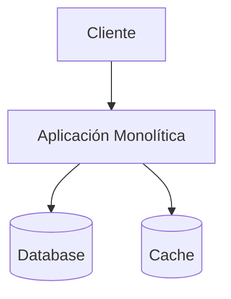
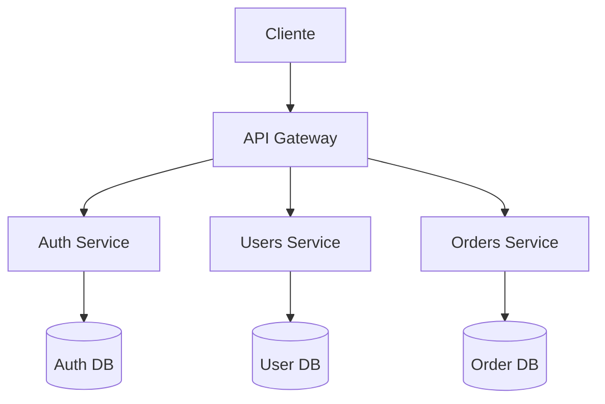
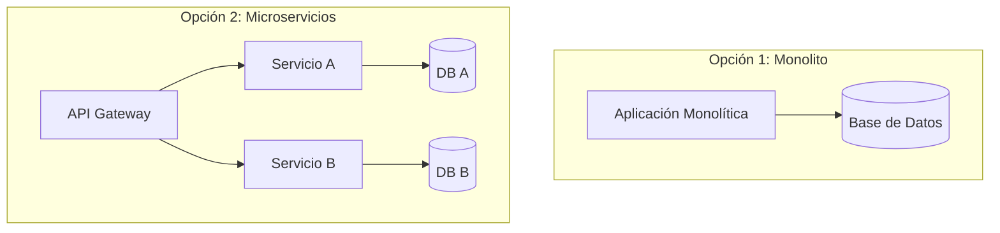

# Ejemplo: Comparación de Arquitecturas (Monolito vs Microservicios)

Ejemplo de cómo usar diagramas Mermaid para comparar diferentes opciones arquitectónicas en un ADR.

## Caso de Uso

ADR que evalúa migrar de arquitectura monolítica a microservicios. Los diagramas ayudan a visualizar las diferencias y facilitan la comprensión de pros/cons.

## Opción 1: Arquitectura Monolítica

**Pros:**

- ✅ Simple de deployar
- ✅ Fácil de desarrollar inicialmente
- ✅ Menos overhead de comunicación

**Cons:**

- ❌ Escala solo verticalmente
- ❌ Alto acoplamiento
- ❌ Difícil mantener con equipos grandes

## Opción 2: Arquitectura de Microservicios

**Pros:**

- ✅ Escala horizontalmente
- ✅ Independencia de servicios
- ✅ Equipos autónomos

**Cons:**

- ❌ Complejidad operacional
- ❌ Latencia de red
- ❌ Consistencia eventual

## Comparación Visual (Lado a Lado)

## Cuándo Usar Este Patrón

- ADRs sobre decisiones arquitectónicas mayores
- Comparación de múltiples opciones
- Decisiones que impactan escalabilidad
- Migración de arquitecturas

## Tips

1. **Mantener Consistencia**: Usar los mismos nombres de componentes en ambos diagramas
2. **Nivel de Detalle**: Mismo nivel de abstracción para comparación justa
3. **Colores**: Usar para destacar diferencias clave
4. **Anotaciones**: Agregar métricas si están disponibles (latencia, costo, etc.)

## Referencias

- Usado en: `bolt-adr/SKILL.md` (Práctica 6)
- Tipo: ARCH (Architecture Decision)
