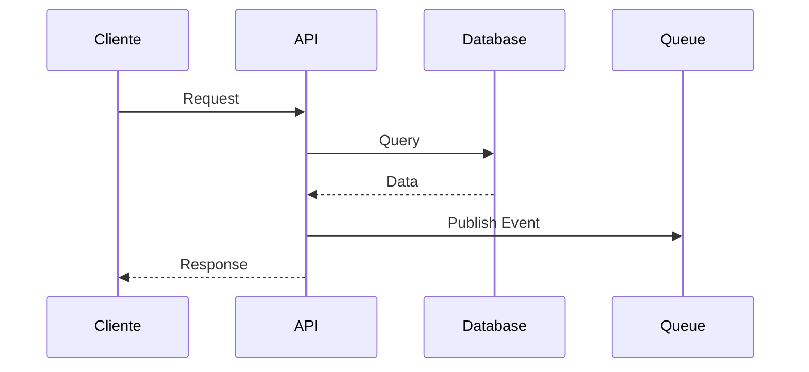
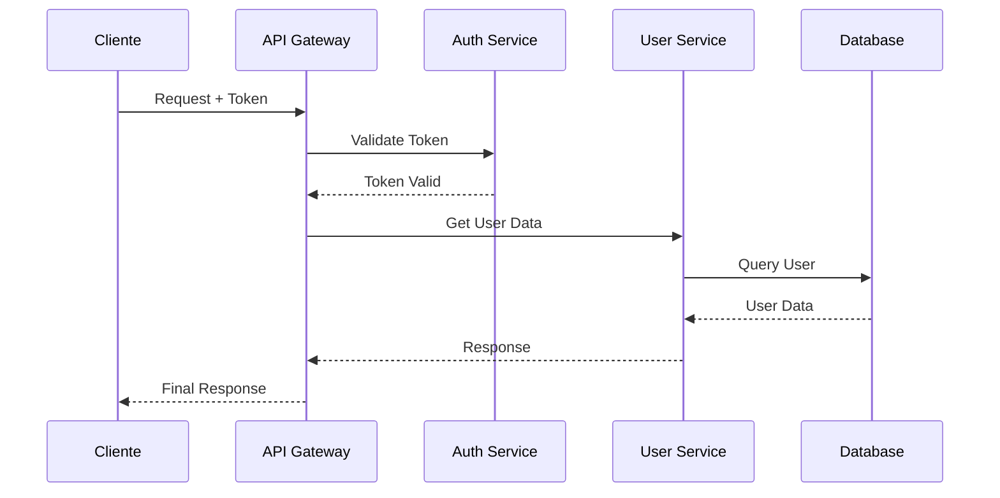
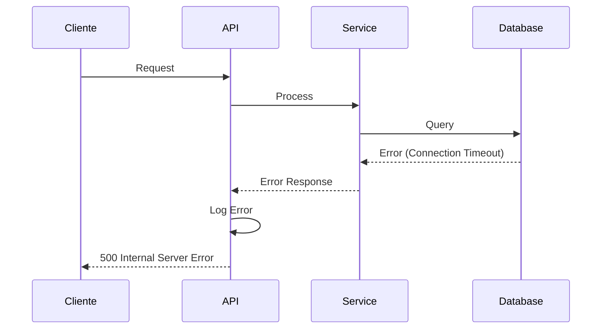
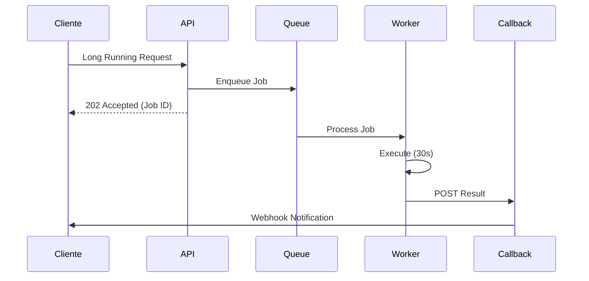
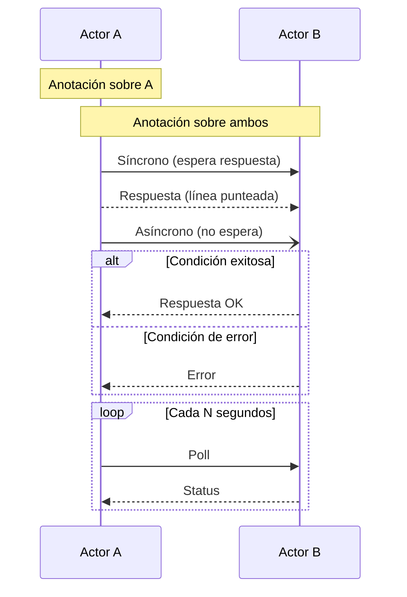

# Ejemplo: Diagrama de Secuencia para Integraciones

Ejemplo de cómo documentar flujos de integración entre servicios usando diagramas de secuencia Mermaid.

## Caso de Uso

ADR que define el flujo de comunicación entre servicios, especialmente útil para decisiones sobre:

- Protocolos de comunicación (REST vs GraphQL vs gRPC)
- Patrones de mensajería (sync vs async)
- Manejo de eventos
- Integraciones con sistemas externos

## Diagrama - Flujo Síncrono con Queue Asíncrono

## Descripción del Flujo

1. **Cliente → API**: Request inicial (HTTP POST/GET)
2. **API → Database**: Query sincrónico para obtener datos
3. **Database → API**: Respuesta con datos solicitados
4. **API → Queue**: Publicación asíncrona de evento (fire-and-forget)
5. **API → Cliente**: Respuesta HTTP con resultado

## Variaciones Comunes

### Flujo con Autenticación

### Flujo con Error Handling

### Flujo Asíncrono con Callbacks

## Cuándo Usar Diagramas de Secuencia

| Tipo de ADR             | Escenario                                       |
| ----------------------- | ----------------------------------------------- |
| **INT** - Integración   | Flujo entre servicios, APIs externas            |
| **SEC** - Seguridad     | Flujos de autenticación/autorización            |
| **ARCH** - Arquitectura | Patrones de comunicación (CQRS, Event Sourcing) |
| **DATA** - Datos        | Sincronización, replicación, ETL                |

## Elementos de Mermaid Sequence Diagram

## Tips para Diagramas de Secuencia

1. **De izquierda a derecha**: Actores externos primero, internos después
2. **Nombres claros**: Usar alias descriptivos (`as Cliente` vs `as C`)
3. **Flechas apropiadas**: `->>` para sync, `-)` para async, `-->>` para returns
4. **Agrupar con alt/opt/loop**: Para mostrar condiciones y repeticiones
5. **Notes para aclaraciones**: Explicar decisiones clave en el flujo

## Referencias

- [Mermaid Sequence Diagram Docs](https://mermaid.js.org/syntax/sequenceDiagram.html)
- Usado en: `bolt-adr/SKILL.md`
- Tipo: Decisiones de Integración (INT)
