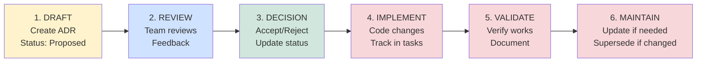
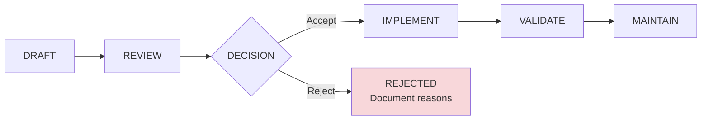
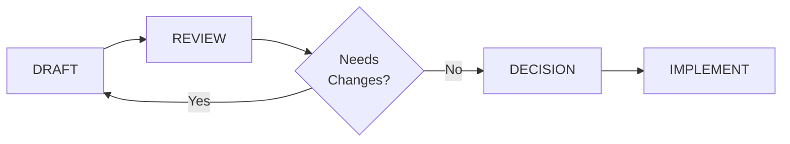

# Ejemplo: Workflow de Review y Aprobación de ADR

Diagrama que muestra el proceso completo desde la creación de un ADR hasta su mantenimiento continuo.

## Caso de Uso

Documentar el flujo de trabajo estándar para proponer, revisar, aprobar e implementar decisiones arquitectónicas usando ADRs.

## Diagrama

## Fases del Workflow

1. **DRAFT** - Creación inicial del ADR con status "Proposed"
2. **REVIEW** - Equipo técnico revisa y proporciona feedback
3. **DECISION** - Se acepta o rechaza la propuesta
4. **IMPLEMENT** - Se implementan los cambios en código
5. **VALIDATE** - Se verifica que la solución funciona
6. **MAINTAIN** - Mantenimiento continuo, updates o superseding

## Cuándo Usar

- ADRs sobre procesos de governance
- Documentar workflow de aprobación de decisiones
- Mostrar ciclo de vida de un ADR
- Sección de "Proceso" en guías arquitectónicas

## Variaciones

### Con Decisión de Rechazo

### Con Ciclo de Feedback

## Estados de ADR Asociados

| Fase del Workflow | Status ADR       |
| ----------------- | ---------------- |
| DRAFT             | Proposed         |
| REVIEW            | Proposed         |
| DECISION          | Accepted         |
| IMPLEMENT         | Accepted         |
| VALIDATE          | Accepted         |
| MAINTAIN          | Accepted         |
| Rechazado         | Rejected         |
| Obsoleto          | Deprecated       |
| Reemplazado       | Superseded by... |

## Referencias

- Ver SKILL.md sección "Workflow de Review y Aprobación"
- Ver templates/madr-standard.md campo "## Status"
