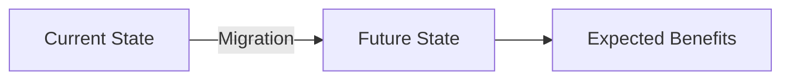

# ADR-NNNN: [Architecture Decision Title]

**Status:** [Proposed | Accepted | Deprecated | Superseded]

**Date:** {YYYY-MM-DD}

**Decision Makers:** {TEAM_MEMBERS}

**Technical Story:** {ISSUE_OR_STORY_LINK}

**Category:** [ARCH | TECH | DATA | SEC | INT | INFRA]

---

## Context and Problem Statement

### Problem

Describe the architectural problem or decision that needs to be made. What is the issue we're trying to solve?

### Context

What is the current state? What constraints do we have?

- **Technical Constraints:**
- **Business Constraints:**
- **Time Constraints:**
- **Resource Constraints:**

### Requirements

What are the functional and non-functional requirements?

#### Functional Requirements

- Requirement 1
- Requirement 2

#### Non-Functional Requirements

- **Performance:**
- **Security:**
- **Scalability:**
- **Maintainability:**
- **Compatibility:**

---

## Decision Drivers

What factors are driving this decision?

### Quality Attributes

- [ ] Performance
- [ ] Security
- [ ] Scalability
- [ ] Maintainability
- [ ] Usability
- [ ] Reliability
- [ ] Testability

### Business Factors

- [ ] Time to market
- [ ] Development cost
- [ ] Operational cost
- [ ] Risk tolerance
- [ ] Competitive advantage
- [ ] Customer satisfaction

### Priority Classification

- **Must Have:** [Critical requirements]
- **Should Have:** [Important requirements]
- **Could Have:** [Nice to have]

---

## Considered Options

### Option 1: {OPTION_NAME}

**Description:** Brief description of this option.

**Pros:**

- ✅ Advantage 1
- ✅ Advantage 2
- ✅ Advantage 3

**Cons:**

- ❌ Disadvantage 1
- ❌ Disadvantage 2

**Metrics:**

- **Implementation Effort:** [High | Medium | Low]
- **Risk Level:** [High | Medium | Low]
- **Cost Estimate:** [$X,XXX]
- **Time Estimate:** [X weeks/months]

### Option 2: {OPTION_NAME}

**Description:** Brief description of this option.

**Pros:**

- ✅ Advantage 1
- ✅ Advantage 2

**Cons:**

- ❌ Disadvantage 1
- ❌ Disadvantage 2

**Metrics:**

- **Implementation Effort:** [High | Medium | Low]
- **Risk Level:** [High | Medium | Low]
- **Cost Estimate:** [$X,XXX]
- **Time Estimate:** [X weeks/months]

### Option 3: {OPTION_NAME}

**Description:** Brief description of this option.

**Pros:**

- ✅ Advantage 1
- ✅ Advantage 2

**Cons:**

- ❌ Disadvantage 1
- ❌ Disadvantage 2

**Metrics:**

- **Implementation Effort:** [High | Medium | Low]
- **Risk Level:** [High | Medium | Low]
- **Cost Estimate:** [$X,XXX]
- **Time Estimate:** [X weeks/months]

---

## Decision Matrix

| Criteria        | Weight   | Option 1 | Option 2 | Option 3 |
| --------------- | -------- | -------- | -------- | -------- |
| Performance     | 20%      | 8/10     | 6/10     | 7/10     |
| Cost            | 25%      | 5/10     | 9/10     | 7/10     |
| Time to Market  | 20%      | 7/10     | 8/10     | 6/10     |
| Maintainability | 15%      | 9/10     | 5/10     | 8/10     |
| Team Expertise  | 10%      | 8/10     | 4/10     | 7/10     |
| Scalability     | 10%      | 7/10     | 9/10     | 6/10     |
| **Total Score** | **100%** | **XX**   | **XX**   | **XX**   |

---

## Decision Outcome

### Chosen Option

**Selected:** Option {NUMBER} - {OPTION_NAME}

### Rationale

Explain why this option was chosen. What were the deciding factors?

- Primary reason
- Secondary reason
- Tertiary reason

### Expected Benefits

- ✅ Business benefit 1
- ✅ Business benefit 2
- ✅ Technical benefit 1
- ✅ Technical benefit 2

### Architecture Overview (if applicable)

### Accepted Trade-offs

- ❌ Trade-off 1 and mitigation strategy
- ❌ Trade-off 2 and mitigation strategy

---

## Constitution Compliance

Per `memory/constitution.md`:

- [ ] **Tech Stack:** [Complies with approved technologies]
- [ ] **Architecture:** [Follows mandated patterns]
- [ ] **Security:** [Meets security requirements]
- [ ] **Budget:** [Within cost constraints]
- [ ] **Quality:** [Satisfies quality standards]

**Conflicts:**
[List any conflicts with constitution and resolution plan]

**Exceptions Required:**

- [ ] Exception 1: [Description and approval needed from]
- [ ] Exception 2: [Description and approval needed from]

---

## Implementation Plan

### Phase 1: Preparation

- [ ] Task 1 - Owner: [Name] - Due: [Date]
- [ ] Task 2 - Owner: [Name] - Due: [Date]

### Phase 2: Implementation

- [ ] Task 1 - Owner: [Name] - Due: [Date]
- [ ] Task 2 - Owner: [Name] - Due: [Date]

### Phase 3: Validation

- [ ] Task 1 - Owner: [Name] - Due: [Date]
- [ ] Task 2 - Owner: [Name] - Due: [Date]

### Timeline

- **Start Date:** {YYYY-MM-DD}
- **Expected Completion:** {YYYY-MM-DD}
- **Milestones:**
  - Milestone 1: {YYYY-MM-DD}
  - Milestone 2: {YYYY-MM-DD}
  - Milestone 3: {YYYY-MM-DD}

### Budget

- **Development Cost:** $X,XXX
- **Infrastructure Cost:** $X,XXX/month
- **Training Cost:** $X,XXX
- **Total Initial Investment:** $X,XXX

---

## Validation and Success Criteria

### Success Metrics

**Technical Metrics:**

- Metric 1: Baseline [X] → Target [Y] by [Date]
- Metric 2: Baseline [X] → Target [Y] by [Date]

**Business Metrics:**

- Revenue impact: [Description]
- Cost savings: [Description]
- Customer satisfaction: [Description]

### Validation Tests

- [ ] Performance test: [Description]
- [ ] Load test: [Description]
- [ ] Security audit: [Description]
- [ ] User acceptance: [Description]

---

## Consequences and Impacts

### Positive Consequences

- ✅ [Business impact]
- ✅ [Technical impact]
- ✅ [Team impact]

### Negative Consequences

- ❌ [Business impact]
- ❌ [Technical impact]
- ❌ [Team impact]

### Risk Mitigation

| Risk   | Probability | Impact  | Mitigation Strategy |
| ------ | ----------- | ------- | ------------------- |
| Risk 1 | [H/M/L]     | [H/M/L] | [Strategy]          |
| Risk 2 | [H/M/L]     | [H/M/L] | [Strategy]          |

### Dependencies

- **Internal:** [System/team dependencies]
- **External:** [Third-party dependencies]

### Impact on Stakeholders

| Stakeholder      | Impact   | Mitigation |
| ---------------- | -------- | ---------- |
| Engineering Team | [Impact] | [Plan]     |
| Product Team     | [Impact] | [Plan]     |
| Operations Team  | [Impact] | [Plan]     |
| Customers        | [Impact] | [Plan]     |

---

## Governance and Approvals

### Approvals Required

- [ ] Technical Lead - [Name] - Status: [Pending/Approved]
- [ ] Engineering Manager - [Name] - Status: [Pending/Approved]
- [ ] Product Owner - [Name] - Status: [Pending/Approved]
- [ ] Security Team - [Name] - Status: [Pending/Approved]
- [ ] Architecture Committee - Status: [Pending/Approved]

### Compliance Requirements

- [ ] Security compliance: [Specific requirements]
- [ ] Data protection: [GDPR/CCPA/etc]
- [ ] Industry standards: [ISO/SOC2/etc]
- [ ] Internal policies: [Which policies]

---

## Related Decisions

- [ADR-XXX: Related Decision](./ADR-XXXX-related.md) - [Relationship description]
- [ADR-YYY: Dependency](./ADR-YYYY-dependency.md) - [How it depends]

## References

### Documentation

- [Technical Specification](link)
- [API Documentation](link)
- [User Documentation](link)

### Research Materials

- [Research Document 1](link)
- [Industry Best Practices](link)
- [Vendor Documentation](link)

---

## Review History

| Date         | Reviewer | Role   | Decision                | Notes      |
| ------------ | -------- | ------ | ----------------------- | ---------- |
| {YYYY-MM-DD} | {Name}   | {Role} | [Approve/Reject/Revise] | {Comments} |
| {YYYY-MM-DD} | {Name}   | {Role} | [Approve/Reject/Revise] | {Comments} |

---

## Revision History

| Version | Date         | Author   | Changes         |
| ------- | ------------ | -------- | --------------- |
| 1.0     | {YYYY-MM-DD} | {Author} | Initial version |

---

**Template:** MADR Business Focus v2.0
**Created by:** AURORA-IA-DLC
**Author:** {Name/Role}
**Last Updated:** {YYYY-MM-DD}
