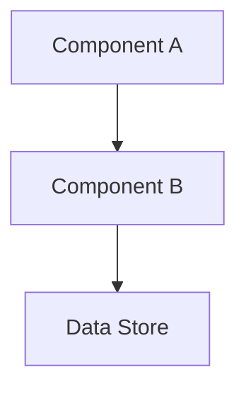

# ADR-NNNN: [Short Title of Architecture Decision]

## Status

[Proposed | Accepted | Deprecated | Superseded by ADR-XXXX]

## Date

[YYYY-MM-DD]

## Context

[Describe the issue motivating this decision and any context that influences or constrains the decision]

### Background

[Provide background information that helps understand the problem space]

### Problem Statement

[Clear statement of the problem this decision addresses]

### Forces

[List the forces at play - constraints, requirements, quality attributes]

- [Force 1: e.g., Performance requirement]
- [Force 2: e.g., Team expertise]
- [Force 3: e.g., Cost constraints]
- [Force 4: e.g., Time to market]

## Decision Drivers

- [Driver 1: e.g., Need for ACID compliance]
- [Driver 2: e.g., Team PostgreSQL expertise]
- [Driver 3: e.g., Budget constraints]

## Considered Options

1. [Option 1]
2. [Option 2]
3. [Option 3]

## Decision Outcome

Chosen option: "[Option Name]", because [justification - 2-3 sentences explaining why this option wins].

### Positive Consequences

- ✅ [Consequence 1]
- ✅ [Consequence 2]
- ✅ [Consequence 3]

### Negative Consequences

- ❌ [Consequence 1]
- ❌ [Consequence 2]

### Neutral Consequences

- ➖ [Consequence 1]

## Pros and Cons of the Options

### [Option 1]

[Description of option 1]

- ✅ Good, because [argument a]
- ✅ Good, because [argument b]
- ❌ Bad, because [argument c]
- ❌ Bad, because [argument d]

### [Option 2]

[Description of option 2]

- ✅ Good, because [argument a]
- ✅ Good, because [argument b]
- ❌ Bad, because [argument c]

### [Option 3]

[Description of option 3]

- ✅ Good, because [argument a]
- ❌ Bad, because [argument b]
- ❌ Bad, because [argument c]

## Compliance

[How this decision aligns with project constraints, standards, or regulations]

### Constitution Compliance

Per `memory/constitution.md`:

- [ ] Tech Stack: [Complies with allowed technologies]
- [ ] Architecture: [Follows mandated patterns]
- [ ] Security: [Meets security requirements]
- [ ] Quality: [Satisfies quality gates]

### Standards Compliance

- [ ] [Standard/Regulation 1]
- [ ] [Standard/Regulation 2]

### Reviews

- [ ] Reviewed by [Team/Person]
- [ ] Approved by [Authority]

## Implementation

### Migration Plan

[If applicable, describe how to migrate from current state to new state]

**Phase 1: Preparation**

1. [Step 1]
2. [Step 2]

**Phase 2: Implementation**

1. [Step 1]
2. [Step 2]

**Phase 3: Validation**

1. [Step 1]
2. [Step 2]

### Implementation Details

**Architecture Diagram (if applicable):**



**Code Example:**

```typescript
// Code example illustrating the decision
interface Example {
  // Implementation details
}
```

### Rollback Strategy

[How to rollback if the decision proves incorrect]

1. [Rollback step 1]
2. [Rollback step 2]

### Validation Criteria

[How to verify the decision is working as intended]

- [ ] Metric 1: [Target value]
- [ ] Metric 2: [Target value]
- [ ] Metric 3: [Target value]

## Timeline

| Milestone            | Date         | Status         |
| -------------------- | ------------ | -------------- |
| Decision Made        | [YYYY-MM-DD] | ✅ Completed   |
| Implementation Start | [YYYY-MM-DD] | 🔄 In Progress |
| Phase 1 Complete     | [YYYY-MM-DD] | ⏳ Pending     |
| Phase 2 Complete     | [YYYY-MM-DD] | ⏳ Pending     |
| Validation Complete  | [YYYY-MM-DD] | ⏳ Pending     |

## Links

- Related to [ADR-XXXX: Related Decision](./ADR-XXXX-related-decision.md) - [Explain relationship]
- Supersedes [ADR-YYYY: Old Decision](./ADR-YYYY-old.md) - [Explain why superseded]
- Informs [ADR-ZZZZ: Future Decision](./ADR-ZZZZ-future.md) - [Explain impact]

## References

- [Reference 1 Title](https://example.com) - Description
- [Reference 2 Title](https://example.com) - Description
- [Internal Document](../path/to/document.md)

## Notes

[Any additional notes, assumptions, or context that doesn't fit elsewhere]

## Review History

| Date         | Reviewer    | Notes             |
| ------------ | ----------- | ----------------- |
| [YYYY-MM-DD] | [Name/Role] | [Review comments] |
| [YYYY-MM-DD] | [Name/Role] | [Review comments] |

---

**Author:** [Name/Role]
**Date:** [YYYY-MM-DD]
**Last Updated:** [YYYY-MM-DD]
**Category:** [ARCH | TECH | DATA | SEC | INT | INFRA]
