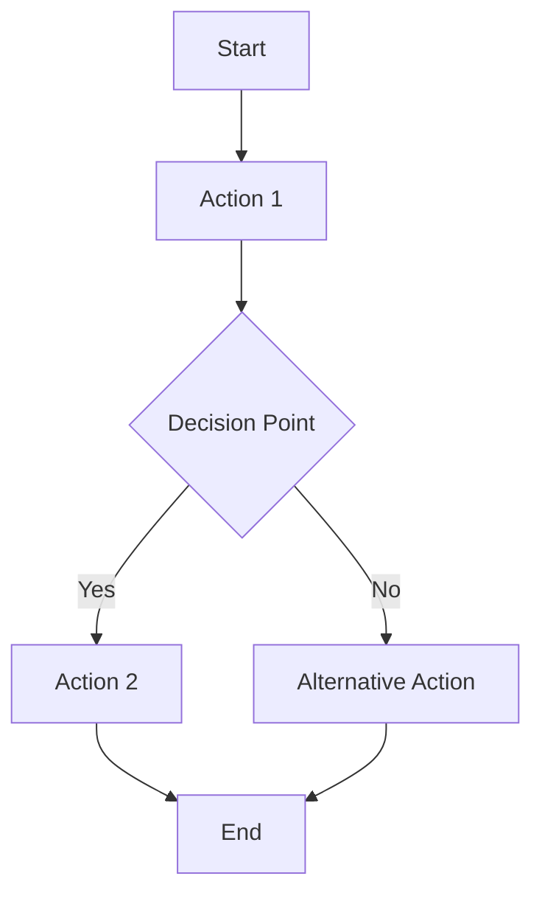

# User Guide Template

**Product:** {PRODUCT_NAME}
**Version:** {VERSION}
**Target Audience:** {AUDIENCE}
**Last Updated:** {DATE}

---

## Table of Contents

1. [Introduction](#introduction)
2. [Getting Started](#getting-started)
3. [Basic Features](#basic-features)
4. [Advanced Features](#advanced-features)
5. [Troubleshooting](#troubleshooting)
6. [FAQ](#faq)
7. [Support](#support)

---

## Introduction

### What is {PRODUCT_NAME}?

Provide a clear and concise overview of the product, its purpose, and the problems it solves.

{PRODUCT_NAME} is a comprehensive solution that helps users achieve {PRIMARY_GOAL}. It provides {KEY_BENEFITS} through an intuitive interface and powerful features.

### Key Benefits

- **Benefit 1:** Description of how this helps users
- **Benefit 2:** Description of how this helps users  
- **Benefit 3:** Description of how this helps users

### Who Should Use This Guide?

This guide is designed for:
- **Primary Users:** Role and responsibilities
- **Secondary Users:** Role and responsibilities
- **Administrators:** Role and responsibilities

### Prerequisites

Before you begin, ensure you have:
- [ ] Requirement 1
- [ ] Requirement 2
- [ ] Requirement 3

---

## Getting Started

### System Requirements

#### Minimum Requirements
- **Operating System:** Windows 10, macOS 10.15, Ubuntu 18.04+
- **Browser:** Chrome 90+, Firefox 88+, Safari 14+
- **RAM:** 4GB minimum, 8GB recommended
- **Storage:** 2GB available space
- **Internet:** Broadband connection required

#### Recommended Requirements
- **RAM:** 16GB for optimal performance
- **Storage:** SSD with 10GB available space
- **Monitor:** 1920x1080 resolution or higher

### Installation and Setup

#### Step 1: Account Creation
1. Navigate to [registration page](https://aurora.company.com/register)
2. Fill in required information:
   - Full Name
   - Email Address
   - Company Name (optional)
3. Verify your email address
4. Complete your profile setup

#### Step 2: Initial Configuration
1. **Login to your account**
   ```
   URL: https://aurora.company.com/login
   Use your registered email and password
   ```

2. **Complete the welcome wizard**
   - Choose your primary use case
   - Set up your first project
   - Configure basic preferences

3. **Verify your setup**
   - [ ] Dashboard loads correctly
   - [ ] Basic navigation works
   - [ ] Sample data is visible

### First Steps Tutorial

#### Creating Your First {ENTITY}

Follow these steps to create your first {entity}:

1. **Access the creation interface**
   - Click on "Create New" button in the main navigation
   - Select "{Entity}" from the dropdown menu

2. **Fill in basic information**
   ```
   Name: My First {Entity}
   Description: Learning how to use the system
   Category: Getting Started
   ```

3. **Configure settings**
   - Choose appropriate settings for your use case
   - Use default values if you're unsure
   - You can change these later

4. **Save and test**
   - Click "Save" to create the {entity}
   - Test basic functionality
   - Verify everything works as expected

### Quick Start Checklist

Complete these tasks to get up and running quickly:

- [ ] Account created and verified
- [ ] Profile information completed
- [ ] First {entity} created successfully
- [ ] Basic navigation understood
- [ ] Help resources located

---

## Basic Features

### Feature 1: {FEATURE_NAME}

#### Overview
Brief description of what this feature does and why it's useful.

#### How to Use
1. **Access the feature**
   - Navigation path or button location
   - Required permissions or prerequisites

2. **Basic operation**
   ```
   Step-by-step instructions with specific details
   Include expected outcomes for each step
   ```

3. **Common use cases**
   - Use case 1: When and why to use this approach
   - Use case 2: Alternative scenarios
   - Use case 3: Best practices

#### Visual Guide
```
[Screenshot or diagram would go here]
Caption: Description of what users should see
```

#### Tips and Best Practices
- **Tip 1:** Specific advice for better results
- **Tip 2:** Common mistake to avoid
- **Tip 3:** Efficiency improvement

### Feature 2: {FEATURE_NAME}

#### Overview
Description of the feature and its benefits.

#### Step-by-Step Instructions

**Method 1: Basic Approach**
1. Step one with detailed instructions
2. Step two with expected results
3. Step three with validation

**Method 2: Alternative Approach**
1. Alternative step one
2. Alternative step two
3. Alternative step three

#### Configuration Options

| Option | Default | Description | Recommended Use |
|--------|---------|-------------|-----------------|
| Option 1 | Value | What it controls | When to use |
| Option 2 | Value | What it controls | When to use |
| Option 3 | Value | What it controls | When to use |

### Feature 3: {FEATURE_NAME}

#### When to Use This Feature
- Scenario 1: Specific situation description
- Scenario 2: Another common use case
- Scenario 3: Advanced scenario

#### Detailed Workflow


#### Examples

**Example 1: Simple Use Case**
```
Scenario: User wants to accomplish X
Steps:
1. Do this first
2. Then do this
3. Finally do this
Result: Expected outcome
```

**Example 2: Complex Use Case**
```
Scenario: User needs to handle Y with constraints Z
Steps:
1. Preparation steps
2. Main workflow
3. Validation and cleanup
Result: Expected outcome and side effects
```

---

## Advanced Features

### Advanced Feature 1: {FEATURE_NAME}

#### Prerequisites
Before using this feature, ensure you have:
- [ ] Completed basic feature training
- [ ] Appropriate permissions
- [ ] Required data or resources

#### Advanced Configuration

**Custom Settings**
```json
{
  "advanced_option_1": "value",
  "advanced_option_2": true,
  "nested_config": {
    "sub_option": "value"
  }
}
```

**Integration Options**
- **API Integration:** How to connect with external systems
- **Webhook Configuration:** Setting up automated responses
- **Custom Scripts:** Adding personalized automation

#### Power User Tips
- **Keyboard Shortcuts:** List of time-saving shortcuts
  - `Ctrl+N`: Create new {entity}
  - `Ctrl+S`: Save current work
  - `Ctrl+/`: Show help

- **Bulk Operations:** How to handle multiple items
- **Automation:** Setting up recurring tasks

### Advanced Feature 2: {FEATURE_NAME}

#### Complex Workflows

**Workflow 1: Multi-step Process**
```
Phase 1: Preparation
- Task 1.1: Specific action
- Task 1.2: Specific action

Phase 2: Execution  
- Task 2.1: Specific action
- Task 2.2: Specific action

Phase 3: Validation
- Task 3.1: Specific action
- Task 3.2: Specific action
```

**Workflow 2: Conditional Logic**
- If condition A: Follow path X
- If condition B: Follow path Y
- If condition C: Follow path Z

#### Performance Optimization
- **Large Datasets:** How to handle efficiently
- **Memory Management:** Best practices
- **Speed Improvements:** Configuration tuning

---

## Troubleshooting

### Common Issues and Solutions

#### Issue 1: {COMMON_PROBLEM}

**Symptoms:**
- Symptom A: What the user observes
- Symptom B: Additional indicators

**Causes:**
- Root cause 1: Technical explanation
- Root cause 2: Configuration issue
- Root cause 3: User error

**Solutions:**
1. **Quick Fix (5 minutes)**
   ```
   Step-by-step resolution
   Include specific commands or actions
   ```

2. **Comprehensive Fix (15 minutes)**
   ```
   More thorough resolution
   Address underlying causes
   ```

3. **Prevention**
   - How to avoid this issue in the future
   - Best practices to follow

#### Issue 2: {ANOTHER_PROBLEM}

**Problem:** Brief description of the issue

**Diagnosis Steps:**
1. Check X to determine Y
2. Verify Z configuration
3. Test ABC functionality

**Resolution:**
```bash
# For technical users - command line fix
command --option value

# For GUI users - interface steps
1. Go to Settings > Section
2. Change Option to Value
3. Save and restart
```

#### Issue 3: {PERFORMANCE_ISSUE}

**When This Occurs:**
- Scenario A: Heavy usage patterns
- Scenario B: Large data volumes
- Scenario C: System limitations

**Optimization Steps:**
1. **Immediate Relief:**
   - Action 1: Quick performance boost
   - Action 2: Temporary workaround

2. **Long-term Solution:**
   - Configuration changes
   - Hardware recommendations
   - Process improvements

### Error Messages and Meanings

| Error Code | Message | Cause | Solution |
|------------|---------|-------|----------|
| ERR001 | "Connection failed" | Network issue | Check internet connection |
| ERR002 | "Invalid credentials" | Authentication problem | Verify login details |
| ERR003 | "Permission denied" | Authorization issue | Contact administrator |

### Getting Help

#### Self-Service Options
1. **Search the knowledge base**
   - URL: [https://help.aurora.company.com](https://help.aurora.company.com)
   - Use specific keywords
   - Filter by category

2. **Check system status**
   - URL: [https://status.aurora.company.com](https://status.aurora.company.com)
   - Current incidents
   - Planned maintenance

#### Contact Support
1. **Create a support ticket**
   - Email: support@company.com
   - Include error details and screenshots
   - Response time: 4-24 hours

2. **Live chat (Premium users)**
   - Available 9 AM - 5 PM EST
   - Click chat icon in application

3. **Phone support (Enterprise users)**
   - Phone: +1-800-AURORA-1
   - Available 24/7 for critical issues

---

## FAQ

### General Questions

**Q: What is the difference between {Feature A} and {Feature B}?**
A: Detailed explanation of the differences, when to use each, and their respective benefits.

**Q: Can I use this with {Integration X}?**
A: Yes/No with specific details about compatibility, setup requirements, and limitations.

**Q: How much does this cost?**
A: Link to pricing page or brief overview of pricing structure.

### Technical Questions

**Q: What data formats are supported?**
A: List of supported formats with any specific requirements or limitations.

**Q: Are there API limits?**
A: Details about rate limiting, quotas, and how to request increases.

**Q: How is my data secured?**
A: Overview of security measures, compliance standards, and data handling practices.

### Account and Billing

**Q: How do I upgrade my plan?**
A: Step-by-step instructions for plan changes.

**Q: Can I cancel anytime?**
A: Cancellation policy and process.

**Q: How do I add team members?**
A: Instructions for user management and permissions.

---

## Support

### Documentation Resources
- **Complete Documentation:** [https://docs.aurora.company.com](https://docs.aurora.company.com)
- **API Reference:** [https://api.aurora.company.com/docs](https://api.aurora.company.com/docs)
- **Video Tutorials:** [YouTube Channel](https://youtube.com/aurora-tutorials)
- **Community Forum:** [https://community.aurora.company.com](https://community.aurora.company.com)

### Training and Learning
- **Interactive Tutorials:** Built into the application
- **Webinar Schedule:** Monthly training sessions
- **Certification Program:** Professional certification available
- **Best Practices Guide:** Advanced usage patterns

### Contact Information
- **General Support:** support@company.com
- **Sales Inquiries:** sales@company.com  
- **Technical Issues:** tech-support@company.com
- **Billing Questions:** billing@company.com

### Community and Social
- **Twitter:** [@AuroraSupport](https://twitter.com/aurorasupport)
- **LinkedIn:** [Company Page](https://linkedin.com/company/aurora)
- **Blog:** [https://blog.aurora.company.com](https://blog.aurora.company.com)

---

## Appendix

### Glossary of Terms

**{Term 1}:** Definition and context where it's used.

**{Term 2}:** Definition and context where it's used.

**{Term 3}:** Definition and context where it's used.

### Keyboard Shortcuts Reference

| Action | Windows/Linux | Mac | Description |
|--------|---------------|-----|-------------|
| New Item | Ctrl+N | Cmd+N | Create new item |
| Save | Ctrl+S | Cmd+S | Save current work |
| Search | Ctrl+F | Cmd+F | Find in current view |

### Release Notes Summary

#### Version 2.1.0
- Feature additions
- Bug fixes
- Performance improvements

#### Version 2.0.0
- Major redesign
- New capabilities
- Breaking changes

---

**Document Information:**
- **Template Version:** 2.1.0
- **Created by:** AURORA-IA-DLC v2.1.0
- **Last Updated:** {DATE}
- **Next Review:** {REVIEW_DATE}
- **Document Owner:** {OWNER_NAME}

---

*This guide is a living document. Please provide feedback and suggestions to help us improve it for all users.*