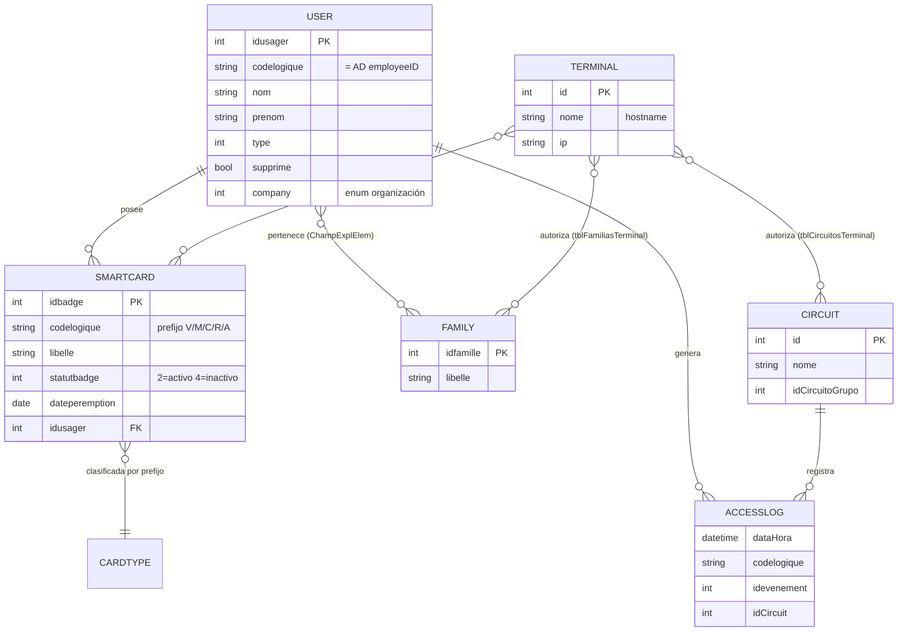

# SICA — Objetos de Datos

> **Sistema**: SICA (Sistema Integrado de Controlo de Acessos)
> **Fase Bolt**: DISCOVERY (brownfield)
> **Fuente**: `demo/from_old_src/`
> **Nota**: El esquema se **infiere de las consultas SQL y firmas SOAP**, no del DDL real.
> **Uso**: Alimenta el modelo de dominio de `@Bolt DDD` y `@Bolt Plan`.

---

## 1. Almacenes de datos

| Almacén             | Servidor   | Rol                          | Fuente de configuración                         |
| ------------------- | ---------- | ---------------------------- | ----------------------------------------------- |
| `Alizes` (SQL)      | `rfsql01`  | Base de datos maestra        | `demo/from_old_src/SICADataSync/app.config:9-10`|
| `SICA` (SQL)        | `rfsql01`  | Base de datos sombra/local   | `demo/from_old_src/SICADataSync/app.config:11`  |
| Active Directory    | `refer.pt` | Maestro de usuarios          | `demo/from_old_src/SICADataSync/app.config:14-15` |
| SMTP                | `hubmail.refer.pt` | Notificaciones        | `demo/from_old_src/SICADataSync/app.config:26-28` |

---

## 2. Entidades principales

### User / Usager

- **Tablas**: `Alizes.Usager`, vistas `SICA.vwVisitantes`, `Alizes.VueUsagers`
- **Reglas asociadas**: RULE-001, RULE-002, RULE-003

| Atributo       | Notas                                         |
| -------------- | --------------------------------------------- |
| `idusager`     | PK                                            |
| `codelogique`  | Único, = `employeeID` de AD (clave de unión)  |
| `nom`, `prenom`| Apellido / nombre                             |
| `type`         | 0 = desconocido, > 0 = empleado               |
| `supprime`     | Borrado lógico                                |
| `datevalidite` | Fecha de validez                              |
| `company`      | Enum de organización (RULE-003)               |

### SmartCard / Badge

- **Tablas**: `Alizes.Badge`, `SICA.tblCartoes`
- **Reglas asociadas**: RULE-004, RULE-005, RULE-006, RULE-007

| Atributo (Alizes / SICA)        | Notas                                       |
| ------------------------------- | ------------------------------------------- |
| `idbadge` / `ID`                | PK                                          |
| `codelogique` / `NumCartao`     | Prefijo V/M/C/R/A + número (RULE-004)       |
| `libelle` / `Decricao`          | Descripción (= `prenom` al sincronizar)     |
| `statutbadge`                   | 2 = activo, 4 = inactivo                     |
| `dateperemption`                | Caducidad                                    |
| `idusager`                      | FK a User                                    |
| `Tipo` (SICA)                   | idTipoCartao 1–5 (RULE-004)                  |
| `supprime`                      | Borrado lógico (filtro RULE-005)             |

### Family / Familia

- **Tablas**: `Alizes.Vue_FamilleListe`, `SICA.tblFamilias`, relación vía `ChampExplElem`
- **Reglas asociadas**: RULE-008 (asociación terminal↔familia)

| Atributo            | Notas                          |
| ------------------- | ------------------------------ |
| `idfamille` / `ID`  | PK                             |
| `libelle` / `Nome`  | Nombre del grupo de acceso     |

### Circuit / Door (Circuito)

- **Tablas**: `SICA.tblCircuitos`, `Alizes.Acces`
- **Reglas asociadas**: monitorización (`Circuitos.ascx`)

| Atributo          | Notas                       |
| ----------------- | --------------------------- |
| `ID`              | PK                          |
| `Nome`            | Nombre del circuito/puerta  |
| `IDCircuitoGrupo` | Jerarquía de circuitos      |

### Terminal

- **Tabla**: `SICA.tblTerminais`
- **Reglas asociadas**: RULE-008

| Atributo    | Notas                   |
| ----------- | ----------------------- |
| `ID`        | PK                      |
| `Nome`      | Hostname del terminal   |
| `Descricao` | Descripción             |
| `IP`        | Dirección IP            |

### AccessLog (Histórico de eventos)

- **Tablas**: `Alizes.VueHisto`, `SICA.tblLog` (vía `sp_tblLog_Insert`)
- **Reglas asociadas**: auditoría, `GetLastCircuitEvents`

| Atributo                  | Notas                                    |
| ------------------------- | ---------------------------------------- |
| `DataHora`                | Fecha/hora del evento                    |
| `NumEmpregado`/`codelogique` | Código de tarjeta                     |
| `Nome`, `Empresa`, `Zona` | Parseados del evento                     |
| `idevenement`             | Tipo de evento (249/253/255 filtrados)   |
| `idCircuit`               | Puerta/circuito                          |

---

## 3. Tablas de asociación (control de acceso)

| Tabla                      | Relación                  | Uso                                |
| -------------------------- | ------------------------- | ---------------------------------- |
| `SICA.tblCartoesTerminal`  | Tarjeta ↔ Terminal        | Reglas de acceso por terminal      |
| `SICA.tblFamiliasTerminal` | Familia ↔ Terminal        | Reglas de acceso por familia       |
| `SICA.tblCircuitosTerminal`| Circuito ↔ Terminal       | Reglas de acceso por circuito      |
| `Alizes.ChampExplElem`     | Usuario ↔ Familia         | Asignación de grupos de acceso     |

---

## 4. Diagrama de relaciones (inferido)

---

## 5. Riesgos de inyección SQL

> Puntos donde datos de estas entidades se concatenan en cadenas SQL sin parametrizar.

| Fichero:línea                                                                          | Patrón                                  | Riesgo     | Entidad        |
| -------------------------------------------------------------------------------------- | --------------------------------------- | ---------- | -------------- |
| [Default.aspx.vb:12](../../../demo/from_old_src/SICAWeb/SICAWeb/Default.aspx.vb)        | `tblTerminais` por hostname/IP          | 🔴 Crítico | Terminal       |
| [DataSync.vb:251](../../../demo/from_old_src/SICADataSync/DataSync.vb)                  | `select codelogique ... where ...`      | 🟡 Medio   | User           |
| [DataSync.vb:253](../../../demo/from_old_src/SICADataSync/DataSync.vb)                  | `select idbadge from badge ...`         | 🟡 Medio   | SmartCard      |
| [DataSync.vb:264](../../../demo/from_old_src/SICADataSync/DataSync.vb)                  | `insert into tblCartoes ...`            | 🟡 Medio   | SmartCard      |
| [ActivarCartoes.ascx.vb:18](../../../demo/from_old_src/SICAWeb/SICAWeb/ActivarCartoes.ascx.vb) | `select IDFamilia from vwFamilias` | 🟡 Medio   | Family         |
| [ActivarCartoes.ascx.vb:25-30](../../../demo/from_old_src/SICAWeb/SICAWeb/ActivarCartoes.ascx.vb) | WHERE construido en bucle       | 🟠 Alto    | SmartCard      |
| [Acessos.ascx.vb:50-52](../../../demo/from_old_src/SICAWeb/SICAWeb/Acessos.ascx.vb)     | `Insert into tblCartoes ...`            | 🟡 Medio   | SmartCard      |
| [Acessos.ascx.vb:66](../../../demo/from_old_src/SICAWeb/SICAWeb/Acessos.ascx.vb)        | `INSERT INTO tblCircuitos ...`          | 🟡 Medio   | Circuit        |
| [SMIMethods.asmx.vb:28](../../../demo/from_old_src/wsSMIServer/SMIMethods.asmx.vb)      | `select ... where codelogique='...'`    | 🟡 Medio   | User           |

---

## 6. Mapa entidad → reglas

| Entidad    | Reglas que la tocan                          |
| ---------- | -------------------------------------------- |
| User       | RULE-001, RULE-002, RULE-003                 |
| SmartCard  | RULE-004, RULE-005, RULE-006, RULE-007       |
| Family     | RULE-008                                     |
| Terminal   | RULE-008                                     |
| AccessLog  | (auditoría — sin regla formal extraída)      |
| Circuit    | (monitorización — sin regla formal extraída) |

---

## 7. Confianza y gaps

- **Confianza**: Media-Alta. La existencia de tablas/columnas se confirma por las consultas
  SQL leídas, pero **tipos, claves y nulabilidad reales requieren el DDL** de `Alizes`/`SICA`.
- **Gaps / preguntas a SME**:
  - DDL real de `Alizes` y `SICA` (tipos exactos, índices, FKs).
  - Definición de las vistas (`VueUsagers`, `Vue_FamilleListe`, `vwFamilias`, etc.).
  - Semántica completa de `statutbadge` y `idevenement`.
  - Relación exacta entre `tblCartoes` (SICA) y `Badge` (Alizes) durante la sincronización.
