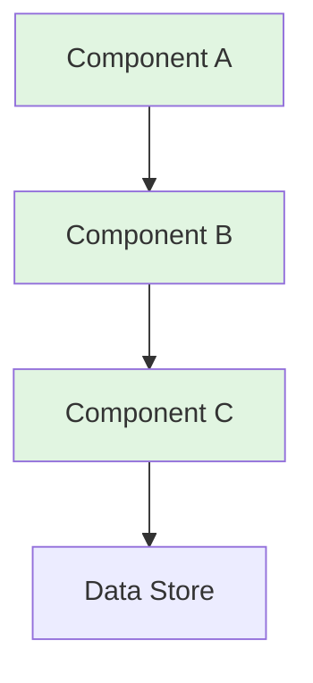
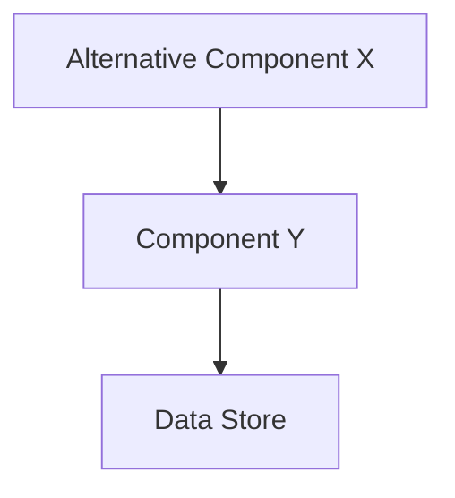
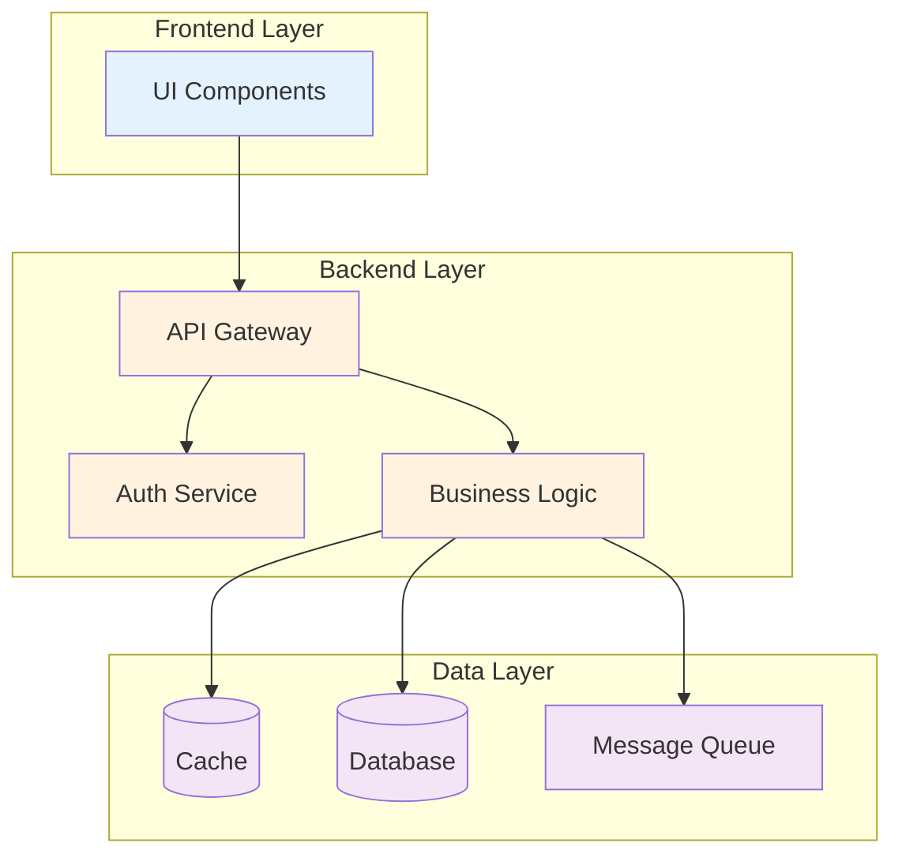

# ADR-NNNN: [Technical Decision Title]

## Metadata

| Property     | Value                                                          |
| ------------ | -------------------------------------------------------------- |
| ADR ID       | ADR-NNNN                                                       |
| Status       | [Proposed \| Accepted \| Deprecated \| Superseded by ADR-XXXX] |
| Category     | [ARCH \| TECH \| DATA \| SEC \| INT \| INFRA]                  |
| Created      | {YYYY-MM-DD}                                                   |
| Updated      | {YYYY-MM-DD}                                                   |
| Deciders     | [Names/Roles]                                                  |
| Consulted    | [Technical stakeholders]                                       |
| Related ADRs | [ADR-XXX, ADR-YYY]                                             |

---

## Context

### Background

[Describe the technical situation that led to this decision]

### Technical Problem

[Clear statement of the technical problem to solve]

### Driving Forces

- **[Force 1]**: [Description - e.g., Performance bottleneck]
- **[Force 2]**: [Description - e.g., Scalability limits]
- **[Force 3]**: [Description - e.g., Technical debt]

### Constitution Constraints

Per `.boltf/memory/constitution.md`:

- **Tech Stack**: [Relevant constraints from constitution]
- **Principles**: [Relevant architectural principles]
- **Security**: [Relevant security requirements]
- **Quality**: [Relevant quality standards]

**Compliance Status:**

- [ ] Complies with all constraints
- [ ] Requires exception (see below)

**Exceptions Required:**
[List any deviations from constitution and justification]

---

## Decision Drivers

| Priority   | Driver     | Description                      | Measurable Target |
| ---------- | ---------- | -------------------------------- | ----------------- |
| **Must**   | [Driver 1] | [Critical technical requirement] | [Specific metric] |
| **Should** | [Driver 2] | [Important technical preference] | [Specific metric] |
| **Could**  | [Driver 3] | [Nice to have feature]           | [Specific metric] |

---

## Options Considered

### Option 1: [Technical Option Name]

**Description:**
[Detailed technical description of the approach]

**Architecture:**



**Implementation Approach:**

```typescript
// Code example showing implementation
interface Example {
  // Key interfaces or pseudocode
}
```

**Pros:**

- ✅ [Technical advantage 1]
- ✅ [Technical advantage 2]
- ✅ [Technical advantage 3]

**Cons:**

- ❌ [Technical limitation 1]
- ❌ [Technical limitation 2]

**Technical Metrics:**

- **Performance**: [Benchmark data]
- **Scalability**: [Scaling characteristics]
- **Complexity**: [Complexity assessment]
- **Maintenance**: [Maintenance burden]

### Option 2: [Alternative Technical Option]

**Description:**
[Detailed technical description]

**Architecture:**



**Implementation Approach:**

```typescript
// Alternative implementation example
```

**Pros:**

- ✅ [Technical advantage 1]
- ✅ [Technical advantage 2]

**Cons:**

- ❌ [Technical limitation 1]
- ❌ [Technical limitation 2]

**Technical Metrics:**

- **Performance**: [Benchmark data]
- **Scalability**: [Scaling characteristics]
- **Complexity**: [Complexity assessment]
- **Maintenance**: [Maintenance burden]

### Option 3: [Another Alternative]

**Description:**
[Detailed technical description]

**Architecture:**


**Implementation Approach:**

```typescript
// Another implementation example
```

**Pros:**

- ✅ [Technical advantage]

**Cons:**

- ❌ [Technical limitation]

**Technical Metrics:**

- **Performance**: [Benchmark data]
- **Scalability**: [Scaling characteristics]

---

## Technical Comparison

### Performance Benchmarks

| Metric        | Option 1 | Option 2 | Option 3 | Target    |
| ------------- | -------- | -------- | -------- | --------- |
| Latency (p95) | X ms     | Y ms     | Z ms     | ≤ A ms    |
| Throughput    | X req/s  | Y req/s  | Z req/s  | ≥ B req/s |
| Memory Usage  | X MB     | Y MB     | Z MB     | ≤ C MB    |
| CPU Usage     | X%       | Y%       | Z%       | ≤ D%      |

### Scalability Analysis

| Factor             | Option 1           | Option 2           | Option 3           |
| ------------------ | ------------------ | ------------------ | ------------------ |
| Horizontal Scaling | [Easy/Medium/Hard] | [Easy/Medium/Hard] | [Easy/Medium/Hard] |
| Vertical Scaling   | [Easy/Medium/Hard] | [Easy/Medium/Hard] | [Easy/Medium/Hard] |
| Max Capacity       | [X units]          | [Y units]          | [Z units]          |

### Complexity Assessment

| Aspect         | Option 1 | Option 2 | Option 3 |
| -------------- | -------- | -------- | -------- |
| Implementation | [H/M/L]  | [H/M/L]  | [H/M/L]  |
| Testing        | [H/M/L]  | [H/M/L]  | [H/M/L]  |
| Operations     | [H/M/L]  | [H/M/L]  | [H/M/L]  |
| Debugging      | [H/M/L]  | [H/M/L]  | [H/M/L]  |

---

## Decision Outcome

**Chosen Option:** Option {N} - {OPTION_NAME}

**Justification:**

1. **Primary Reason:** [Most important technical factor]
2. **Secondary Reason:** [Supporting technical factor]
3. **Tertiary Reason:** [Additional consideration]

**Technical Benefits:**

- ✅ [Specific technical benefit with metric]
- ✅ [Another technical benefit with metric]
- ✅ [Performance improvement: X% faster]

**Technical Trade-offs:**

- ❌ [Specific technical cost with mitigation]
- ❌ [Another trade-off with acceptance reason]

---

## Implementation Details

### Architecture



### Code Structure

```typescript
// Key interfaces and types
interface CoreInterface {
  // Define core contracts
}

class Implementation implements CoreInterface {
  // Implementation outline
}

// Usage example
const example = new Implementation();
```

### Configuration

```yaml
# Configuration example
service:
  option: value
  setting: value
```

### Data Model

```typescript
// Data structures
interface DataModel {
  // Schema definition
}
```

### Migration Plan

**Phase 1: Preparation (Days 1-3)**

```bash
# Setup commands
npm install new-dependencies
npx migration-tool init
```

**Phase 2: Implementation (Days 4-10)**

```typescript
// Migration code example
async function migrate() {
  // Migration logic
}
```

**Phase 3: Validation (Days 11-14)**

```bash
# Validation commands
npm run test:integration
npm run benchmark
```

### Rollback Strategy

**If issues detected:**

```bash
# Step 1: Stop new system
docker-compose down new-service

# Step 2: Revert database (if needed)
./scripts/rollback-migration.sh

# Step 3: Restart old system
docker-compose up -d old-service
```

**Rollback Criteria:**

- P95 latency > [X]ms for > 5 minutes
- Error rate > [Y]% for > 2 minutes
- Memory usage > [Z]GB

---

## Testing Strategy

### Unit Tests

```typescript
describe('Implementation', () => {
  it('should handle case X', () => {
    // Test code
  });
});
```

### Integration Tests

```typescript
describe('Integration', () => {
  it('should integrate with system Y', () => {
    // Integration test
  });
});
```

### Performance Tests

```bash
# Load test command
artillery run load-test.yml

# Benchmark command
npm run bench
```

### Validation Criteria

- [ ] Unit test coverage ≥ 80%
- [ ] Integration tests pass
- [ ] Load test: [X] req/s sustained for 10 minutes
- [ ] Memory leak test: 24-hour soak test
- [ ] Benchmark: Performance within ±5% of target

---

## Monitoring and Observability

### Metrics to Track

```typescript
// Key metrics
const metrics = {
  'system.latency.p95': 'gauge',
  'system.throughput': 'counter',
  'system.errors': 'counter',
  'system.memory': 'gauge',
};
```

### Alerts

| Alert        | Condition         | Severity | Action       |
| ------------ | ----------------- | -------- | ------------ |
| High Latency | p95 > [X]ms       | Warning  | Investigate  |
| Error Spike  | > [Y]% errors     | Critical | Page on-call |
| Memory Leak  | Growth > [Z]MB/hr | Warning  | Investigate  |

### Dashboards

- **Performance Dashboard**: [Link or description]
- **Health Dashboard**: [Link or description]
- **Business Metrics**: [Link or description]

---

## Security Implications

### Security Analysis

- [ ] Authentication: [How handled]
- [ ] Authorization: [How handled]
- [ ] Data Encryption: [At-rest and in-transit]
- [ ] Input Validation: [Approach]
- [ ] Audit Logging: [What's logged]

### Threat Model

| Threat     | Mitigation      |
| ---------- | --------------- |
| [Threat 1] | [How mitigated] |
| [Threat 2] | [How mitigated] |

### Compliance

- [ ] OWASP Top 10 reviewed
- [ ] Security scan completed
- [ ] Penetration test planned

---

## Dependencies

### Technical Dependencies

**New Dependencies:**

```json
{
  "dependency-1": "^1.2.3",
  "dependency-2": "^4.5.6"
}
```

**Deprecated Dependencies:**

```json
{
  "old-dependency": "Removed (replaced by dependency-1)"
}
```

### System Dependencies

| System   | Dependency | Impact                  |
| -------- | ---------- | ----------------------- |
| System A | [How used] | [Impact if unavailable] |
| System B | [How used] | [Impact if unavailable] |

---

## Timeline and Milestones

| Milestone               | Date         | Owner  | Status      |
| ----------------------- | ------------ | ------ | ----------- |
| ✅ Decision Made        | {YYYY-MM-DD} | [Name] | Complete    |
| 🔄 PoC Complete         | {YYYY-MM-DD} | [Name] | In Progress |
| ⏳ Implementation Start | {YYYY-MM-DD} | [Name] | Pending     |
| ⏳ Testing Complete     | {YYYY-MM-DD} | [Name] | Pending     |
| ⏳ Production Deploy    | {YYYY-MM-DD} | [Name] | Pending     |
| ⏳ Validation Complete  | {YYYY-MM-DD} | [Name] | Pending     |

---

## Related Technical Decisions

- **Builds upon**: [ADR-XXX: Foundation](./ADR-XXXX.md) - [How it builds on it]
- **Supersedes**: [ADR-YYY: Old Approach](./ADR-YYYY.md) - [What changed]
- **Impacts**: [ADR-ZZZ: Dependent System](./ADR-ZZZZ.md) - [How it impacts]

---

## References

### Technical Documentation

- [API Specification](link)
- [Database Schema](link)
- [Architecture Diagrams](link)

### Research & Benchmarks

- [Performance Study](link)
- [Comparison Analysis](link)
- [Vendor Documentation](link)

### Code References

- [Proof of Concept](link-to-branch)
- [Benchmark Suite](link-to-repo)

---

## Notes

### Assumptions

- [Assumption 1]
- [Assumption 2]

### Open Questions

- [ ] [Question 1]
- [ ] [Question 2]

### Future Considerations

- [Future enhancement 1]
- [Future enhancement 2]

---

## Review History

| Date         | Reviewer | Role         | Outcome  | Technical Notes                  |
| ------------ | -------- | ------------ | -------- | -------------------------------- |
| {YYYY-MM-DD} | {Name}   | Tech Lead    | Approved | [Technical feedback]             |
| {YYYY-MM-DD} | {Name}   | Sr. Engineer | Approved | [Performance concerns addressed] |

---

**Template:** MADR Technical Focus v2.0
**Author:** {Name/Role}
**Technical Owner:** {Name}
**Last Updated:** {YYYY-MM-DD}
**Review Status:** [Draft | In Review | Approved]
