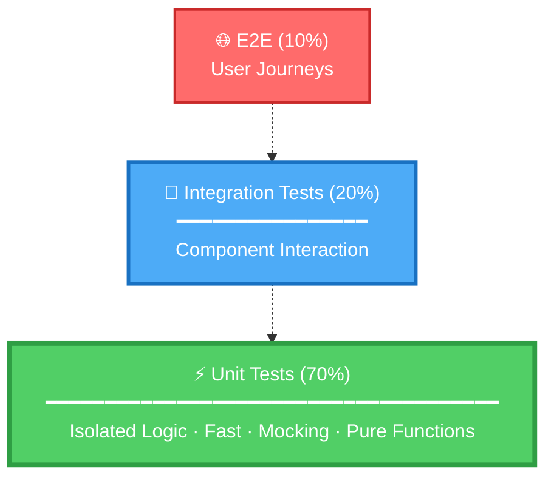

# Testing Discipline

## When to Use

- Generating test suites for new code
- Deciding between TDD and BDD approaches
- Implementing coverage-first for legacy code

## Testing Pyramid



**Distribution:**

- 70% Unit Tests (fast, isolated)
- 20% Integration Tests (components together)
- 10% E2E Tests (full system)

## TDD vs BDD Decision Matrix

| Scenario               | Approach           | Agent Command              |
| ---------------------- | ------------------ | -------------------------- |
| User story with ACs    | **BDD**            | Use @bolt-gherkin          |
| New algorithm/utility  | **TDD**            | Use @bolt-testing tdd      |
| Existing untested code | **Coverage-First** | Use @bolt-testing coverage |
| Bug fix                | **TDD**            | Use @bolt-testing tdd      |
| API endpoint           | **BDD + Contract** | Use @bolt-gherkin          |
| Domain entity          | **TDD**            | Use @bolt-testing tdd      |

## TDD Workflow (Test-Driven Development)

**Red-Green-Refactor Cycle:**

1. **RED** - Write failing test for one small piece of functionality
2. **GREEN** - Write minimal code to make test pass
3. **REFACTOR** - Improve code design while keeping tests green
4. **REPEAT** - Next test

## BDD Workflow (Behavior-Driven Development)

**Gherkin → Step Definitions → Implementation:**

1. **Write Gherkin scenario** from user story acceptance criteria
2. **Generate step definitions** (use @bolt-gherkin)
3. **Implement functionality** to satisfy scenarios
4. **Verify all scenarios pass**

## Coverage-First Approach

**For existing untested code:**

1. **Run coverage report** - Identify uncovered areas
2. **Write tests** for uncovered code paths
3. **Achieve target coverage** (80% line, 75% branch)
4. **Run mutation testing** - Validate test quality
5. **Improve tests** if mutation score < 70%

## Quality Targets

| Metric          | Minimum | Recommended | Critical Paths |
| --------------- | ------- | ----------- | -------------- |
| Line Coverage   | 80%     | 90%         | 100%           |
| Branch Coverage | 75%     | 85%         | 100%           |
| Mutation Score  | 70%     | 80%         | 90%            |

## Prerequisites

- Must be on `feature/*` branch (verify with `git branch --show-current`)
- `specs/[XXX-feature-name]/requirements/requirements.md` must exist
- `.boltf/memory/constitution.md` defines project thresholds

## Terminal Commands

```bash
# Run all tests with coverage
npm test -- --coverage
# or: dotnet test /p:CollectCoverage=true

# Run mutation testing
npx stryker run
# or: dotnet stryker

# Generate coverage report
npm run test:cov
# or: dotnet test /p:CollectCoverage=true /p:CoverletOutputFormat=opencover
```

## References

- @bolt-testing agent (Test suite generation)
- @bolt-gherkin agent (BDD scenario generation)
- @bolt-quality-gates skill (Thresholds and mutation tools)
