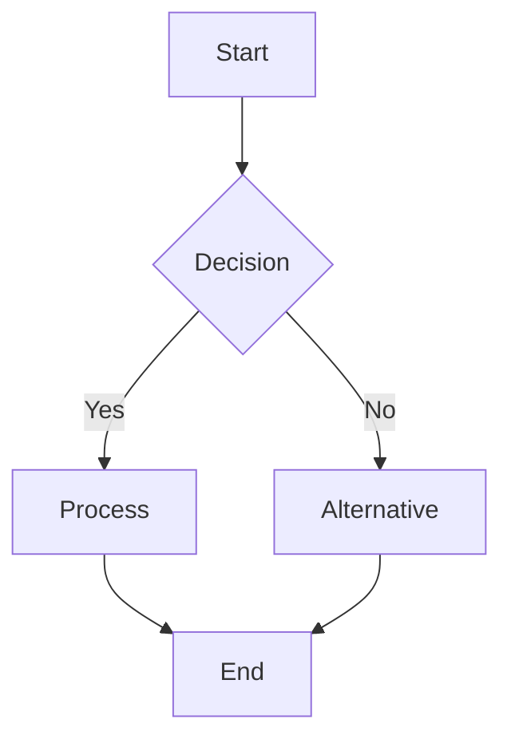
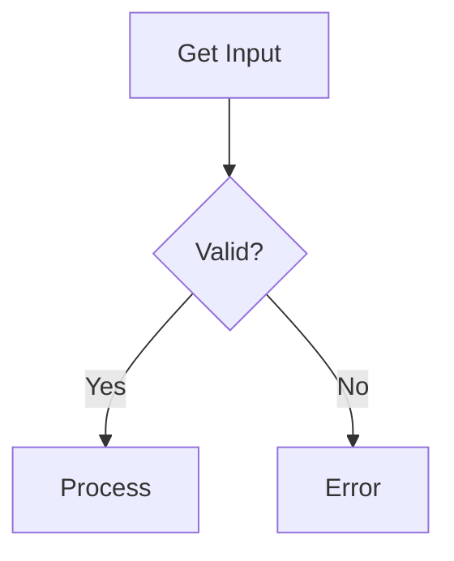
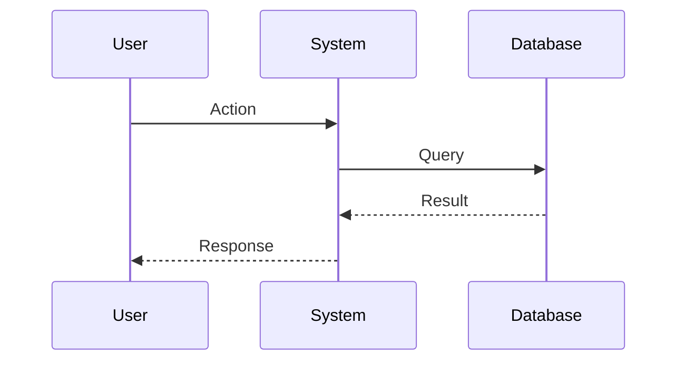

# Mermaid Creator

Create professional diagrams using Mermaid syntax for documentation, architecture design, and data
modeling.

## Workflow

1. **Choose diagram type** - Select the appropriate diagram based on what needs to be visualized
2. **Create .mmd file** - Write Mermaid syntax in a `.mmd` file
3. **Validate syntax** - Check syntax is correct (Mermaid CLI will report errors)
4. **Convert to SVG** (optional) - Generate SVG for embedding in presentations or documents

## Diagram Type Selection

Choose the right diagram type for your use case:

| Type          | Use Case                                                           | Reference                                                  |
| ------------- | ------------------------------------------------------------------ | ---------------------------------------------------------- |
| **C4**        | **Software architecture diagrams** (Context, Container, Component) | [other-types.md](references/other-types.md#c4-diagram)     |
| **Flowchart** | Processes, workflows, decision trees, **functional module overviews** | [flowchart.md](references/flowchart.md)                 |
| **Sequence**  | API interactions, system communications, message flows             | [sequence.md](references/sequence.md)                      |
| **Class**     | Object-oriented design, data models, relationships                 | [class.md](references/class.md)                            |
| **State**     | State machines, workflow states, system states                     | [state.md](references/state.md)                            |
| **ER**        | Database schemas, entity relationships                             | [er.md](references/er.md)                                  |
| **Gantt**     | Project timelines, task scheduling                                 | [other-types.md](references/other-types.md#gantt-charts)   |
| **Pie**       | Data distribution, percentages                                     | [other-types.md](references/other-types.md#pie-charts)     |
| **Git**       | Git history, branching strategies                                  | [other-types.md](references/other-types.md#git-graphs)     |
| **Journey**   | User experience flows                                              | [other-types.md](references/other-types.md#user-journey)   |
| **Quadrant**  | 2D comparison, prioritization                                      | [other-types.md](references/other-types.md#quadrant-chart) |
| **Timeline**  | Chronological events                                               | [other-types.md](references/other-types.md#timeline)       |

> **For Architecture Diagrams**: Prefer **C4 diagrams** for system architecture, application
> architecture, and component design. They provide standard levels of abstraction (Context,
> Container, Component, Code).
>
> **For Functional Module Overviews**: Use **`flowchart TB` + `subgraph`** to show module
> grouping, implementation status (via `style` colors) and inter-module dependencies in a single
> diagram. Always use `<br/>` for multiline node labels — **never `\n`**.
> See the [canonical pattern](references/flowchart.md#functional-module-overview-canonical-pattern).

**Load references as needed**: Each reference file contains syntax, patterns, examples, and best
practices for that diagram type.

## Quick Start

The most common starting point — a flowchart with decision logic:



For syntax specific to each diagram type, read the reference file linked in the
[Diagram Type Selection](#diagram-type-selection) table above.

## Example Files

74 ready-to-use `.mmd` files live in `assets/examples/`, organized by type (flowchart ×10,
sequence ×12, class ×13, state ×13, er ×10, other ×16). Copy and modify — all are validated
with Mermaid CLI.

## Mermaid CLI

### Installation

```shell
npm install -g @mermaid-js/mermaid-cli
```

### Convert to SVG

```shell
mmdc -i diagram.mmd -o diagram.svg
```

### Batch Conversion

```shell
mmdc -i input1.mmd -i input2.mmd -o output/
```

### With Configuration

```shell
mmdc -i diagram.mmd -o diagram.svg -t dark -b transparent
```

Options:

- `-t` - Theme (default, dark, forest, neutral)
- `-b` - Background color or `transparent`
- `-w` - Width
- `-H` - Height

## Best Practices

### General Guidelines

- **Choose the right diagram type** - Match the diagram to the information structure
- **Keep it simple** - Split complex diagrams into multiple focused diagrams
- **Use descriptive labels** - Avoid abbreviations unless well-known
- **Be consistent** - Use consistent naming and styling within a diagram
- **Validate syntax** - Run through Mermaid CLI to catch errors early

### For Documentation

- Create separate `.mmd` files for each diagram
- Store diagrams near the documentation they support
- **Save a copy to `docs/diagrams/`** with a comprehensive name for central diagram index
- Include comments in complex diagrams using `%%` for Mermaid comments
- Generate SVG for static documentation
- Commit both `.mmd` source and generated SVG

### For Presentations

- Use high contrast colors for visibility
- Keep text large and readable
- Test diagram rendering at presentation size
- Use `transparent` background to match slide themes
- Prefer SVG over PNG for crisp rendering

### Performance

- Large diagrams (>50 nodes) may render slowly
- Split large flowcharts using off-page connectors
- For ER diagrams with many entities, show only relevant relationships
- Consider using subgraphs to organize complex diagrams

## Common Patterns

### Decision Logic

Use flowcharts with diamond decision nodes:



### System Interactions

Use sequence diagrams for temporal interactions:



**IMPORTANT**: When using sequence diagrams, always include sequence numbers.

### Data Models

Use ER diagrams for database schemas or class diagrams for object models.

### Process Workflows

Use state diagrams for state machines or flowcharts for process flows.

## Troubleshooting

### Syntax Errors

Run `mmdc -i file.mmd -o output.svg` to see specific error messages.

Common issues:

- Missing spaces around arrows (`A-->B` should be `A --> B` in some contexts)
- Unclosed quotes in labels
- Invalid characters in IDs (use alphanumeric + underscore)
- Wrong diagram type declaration
- **Multiline labels not rendering** — `\n` does not work in flowchart node labels.
  Use `<br/>` inside double-quoted labels: `A["Line 1<br/>Line 2"]`

### Rendering Issues

- Check Mermaid CLI version: `mmdc --version`
- Update to latest: `npm install -g @mermaid-js/mermaid-cli@latest`
- Try different themes if elements overlap
- Reduce diagram complexity

### SVG Quality

- Use `mmdc -w 1920` for high-resolution output
- Set background to `transparent` for flexible embedding
- Test generated SVG in target environment

## Advanced Features

Each reference file documents the advanced features for its diagram type:

| Reference | Advanced features covered |
| --------- | ------------------------- |
| [flowchart.md](references/flowchart.md) | Subgraphs, `classDef`, `style` directives, interactive links, functional module pattern |
| [sequence.md](references/sequence.md) | Autonumber, background `rect`, critical regions, activation bars |
| [class.md](references/class.md) | Generics, interfaces, notes, namespaces, visibility modifiers |
| [state.md](references/state.md) | Concurrency, notes, fork/join, composite states |
| [er.md](references/er.md) | Cardinality notation, attribute types, multi-table schemas |
| [other-types.md](references/other-types.md) | Gantt, Pie, Git graphs, User Journey, Quadrant, Timeline, Mindmap, C4 |
