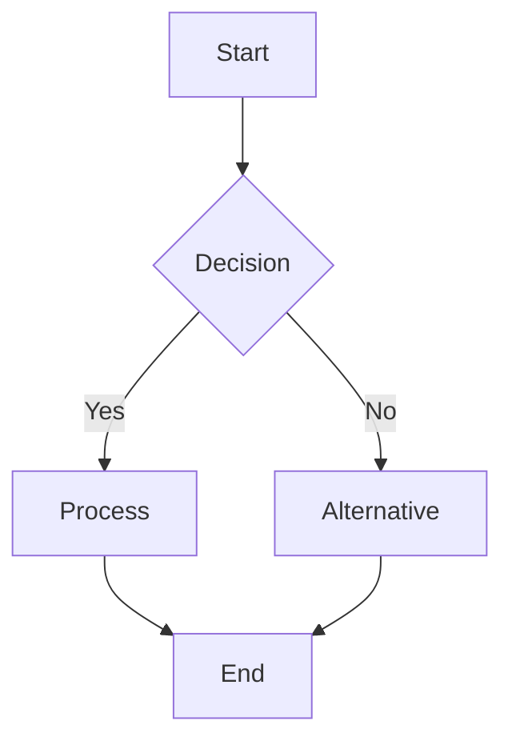
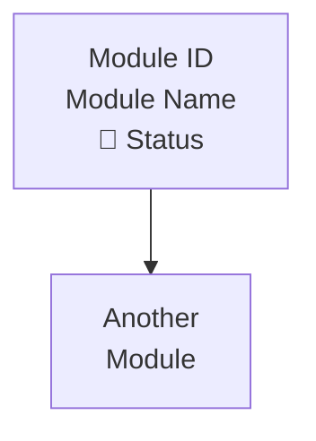
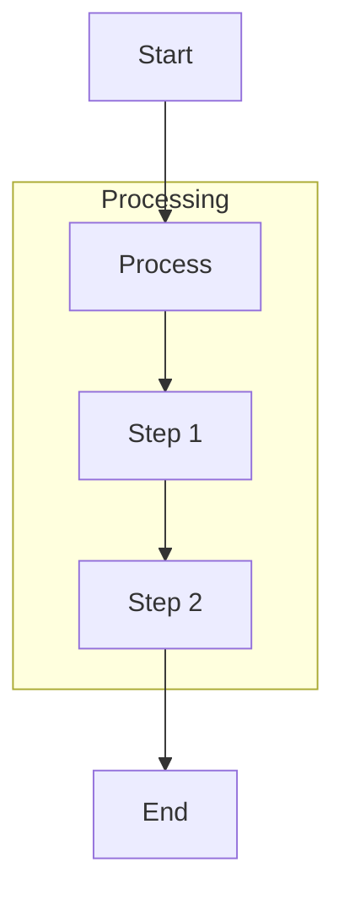
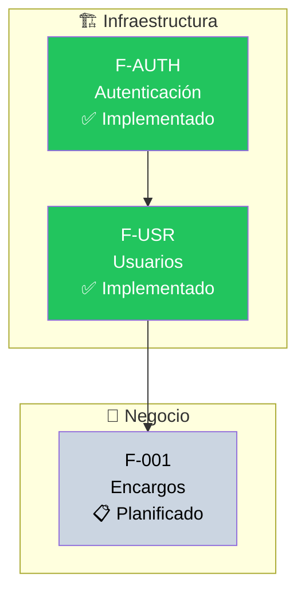

# Flowchart Diagrams

Flowcharts represent processes, workflows, and decision trees.

## Basic Syntax

**Example**: See `assets/examples/flowchart/basic.mmd`

## Direction

- `TD` or `TB` - Top to bottom
- `BT` - Bottom to top
- `LR` - Left to right
- `RL` - Right to left

## Node Shapes

| Shape         | Syntax                   | Use Case              |
| ------------- | ------------------------ | --------------------- |
| Rectangle     | `[Text]`                 | Standard process      |
| Rounded       | `(Text)`                 | Start/end points      |
| Stadium       | `([Text])`               | Alternative start/end |
| Subroutine    | `[[Text]]`               | Predefined process    |
| Database      | `[(Text)]`               | Data storage          |
| Circle        | `((Text))`               | Connection point      |
| Diamond       | `{Text}`                 | Decision              |
| Hexagon       | `{{Text}}`               | Preparation           |
| Parallelogram | `[/Text/]` or `[\Text\]` | Input/output          |
| Trapezoid     | `[/Text\]` or `[\Text/]` | Manual operation      |

**Example**: See `assets/examples/flowchart/node-shapes.mmd`

## Connections

| Type         | Syntax | Use Case                     |
| ------------ | ------ | ---------------------------- |
| Arrow        | `-->`  | Standard flow                |
| Line         | `---`  | Connection without direction |
| Dotted arrow | `-.->` | Optional or conditional      |
| Dotted line  | `-.-`  | Weak connection              |
| Thick arrow  | `==>`  | Primary/important flow       |
| Thick line   | `===`  | Strong connection            |

Add labels: `A -->|Label| B`

**Examples**:

- `assets/examples/flowchart/connections.mmd`
- `assets/examples/flowchart/labeled-links.mmd`

## Common Patterns

Refer to example files for complete implementations:

- **Process Flow**: `assets/examples/flowchart/process-flow.mmd` Standard input → validate → process
  → save pattern

- **Decision Tree**: `assets/examples/flowchart/decision-tree.mmd` Authentication and role-based
  routing

- **Workflow with Subprocesses**: `assets/examples/flowchart/workflow-subprocess.mmd` Order
  processing with validation and payment

## Multiline Node Labels

Use ` ` inside quoted labels to break lines. **Never use `\n`** — it is not rendered by
Mermaid in flowcharts and will appear as a literal backslash-n:

> ❌ Wrong: `A["Title\nSubtitle"]`
> ✅ Correct: `A["Title Subtitle"]`

## Best Practices

- Use descriptive labels for nodes and connections
- Use ` ` for multiline labels — **never `\n`**
- Keep flows top-to-bottom or left-to-right for readability
- Use consistent node shapes (rectangles for processes, diamonds for decisions)
- Limit complexity - split large flows into multiple diagrams
- Use subgraphs for logical grouping

## Advanced Features

### Subgraphs

Group related processes:

**Example**: `assets/examples/flowchart/subgraph.mmd`

### Functional Module Overview (canonical pattern)

Use `flowchart TB` + `subgraph` to document a system's functional modules with status, grouping and
dependencies in a single diagram. Apply `style` for status colors and ` ` for multiline labels:

**Color convention**:

- `#22c55e` (verde) — Implementado
- `#f59e0b` (naranja) — En implementación / en desarrollo
- `#93c5fd` (azul) — En especificación
- `#cbd5e1` (gris) — Planificado / pendiente

### Styling

Apply custom styles with `style` directive or `classDef`:

**Examples**:

- `assets/examples/flowchart/styling.mmd`
- `assets/examples/flowchart/class-definitions.mmd`
