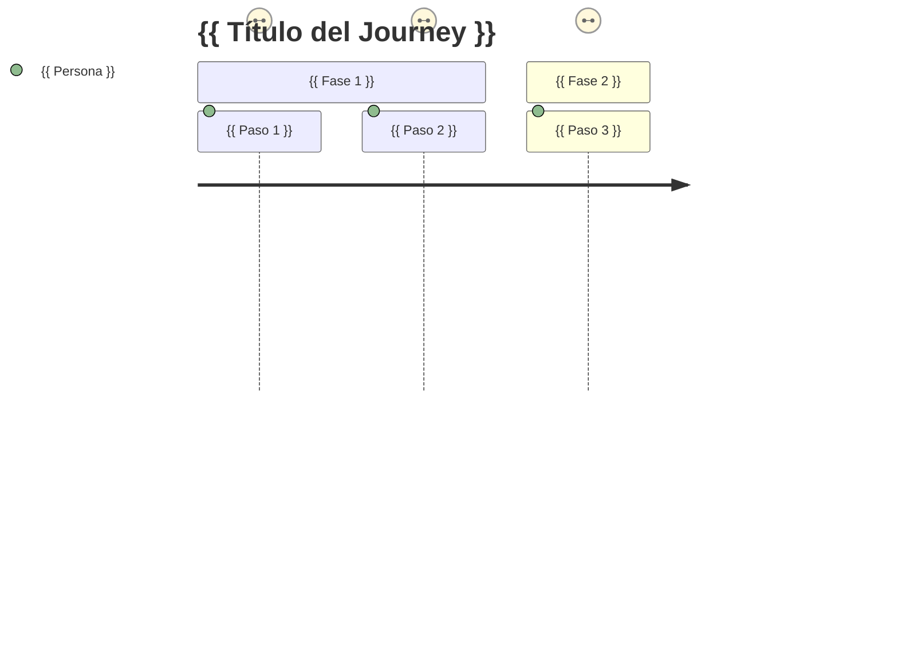

# User Journey Documentation

Genera documentación de user journeys (mapas de experiencia de usuario) y personas,
combinando narrativa estructurada con diagramas Mermaid `journey`. Cubre la sección
`docs/functional/` que el agente Bolt Documentation necesita para documentación funcional completa.

## Cuándo Usar

- El agente Bolt Documentation necesita cubrir `docs/functional/user-journeys/` o `docs/functional/personas.md`
- El usuario quiere documentar cómo un actor interactúa con el sistema de extremo a extremo
- Se necesita identificar y documentar las personas/roles del sistema
- Hay que revisar o crear documentación funcional orientada al negocio

## Cuándo NO Usar

- Para diagramas de secuencia técnicos (usar `architect-diagramer`)
- Para BDD / acceptance criteria ejecutables (usar `gherkin-reqnroll`)
- Para use cases UML completos (usar agente `Bolt Use Case`)

---

## Workflow

### 1. Identificar Fuentes

Lee en este orden para obtener contexto:

| Fuente | Qué extraer |
|--------|-------------|
| `specs/**/feature.md` | Actores, flujos principales, precondiciones |
| `specs/**/requirements/` | Reglas de negocio que condicionan el journey |
| `docs/functional/personas.md` | Personas ya documentadas (para no duplicar) |
| Controllers / Commands / Queries | Acciones reales del sistema disponibles |

### 2. Identificar Personas

Para cada actor del sistema extrae:

- **Nombre y rol** (ej: "Gestor de Siniestros", "Perito Externo")
- **Objetivo principal** en el sistema
- **Pain points** antes de usar el sistema
- **Touchpoints** principales (secciones / features que usa)
- **Nivel técnico** (influye en el detalle de la documentación)

### 3. Mapear el Journey

Para cada persona + escenario principal:

1. Identifica los **pasos discretos** del journey (máx. 8-10 pasos)
2. Asigna una **puntuación de satisfacción** por paso (1-5)
3. Identifica **puntos de fricción** (score ≤ 2)
4. Identifica **momentos de deleite** (score = 5)

### 4. Generar Artefactos

Produce dos ficheros por journey:

#### A. Diagrama Mermaid `journey`



#### B. Narrativa Markdown

Carga y rellena [`templates/journey.md`](templates/journey.md). Para documentar una persona nueva, carga [`templates/personas.md`](templates/personas.md).

### 5. Guardar Ficheros

```
docs/
└── functional/
    ├── personas.md                          ← todas las personas del sistema
    └── user-journeys/
        ├── journey-{{ nombre-actor }}-{{ escenario }}.md
        └── ...
```

---

## Plantillas

| Plantilla | Fichero | Cuándo cargarla |
|-----------|---------|------------------|
| Personas del sistema | [`templates/personas.md`](templates/personas.md) | Paso 4: documentar un actor nuevo |
| User Journey narrativo | [`templates/journey.md`](templates/journey.md) | Paso 4: documentar un escenario de usuario |

---

## Convenciones del Proyecto

- Los actores del sistema están documentados en `specs/**/feature.md` bajo la sección "Actors" o "Actores"
- Los journeys se nombran `journey-{actor-kebab}-{escenario-kebab}.md`
- Las puntuaciones de satisfacción reflejan la experiencia **actual** implementada, no la deseada
- Los puntos de fricción deben enlazar al issue o spec correspondiente si existe
- Usar emojis de estrellas (⭐) para la columna Satisfacción en tablas para facilitar lectura rápida
