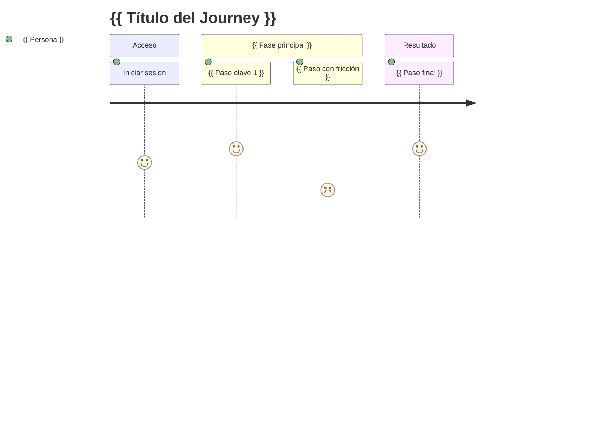

# User Journey: {{ Título descriptivo }}

**Persona**: {{ Nombre de la persona }}
**Escenario**: {{ Descripción breve del escenario }}
**Objetivo**: {{ Qué quiere conseguir al final }}
**Precondiciones**: {{ Qué debe ser cierto para que este journey comience }}

## Diagrama

## Pasos Detallados

### Fase: {{ Nombre de fase }}

| # | Acción del usuario | Respuesta del sistema | Satisfacción | Notas |
|---|--------------------|-----------------------|:------------:|-------|
| 1 | {{ acción }} | {{ qué hace el sistema }} | ⭐⭐⭐⭐⭐ | — |
| 2 | {{ acción con fricción }} | {{ respuesta del sistema }} | ⭐⭐ | Punto de mejora |

## Puntos de Fricción

- **Paso {{ N }}**: {{ descripción del problema }} → *Mejora sugerida*: {{ solución }}

## Momentos de Deleite

- **Paso {{ N }}**: {{ por qué es una experiencia positiva }}

## Variantes del Journey

| Escenario alternativo | Diferencia con el principal |
|-----------------------|-----------------------------|
| {{ variante }} | {{ qué cambia }} |
