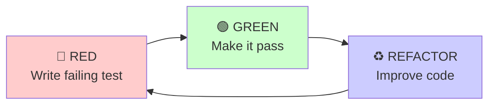
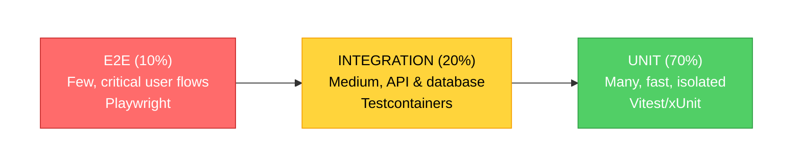

# TDD Comprehensive - Test-Driven Development

**USE THIS SKILL WHEN** implementing new features, fixing bugs, or refactoring code that requires confidence through comprehensive test coverage and strict test-first discipline.

## The Iron Law

**NO PRODUCTION CODE WITHOUT A FAILING TEST FIRST**

This is not a suggestion. This is the foundation of TDD:

- ✅ Write test FIRST → Watch it FAIL → Write code to pass it
- ❌ Code before test? DELETE IT. Start over.
- ❌ Test passes immediately? You tested existing behavior. Fix test.
- ❌ Skip watching test fail? You don't know if it tests anything.

**Violating the letter of the Iron Law is violating its spirit.**

## When to Use TDD

**Always use TDD for:**

- ✅ New features - Before any implementation code
- ✅ Bug fixes - Write failing test reproducing bug first
- ✅ Refactoring - Tests prove behavior preserved
- ✅ Critical business logic - High confidence required
- ✅ Complex algorithms - Edge cases need verification

**Never skip TDD for:**

- ❌ "Simple" changes (simple code breaks too)
- ❌ "Quick fixes" (untested fixes create more bugs)
- ❌ "Prototypes" (prototypes become production)
- ❌ "Exploratory code" (explore, then DELETE and start with TDD)

## Quick Start - The Cycle

**The TDD mantra**: 🔴 **RED** → 🟢 **GREEN** → ♻️ **REFACTOR**



**Typical cycle time:** 10-30 minutes per iteration

### Quick Example - TypeScript

```typescript
// 🔴 RED: Write failing test FIRST
test('retries operation 3 times before failing', async () => {
  let attempts = 0;
  const operation = async () => {
    attempts++;
    if (attempts < 3) throw new Error('fail');
    return 'success';
  };

  const result = await retryOperation(operation);

  expect(result).toBe('success');
  expect(attempts).toBe(3);
});

// Run: npm test → FAIL (retryOperation not defined) ✅ This is expected!

// 🟢 GREEN: Write minimal code to pass
async function retryOperation<T>(fn: () => Promise<T>): Promise<T> {
  for (let i = 0; i < 3; i++) {
    try {
      return await fn();
    } catch (e) {
      if (i === 2) throw e;
    }
  }
  throw new Error('unreachable');
}

// Run: npm test → PASS ✅

// ♻️ REFACTOR: Improve while keeping tests green
async function retryOperation<T>(operation: () => Promise<T>, maxAttempts: number = 3): Promise<T> {
  let lastError: Error;

  for (let attempt = 1; attempt <= maxAttempts; attempt++) {
    try {
      return await operation();
    } catch (error) {
      lastError = error as Error;
      if (attempt === maxAttempts) throw lastError;
    }
  }

  throw lastError!;
}

// Run: npm test → PASS ✅
```

## 7-Step TDD Workflow

### Step 1: Write User Story

```text
As a [role]
I want to [action]
So that [benefit]

Example:
As a developer
I want to retry failed operations automatically
So that transient errors don't cause permanent failures
```

### Step 2: Generate Test Cases

Break user story into specific test cases:

```typescript
describe('retryOperation', () => {
  it('returns result on first success');
  it('retries up to 3 times before failing');
  it('throws error after 3 failed attempts');
  it('does not retry if operation succeeds');
  it('preserves original error message on final failure');
});
```

### Step 3: Write First Failing Test

Pick simplest case. Write test. **Watch it fail.**

```typescript
it('returns result on first success', async () => {
  const operation = async () => 'success';
  const result = await retryOperation(operation);
  expect(result).toBe('success');
});

// Run: npm test
// MUST see: FAIL ✗ returns result on first success
```

### Step 4: Write Minimal Code

Just enough to pass THIS test.

```typescript
async function retryOperation<T>(fn: () => Promise<T>): Promise<T> {
  return await fn(); // Minimal for first test
}

// Run: npm test
// MUST see: PASS ✓ returns result on first success
```

### Step 5: Refactor

Improve code while keeping tests green. Run tests after each change.

### Step 6: Repeat for Next Test

Write next failing test → minimal code → refactor → repeat.

### Step 7: Verify Coverage

```bash
npm run test:coverage
# Verify: All statements 80%+, Branches 80%+, Functions 80%+, Lines 80%+
```

## The Three Phases

### 🔴 RED Phase: Write a Failing Test

**Goal:** Define WHAT should happen (not HOW).

**Checklist:**

- [ ] Test follows AAA pattern (Arrange, Act, Assert)
- [ ] Test name clearly describes expected behavior
- [ ] Test runs and FAILS
- [ ] Failure message is clear and expected
- [ ] Only ONE new test added
- [ ] Test committed: `test: add failing test for [feature]`

**Common RED mistakes:**

- ❌ Test errors (syntax/import) instead of failing - Fix your test!
- ❌ Didn't run test - You don't know if it works
- ❌ Test passes immediately - You tested existing code

### 🟢 GREEN Phase: Make the Test Pass

**Goal:** Write the SIMPLEST code to make the test pass.

**Checklist:**

- [ ] Minimal code written (no over-engineering)
- [ ] New test PASSES
- [ ] ALL existing tests still pass
- [ ] No functionality added beyond test requirements
- [ ] Code committed: `feat: implement [feature]`

**Common GREEN mistakes:**

- ❌ Over-Engineering: Adding features not tested yet
- ❌ Premature Optimization: Performance concerns before it works
- ❌ Adding Error Handling: Unless you have a test for it

**Remember:** Keep it simple! Just make the test pass.

### ♻️ REFACTOR Phase: Improve Code Quality

**Goal:** Improve code while keeping tests GREEN.

**When to refactor:**

- Code duplication detected
- Long methods (>20 lines)
- Complex conditionals
- Magic numbers or strings
- Poor naming
- SOLID violations

**Common refactorings:**

1. Extract Method - Break long methods
2. Extract Class - Split god classes
3. Rename - Improve clarity
4. Remove Duplication - DRY principle
5. Simplify Conditionals - Guard clauses

**Workflow:**

1. Identify code smell
2. Make ONE improvement
3. Run ALL tests - Must stay GREEN
4. Commit: `refactor: extract validation logic`
5. Repeat until satisfied

**Checklist:**

- [ ] Code follows SOLID principles
- [ ] No code duplication (DRY)
- [ ] Clear, descriptive names
- [ ] ALL tests still GREEN after each change
- [ ] Code complexity reduced
- [ ] Changes committed incrementally

## Test Pyramid

Balance three test types for optimal coverage:



**Distribution:**

- **Unit Tests (70%)**: Fast (milliseconds), isolated, pure logic
- **Integration Tests (20%)**: APIs, database, services
- **E2E Tests (10%)**: Critical user journeys via Playwright

## Coverage Requirements

**Minimum Thresholds:**

- Line Coverage: **80%+**
- Branch Coverage: **80%+**
- Function Coverage: **80%+**
- Statement Coverage: **80%+**

**Below 80% means too much untested code = production bugs waiting to happen.**

### Enforce Coverage

```json
{
  "jest": {
    "coverageThresholds": {
      "global": {
        "branches": 80,
        "functions": 80,
        "lines": 80,
        "statements": 80
      }
    }
  }
}
```

### Run Coverage

```bash
# JavaScript/TypeScript
npm run test:coverage

# .NET
dotnet test /p:CollectCoverage=true

# Frontend with Vitest
npm test -- --coverage
```

## Quick Test Type Reference

### Unit Test (TypeScript)

```typescript
import { render, screen, fireEvent } from '@testing-library/react';
import { Button } from './Button';

describe('Button', () => {
  it('calls onClick when clicked', () => {
    const handleClick = jest.fn();
    render(<Button onClick={handleClick}>Click</Button>);

    fireEvent.click(screen.getByRole('button'));

    expect(handleClick).toHaveBeenCalledTimes(1);
  });
});
```

### Integration Test (API)

```typescript
describe('GET /api/markets', () => {
  it('returns markets successfully', async () => {
    const response = await GET(new NextRequest('http://localhost/api/markets'));
    const data = await response.json();

    expect(response.status).toBe(200);
    expect(data.success).toBe(true);
    expect(Array.isArray(data.data)).toBe(true);
  });
});
```

### E2E Test (Playwright)

```typescript
test('user can search markets', async ({ page }) => {
  await page.goto('/');
  await page.fill('input[placeholder="Search"]', 'election');
  await page.waitForTimeout(600); // debounce

  const results = page.locator('[data-testid="market-card"]');
  await expect(results).toHaveCount(5, { timeout: 5000 });
});
```

## Common Anti-Patterns

### ❌ Writing Tests After Implementation

```typescript
// WRONG ORDER:
function calculateDiscount(price) {
  /* implementation */
}
test('calculates discount', () => {
  /* test after */
});
```

### ✅ Test First, Always

```typescript
// CORRECT ORDER:
test('calculates 10% discount for members', () => {
  expect(calculateDiscount(100, true)).toBe(90);
});
// NOW implement calculateDiscount
```

### ❌ Testing Implementation Details

```typescript
// WRONG: Couples test to implementation
expect(component.state.count).toBe(5);
```

### ✅ Test User-Visible Behavior

```typescript
// CORRECT: Tests actual behavior
expect(screen.getByText('Count: 5')).toBeInTheDocument();
```

### ❌ Multiple Concerns Per Test

```typescript
// WRONG: Too many things
it('validates email and domain and whitespace and special chars', () => {});
```

### ✅ One Thing Per Test

```typescript
// CORRECT: Single responsibility
it('rejects email with invalid domain', () => {});
it('rejects email with leading whitespace', () => {});
```

## Mocking Guidelines

**Principle:** Use real implementations when possible. Mock only external dependencies.

### When to Mock

- ✅ External APIs (third-party services)
- ✅ Payment gateways, email services
- ✅ AI models (OpenAI, embeddings)
- ✅ Time-sensitive operations

### When NOT to Mock

- ❌ Internal business logic
- ❌ Databases (use Testcontainers instead)
- ❌ Simple utilities

### Quick Mock Example

```typescript
jest.mock('@/lib/openai', () => ({
  generateEmbedding: jest.fn(() => Promise.resolve(new Array(1536).fill(0.1))),
}));

const embedding = await generateEmbedding('test');
expect(embedding).toHaveLength(1536);
```

## Good Test Qualities

| Quality          | Means                                          |
| ---------------- | ---------------------------------------------- |
| **Minimal**      | Tests ONE behavior (split if "and" in name)    |
| **Clear**        | Name describes exact behavior tested           |
| **Fast**         | Milliseconds (unit), seconds (integration)     |
| **Real**         | Tests real code, minimal mocking               |
| **Shows Intent** | Demonstrates desired API from user perspective |

## Prevention Checklist

Before writing production code:

- [ ] Have I written a FAILING test first?
- [ ] Did I RUN the test and SEE it fail?
- [ ] Did it fail for the RIGHT reason (missing feature, not typo)?
- [ ] Am I writing MINIMAL code to pass the test?
- [ ] After green, did I REFACTOR?
- [ ] Do all tests still PASS after refactor?
- [ ] Am I at 80%+ coverage?

**If you answer "no" to ANY:** STOP. Fix it before continuing.

## When TDD is Working Well

✅ Cycle time is short (< 30 min)  
✅ Tests are green most of the time  
✅ Refactoring is fearless  
✅ Code coverage is high naturally  
✅ Bugs are caught early

## When TDD is Not Working

❌ Cycle time > 1 hour  
❌ Tests frequently break  
❌ Afraid to refactor  
❌ Coverage gaps after TDD  
❌ Tests feel like burden

**If experiencing these: Review workflow, ask for help, don't abandon TDD.**

## Progressive Disclosure - Advanced Topics

- **[red-green-refactor-phases.md](references/red-green-refactor-phases.md)** - Detailed phase workflows, examples, metrics, and timing guidance
- **[testing-patterns.md](references/testing-patterns.md)** - Comprehensive test examples: Unit, Integration, E2E with Good/Bad patterns for TypeScript and C#/.NET
- **[mocking-guide.md](references/mocking-guide.md)** - Complete mocking strategies: Supabase, Redis, OpenAI, HTTP clients, Entity Framework, time mocking
- **[anti-patterns.md](references/anti-patterns.md)** - Why test-first matters, common rationalizations debunked, red flags, enforcement strategies
- **[tdd-decision-matrix.md](references/tdd-decision-matrix.md)** - When to use TDD vs BDD vs coverage-first, scenario-based guidance

## Technology Stack

- **JavaScript/TypeScript**: Vitest, Jest, React Testing Library
- **.NET/C#**: xUnit, NUnit, FluentAssertions, Moq
- **Integration**: Testcontainers, Supabase Test Client
- **E2E**: Playwright (Chromium, Firefox, WebKit)
- **Coverage**: c8 (Node.js), Coverlet (.NET)

---

**Remember:** Test FIRST. Watch it FAIL. Write code. Watch it PASS. Refactor. Repeat.

The Iron Law is not negotiable.
