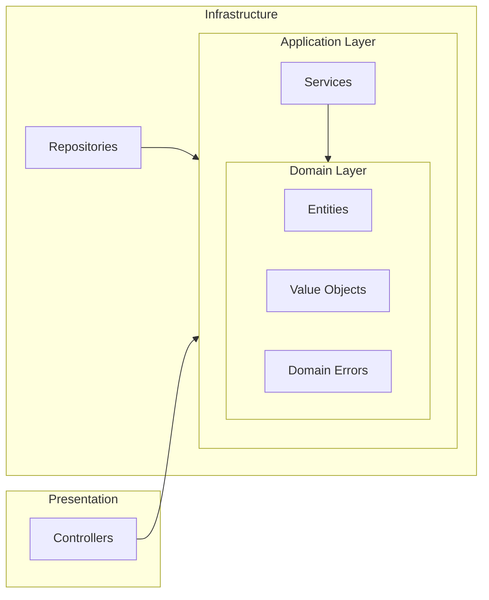

# Architecture Quality Gates Template

> Template for setting up automated architecture validation in any project.

## Purpose

Ensure Clean Architecture compliance through automated tools that validate:
- Layer boundary violations (domain → infrastructure is forbidden)
- Circular dependencies
- API contract compliance

## Configuration Files by Stack

### Node.js / TypeScript

#### 1. `.dependency-cruiser.cjs`

```javascript
/** @type {import('dependency-cruiser').IConfiguration} */
module.exports = {
  forbidden: [
    // Domain layer cannot depend on anything outside domain
    {
      name: 'domain-no-infrastructure',
      severity: 'error',
      comment: 'Domain layer must not depend on infrastructure',
      from: { path: '^src/domain/' },
      to: { path: '^src/infrastructure/' }
    },
    {
      name: 'domain-no-presentation',
      severity: 'error',
      comment: 'Domain layer must not depend on presentation/API',
      from: { path: '^src/domain/' },
      to: { path: '^src/(presentation|controllers|api)/' }
    },
    {
      name: 'domain-no-application',
      severity: 'error',
      comment: 'Domain layer must not depend on application layer',
      from: { path: '^src/domain/' },
      to: { path: '^src/application/' }
    },
    {
      name: 'domain-no-framework',
      severity: 'error',
      comment: 'Domain layer must not depend on framework (NestJS, Express, etc.)',
      from: { path: '^src/domain/' },
      to: { path: '@nestjs|express|fastify' }
    },
    // Application layer cannot depend on infrastructure
    {
      name: 'application-no-infrastructure',
      severity: 'error',
      comment: 'Application layer must not depend on infrastructure',
      from: { path: '^src/application/' },
      to: { path: '^src/infrastructure/' }
    },
    // No circular dependencies
    {
      name: 'no-circular',
      severity: 'error',
      comment: 'Circular dependencies are not allowed',
      from: {},
      to: { circular: true }
    },
    // No dev dependencies in production code
    {
      name: 'not-to-dev-dep',
      severity: 'error',
      comment: 'Production code cannot import devDependencies',
      from: { path: '^src/', pathNot: '\\.spec\\.' },
      to: { dependencyTypes: ['npm-dev'] }
    }
  ],
  options: {
    doNotFollow: { path: 'node_modules' },
    tsPreCompilationDeps: true,
    tsConfig: { fileName: 'tsconfig.json' },
    enhancedResolveOptions: { exportsFields: ['exports'], conditionNames: ['import', 'require', 'node', 'default'] },
    reporterOptions: {
      archi: { collapsePattern: '^node_modules/(@[^/]+/[^/]+|[^/]+)' },
      text: { highlightFocused: true }
    }
  }
};
```

#### 2. `.spectral.yaml`

```yaml
# Spectral OpenAPI/AsyncAPI Ruleset
extends:
  - spectral:oas

rules:
  # Require operation descriptions
  operation-description: warn
  
  # Require operation IDs
  operation-operationId: error
  
  # Require tags
  operation-tags: warn
  
  # Contact info
  info-contact: warn
  
  # License
  info-license: off
  
  # Servers array
  oas3-api-servers: warn
  
  # Examples in responses
  oas3-valid-media-example: warn
  
  # Schema examples
  oas3-valid-schema-example: warn

  # Custom: Path parameters should be snake_case
  path-params-snake-case:
    description: "Path parameters should be snake_case"
    severity: warn
    given: "$.paths[*].parameters[?(@.in=='path')].name"
    then:
      function: pattern
      functionOptions:
        match: "^[a-z_]+$"
```

#### 3. `package.json` scripts

```json
{
  "scripts": {
    "arch:check": "depcruise src --config .dependency-cruiser.cjs --output-type err-long",
    "arch:graph": "depcruise src --config .dependency-cruiser.cjs --output-type mermaid > reports/architecture/dependency-graph.md",
    "arch:report": "depcruise src --config .dependency-cruiser.cjs --output-type html > reports/architecture/dependency-report.html",
    "circular:check": "madge --circular src",
    "validate:openapi": "npx @stoplight/spectral-cli lint specs/**/openapi.yaml"
  },
  "devDependencies": {
    "dependency-cruiser": "^16.0.0",
    "madge": "^8.0.0",
    "@stoplight/spectral-cli": "^6.14.0"
  }
}
```

### Python

#### 1. `pyproject.toml` (with pylint)

```toml
[tool.pylint.imports]
# Forbidden imports for Clean Architecture
known-first-party = ["domain", "application", "infrastructure", "presentation"]

[tool.pydeps]
max_bacon = 2
cluster = true
```

#### 2. Commands

```bash
# Check imports
pylint --disable=all --enable=import-error,wrong-import-order src/

# Generate dependency graph
pydeps src/ --cluster --max-bacon=2 -o reports/architecture/deps.svg

# Circular check
pydeps src/ --show-cycles
```

### .NET

#### 1. `depend.json`

```json
{
  "rules": [
    {
      "name": "Domain isolation",
      "from": "*.Domain",
      "notTo": ["*.Infrastructure", "*.Api", "*.Application"]
    },
    {
      "name": "Application isolation",
      "from": "*.Application",
      "notTo": ["*.Infrastructure", "*.Api"]
    }
  ]
}
```

#### 2. Commands

```bash
# Install
dotnet tool install -g Depend.NET

# Verify
dotnet tool run depend --verify

# Graph (requires GraphViz or Mermaid export)
dotnet tool run depend --graph mermaid > reports/architecture/deps.md
```

### Java (Maven)

#### 1. `pom.xml` (ArchUnit)

```xml
<dependency>
    <groupId>com.tngtech.archunit</groupId>
    <artifactId>archunit-junit5</artifactId>
    <version>1.2.1</version>
    <scope>test</scope>
</dependency>
```

#### 2. Test class

```java
@AnalyzeClasses(packages = "com.example")
public class ArchitectureTest {
    @ArchTest
    static final ArchRule domainShouldNotDependOnInfrastructure = 
        noClasses().that().resideInAPackage("..domain..")
            .should().dependOnClassesThat().resideInAPackage("..infrastructure..");
}
```

### Go

```bash
# Install
go install github.com/loov/goda@latest

# Check dependencies
goda graph ./... | grep -E "domain.*infrastructure" && echo "VIOLATION" || echo "OK"

# Generate graph
goda graph ./... > reports/architecture/deps.dot
```

### Rust

```bash
# Install
cargo install cargo-depgraph

# Generate graph
cargo depgraph --all-deps | dot -Tsvg > reports/architecture/deps.svg

# Check with cargo-deny
cargo deny check
```

## Quality Gates Thresholds

| Gate | Requirement | Severity |
|------|-------------|----------|
| Layer violations | 0 | 🔴 BLOCKING |
| Circular dependencies | 0 | 🔴 BLOCKING |
| Contract errors | 0 | 🔴 BLOCKING |
| Contract warnings | < 10 | 🟡 WARNING |

## Mermaid Output

The architecture graph is generated in Mermaid format for maximum compatibility:

- ✅ Renders in GitHub README/PRs
- ✅ Renders in VS Code (with Mermaid extension)
- ✅ Renders in GitLab
- ✅ Renders in Notion, Confluence
- ✅ Text-based = Git versionable
- ✅ No external dependencies (no GraphViz)

Example output:



## Integration with Bolt Framework

1. **BOLT Implementation**: Run architecture gates after each BOLT
2. **Code Review**: Include architecture report in review
3. **CI/CD**: Add gate as pipeline step
4. **Constitution**: Define thresholds in `memory/constitution.md`

---

*Bolt Architecture Quality Gates Template v1.0.0*
