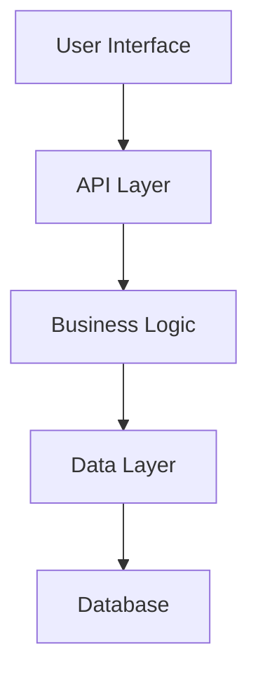

# Feature Specification Template

**Feature ID:** {FEATURE_ID}
**Feature Name:** {FEATURE_NAME}
**Epic:** {EPIC_NAME}
**Priority:** [Critical | High | Medium | Low]
**Status:** [Draft | In Review | Approved | In Development | Testing | Complete]
**Created:** {DATE}
**Last Updated:** {DATE}

---

## Executive Summary

### Overview
Provide a high-level description of the feature in 2-3 sentences. What does it do and why is it important?

### Business Value
- **Primary Goal:** What business objective does this achieve?
- **Expected Impact:** Quantifiable benefits (revenue, efficiency, user satisfaction)
- **Success Metrics:** How will we measure success?

### Target Users
- **Primary:** Main user persona
- **Secondary:** Additional user groups
- **Excluded:** Users who won't benefit

---

## Business Context

### Problem Statement
Clearly articulate the problem or opportunity this feature addresses.

**Current State:**
- What challenges exist today?
- What pain points do users experience?
- What opportunities are we missing?

**Desired State:**
- What experience should users have?
- What capabilities should be available?
- What outcomes do we expect?

### Strategic Alignment
- **Company OKRs:** How does this support organizational objectives?
- **Product Roadmap:** Where does this fit in the overall strategy?
- **Customer Requests:** What feedback or requests drove this?

### Market Analysis
- **Competitive Landscape:** How do competitors handle this?
- **Market Opportunity:** Size and potential of the market
- **Differentiation:** What makes our approach unique?

---

## User Requirements

### User Stories

#### Epic User Story
```gherkin
As a [user type]
I want to [capability]
So that [business value]
```

#### Detailed User Stories

**Story 1: Core Functionality**
```gherkin
As a [specific user role]
I want to [specific action]
So that [specific benefit]

Acceptance Criteria:
- Given [context]
- When [action]
- Then [expected result]
- And [additional verification]
```

**Story 2: Edge Cases**
```gherkin
As a [user role]
I want to [handle edge case]
So that [maintain functionality]

Acceptance Criteria:
- Given [edge case context]
- When [edge case action]
- Then [graceful handling]
```

**Story 3: Integration**
```gherkin
As a [user role]
I want to [integrate with existing feature]
So that [seamless workflow]

Acceptance Criteria:
- Given [existing feature state]
- When [integration action]
- Then [combined result]
```

### Use Cases

#### Use Case 1: {PRIMARY_USE_CASE}

**Actors:** Primary and secondary users involved
**Preconditions:** What must be true before this use case
**Basic Flow:**
1. User performs action A
2. System responds with B
3. User continues with C
4. System completes with D

**Alternative Flows:**
- **Alt Flow 1:** What happens if user chooses different path
- **Alt Flow 2:** How system handles edge cases

**Post-conditions:** State after successful completion
**Exceptions:** Error conditions and how they're handled

#### Use Case 2: {SECONDARY_USE_CASE}

[Repeat structure for additional use cases]

### Personas and Scenarios

#### Primary Persona: {PERSONA_NAME}
- **Role:** Job title and responsibilities
- **Goals:** What they're trying to achieve
- **Pain Points:** Current frustrations
- **Technical Skills:** Level of expertise
- **Context:** When/where they use the system

**Scenario:** Day-in-the-life example showing how they would use this feature

---

## Functional Requirements

### Core Features

#### Feature 1: {CORE_FEATURE_NAME}
**Description:** What this feature does
**Priority:** Critical/High/Medium/Low
**Complexity:** Simple/Medium/Complex

**Detailed Requirements:**
- **REQ-F001:** Specific functional requirement
- **REQ-F002:** Another functional requirement
- **REQ-F003:** Additional functional requirement

#### Feature 2: {SUPPORTING_FEATURE_NAME}
[Repeat structure for each feature]

### User Interface Requirements

#### UI-001: Layout and Navigation
- Navigation structure and hierarchy
- Page layouts and content organization
- Responsive design requirements

#### UI-002: Visual Design
- Branding and style guidelines
- Color scheme and typography
- Icons and imagery requirements

#### UI-003: Interaction Design
- User flows and workflows
- Input methods and controls
- Feedback and notifications

### Data Requirements

#### Data Models
```json
{
  "entity_name": {
    "id": "unique identifier",
    "field1": "data type and constraints",
    "field2": "data type and constraints",
    "relationships": "connections to other entities"
  }
}
```

#### Data Validation
- **Input Validation:** Required fields, formats, ranges
- **Business Rules:** Complex validation logic
- **Data Integrity:** Consistency and referential integrity

#### Data Migration
- **Existing Data:** How to handle current data
- **Migration Strategy:** Process and timeline
- **Rollback Plan:** Recovery procedures

---

## Non-Functional Requirements

### Performance Requirements
- **Response Time:** Maximum acceptable latency
- **Throughput:** Requests per second capacity
- **Concurrent Users:** Maximum simultaneous users
- **Resource Usage:** Memory, CPU, storage limits

#### Performance Targets
| Metric | Target | Measurement |
|--------|--------|-------------|
| Page Load Time | < 2 seconds | 95th percentile |
| API Response | < 500ms | Average |
| Database Query | < 100ms | 99th percentile |

### Scalability Requirements
- **User Growth:** Expected user base expansion
- **Data Growth:** Projected data volume increases
- **Geographic Distribution:** Multi-region support needs
- **Infrastructure Scaling:** Horizontal vs vertical scaling

### Security Requirements
- **Authentication:** Identity verification methods
- **Authorization:** Access control and permissions
- **Data Protection:** Encryption and privacy measures
- **Compliance:** Regulatory requirements (GDPR, HIPAA, etc.)

#### Security Controls
- **SEC-001:** Specific security requirement
- **SEC-002:** Another security requirement
- **SEC-003:** Additional security requirement

### Reliability Requirements
- **Availability:** Uptime targets (99.9%, 99.99%)
- **Recovery Time:** Maximum downtime during failures
- **Backup and Recovery:** Data protection strategies
- **Error Handling:** Graceful degradation approaches

### Usability Requirements
- **Accessibility:** WCAG compliance level
- **Browser Support:** Supported browsers and versions
- **Mobile Compatibility:** Device and screen size support
- **User Experience:** Usability testing criteria

---

## Technical Specifications

### System Architecture

#### High-Level Architecture


#### Component Diagram
Detail the major components and their interactions.

### API Specifications

#### Endpoint 1: Create {Entity}
```http
POST /api/v1/{entities}
Content-Type: application/json

{
  "field1": "value1",
  "field2": "value2"
}

Response: 201 Created
{
  "id": "generated-id",
  "field1": "value1",
  "field2": "value2",
  "created_at": "timestamp"
}
```

#### Endpoint 2: Get {Entity}
```http
GET /api/v1/{entities}/{id}

Response: 200 OK
{
  "id": "entity-id",
  "field1": "value1",
  "field2": "value2"
}
```

### Database Design

#### Tables and Relationships
```sql
CREATE TABLE entities (
    id UUID PRIMARY KEY,
    field1 VARCHAR(100) NOT NULL,
    field2 TEXT,
    created_at TIMESTAMP DEFAULT CURRENT_TIMESTAMP,
    updated_at TIMESTAMP DEFAULT CURRENT_TIMESTAMP
);
```

#### Indexes and Constraints
- Primary keys and unique constraints
- Foreign key relationships
- Performance indexes
- Check constraints

### Integration Requirements
- **External APIs:** Third-party service integrations
- **Internal Services:** Connections to existing systems
- **Message Queues:** Asynchronous communication needs
- **File Systems:** Document and media storage

---

## Implementation Plan

### Development Phases

#### Phase 1: Foundation (Weeks 1-2)
- [ ] Database schema creation
- [ ] Basic API endpoints
- [ ] Authentication integration
- [ ] Initial UI framework

**Deliverables:**
- Working API endpoints
- Database migrations
- Basic authentication flow

**Success Criteria:**
- All endpoints return expected responses
- Data persistence works correctly
- Security validation passes

#### Phase 2: Core Features (Weeks 3-5)
- [ ] Primary user workflows
- [ ] Business logic implementation
- [ ] UI component development
- [ ] Integration testing

**Deliverables:**
- Complete user workflows
- Functional UI components
- Integration test suite

**Success Criteria:**
- All user stories are testable
- Performance targets are met
- Security requirements are satisfied

#### Phase 3: Polish and Launch (Weeks 6-7)
- [ ] User experience refinements
- [ ] Performance optimization
- [ ] Documentation completion
- [ ] Launch preparation

**Deliverables:**
- Production-ready feature
- Complete documentation
- Monitoring and alerting

**Success Criteria:**
- User acceptance testing passed
- Performance benchmarks met
- Launch checklist completed

### Risk Assessment

#### High Risk Items
| Risk | Probability | Impact | Mitigation Strategy |
|------|-------------|--------|-------------------|
| Risk 1 | High/Medium/Low | High/Medium/Low | Specific mitigation actions |
| Risk 2 | High/Medium/Low | High/Medium/Low | Specific mitigation actions |

#### Dependencies
- **Internal Dependencies:** Other teams or features required
- **External Dependencies:** Third-party services or tools
- **Technical Dependencies:** Infrastructure or platform requirements

### Resource Requirements
- **Development Team:** Roles and estimated effort
- **Design Resources:** UI/UX design needs
- **DevOps Support:** Infrastructure and deployment help
- **Testing Resources:** QA and user testing requirements

---

## Testing Strategy

### Test Types and Coverage

#### Unit Testing
- **Coverage Target:** 90% code coverage
- **Focus Areas:** Business logic, data validation, edge cases
- **Tools:** Jest, xUnit, pytest (technology-dependent)

#### Integration Testing
- **API Testing:** All endpoints with various scenarios
- **Database Testing:** Data integrity and performance
- **Third-party Integration:** External service connections

#### End-to-End Testing
- **User Workflows:** Complete user journeys
- **Cross-browser Testing:** Supported browser matrix
- **Mobile Testing:** Responsive design validation

#### Performance Testing
- **Load Testing:** Expected traffic patterns
- **Stress Testing:** Peak load scenarios
- **Endurance Testing:** Long-running stability

### Test Cases

#### Test Case 1: Happy Path
**Objective:** Verify core functionality works as expected
**Preconditions:** User is authenticated and authorized
**Steps:**
1. Navigate to feature
2. Perform primary action
3. Verify expected result

**Expected Result:** Feature completes successfully

#### Test Case 2: Error Handling
**Objective:** Verify system handles errors gracefully
**Preconditions:** Invalid data or error condition
**Steps:**
1. Attempt invalid operation
2. Observe system response
3. Verify error messaging

**Expected Result:** Clear error message and graceful handling

### User Acceptance Testing
- **UAT Criteria:** Specific criteria for user acceptance
- **Test Users:** Representative user groups
- **Success Metrics:** Quantitative and qualitative measures

---

## Documentation Requirements

### User Documentation
- [ ] Feature overview and benefits
- [ ] Step-by-step user guides
- [ ] Troubleshooting information
- [ ] FAQ for common questions

### Technical Documentation
- [ ] API documentation with examples
- [ ] Database schema documentation
- [ ] Integration guides for developers
- [ ] Configuration and deployment guides

### Training Materials
- [ ] Video tutorials for key workflows
- [ ] Interactive demos or walkthroughs
- [ ] Training documentation for support team
- [ ] Release communication materials

---

## Success Criteria and Metrics

### Launch Criteria
Before this feature can be released to production:

- [ ] All functional requirements implemented
- [ ] Performance targets achieved
- [ ] Security review completed
- [ ] Accessibility compliance verified
- [ ] User acceptance testing passed
- [ ] Documentation completed
- [ ] Monitoring and alerting configured

### Success Metrics

#### Primary Metrics
- **Adoption Rate:** X% of eligible users adopt within Y days
- **Usage Frequency:** Average Z uses per user per week
- **Task Completion Rate:** Y% of users complete primary workflow
- **User Satisfaction:** Average rating of X.Y/5 in feedback

#### Secondary Metrics
- **Performance Metrics:** Response times, error rates
- **Business Metrics:** Revenue impact, cost savings
- **Support Metrics:** Reduction in support tickets

### Post-Launch Review
- **Timeline:** 30 days after launch
- **Stakeholders:** Product, engineering, design, business
- **Review Criteria:** Success metrics, user feedback, technical performance

---

## Appendices

### Appendix A: Mockups and Wireframes
[Include or reference visual designs]

### Appendix B: Technical Research
[Include research findings, proofs of concept, architecture decisions]

### Appendix C: Competitive Analysis
[Include analysis of competitor features and approaches]

### Appendix D: User Research Findings
[Include user interviews, surveys, usability testing results]

---

## Document Control

**Document Information:**
- **Template Version:** 2.1.0
- **Created by:** Bolt Framework v2.1.0
- **Document Owner:** {PRODUCT_MANAGER}
- **Technical Lead:** {TECH_LEAD}
- **Stakeholder Approval:** {STAKEHOLDER_LIST}

**Review Schedule:**
- **Initial Review:** {DATE}
- **Technical Review:** {DATE}
- **Stakeholder Approval:** {DATE}
- **Final Sign-off:** {DATE}

**Change History:**
| Date | Version | Author | Changes |
|------|---------|--------|---------|
| {DATE} | 1.0 | {AUTHOR} | Initial version |

---

*This specification is a living document that will be updated throughout the development process. All stakeholders should review and provide feedback before implementation begins.*