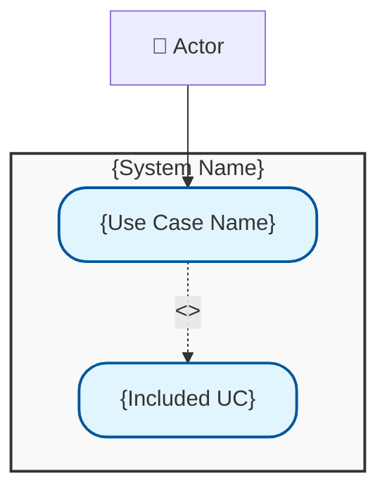

# Use Case Specification

> **BOLT Framework Stage:** DISCOVERY - Requirements Analysis
> **Format:** UML/Cockburn Style

**Use Case ID:** UC-{ID}
**Use Case Name:** {USE_CASE_NAME}
**Feature:** {FEATURE_ID} - {FEATURE_NAME}
**Version:** 1.0
**Created:** {DATE}
**Last Updated:** {DATE}
**Status:** [Draft | Review | Approved | Implemented]

---

## 1. Overview

### Brief Description

{One paragraph describing what this use case accomplishes}

### Scope

- **System:** {system name}
- **Level:** {User Goal | Subfunction | Summary}

### Primary Actor

{The main actor who initiates this use case}

### Supporting Actors

| Actor   | Role                    |
| ------- | ----------------------- |
| {actor} | {role in this use case} |

---

## 2. Stakeholders and Interests

| Stakeholder   | Interest                            |
| ------------- | ----------------------------------- |
| {stakeholder} | {what they want from this use case} |

---

## 3. Preconditions

1. {precondition 1}
2. {precondition 2}
3. {precondition 3}

---

## 4. Postconditions

### Success Guarantee (Main Success Scenario)

1. {postcondition 1}
2. {postcondition 2}

### Minimal Guarantee (All Scenarios)

1. {minimal postcondition - what always happens}

---

## 5. Trigger

{Event that initiates this use case}

---

## 6. Main Success Scenario (Basic Flow)

| Step | Actor          | System            |
| ---- | -------------- | ----------------- |
| 1    | {actor action} |                   |
| 2    |                | {system response} |
| 3    | {actor action} |                   |
| 4    |                | {system response} |
| 5    | {actor action} |                   |
| 6    |                | {system response} |

### Narrative Format

1. {Actor} {action}.
2. System {response}.
3. {Actor} {action}.
4. System {response}.
5. Use case ends.

---

## 7. Extensions (Alternative Flows)

### 2a. {Extension Name}

**Condition:** {when this extension applies}

| Step | Actor          | System                     |
| ---- | -------------- | -------------------------- |
| 2a.1 |                | {system detects condition} |
| 2a.2 |                | {system response}          |
| 2a.3 | {actor action} |                            |
| 2a.4 |                | Return to step {n}         |

### 3a. {Extension Name}

**Condition:** {when this extension applies}

| Step | Actor | System                   |
| ---- | ----- | ------------------------ |
| 3a.1 |       | {system response}        |
| 3a.2 |       | Use case ends in failure |

### \*a. {Global Extension - applies at any step}

**Condition:** {when this extension applies}

| Step  | Actor          | System            |
| ----- | -------------- | ----------------- |
| \*a.1 | {actor action} |                   |
| \*a.2 |                | {system response} |

---

## 8. Special Requirements

### Performance

- {requirement}: {target} (e.g., "Response time: < 2 seconds")

### Security

- {requirement} (e.g., "User must be authenticated")

### Usability

- {requirement} (e.g., "Must be accessible via screen reader")

### Compliance

- {requirement} (e.g., "Must comply with GDPR")

---

## 9. Technology and Data Variations

### Input Variations

| Step   | Variation                            |
| ------ | ------------------------------------ |
| {step} | {alternative input method or format} |

### Platform Variations

| Platform | Variation           |
| -------- | ------------------- |
| Web      | {specific behavior} |
| Mobile   | {specific behavior} |
| API      | {specific behavior} |

---

## 10. Frequency of Occurrence

- **Expected frequency:** {times per day/week/month}
- **Peak usage:** {when}
- **Concurrent users:** {number}

---

## 11. Open Issues

| ID   | Issue               | Status        | Resolution   |
| ---- | ------------------- | ------------- | ------------ |
| {id} | {issue description} | Open/Resolved | {resolution} |

---

## 12. Related Artifacts

### Related Use Cases

| Use Case | Relationship                        |
| -------- | ----------------------------------- |
| UC-{id}  | {includes/extends/precedes/follows} |

### User Stories

| Story ID | Title   |
| -------- | ------- |
| US-{id}  | {title} |

### Gherkin Scenarios

| Scenario   | File           |
| ---------- | -------------- |
| {scenario} | {file.feature} |

---

## 13. Use Case Diagram

---

## 14. Revision History

| Version | Date   | Author   | Changes         |
| ------- | ------ | -------- | --------------- |
| 1.0     | {DATE} | {author} | Initial version |

---

_Generated by Bolt Use Case Agent_
