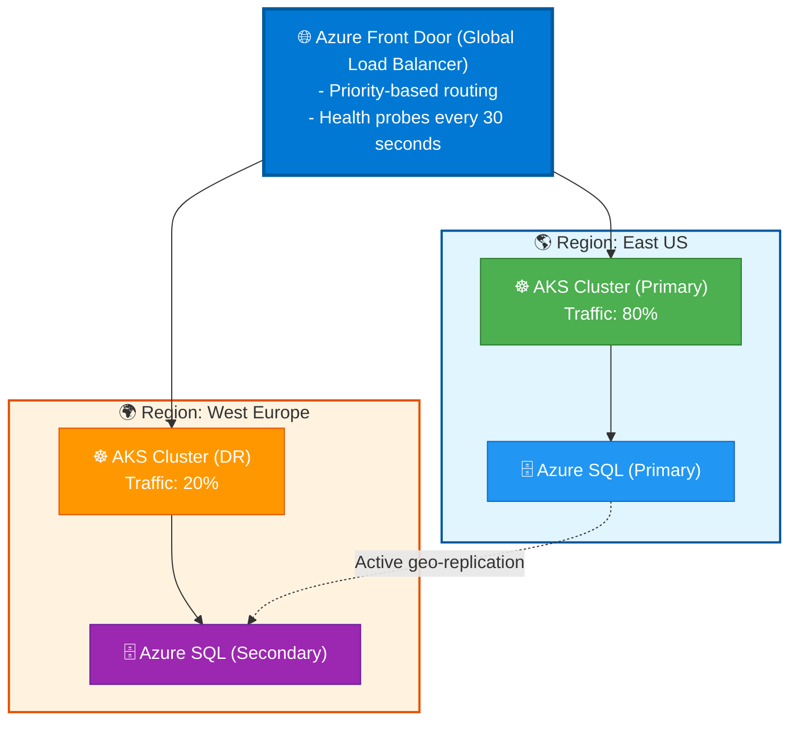

# BOLT Framework Project Constitution — Scope: Cloud Platform

> **Extracted from**: `.boltf/memory/constitution.md`
> **Scope**: `cloud-platform` — Infrastructure scope, containers, orchestration, IaC, infra monitoring, infra testing, and landing zone templates.
> Articles marked with 🔄 are **common to all scopes** and always present.
> Sections marked with 🆕 are **proposed additions** not present in the original constitution.

---

## Preamble 🔄

This Constitution establishes the governing principles, technology decisions, and standards for the **[PROJECT_NAME]** project. All AI agents, developers, and automated systems MUST adhere to this document.

**This document is the SINGLE SOURCE OF TRUTH.**

**Cloud Provider**: Microsoft Azure (mandatory for all deployments)

---

## Article VIII: Containers & Orchestration

> **📋 Applies to**: Application Development, Full Stack (workload infra)
> **⏭️ Skip if**: Infrastructure Only (platform level)

### Section 8.1: Container Strategy

- [ ] **Docker** - Standard containers
- [ ] **None** - PaaS only (Azure App Service)

### Section 8.2: Orchestration Platform

Select ONE:

- [ ] **Azure Kubernetes Service (AKS)** - Managed K8s
- [ ] **Azure Container Apps** - Serverless containers
- [ ] **Azure App Service** - PaaS (Containers or Code)
- [ ] **On-premises Kubernetes** - Self-managed K8s
- [ ] **Docker Compose** - Development only

### Section 8.3: Kubernetes Configuration (if AKS/K8s selected)

Package Manager:

- [ ] **Helm** - Chart-based deployments
- [ ] **Kustomize** - Overlay-based configuration

Ingress Controller:

- [ ] **NGINX Ingress** - Community standard
- [ ] **Azure Application Gateway Ingress (AGIC)** - Azure-native
- [ ] **Traefik** - Cloud-native, auto-discovery

### Section 8.4: Cloud-Native Extensions

#### KEDA (Kubernetes Event-Driven Autoscaling)

KEDA Enabled: [ ] Yes [ ] No

If Yes, select scalers:

- [ ] Azure Service Bus
- [ ] Azure Event Hubs
- [ ] Azure Storage Queue
- [ ] HTTP Request count

#### Dapr (Distributed Application Runtime)

Dapr Enabled: [ ] Yes [ ] No

If Yes, select building blocks:

| Building Block     | Enabled        | Azure Component                      |
| ------------------ | -------------- | ------------------------------------ |
| Service Invocation | [ ] Yes [ ] No | -                                    |
| State Management   | [ ] Yes [ ] No | [ ] Azure Cosmos DB [ ] Redis        |
| Pub/Sub            | [ ] Yes [ ] No | [ ] Azure Service Bus [ ] Event Hubs |
| Secrets            | [ ] Yes [ ] No | [ ] Azure Key Vault                  |

---

## Article VIII-B: Infrastructure Scope & Landing Zone Strategy

> **📋 Applies to**: Infrastructure Only, Full Stack
> **⏭️ Skip if**: Application Development Only (assumes infra exists)
> **Priority**: Must be decided BEFORE IaC tool selection

### Section 8B.1: Infrastructure Scope

Select infrastructure provisioning scope:

- [ ] **Landing Zone** - Enterprise-scale foundation with Management Groups, Hub-Spoke networking, governance, and platform-level services
- [ ] **Workload Infrastructure** - App-specific resources only (databases, storage, compute) on existing platform
- [ ] **Both** - Landing Zone + Workload (greenfield deployment)

### Section 8B.2: Landing Zone Components (if Landing Zone selected)

**Core Components**:

- [ ] Management Groups hierarchy
- [ ] Subscription organization
- [ ] Hub-Spoke network topology
- [ ] Azure Policy governance
- [ ] RBAC baseline
- [ ] Log Analytics workspace (centralized)
- [ ] Azure Security Center / Defender
- [ ] Azure Firewall / Network Virtual Appliances

**Implementation Pattern**:

- [ ] **Azure Landing Zones (ALZ)** - Microsoft reference architecture with Bicep/Terraform modules
- [ ] **Cloud Adoption Framework (CAF) Enterprise Scale** - Full governance framework
- [ ] **Custom Landing Zone** - Organization-specific design

**Networking Model**:

- [ ] Hub-Spoke (centralized connectivity)
- [ ] Virtual WAN (global transit architecture)
- [ ] Mesh (peer-to-peer connectivity)

### Section 8B.3: Workload Infrastructure Components (if Workload or Both selected)

**Compute Resources**:

- [ ] App Services / Container Apps
- [ ] AKS clusters
- [ ] Virtual Machines
- [ ] Serverless (Functions, Logic Apps)

**Data Resources**:

- [ ] Azure SQL / Cosmos DB / PostgreSQL
- [ ] Redis Cache
- [ ] Storage Accounts

**Integration Resources**:

- [ ] Service Bus / Event Hubs
- [ ] API Management
- [ ] Application Gateway

### Section 8B.4: Deployment Strategy

**Provisioning Order** (if Both selected):

1. Landing Zone foundation (management, networking, governance)
2. Workload-specific subscriptions
3. Application resources

**Separation of Concerns**:

- [ ] **Separate repositories** - Landing Zone repo + Workload repo
- [ ] **Monorepo** - Single repo with /landing-zone and /workload folders
- [ ] **Modular approach** - Shared modules with environment-specific configurations

### Section 8B.5: Trade-offs and Rationale

**Landing Zone Benefits**:

- ✅ Enterprise governance at scale
- ✅ Consistent security baseline
- ✅ Centralized networking (ExpressRoute, VPN)
- ✅ Multi-subscription architecture support

**Landing Zone Costs**:

- ⚠️ Increased complexity (Management Groups, policies)
- ⚠️ Longer initial setup time
- ⚠️ Requires platform engineering expertise

**Workload-Only Benefits**:

- ✅ Faster time-to-market (assumes platform exists)
- ✅ Focused scope (app-specific resources only)
- ✅ Simpler IaC (no cross-subscription dependencies)

**Workload-Only Assumptions**:

- ⚠️ Assumes existing landing zone or shared platform
- ⚠️ Limited control over networking/governance
- ⚠️ May require coordination with platform team

---

## Article VIII-C: Service Orchestration with .NET Aspire

> **📋 Applies to**: Multi-service .NET applications (2+ services)
> **⏭️ Skip if**: Single-service architecture, non-.NET stack, or manual orchestration preferred

### Section 8C.1: Aspire Adoption Decision

**Choose ONE**:

- [ ] **Yes** - Enable .NET Aspire for service orchestration
- [ ] **No** - Manual orchestration (Docker Compose / Kubernetes / Podman)

### Section 8C.2: Aspire Components (if Yes)

When Aspire is enabled, the following components are provisioned:

- **AppHost Project**: Orchestrator that defines service topology and dependencies
- **ServiceDefaults Library**: Shared OpenTelemetry, health checks, and resilience configuration
- **Service Discovery**: Automatic resolution via `WithReference()` API
- **Aspire Dashboard**: Local observability dashboard at `http://localhost:15888`

### Section 8C.3: Service Discovery Strategy

**Choose ONE**:

- [ ] **Aspire Automatic** - Use `WithReference()` for all inter-service communication (recommended)
- [ ] **Manual Configuration** - Environment variables and explicit URLs
- [ ] **Hybrid** - Aspire for local dev, manual for production

### Section 8C.4: Rationale and Trade-offs

**✅ When to Use Aspire**:

- Multi-service .NET architecture (backend + frontend + API gateway)
- Team wants unified local development experience (`dotnet run` launches all)
- Observability is a priority (OpenTelemetry out-of-the-box)
- Deploying to Azure with `azd` CLI

**❌ When NOT to Use**:

- Single-service application (no orchestration needed)
- Non-.NET services (Node.js, Python, Go) - Aspire is .NET-centric
- Team prefers explicit configuration over "magic" service discovery
- Docker Desktop unavailable (Aspire requires containers for local dev)

**Benefits**:

- ✅ **Automatic Service Discovery**: Eliminates hardcoded URLs between services
- ✅ **Built-in Observability**: OpenTelemetry dashboard for traces, metrics, logs
- ✅ **Simplified Local Development**: Single `dotnet run` launches all services
- ✅ **Unified Deployment**: `azd up` deploys entire solution to Azure with Bicep generation

**Costs & Constraints**:

- ⚠️ **Docker Desktop Required**: Aspire runs services in containers locally
- ⚠️ **Learning Curve**: AppHost model and `WithReference()` API
- ⚠️ **.NET 8+ Required**: Aspire is not available for older frameworks
- ⚠️ **Additional Project**: AppHost adds complexity to solution structure

### Section 8C.5: Implementation References

**Provisioning**:

- Article VIII-C decisions are processed by `@Bolt Constitution` agent
- Templates downloaded from [dotnet/aspire GitHub](https://github.com/dotnet/aspire/tree/main/templates)
- AppHost project created at `src/AppHost/`
- ServiceDefaults library created at `src/ServiceDefaults/`

**Learn More**:

- [.NET Aspire Documentation](https://learn.microsoft.com/dotnet/aspire/)
- [AppHost Patterns](https://learn.microsoft.com/dotnet/aspire/fundamentals/app-host-overview)
- [Service Discovery Overview](https://learn.microsoft.com/dotnet/aspire/service-discovery/overview)
- Skill: `skill-bolt-aspire-orchestration` (provisioned if enabled)

---

## Article IX: Infrastructure as Code

> **📋 Applies to**: Infrastructure Only, Full Stack
> **⏭️ Skip if**: Application Development Only (assumes infra exists)

### Section 9.1: IaC Tool

Select ONE:

- [ ] **Bicep** - Azure-native, recommended
- [ ] **Terraform** - Multi-cloud, HCL
- [ ] **Pulumi** - Programmatic (.NET/TypeScript)
- [ ] **ARM Templates** - Azure legacy JSON

### Section 9.2: IaC Structure

```text
infra/
├── bicep/                      # or terraform/
│   ├── modules/
│   │   ├── networking/
│   │   ├── compute/
│   │   ├── data/
│   │   └── security/
│   ├── environments/
│   │   ├── dev.bicepparam
│   │   ├── uat.bicepparam
│   │   ├── pre.bicepparam
│   │   └── prod.bicepparam
│   └── main.bicep
├── k8s/                        # If using Kubernetes
│   ├── helm/
│   └── kustomize/
└── scripts/
    └── deploy.ps1
```

### Section 9.3: Landing Zone Configuration

> **📋 Applies to**: Infrastructure Only (Landing Zone scope), Full Stack (if deploying platform)

Landing Zone Pattern: [ ] CAF Enterprise-Scale [ ] Start-Small (single subscription)

#### If CAF Enterprise-Scale

| Component                  | Enabled                       | Notes                                                |
| -------------------------- | ----------------------------- | ---------------------------------------------------- |
| Management Group Hierarchy | [ ] Yes                       | Platform, Landing Zones, Decommissioned, Sandboxes   |
| Connectivity               | [ ] Hub-Spoke [ ] Virtual WAN | Central networking                                   |
| Identity                   | [ ] Yes                       | Entra ID integration, Privileged Identity Management |
| Management                 | [ ] Yes                       | Azure Monitor, Log Analytics, Automation             |
| Security                   | [ ] Yes                       | Microsoft Defender for Cloud, Sentinel (optional)    |

#### Governance Components

| Policy                   | Enabled        | Scope                             |
| ------------------------ | -------------- | --------------------------------- |
| Azure Policy Initiatives | [ ] Yes        | [ ] Built-in ALZ [ ] Custom       |
| Azure RBAC Custom Roles  | [ ] Yes        | -                                 |
| Azure Blueprints         | [ ] Yes [ ] No | Deprecated, use Deployment Stacks |
| Cost Management Budgets  | [ ] Yes        | Per subscription/resource group   |
| Resource Tags            | [ ] Yes        | Required tags: \_\_\_             |

#### Landing Zone Structure (Bicep)

```text
infra/
├── platform/
│   ├── management-groups/
│   │   └── main.bicep
│   ├── policies/
│   │   ├── initiatives/
│   │   └── assignments/
│   ├── connectivity/
│   │   ├── hub-network.bicep
│   │   ├── dns-zones.bicep
│   │   └── firewall.bicep
│   ├── identity/
│   │   └── main.bicep
│   └── management/
│       ├── log-analytics.bicep
│       └── automation.bicep
├── landing-zones/
│   ├── templates/
│   │   ├── corp/           # Internal workloads
│   │   └── online/         # Public-facing workloads
│   └── subscriptions/
│       └── {workload-name}/
└── scripts/
    ├── deploy-platform.ps1
    └── deploy-landing-zone.ps1
```

---

## Article X: Environments & Configuration 🔄

> **📋 Applies to**: ALL project types

### Section 10.1: Environment Strategy

| Environment | Purpose                      | Enabled | Auto-Deploy              |
| ----------- | ---------------------------- | ------- | ------------------------ |
| **dev**     | Development, rapid iteration | [ ] Yes | [ ] On commit to develop |
| **uat**     | User Acceptance Testing      | [ ] Yes | [ ] On PR merge          |
| **pre**     | Pre-production, staging      | [ ] Yes | [ ] Manual trigger       |
| **prod**    | Production                   | [ ] Yes | [ ] Manual approval      |

### Section 10.2: Configuration Management

Select strategy:

- [ ] **Azure App Configuration** - Centralized, feature flags (recommended)
- [ ] **Environment Variables** - Container/App Service config
- [ ] **appsettings.{Environment}.json** (.NET) / **.env files** (Node.js)
- [ ] **Combination** - App Config + Key Vault (recommended)

### Section 10.3: Secrets Management

| Secret Type        | Storage         |
| ------------------ | --------------- |
| Connection Strings | Azure Key Vault |
| API Keys           | Azure Key Vault |
| Certificates       | Azure Key Vault |

Local Development Secrets:

- [ ] **User Secrets** (.NET) - `dotnet user-secrets`
- [ ] **.env files** (Node.js) - gitignored
- [ ] **Local Key Vault** - Azure Key Vault dev instance

### Section 10.4: Feature Flags

Feature Flag Provider:

- [ ] **None**
- [ ] **Azure App Configuration** - Native integration
- [ ] **LaunchDarkly** - Enterprise features
- [ ] **Unleash** - Open-source

---

## Article XI: CI/CD Pipeline 🔄

> **📋 Applies to**: ALL project types

### Section 11.1: CI/CD Platform

Select ONE:

- [ ] **GitHub Actions** - GitHub-native
- [ ] **Azure DevOps Pipelines** - Azure-native

### Section 11.2: Pipeline Stages

#### For Infrastructure

| Stage                | Enabled | Threshold           |
| -------------------- | ------- | ------------------- |
| **IaC Lint**         | [ ] Yes | Bicep lint / tflint |
| **IaC Validation**   | [ ] Yes | what-if / plan      |
| **Security Scan**    | [ ] Yes | Checkov / tfsec     |
| **Cost Estimation**  | [ ] Yes | Infracost           |
| **Compliance Check** | [ ] Yes | Azure Policy        |

#### Deployment Stages

| Stage           | Enabled | Trigger            |
| --------------- | ------- | ------------------ |
| **Deploy Dev**  | [ ] Yes | Auto on develop    |
| **Deploy UAT**  | [ ] Yes | Auto on release/\* |
| **Deploy Pre**  | [ ] Yes | Manual trigger     |
| **Deploy Prod** | [ ] Yes | Manual approval    |

### Section 11.3: Deployment Strategy

Select ONE:

- [ ] **Rolling Update** - Gradual replacement
- [ ] **Blue-Green** - Azure Deployment Slots / K8s
- [ ] **Canary** - Gradual traffic shift
- [ ] **Feature Flags** - Deploy dark, enable via flags

### Section 11.4: Branch Strategy

Select ONE:

- [ ] **GitFlow** - feature/, develop, release/, main
- [ ] **GitHub Flow** - feature/, main
- [ ] **Trunk-Based** - Short-lived branches, main

---

## Article XII: Observability 🔄

> **📋 Applies to**: ALL project types

### Section 12.1: Observability Strategy

Select ONE:

- [ ] **Azure-Native** - Azure Monitor + Application Insights
- [ ] **OpenTelemetry → Azure** - OTel SDK → Azure Monitor Exporter
- [ ] **OpenTelemetry → Grafana Stack** - Self-hosted Grafana/Loki/Tempo

### Section 12.2: Health Checks

```text
/health       - Full health check
/health/ready - Readiness probe
/health/live  - Liveness probe
```

### Section 12.3: Infrastructure Monitoring (if Infrastructure scope)

| Component       | Tool                      | Enabled |
| --------------- | ------------------------- | ------- |
| Resource Health | Azure Resource Health     | [ ] Yes |
| Activity Logs   | Azure Monitor             | [ ] Yes |
| Diagnostics     | Log Analytics             | [ ] Yes |
| Alerts          | Azure Monitor Alerts      | [ ] Yes |
| Dashboards      | Azure Workbooks / Grafana | [ ] Yes |

---

## Article XIII: Testing Standards (Infrastructure)

### Section 13.4: Infrastructure Testing (if Infrastructure scope)

| Test Type         | Tool                   | Purpose                    |
| ----------------- | ---------------------- | -------------------------- |
| IaC Lint          | Bicep linter / tflint  | Syntax and best practices  |
| Security Scan     | Checkov / tfsec        | Security misconfigurations |
| Policy Compliance | Azure Policy (what-if) | Governance validation      |
| Integration Test  | Pester / Terratest     | Post-deployment validation |
| Cost Estimation   | Infracost              | Budget validation          |

---

## Article XV: Project Structure Templates (Infrastructure)

### Template E: Infrastructure Only - Landing Zone

```text
project-root/
├── platform/
│   ├── management-groups/
│   │   ├── main.bicep
│   │   └── modules/
│   ├── policies/
│   │   ├── initiatives/
│   │   │   ├── security.bicep
│   │   │   └── tagging.bicep
│   │   ├── definitions/
│   │   └── assignments/
│   ├── connectivity/
│   │   ├── hub-network/
│   │   │   ├── main.bicep
│   │   │   ├── firewall.bicep
│   │   │   └── bastion.bicep
│   │   ├── dns/
│   │   │   └── private-dns-zones.bicep
│   │   └── vwan/                 # If Virtual WAN
│   ├── identity/
│   │   ├── main.bicep
│   │   └── rbac-assignments.bicep
│   └── management/
│       ├── log-analytics.bicep
│       ├── automation.bicep
│       └── defender.bicep
├── landing-zones/
│   ├── templates/
│   │   ├── corp-workload/
│   │   │   ├── main.bicep
│   │   │   └── parameters/
│   │   └── online-workload/
│   │       ├── main.bicep
│   │       └── parameters/
│   └── subscriptions/
│       └── README.md             # Instructions for new workloads
├── modules/
│   ├── networking/
│   ├── security/
│   ├── compute/
│   └── data/
├── tests/
│   ├── policy-compliance/
│   ├── integration/
│   └── security-scan/
├── pipelines/
│   ├── platform-deploy.yml
│   └── landing-zone-deploy.yml
├── docs/
│   ├── architecture/
│   └── runbooks/
└── README.md
```

### Template F: Infrastructure Only - Workload

```text
project-root/
├── infra/
│   ├── bicep/                    # or terraform/
│   │   ├── main.bicep
│   │   ├── modules/
│   │   │   ├── networking/
│   │   │   │   ├── vnet.bicep
│   │   │   │   └── nsg.bicep
│   │   │   ├── compute/
│   │   │   │   ├── aks.bicep
│   │   │   │   └── container-apps.bicep
│   │   │   ├── data/
│   │   │   │   ├── sql.bicep
│   │   │   │   └── cosmos.bicep
│   │   │   └── security/
│   │   │       ├── keyvault.bicep
│   │   │       └── managed-identity.bicep
│   │   └── environments/
│   │       ├── dev.bicepparam
│   │       ├── uat.bicepparam
│   │       ├── pre.bicepparam
│   │       └── prod.bicepparam
│   └── k8s/                      # If AKS
│       ├── helm/
│       └── kustomize/
├── tests/
│   ├── bicep-lint/
│   ├── security/
│   └── post-deploy/
├── pipelines/
│   └── infra-deploy.yml
├── docs/
│   └── architecture.md
└── README.md
```

---

## Article XIV: GitOps & Declarative Deployment

> **📋 Applies to**: Kubernetes/Container-based deployments (AKS, Container Apps)
> **⏭️ Skip if**: Non-Kubernetes infrastructure (VM-only, PaaS-only)
> **References**: [GitOps with Flux (Microsoft)](https://learn.microsoft.com/azure/azure-arc/kubernetes/conceptual-gitops-flux2)

**GitOps** is a declarative approach to continuous delivery where Git is the single source of truth for infrastructure and application configurations. Git commits trigger automated deployments without manual kubectl/helm commands.

### Section 14.1: GitOps Tool Selection

Select ONE:

- [ ] **Flux (Recommended for Azure)** - Native AKS/Arc integration, Helm + Kustomize support
- [ ] **ArgoCD** - Feature-rich UI, multi-cluster management, advanced RBAC
- [ ] **Manual Deployments** - kubectl/helm CLI (not scalable for production)

**Comparison**:

| Feature               | Flux                    | ArgoCD                         | Manual      |
| --------------------- | ----------------------- | ------------------------------ | ----------- |
| **Azure Integration** | ✅ Native (AKS, Arc)    | ⚠️ Requires setup              | ❌ N/A      |
| **UI**                | ⚠️ Basic (Flux UI)      | ✅ Advanced web UI             | ❌ CLI only |
| **Helm Support**      | ✅ Native               | ✅ Native                      | ✅ CLI      |
| **Image Automation**  | ✅ Flux Image Reflector | ⚠️ Requires Argo Image Updater | ❌ Manual   |
| **Multi-Tenancy**     | ⚠️ Namespace-based      | ✅ App Projects                | ❌ N/A      |
| **Learning Curve**    | Medium                  | Medium-High                    | Low         |

**Recommendation**: Use Flux for Azure-native teams (AKS Extension), ArgoCD if advanced UI/RBAC required.

### Section 14.2: GitOps Repository Structure

**Mono-Repo vs Multi-Repo**:

- [ ] **Mono-Repo** - Single repo with `/infra`, `/apps`, `/clusters` folders
  - **Pro**: Simplified management, atomic changes across components
  - **Con**: Larger blast radius, all teams see all configs

- [ ] **Multi-Repo** - Separate repos per environment or team
  - **Pro**: Granular access control, smaller blast radius
  - **Con**: Complex cross-repo dependencies, harder to coordinate changes

**Recommended Structure (Mono-Repo with Flux)**:

```text
gitops-repo/
├── clusters/
│   ├── dev/
│   │   ├── flux-system/
│   │   │   ├── gotk-components.yaml
│   │   │   ├── gotk-sync.yaml
│   │   │   └── kustomization.yaml
│   │   └── apps/
│   │       ├── kustomization.yaml
│   │       └── app-release.yaml
│   ├── uat/
│   └── prod/
├── infra/
│   ├── namespaces/
│   ├── ingress/
│   ├── cert-manager/
│   └── monitoring/
└── apps/
    ├── backend/
    │   ├── base/
    │   │   ├── deployment.yaml
    │   │   ├── service.yaml
    │   │   └── kustomization.yaml
    │   └── overlays/
    │       ├── dev/
    │       ├── uat/
    │       └── prod/
    └── frontend/
```

### Section 14.3: Deployment Strategy

**Git Workflow**:

1. Developer commits code → triggers CI pipeline → builds container image → pushes to ACR
2. **Manual**: Developer updates `apps/backend/overlays/dev/kustomization.yaml` with new image tag
3. **Automated (Flux Image Automation)**: Flux auto-commits updated image tag to Git
4. Flux detects Git change → reconciles cluster state → deploys new version

**Promotion Strategy**:

- [ ] **Manual PR Promotion** - DevOps engineer raises PR from dev → uat → prod
- [ ] **Automated Image Tags** - Use semantic tags (`v1.2.3`) + Flux policies
- [ ] **Branch-based** - `dev` branch → dev cluster, `main` branch → prod cluster

### Section 14.4: Flux Configuration (if Flux selected)

**Flux Components**:

- **Source Controller** - Monitors Git repos, Helm repos, S3 buckets
- **Kustomize Controller** - Applies Kustomize manifests
- **Helm Controller** - Deploys Helm charts
- **Notification Controller** - Sends alerts (Slack, Teams, email)
- **Image Reflector/Automation** - Scans ACR for new images, auto-updates Git

**Bootstrap Flux on AKS**:

```bash
# Install Flux CLI
curl -s https://fluxcd.io/install.sh | sudo bash

# Bootstrap Flux (creates flux-system namespace + CRDs)
flux bootstrap github \
  --owner=my-org \
  --repository=gitops-repo \
  --branch=main \
  --path=clusters/dev \
  --personal

# Verify
flux get all
```

**Example GitRepository Source**:

```yaml
# clusters/dev/flux-system/gitops-source.yaml
apiVersion: source.toolkit.fluxcd.io/v1
kind: GitRepository
metadata:
  name: gitops-repo
  namespace: flux-system
spec:
  interval: 1m
  url: https://github.com/my-org/gitops-repo
  ref:
    branch: main
  secretRef:
    name: github-token
```

**Example Kustomization**:

```yaml
# clusters/dev/apps/backend-kustomization.yaml
apiVersion: kustomize.toolkit.fluxcd.io/v1
kind: Kustomization
metadata:
  name: backend-app
  namespace: flux-system
spec:
  interval: 5m
  path: ./apps/backend/overlays/dev
  prune: true
  sourceRef:
    kind: GitRepository
    name: gitops-repo
  healthChecks:
    - apiVersion: apps/v1
      kind: Deployment
      name: backend
      namespace: default
```

### Section 14.5: Image Automation (Flux Only)

**Automated Image Updates** - Flux scans ACR for new images matching policy, updates Git manifests.

```yaml
# Image Repository (scan ACR)
apiVersion: image.toolkit.fluxcd.io/v1beta2
kind: ImageRepository
metadata:
  name: backend-image
  namespace: flux-system
spec:
  image: myacr.azurecr.io/backend
  interval: 1m

# Image Policy (semver, latest, regex)
apiVersion: image.toolkit.fluxcd.io/v1beta2
kind: ImagePolicy
metadata:
  name: backend-policy
  namespace: flux-system
spec:
  imageRepositoryRef:
    name: backend-image
  policy:
    semver:
      range: ">=1.0.0 <2.0.0"  # Only patch/minor updates

# Image Update Automation (commit to Git)
apiVersion: image.toolkit.fluxcd.io/v1beta1
kind: ImageUpdateAutomation
metadata:
  name: backend-auto-update
  namespace: flux-system
spec:
  interval: 1m
  sourceRef:
    kind: GitRepository
    name: gitops-repo
  git:
    checkout:
      ref:
        branch: main
    commit:
      author:
        name: fluxbot
        email: flux@example.com
      messageTemplate: "Update backend to {{range .Updated.Images}}{{println .}}{{end}}"
  update:
    path: ./apps/backend/overlays/dev
    strategy: Setters
```

### Section 14.6: Secrets Management in GitOps

**Problem**: Cannot commit secrets to Git.

**Solutions**:

- [ ] **Sealed Secrets (Bitnami)** - Encrypt secrets in Git, controller decrypts in-cluster
- [ ] **External Secrets Operator (ESO)** - Sync secrets from Azure Key Vault to K8s
- [ ] **SOPS (Mozilla)** - Encrypt YAML files with Azure Key Vault keys
- [ ] **Azure Key Vault Provider for Secrets Store CSI Driver** - Mount Key Vault secrets as volumes

**Recommended**: External Secrets Operator (ESO) for Azure Key Vault integration.

**Example ESO**:

```yaml
apiVersion: external-secrets.io/v1beta1
kind: SecretStore
metadata:
  name: azure-keyvault
  namespace: default
spec:
  provider:
    azurekv:
      authType: WorkloadIdentity
      vaultUrl: 'https://my-keyvault.vault.azure.net'

---
apiVersion: external-secrets.io/v1beta1
kind: ExternalSecret
metadata:
  name: db-credentials
  namespace: default
spec:
  refreshInterval: 1h
  secretStoreRef:
    name: azure-keyvault
    kind: SecretStore
  target:
    name: db-secret
    creationPolicy: Owner
  data:
    - secretKey: password
      remoteRef:
        key: db-password # Key Vault secret name
```

### Section 14.7: Monitoring & Alerting

**Flux Notifications**:

```yaml
apiVersion: notification.toolkit.fluxcd.io/v1beta3
kind: Alert
metadata:
  name: backend-deployment-alert
  namespace: flux-system
spec:
  providerRef:
    name: teams-webhook
  eventSeverity: error
  eventSources:
    - kind: Kustomization
      name: backend-app

---
apiVersion: notification.toolkit.fluxcd.io/v1beta3
kind: Provider
metadata:
  name: teams-webhook
  namespace: flux-system
spec:
  type: msteams
  address: https://outlook.office.com/webhook/...
```

**Key Metrics to Monitor**:

- Flux reconciliation failures (Kustomization/HelmRelease errors)
- Image automation lag (time from image push to Git commit)
- Helm release drift (manual kubectl edits detected)

### Section 14.8: GitOps Best Practices

1. ✅ **Separate config repos from source code repos** - Avoid coupling
2. ✅ **Use Kustomize overlays for environment-specific configs** - DRY principle
3. ✅ **Enable Flux notifications** - Alert on reconciliation failures
4. ✅ **Implement drift detection** - Alert when manual changes detected
5. ✅ **Use image automation for dev/uat** - Speed up feedback loop
6. ✅ **Require manual approval for prod** - PR-based promotion
7. ❌ **Never commit secrets to Git** - Use Sealed Secrets/ESO/SOPS
8. ❌ **Avoid imperative kubectl commands** - Breaks GitOps model

---

## Article XIV-B: FinOps & Cost Management

> **📋 Applies to**: ALL Azure projects (Infrastructure and Application teams)
> **⏭️ Skip if**: POC/demo projects with no budget constraints
> **References**: [FinOps on Azure (Microsoft)](https://learn.microsoft.com/azure/cost-management-billing/finops/)

**FinOps** (Financial Operations) is a cultural practice that brings financial accountability to cloud spending through collaboration between Finance, Engineering, and Business teams.

### Section 14B.1: FinOps Team Structure

**Roles & Responsibilities**:

| Role                  | Responsibility                                       | Stakeholder      |
| --------------------- | ---------------------------------------------------- | ---------------- |
| **FinOps Lead**       | Define cost policies, review budgets, cost reporting | Finance/IT       |
| **Engineering Teams** | Tag resources, optimize workloads, forecast capacity | DevOps/Eng       |
| **Product Owners**    | Prioritize cost vs features, approve spending        | Product/Business |
| **Executives**        | Set budget constraints, approve reservations         | C-Level          |

**Recommended Team Size**: 1 FinOps Lead per 20-50 engineers.

### Section 14B.2: Cost Visibility & Tagging Strategy

**Mandatory Tags** (enforced via Azure Policy):

| Tag           | Purpose                        | Example           |
| ------------- | ------------------------------ | ----------------- |
| `Environment` | Separate dev/uat/prod costs    | `prod`            |
| `CostCenter`  | Chargeback to business unit    | `marketing`       |
| `Owner`       | Team responsible for resources | `platform-team`   |
| `Application` | Group resources by app         | `customer-portal` |
| `Project`     | Track project budgets          | `project-phoenix` |

**Azure Policy Tag Enforcement**:

```bicep
// Bicep: Require tags on resource groups
resource tagPolicy 'Microsoft.Authorization/policyAssignments@2023-04-01' = {
  name: 'enforce-tags'
  properties: {
    policyDefinitionId: '/providers/Microsoft.Authorization/policyDefinitions/96670d01-0a4d-4649-9c89-2d3abc0a5025'
    parameters: {
      tagName: {
        value: 'CostCenter'
      }
    }
  }
}
```

### Section 14B.3: Budgets & Alerts

**Budget Configuration**:

- [ ] **Per Subscription** - Total spend cap per environment
- [ ] **Per Resource Group** - Budget per application/team
- [ ] **Per Tag** - Track spending by cost center/project

**Alert Thresholds** (Azure Cost Management):

| Threshold          | Action                     | Recipient                |
| ------------------ | -------------------------- | ------------------------ |
| **50% of budget**  | Email alert                | FinOps Lead + Team Lead  |
| **80% of budget**  | Email + Teams notification | Team + Product Owner     |
| **100% of budget** | Escalation                 | Executives + FinOps Lead |

**Example**:

```bash
# Create budget via Azure CLI
az consumption budget create \
  --budget-name "project-phoenix-monthly" \
  --amount 5000 \
  --time-grain Monthly \
  --start-date 2024-01-01 \
  --end-date 2024-12-31 \
  --resource-group "rg-project-phoenix" \
  --notifications "Actual_GreaterThan_80_Percent"={enabled:true,operator:GreaterThan,threshold:80,contactEmails:[team@example.com]}
```

### Section 14B.4: Cost Optimization Opportunities

**Compute Optimization**:

- [ ] **Azure Reservations** - 1-year or 3-year commitment (up to 72% savings on VMs, SQL)
- [ ] **Spot VMs** - Interruptible workloads (up to 90% discount for non-prod, batch jobs)
- [ ] **Auto-shutdown schedules** - Stop dev/uat VMs outside business hours
- [ ] **Right-sizing** - Analyze CPU/memory utilization, downgrade underutilized VMs
- [ ] **Azure Hybrid Benefit** - Use existing Windows Server/SQL licenses (save 40-49%)

**Storage Optimization**:

- [ ] **Tiering** - Move cold data to Cool/Archive tiers (up to 80% cheaper)
- [ ] **Lifecycle policies** - Auto-transition blobs to lower-cost tiers
- [ ] **Delete unused disks** - Orphaned managed disks from deleted VMs
- [ ] **Geo-redundancy review** - Downgrade from GRS to LRS if not needed

**Database Optimization**:

- [ ] **Serverless Azure SQL** - Auto-pause during inactivity (dev/uat databases)
- [ ] **Reserved Capacity** - 1-year/3-year for prod databases (up to 65% savings)
- [ ] **Elastic Pools** - Share resources across multiple databases

**Networking Optimization**:

- [ ] **Review NAT Gateway usage** - $0.045/hour + data processing fees
- [ ] **Consolidate Public IPs** - $0.005/hour per IP ($3.65/month)
- [ ] **ExpressRoute commitment** - Reservations for predictable bandwidth

### Section 14B.5: Azure Advisor Cost Recommendations

**Azure Advisor** provides automated cost optimization recommendations:

- Idle VMs (low CPU/memory usage) → Resize or delete
- Unattached disks → Delete orphaned managed disks
- Reserved Instances recommendations → Save 30-70% on predictable workloads
- ExpressRoute circuits with low bandwidth usage → Downgrade SKU

**Implementation**:

```bash
# Get Advisor recommendations via Azure CLI
az advisor recommendation list --category Cost --output table

# Example automation: Auto-shutdown idle VMs
az vm auto-shutdown -g rg-dev -n vm-dev-01 --time 1800  # 6 PM daily
```

### Section 14B.6: FinOps Metrics & KPIs

**Track Monthly**:

| Metric                         | Formula                                           | Target                |
| ------------------------------ | ------------------------------------------------- | --------------------- |
| **Cost per Customer**          | Total Cost / # Active Customers                   | Decreasing trend      |
| **Cost per Transaction**       | Total Cost / # Transactions                       | < $0.10               |
| **Cloud Spend Growth Rate**    | (Current Month - Previous Month) / Previous Month | < Revenue Growth Rate |
| **Waste Percentage**           | (Idle Resources Cost) / Total Cost                | < 10%                 |
| **Reserved Instance Coverage** | Reserved Cost / Total Eligible Cost               | > 70% for prod        |

**Dashboard**: Use Azure Cost Management Power BI connector or Grafana.

### Section 14B.7: Commitment-Based Discounts

**Azure Reservations**:

- **1-year term**: 20-40% discount
- **3-year term**: 40-72% discount
- **Applicable to**: VMs, SQL Database, Cosmos DB, App Service, Data Factory

**Purchasing Strategy**:

- Analyze last 6 months of usage (Azure Advisor recommendations)
- Purchase Reservations for **stable prod workloads** only (not dev/uat)
- Start with 1-year commitments, upgrade to 3-year after validating stability

**Example**:

```bash
# Purchase 1-year VM reservation
az reservations reservation-order purchase \
  --reservation-order-id "/providers/Microsoft.Capacity/reservationOrders/..." \
  --sku "Standard_D2s_v3" \
  --location "eastus" \
  --quantity 10 \
  --term P1Y  # 1 year
```

### Section 14B.8: Chargeback & Showback

**Showback** - Inform teams of their costs (no billing):

- Monthly reports per team/application/cost center
- Use Azure Cost Management workbooks

**Chargeback** - Bill teams for actual consumption:

- Requires Finance approval and internal billing system
- Use tags (CostCenter, Application) to allocate costs
- Export cost data to ERP/billing system via Azure Cost Management API

**Implementation**:

```powershell
# Export cost data for chargeback
az costmanagement query `
  --type Usage `
  --dataset-filter "{\"and\":[{\"dimensions\":{\"name\":\"ResourceGroup\",\"operator\":\"In\",\"values\":[\"rg-marketing\"]}}]}" `
  --timeframe MonthToDate `
  --dataset-aggregation "{\"totalCost\":{\"name\":\"Cost\",\"function\":\"Sum\"}}"
```

### Section 14B.9: FinOps Automation

**Automated Actions**:

- [ ] **Auto-shutdown dev/uat VMs** - Azure Automation runbooks
- [ ] **Delete unattached disks** - Weekly Azure Function
- [ ] **Move blobs to Archive tier** - Lifecycle policies
- [ ] **Alert on budget overruns** - Action Groups → Logic Apps → Teams/Slack

**Example Azure Function (Delete Orphaned Disks)**:

```csharp
[FunctionName("DeleteOrphanedDisks")]
public static async Task Run([TimerTrigger("0 0 2 * * 0")] TimerInfo timer, ILogger log) {
    var disks = await GetUnattachedDisks();
    foreach (var disk in disks) {
        if (disk.IdleDays > 30) {
            await DeleteDisk(disk.Id);
            log.LogInformation($"Deleted orphaned disk: {disk.Name}");
        }
    }
}
```

---

## Article XIV-C: SRE & Reliability Engineering

> **📋 Applies to**: Production applications, business-critical systems
> **⏭️ Skip if**: Internal tools, prototypes, dev-only environments
> **References**: [SRE with Azure (Microsoft)](https://learn.microsoft.com/azure/architecture/framework/devops/principles)

**Site Reliability Engineering (SRE)** ensures systems are reliable, scalable, and maintainable through engineering practices: SLOs, error budgets, toil reduction, and incident management.

### Section 14C.1: Service Level Objectives (SLOs)

**SLI → SLO → SLA Hierarchy**:

- **SLI** (Service Level Indicator) - Quantitative measure (e.g., request success rate, latency p95)
- **SLO** (Service Level Objective) - Internal target (e.g., 99.9% success rate)
- **SLA** (Service Level Agreement) - External commitment with penalties (e.g., 99.95% uptime)

**SLO Definition**:

| Service     | SLI                         | SLO Target | Measurement Window    |
| ----------- | --------------------------- | ---------- | --------------------- |
| API Gateway | Success rate (HTTP 2xx/3xx) | 99.9%      | 30-day rolling window |
| Web App     | Latency p95                 | < 500ms    | 30-day rolling window |
| Database    | Availability                | 99.95%     | 30-day rolling window |

**SLO Formula**:

```text
SLO = (Good Events / Total Events) × 100%

Example:
- Total requests: 1,000,000
- Failed requests (5xx): 500
- Success rate: (999,500 / 1,000,000) × 100% = 99.95% ✅ (meets 99.9% SLO)
```

### Section 14C.2: Error Budgets

**Error Budget** - Allowable downtime/failures before SLO is violated.

**Calculation**:

```text
Error Budget = 100% - SLO

Example (99.9% SLO over 30 days):
- Allowable downtime: 0.1% × 30 days = 0.03 days = 43 minutes
- If actual downtime = 20 minutes → 23 minutes remaining
- If actual downtime = 50 minutes → Budget exceeded ❌
```

**Policy** (when error budget exhausted):

- [ ] **Freeze feature releases** - Focus on reliability improvements only
- [ ] **Mandatory postmortem** - Root cause analysis required
- [ ] **Prioritize reliability backlog** - Fix known issues before new features
- [ ] **Executive escalation** - Inform leadership of reliability breach

**Monitoring Error Budgets**:

```kusto
// Azure Monitor KQL: Calculate error budget consumption
requests
| where timestamp > ago(30d)
| summarize
    TotalRequests = count(),
    FailedRequests = countif(resultCode >= 500)
| extend
    SuccessRate = (TotalRequests - FailedRequests) * 100.0 / TotalRequests,
    SLO = 99.9,
    ErrorBudgetConsumed = 100 - SuccessRate,
    ErrorBudgetRemaining = SLO - (100 - SuccessRate)
| project SuccessRate, ErrorBudgetConsumed, ErrorBudgetRemaining
```

### Section 14C.3: Toil Reduction

**Toil** - Manual, repetitive, automatable work that doesn't add long-term value.

**Examples of Toil**:

- Manually restarting crashed services
- Manual deployment steps (copy-paste commands)
- Ticket-driven provisioning (create VM, create database)
- Manual log analysis for known issues

**Toil Reduction Strategies**:

- [ ] **Automate incident response** - Auto-restart failed pods (Kubernetes liveness probes)
- [ ] **Self-service infrastructure** - Developers provision via IaC (Terraform, Bicep)
- [ ] **Automate monitoring alerts** - Azure Monitor Action Groups → runbooks
- [ ] **Reduce alert noise** - Consolidate duplicate alerts, use smart grouping

**Goal**: Limit toil to < 50% of engineer time (Google SRE guideline).

### Section 14C.4: Incident Management

**Incident Severity Levels**:

| Severity             | Definition                           | Response Time     | Escalation                       |
| -------------------- | ------------------------------------ | ----------------- | -------------------------------- |
| **SEV-1 (Critical)** | Complete service outage, data loss   | < 15 minutes      | Immediate executive notification |
| **SEV-2 (High)**     | Degraded performance, partial outage | < 1 hour          | On-call engineer + manager       |
| **SEV-3 (Medium)**   | Minor impact, workaround available   | < 4 hours         | Standard on-call rotation        |
| **SEV-4 (Low)**      | No user impact, cosmetic issues      | Next business day | Backlog prioritization           |

**Incident Response Process**:

1. **Detection** - Automated alert (Azure Monitor) or user report
2. **Triage** - On-call engineer assesses severity
3. **Mitigation** - Quick fix (rollback, scale up, restart service)
4. **Resolution** - Root cause fix deployed
5. **Postmortem** - Blameless analysis within 5 business days (SEV-1/2)

**On-Call Rotation**:

- [ ] **Follow-the-sun** - Rotate across time zones (24/7 coverage)
- [ ] **Primary + Secondary** - Escalation path if primary unavailable
- [ ] **On-call compensation** - Stipend or time-off for on-call duty

### Section 14C.5: Postmortem Process

**Blameless Postmortem** - Focus on systems, not individuals.

**Template**:

```markdown
# Incident Postmortem: [Date] - [Service] Outage

## Summary

- **Incident Date**: 2024-02-27
- **Duration**: 45 minutes
- **Severity**: SEV-1
- **Impact**: 100% of users unable to access API

## Timeline

| Time  | Event                                          |
| ----- | ---------------------------------------------- |
| 14:00 | Deploy v1.2.3 to production                    |
| 14:05 | Alerts: HTTP 500 errors spike to 100%          |
| 14:10 | On-call engineer paged                         |
| 14:15 | Identified: database connection pool exhausted |
| 14:20 | Mitigation: Rolled back to v1.2.2              |
| 14:30 | Service restored, error rate < 0.1%            |

## Root Cause

Database connection leak introduced in v1.2.3 (missing `.Dispose()` call).

## Action Items

| Action                                                | Owner          | Deadline   |
| ----------------------------------------------------- | -------------- | ---------- |
| Add connection leak test to CI pipeline               | @jane          | 2024-03-05 |
| Increase connection pool size (short-term mitigation) | @john          | 2024-02-28 |
| Implement connection pool monitoring                  | @platform-team | 2024-03-10 |

## Lessons Learned

- ✅ **What went well**: Rollback executed quickly (10 minutes)
- ❌ **What went poorly**: No automated rollback on error rate spike
- 🔧 **Improvement**: Enable auto-rollback in deployment pipeline
```

### Section 14C.6: Chaos Engineering

**Chaos Engineering** - Intentionally inject failures to test system resilience.

**Tools**:

- [ ] **Azure Chaos Studio** - Managed service for Azure resources
- [ ] **Chaos Mesh** - Kubernetes chaos experiments
- [ ] **Gremlin** - SaaS chaos engineering platform

**Example Experiments**:

- **Kill random pods** - Test Kubernetes auto-recovery
- **Introduce network latency** - Validate timeout handling
- **Simulate AZ failure** - Test multi-zone resilience
- **Database failover** - Validate connection retry logic

**Implementation (Azure Chaos Studio)**:

```bash
# Create experiment: Kill 50% of pods in namespace
az chaos experiment create \
  --name "kill-pods-experiment" \
  --resource-group "rg-chaos" \
  --experiment-file chaos-experiment.json

# chaos-experiment.json
{
  "steps": [{
    "name": "kill-pods",
    "branches": [{
      "name": "kill-branch",
      "actions": [{
        "type": "continuous",
        "duration": "PT5M",  # 5 minutes
        "parameters": [{
          "key": "podKillPercentage",
          "value": "50"
        }],
        "selectorId": "aks-cluster-selector"
      }]
    }]
  }]
}
```

### Section 14C.7: Capacity Planning

**Capacity Management** - Ensure sufficient resources for current + future demand.

**Forecast Methods**:

- [ ] **Trend Analysis** - Extrapolate from historical growth (linear, exponential)
- [ ] **Business-Driven** - Product roadmap (new features, customer launches)
- [ ] **Load Testing** - Determine breaking point, plan for 2x safety margin

**Capacity Metrics to Track**:

| Resource | Metric          | Warning Threshold | Critical Threshold |
| -------- | --------------- | ----------------- | ------------------ |
| CPU      | Utilization     | > 70%             | > 85%              |
| Memory   | Utilization     | > 75%             | > 90%              |
| Disk     | IOPS usage      | > 80%             | > 95%              |
| Database | DTU/vCore usage | > 70%             | > 85%              |

**Auto-Scaling Strategy**:

- [ ] **Horizontal (Scale Out)** - Add more pods/VMs (preferred for stateless apps)
- [ ] **Vertical (Scale Up)** - Increase VM size (for stateful databases)
- [ ] **Scheduled Scaling** - Pre-scale before known traffic spikes (Black Friday)

---

## Article XIV-D: Disaster Recovery & Business Continuity

> **📋 Applies to**: Production systems, business-critical applications
> **⏭️ Skip if**: Non-production environments, disposable resources
> **References**: [Azure Business Continuity (Microsoft)](https://learn.microsoft.com/azure/reliability/overview)

**Disaster Recovery (DR)** ensures business operations continue after catastrophic failures (region outage, data center failure, ransomware).

### Section 14D.1: Recovery Objectives

**Define DR Requirements**:

| Metric                                   | Definition                     | Typical Values                             | Approval       |
| ---------------------------------------- | ------------------------------ | ------------------------------------------ | -------------- |
| **RPO** (Recovery Point Objective)       | Max acceptable data loss       | 1 hour, 15 min, 0 (sync replication)       | Business Owner |
| **RTO** (Recovery Time Objective)        | Max acceptable downtime        | 4 hours, 1 hour, < 5 min                   | Business Owner |
| **RCO** (Recovery Consistency Objective) | Data consistency after restore | Eventually consistent, strongly consistent | Tech Lead      |

**Cost vs Tolerance**:

```text
Higher Availability = Higher Cost

RPO 0, RTO < 5 min → Active-Active multi-region ($$$$)
RPO 1 hour, RTO 4 hours → Backup + warm standby ($$$)
RPO 24 hours, RTO 24 hours → Cold standby ($)
```

### Section 14D.2: DR Strategies

Select ONE per application tier:

#### Strategy 1: Backup & Restore (Lowest Cost)

- **RPO**: 1-24 hours
- **RTO**: 4-24 hours
- **Cost**: $
- **Implementation**: Automated backups to geo-redundant storage
- **Use case**: Non-critical applications, dev/uat environments

#### Strategy 2: Pilot Light (Warm Standby)

- **RPO**: 15 minutes - 1 hour
- **RTO**: 1-4 hours
- **Cost**: $$
- **Implementation**: Minimal DR site (database replicas, scaled-down compute), scale up on failover
- **Use case**: Business applications with moderate RTO requirements

#### Strategy 3: Warm Standby (Active-Passive)

- **RPO**: < 15 minutes
- **RTO**: < 1 hour
- **Cost**: $$$
- **Implementation**: Fully provisioned DR site (50-100% capacity), auto-failover configured
- **Use case**: High-availability applications, customer-facing services

#### Strategy 4: Active-Active (Multi-Region)

- **RPO**: 0 (continuous replication)
- **RTO**: < 5 minutes (automatic failover)
- **Cost**: $$$$
- **Implementation**: Traffic split across regions, data synced bi-directionally
- **Use case**: Mission-critical systems, SLA > 99.99%

### Section 14D.3: Azure DR Capabilities by Service

| Service                | DR Capability                      | Configuration                                            |
| ---------------------- | ---------------------------------- | -------------------------------------------------------- |
| **Azure SQL Database** | Active geo-replication             | Secondary replica in paired region, auto-failover groups |
| **Azure Cosmos DB**    | Multi-region writes                | Enable multi-region replication, automatic failover      |
| **Azure Storage**      | GRS (Geo-Redundant Storage)        | Data replicated to paired region, 15-min RPO             |
| **Azure VM**           | Azure Site Recovery (ASR)          | Replicate VMs to secondary region, orchestrated failover |
| **AKS**                | Multi-cluster + Traffic Manager    | Deploy to 2+ regions, use Azure Front Door for routing   |
| **App Service**        | Traffic Manager + Deployment Slots | Primary + secondary region, DNS-based failover           |

### Section 14D.4: Backup Strategy

**Backup Frequency**:

| Data Type                | Backup Frequency        | Retention              | Storage              |
| ------------------------ | ----------------------- | ---------------------- | -------------------- |
| **Databases**            | Hourly transaction logs | 35 days (prod)         | GRS (Azure Backup)   |
| **File Storage**         | Daily snapshots         | 30 days                | ZRS/GRS (Azure Blob) |
| **Infrastructure (IaC)** | On every commit         | Indefinite (Git)       | GitHub/Azure Repos   |
| **Secrets**              | Manual export quarterly | Offline secure storage | Key Vault + HSM      |

**Azure Backup Configuration**:

```bash
# Enable automated backups for Azure SQL
az sql db show --resource-group rg-prod --server sql-prod --name db-app --query "retentionDays"
# Default: 7 days, max 35 days

# Create backup policy for VMs (Azure Site Recovery)
az backup policy create \
  --resource-group rg-backup \
  --vault-name vault-prod \
  --policy '{
    "name": "DailyBackupPolicy",
    "schedulePolicy": {
      "scheduleRunFrequency": "Daily",
      "scheduleRunTimes": ["2024-02-27T02:00:00Z"]
    },
    "retentionPolicy": {
      "dailySchedule": { "retentionDuration": { "count": 30, "durationType": "Days" } }
    }
  }'
```

### Section 14D.5: Failover Testing

**DR Drills** - Test failover procedures quarterly (SEV-1 systems) or annually (SEV-2/3).

**Test Plan**:

1. **Announce drill** - Schedule during low-traffic window, notify stakeholders
2. **Trigger failover** - Execute failover to DR region (manual or automated)
3. **Validate services** - Check all components functional in DR site
4. **Measure RTO** - Record actual failover time vs target
5. **Fail back** - Return to primary region (if applicable)
6. **Document results** - Update runbooks with lessons learned

**Azure SQL Failover Test**:

```bash
# Trigger failover to secondary region (Azure SQL Failover Group)
az sql failover-group set-primary \
  --name sql-failover-group \
  --resource-group rg-prod \
  --server sql-prod-secondary

# Verify new primary
az sql failover-group show --name sql-failover-group --resource-group rg-prod --server sql-prod-secondary
```

### Section 14D.6: Multi-Region Architecture

**Active-Active Pattern** (Azure Front Door + multiple AKS clusters):



**Failover Logic**:

- If primary region health < 50% → Route 100% traffic to secondary
- If primary region restored → Gradual traffic shift (20% → 50% → 80%)

### Section 14D.7: Runbook for Disaster Recovery

**Runbook Template**:

````markdown
# DR Runbook: [Service Name]

## Pre-Requisites

- Access to Azure Portal with Contributor role
- PagerDuty/on-call access
- Incident communication channel (Teams/Slack)

## Failover Steps

### 1. Assess Impact

- Check Azure Service Health: https://status.azure.com/
- Verify primary region health (Azure Monitor dashboard)
- Estimate RPO data loss (query last replicated transaction timestamp)

### 2. Declare Incident

- Create SEV-1 incident in PagerDuty
- Notify: Engineering Lead, Product Owner, Customer Support

### 3. Execute Failover

```bash
# Azure SQL failover
az sql failover-group set-primary --name sql-fg --resource-group rg-dr --server sql-dr

# AKS traffic shift (Azure Front Door)
az network front-door routing-rule update --name default-rule --front-door-name fd-global --resource-group rg-global --backend-pool pool-dr

# Verify services
curl https://api.example.com/health
```
````

### 4. Validate Services

- [ ] API health check returns 200 OK
- [ ] Database connections successful
- [ ] Background jobs running
- [ ] Monitoring dashboards show green metrics

### 5. Communicate Status

- Post to status page: "Failover to DR region completed. Services restored."
- Notify customers if SLA breach occurred

### 6. Postmortem

- Schedule postmortem within 3 business days
- Update runbook with lessons learned

```markdown
---

## Article XVI: Security Policies 🔄

> **📋 Applies to**: ALL project types

### Section 16.1: Network Security

| Component                | Configuration                     |
| ------------------------ | --------------------------------- |
| Virtual Network          | [ ] Azure VNet [ ] None           |
| Private Endpoints        | [ ] Enabled [ ] Disabled          |
| Web Application Firewall | [ ] Azure Front Door WAF [ ] None |

### Section 16.2: Data Protection

| Policy                | Value                                                 |
| --------------------- | ----------------------------------------------------- |
| Encryption at Rest    | [ ] Azure-managed keys [ ] Customer-managed keys      |
| Encryption in Transit | TLS 1.2+ (mandatory)                                  |
| PII Handling          | [ ] Anonymization [ ] Pseudonymization [ ] Encryption |

### Section 16.3: Compliance Requirements

| Standard | Required       |
| -------- | -------------- |
| GDPR     | [ ] Yes [ ] No |
| HIPAA    | [ ] Yes [ ] No |
| SOC 2    | [ ] Yes [ ] No |
| PCI-DSS  | [ ] Yes [ ] No |

---

## Article XIX: Governance 🔄

> **📋 Applies to**: ALL project types

### Section 19.1: Constitution Amendments

1. **Proposal**: Any team member may propose amendments
2. **Review**: Tech Lead + Architect review required
3. **Approval**: Majority approval from signatories
4. **Implementation**: Update constitution + notify AI agents
5. **Versioning**: Semantic versioning (MAJOR.MINOR.PATCH)

### Section 19.2: AI Agent Compliance

All AI agents operating in this project MUST:

1. **Read** this constitution before any operation
2. **Validate** all decisions against constitution principles
3. **FAIL** operations that violate constitution
4. **Request** amendment for justified exceptions
5. **Log** all constitution checks for audit

---

## Proposed Additions — Cloud Platform Gaps 🆕

> The original constitution does not cover the following cloud platform concerns.
> These are recommended Microsoft/Azure alternatives based on current best practices.

- **Cost Management / FinOps**: Azure Cost Management + Budgets; Infracost in CI; Azure Advisor cost recommendations.
- **SLO / SLA Targets**: Define per-environment SLOs using Azure Monitor SLI dashboards and Azure Service Health alerts.
- **Disaster Recovery**: Azure Site Recovery for VMs; Geo-redundant storage (GRS); Azure Cosmos DB multi-region writes.
- **Azure Deployment Stacks**: Preferred over deprecated Blueprints for managed resource group deployments.
- **Azure Verified Modules (AVM)**: Use AVM Bicep/Terraform modules for standardized, Microsoft-maintained infrastructure components.
- **Azure Landing Zone Accelerators**: Use ALZ Bicep/Terraform accelerators from Microsoft CAF for rapid enterprise-scale bootstrapping.

---

## Signatories

| Role         | Name   | Date   | Signature |
| ------------ | ------ | ------ | --------- |
| Project Lead | [NAME] | [DATE] |           |
| Tech Lead    | [NAME] | [DATE] |           |
| Architect    | [NAME] | [DATE] |           |

---

## Revision History

| Version | Date       | Author              | Changes                                                                                                                                                                                                    |
| ------- | ---------- | ------------------- | ---------------------------------------------------------------------------------------------------------------------------------------------------------------------------------------------------------- |
| 3.0.0   | 2024-02-27 | Bolt Framework Team | Added Article XIV (GitOps), XIV-B (FinOps), XIV-C (SRE), XIV-D (Disaster Recovery) with comprehensive sections on deployment patterns, cost optimization, reliability engineering, and business continuity |
| 2.1.0   | [DATE]     | [AUTHOR]            | Added Project Scope (App/Infra/Full Stack), Landing Zone templates, Infrastructure testing                                                                                                                 |
| 2.0.0   | [DATE]     | [AUTHOR]            | Complete rewrite with C#/Node.js options                                                                                                                                                                   |
| 1.0.0   | [DATE]     | [AUTHOR]            | Initial constitution                                                                                                                                                                                       |
```
