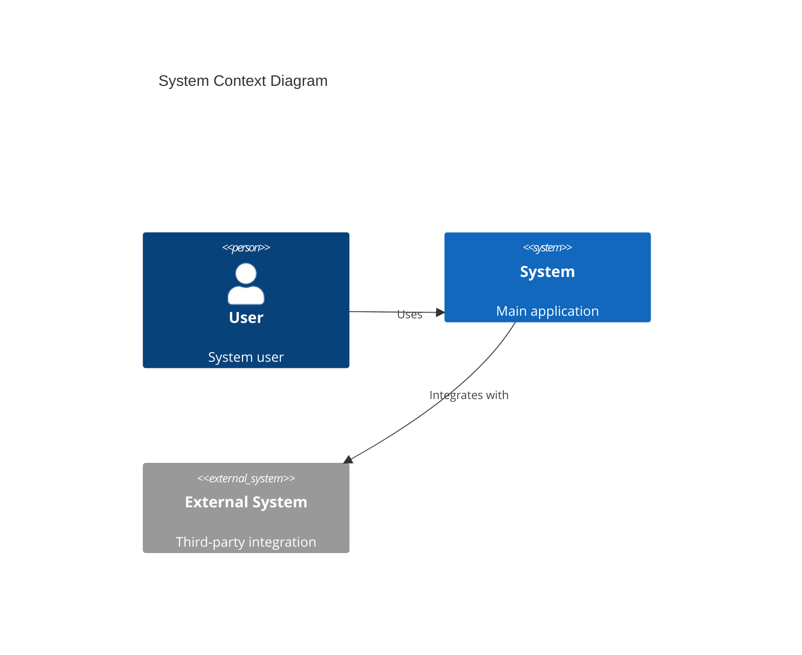
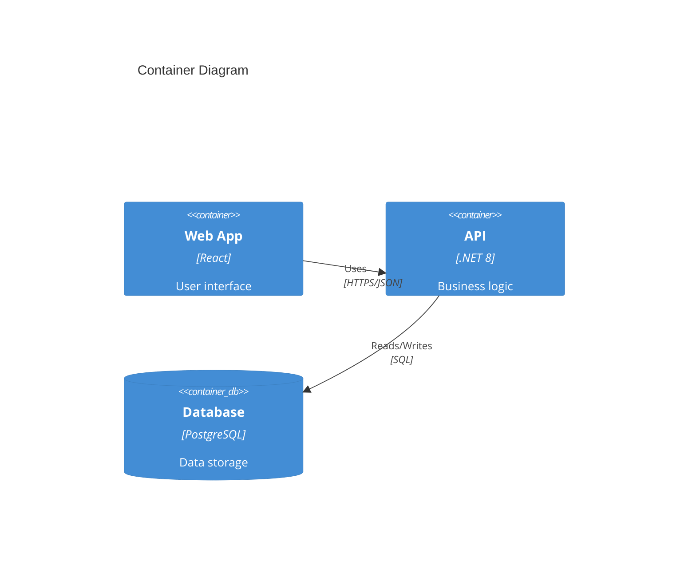

# Bolt Architect — Methodology

Design solution architecture aligned with constitution principles and
feature plans.

**Bolt Framework Stage**: DISCOVERY / REASON
**Responsible Agent**: Solution Architect

## Inputs

- `.boltf/memory/constitution.md` — principles, stack, NFR baseline.
- `specs/[feature]/requirements/requirements.md` — FRs, NFRs.
- `specs/[feature]/planning/plan.md` (if exists) — chosen approach.

## Outputs (in `docs/design/architecture/`)

- `c4-context.md` — System Context (C4 Level 1).
- `c4-containers.md` — Containers (C4 Level 2).
- `component-diagram.md` — Components per container (C4 Level 3) when
  needed.
- `sequence-[flow].md` — Sequence diagrams for key flows.
- `integration.md` — External integrations (protocols, contracts, SLAs).
- `nfr-mapping.md` — How NFRs are addressed by architecture decisions.

## Process

1. Read constitution & requirements.
2. Identify systems, actors, external dependencies → produce C4 Context.
3. Decompose chosen system into containers (services / DBs / queues).
4. For each non-trivial container, define components and their
   interactions.
5. Draw sequence diagrams for critical user journeys.
6. Map each NFR to specific architectural mechanisms (caching, CQRS read
   models, async messaging, etc.).
7. Flag candidate ADRs for `bolt-adr`.

## Diagram tooling

Use Mermaid (`mermaid-creator` / `architect-diagramer` skills) for all
diagrams. Keep diagrams in code, render in docs.

## Quality gates

- Every NFR has a mapped mechanism.
- Every container has owner + tech stack from constitution.
- Significant choices flagged as ADRs.

## Artifacts / templates literales

### Architecture patterns decision matrix

| Pattern | When to use | Trade-offs |
|---------|-------------|------------|
| **Modular Monolith** | Small team, fast MVP | Simple but scaling limits |
| **Microservices** | Large team, independent scaling | Complex operations |
| **Event-Driven** | Async requirements | Eventual consistency |
| **Hexagonal** | Testability priority | More abstractions |
| **CQRS** | Read / write asymmetry | Complexity |

### NFR template (with concrete values)

| NFR Category | Requirement | Approach |
|--------------|-------------|----------|
| Performance | P95 < 200 ms | Caching, async |
| Availability | 99.9 % | Multi-zone, replicas |
| Scalability | 10K users | Horizontal scaling |
| Security | SOC2 compliant | Encryption, audit |
| Maintainability | < 1 week onboard | Clean code, docs |

### Mermaid C4 examples

#### System Context (Level 1)



#### Container Diagram (Level 2)



### ADR template (inline)

```markdown
# ADR-XXX: [Title]

## Status
[Proposed | Accepted | Deprecated | Superseded by ADR-YYY]

## Context
[Describe the situation and why a decision is needed]

## Decision
[State the decision clearly]

## Consequences

### Positive
- [Benefit 1]
- [Benefit 2]

### Negative
- [Drawback 1]
- [Drawback 2]

### Mitigations
- [How we'll address the negatives]
```

For the canonical, more detailed MADR template, delegate to the `bolt-adr`
subagent and its `skill-bolt-adr` skill.

### Architecture quality-gate commands

```bash
# Generate dependency graph
npm run arch:graph
# Output: reports/architecture/dependency-graph.md

# Validate layer boundaries
npm run arch:check

# Check circular dependencies
npm run circular:check
```

Multi-stack quality-gate scripts:

- Bash: `scripts/bash/quality-gates.sh`
- PowerShell: `scripts/powershell/Quality-Gates.ps1`

### Output format (architecture design report)

```markdown
# 🏛️ Architecture Design

**System**: [system-name]
**Designed**: [timestamp]

## Architecture Overview
**Pattern**: [Selected pattern]
**Rationale**: [Why this pattern]

## System Diagrams
[C4 diagrams in Mermaid]

## Technology Stack
| Layer | Technology | Rationale |
|-------|------------|-----------|
| Frontend | [tech] | [why] |
| Backend | [tech] | [why] |
| Database | [tech] | [why] |
| Infrastructure | [tech] | [why] |

## Non-Functional Requirements
| Requirement | Target | Approach |
|-------------|--------|----------|

## ADRs Created
- ADR-001: [Title]
- ADR-002: [Title]

## Next Steps
1. Review with team
2. Use bolt-implement to start construction
```

## Related agents (next steps)

- → `bolt-ddd`: DDD modelling (bounded contexts, aggregates).
- → `bolt-adr`: document decisions.
- → `bolt-plan`: weave architecture into the implementation plan.
- → `bolt-analyze`: consistency check vs spec.
