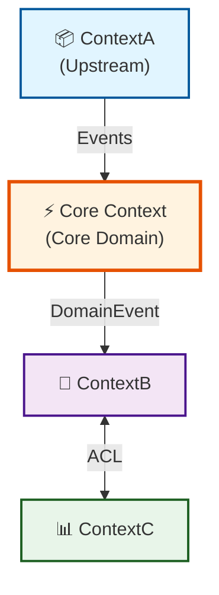

# Template: Context Map → `flowchart TB`

Use this template when the source contains **bounded contexts** with Upstream/Downstream
relationships, ACL patterns, or domain events flowing between contexts.

## Template

> **Instrucciones para el agente**: Sustituye los campos entre `< >` con los valores reales
> extraídos del artefacto fuente. Elimina esta nota antes de entregar el diagrama.

```markdown
---
**Diagrama**: Context Map  
**Bounded Context**: <NombreContexto>  
**Versión**: <x.y>  
**Fecha**: <YYYY-MM-DD>  
**Fuente**: <ruta/al/archivo-fuente.md>  
**Descripción**: <Breve descripción del mapa de contextos representado>  
---
```



## Rules

- **Core Domain** → orange/warm fill + thick border (`#fff3e0` / `#e65100` 3px)
- **Upstream** → blue fill — provides data/events, doesn't depend on downstream (`#e1f5ff`)
- **Downstream** → neutral fill — depends on upstream
- Relationship labels = the **actual event or integration name** (not generic "→")
- `<-->` for bidirectional (with ACL); `-->` for unidirectional
- Label ACL relationships explicitly: `|ACL|`

## Style Reference

| Role | Fill | Stroke |
|------|------|--------|
| Core Domain | `#fff3e0` | `#e65100` (3px) |
| Upstream | `#e1f5ff` | `#01579b` (2px) |
| Downstream / Consumer | `#e8f5e9` | `#1b5e20` (2px) |
| Generic Context | `#f3e5f5` | `#4a148c` (2px) |
| Auth / Security | `#fce4ec` | `#b71c1c` (2px) |

---

## Footer

> **Instrucciones para el agente**: Sustituye los campos entre `< >` con los valores reales.
> Elimina esta nota antes de entregar el diagrama.

```markdown
---
**Notas**: <Observaciones, decisiones de diseño o limitaciones del diagrama>  
**Pendientes**: <Contextos o relaciones no modelados que requieren revisión futura>  
**Documentos relacionados**: <enlaces a specs, ADRs u otros diagramas>

__Bolt Data Model Diagrammer v1.0__
---
```
