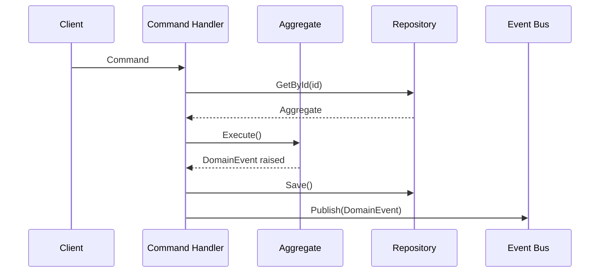
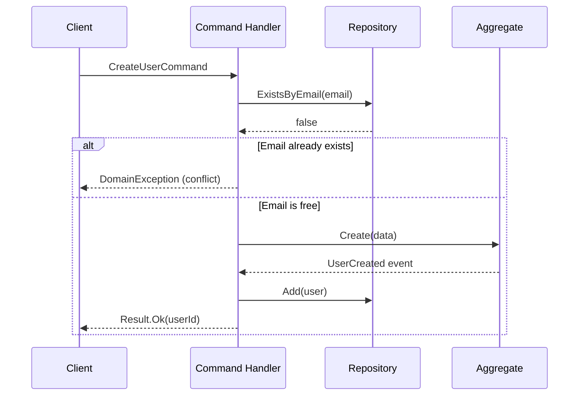

# Template: Domain Flow → `sequenceDiagram`

Use this template when the source describes the **flow of a command through handlers, aggregates,
repositories, and the event bus** — CQRS/event-driven patterns in the domain layer.

## Template

> **Instrucciones para el agente**: Sustituye los campos entre `< >` con los valores reales
> extraídos del artefacto fuente. Elimina esta nota antes de entregar el diagrama.

```markdown
---
**Diagrama**: Domain Flow  
**Bounded Context**: <NombreContexto>  
**Comando / Caso de uso**: <NombreComando>  
**Versión**: <x.y>  
**Fecha**: <YYYY-MM-DD>  
**Fuente**: <ruta/al/archivo-fuente.md>  
**Descripción**: <Breve descripción del flujo representado>  
---
```



## Rules

- Use `participant X as Label` to give descriptive names to roles
- `->>` for synchronous call; `-->>` for response/return
- `-)` for async fire-and-forget messages
- Group related steps with `rect rgb(...)` blocks for readability
- Label messages with the **actual method or command name**, not generic terms
- Show error paths with `alt` / `else` when relevant

## Common Participants in This Project

| Participant | Role |
|-------------|------|
| `Client` | Controller / API endpoint |
| `Handler` | `ICommandHandler<T>` or `IQueryHandler<T>` |
| `Aggregate` | Domain aggregate root |
| `Repo` | `IGenericRepository<T>` |
| `Bus` | `IEventBus` / `IDomainEventDispatcher` |
| `Cache` | `IDistributedCache` / Redis |

## Extended Example with Error Handling



---

## Footer

> **Instrucciones para el agente**: Sustituye los campos entre `< >` con los valores reales.
> Elimina esta nota antes de entregar el diagrama.

```markdown
---
**Notas**: <Observaciones, decisiones de diseño o limitaciones del diagrama>  
**Pendientes**: <Pasos o caminos alternativos no modelados que requieren revisión futura>  
**Documentos relacionados**: <enlaces a specs, ADRs u otros diagramas>

__Bolt Data Model Diagrammer v1.0__
---
```
