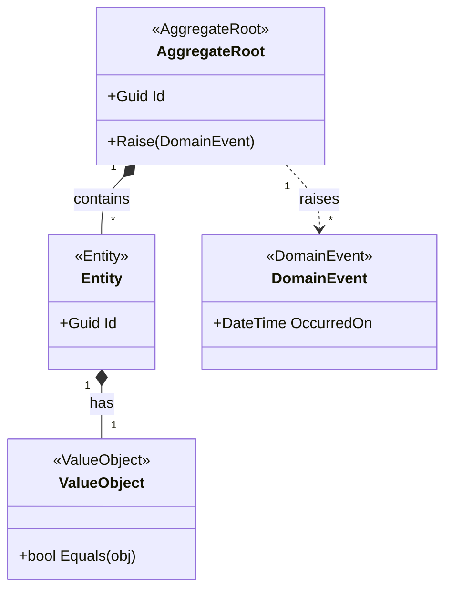

# Template: Domain Model → `classDiagram`

Use this template when the source describes **aggregates, entities, value objects, and domain
events** — the tactical DDD building blocks within a bounded context.

## Template

> **Instrucciones para el agente**: Sustituye los campos entre `< >` con los valores reales
> extraídos del artefacto fuente. Elimina esta nota antes de entregar el diagrama.

```markdown
---
**Diagrama**: Domain Model  
**Bounded Context**: <NombreContexto>  
**Versión**: <x.y>  
**Fecha**: <YYYY-MM-DD>  
**Fuente**: <ruta/al/archivo-fuente.md>  
**Descripción**: <Breve descripción del modelo de dominio representado>  
---
```



## Rules

- Use stereotypes to classify each type:
  - `<<AggregateRoot>>` — transactional boundary, owns its children
  - `<<Entity>>` — has identity, lives inside the aggregate
  - `<<ValueObject>>` — no identity, equality by value
  - `<<DomainEvent>>` — something that happened in the domain
- **Composition** `*--` for entities inside the aggregate boundary
- **Association** `-->` for references to other aggregates (by ID only in DDD)
- **Dashed** `..>` for events raised by the aggregate
- Only expose `+public` members; keep `-private` implementation details out

## Relationship Cheat Sheet

| Symbol | Meaning |
|--------|---------|
| `*--` | Composition (owns, lifecycle tied) |
| `o--` | Aggregation (references, independent lifecycle) |
| `-->` | Association (uses/references) |
| `..>` | Dependency / raises (dashed) |
| `<\|--` | Inheritance |
| `<\|..` | Interface implementation |

---

## Footer

> **Instrucciones para el agente**: Sustituye los campos entre `< >` con los valores reales.
> Elimina esta nota antes de entregar el diagrama.

```markdown
---
**Notas**: <Observaciones, decisiones de diseño o limitaciones del diagrama>  
**Pendientes**: <Agregados o value objects no modelados que requieren revisión futura>  
**Documentos relacionados**: <enlaces a specs, ADRs u otros diagramas>

__Bolt Data Model Diagrammer v1.0__
---
```
