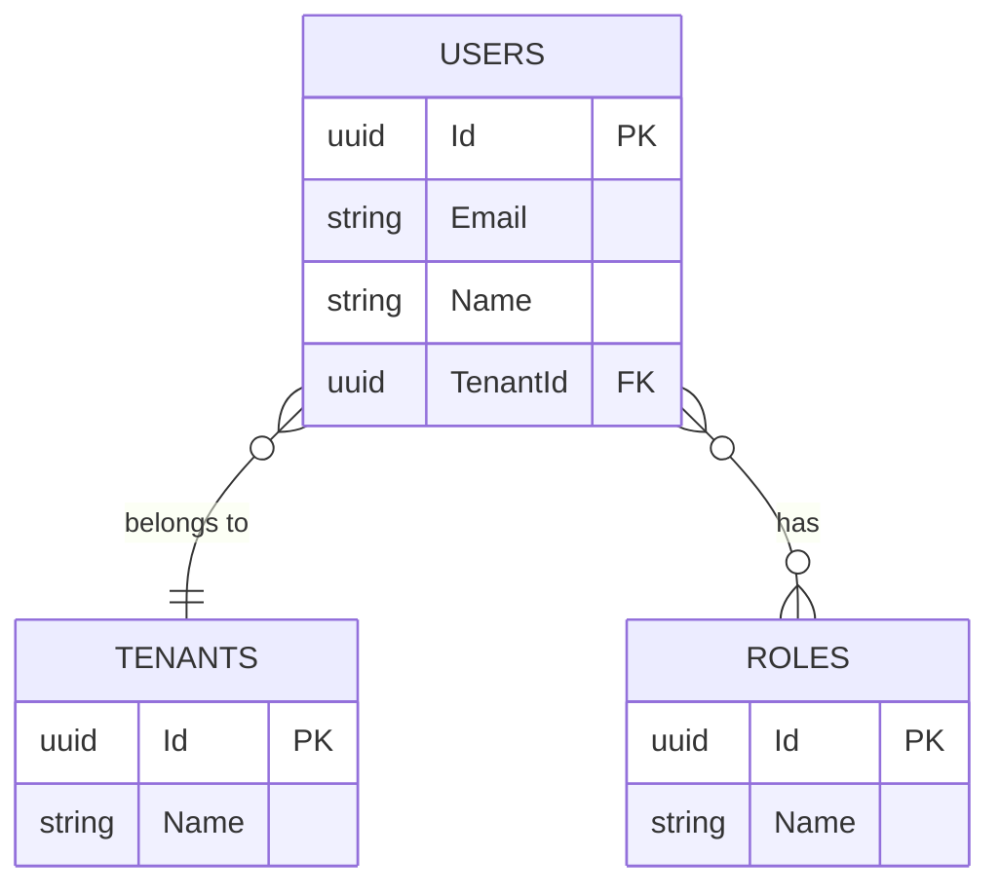

# Template: Entity / DB Schema → `erDiagram`

Use this template when the source describes **database tables, EF Core entities, or persistence
models** with foreign keys and cardinality constraints.

## Template

> **Instrucciones para el agente**: Sustituye los campos entre `< >` con los valores reales
> extraídos del artefacto fuente. Elimina esta nota antes de entregar el diagrama.

```markdown
---
**Diagrama**: Entity / DB Schema  
**Bounded Context**: <NombreContexto>  
**Versión**: <x.y>  
**Fecha**: <YYYY-MM-DD>  
**Fuente**: <ruta/al/archivo-fuente.md>  
**Descripción**: <Breve descripción del esquema de entidades representado>  
---
```



## Rules

- Annotate columns: `PK` (primary key), `FK` (foreign key), `UK` (unique)
- Table names in **UPPER_SNAKE_CASE** to match DB convention
- Relationship labels describe the **business meaning**, not the FK name
- Include only the most relevant columns; omit audit fields (`CreatedAt`, etc.) unless important

## Cardinality Notation

| Symbol | Meaning |
|--------|---------|
| \|\|--\|\| | One-to-one |
| \|\|--o{ | One-to-many (optional on right) |
| \|\|--\|{ | One-to-many (required on right) |
| }o--o{ | Many-to-many (both optional) |
| }\|--\|{ | Many-to-many (both required) |

## EF Core Mapping Notes

When translating EF Core `DbContext` or entity classes:

- `HasOne(...).WithMany(...)` → `||--o{`
- `HasMany(...).WithMany(...)` → junction table needed → `}o--o{`
- Navigation properties without FK annotations → infer from naming convention

---

## Footer

> **Instrucciones para el agente**: Sustituye los campos entre `< >` con los valores reales.
> Elimina esta nota antes de entregar el diagrama.

```markdown
---
**Notas**: <Observaciones, decisiones de diseño o limitaciones del diagrama>  
**Pendientes**: <Tablas o relaciones no modeladas que requieren revisión futura>  
**Documentos relacionados**: <enlaces a specs, ADRs u otros diagramas>

__Bolt Data Model Diagrammer v1.0__
---
```
