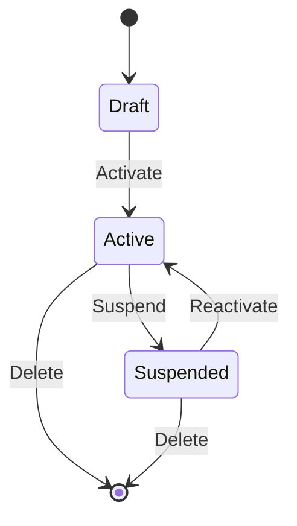
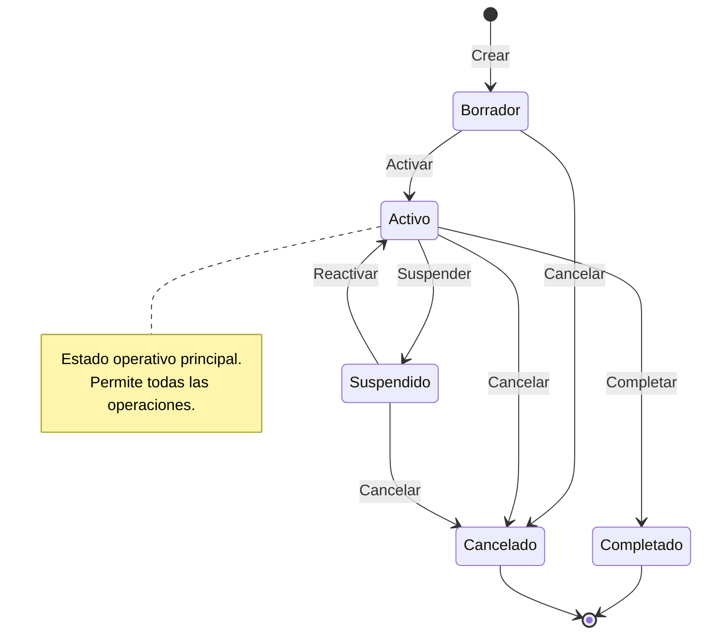

# Template: State Machine → `stateDiagram-v2`

Use this template when the source describes the **lifecycle of a domain entity** — its valid
states and the transitions (commands/events) that move it between them.

## Template

> **Instrucciones para el agente**: Sustituye los campos entre `< >` con los valores reales
> extraídos del artefacto fuente. Elimina esta nota antes de entregar el diagrama.

```markdown
---
**Diagrama**: State Machine  
**Entidad**: <NombreEntidad>  
**Bounded Context**: <NombreContexto>  
**Versión**: <x.y>  
**Fecha**: <YYYY-MM-DD>  
**Fuente**: <ruta/al/archivo-fuente.md>  
**Descripción**: <Breve descripción del ciclo de vida representado>  
---
```



## Rules

- `[*]` marks the entry point (creation) and terminal states (deletion/archival)
- Transition labels = the **command or domain event** that triggers the transition
- Use `state "Label" as Alias` for states with long names
- Use `state X { ... }` for composite/nested states when an entity has sub-states
- Keep it to one state machine per entity; split into separate diagrams if complex

## Extended Example with Notes



## Common Entity Lifecycles in This Project

| Entity | States |
|--------|--------|
| Usuario | `Pendiente` → `Activo` → `Suspendido` / `Eliminado` |
| Encargo | `Borrador` → `Asignado` → `EnCurso` → `Completado` / `Cancelado` |
| Visita | `Programada` → `Realizada` / `Cancelada` |
| Compañía | `Activa` → `Suspendida` → `Eliminada` |

---

## Footer

> **Instrucciones para el agente**: Sustituye los campos entre `< >` con los valores reales.
> Elimina esta nota antes de entregar el diagrama.

```markdown
---
**Notas**: <Observaciones, decisiones de diseño o limitaciones del diagrama>  
**Pendientes**: <Estados o transiciones no modelados que requieren revisión futura>  
**Documentos relacionados**: <enlaces a specs, ADRs u otros diagramas>

__Bolt Data Model Diagrammer v1.0__
---
```
