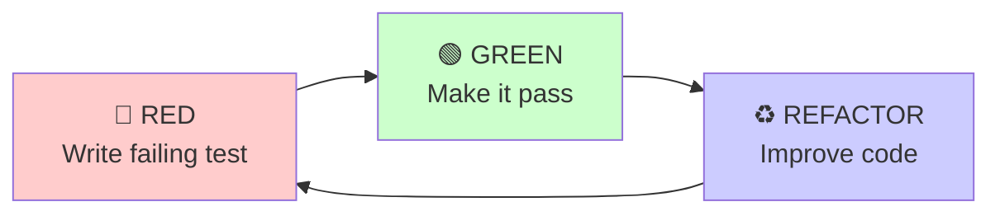

# Skill: TDD Red-Green-Refactor

**Test-Driven Development (TDD)** is a software development discipline where tests are written **before** the implementation. The RED-GREEN-REFACTOR cycle is the heartbeat of TDD, ensuring high-quality, maintainable code with comprehensive test coverage.

## 🎯 When to Use This Skill

Invoke this skill when:

- Implementing new features from scratch (backend or frontend)
- Adding new functionality to existing codebase
- Refactoring legacy code with test coverage
- Working on critical business logic that requires confidence
- Collaborating with **Aurora Implement**, **Aurora Testing**, or **Aurora Review** agents
- User explicitly requests TDD approach
- Working on code that needs to be maintainable long-term

## 🚀 Quick Start

**The TDD mantra**: 🔴 **RED** → 🟢 **GREEN** → ♻️ **REFACTOR**



1. **RED**: Write a test that fails
2. **GREEN**: Write minimal code to make it pass
3. **REFACTOR**: Improve code while keeping tests green
4. **Repeat**: Next test

---

## 🔴 RED Phase: Write a Failing Test

**Goal**: Define WHAT should happen (not HOW).

### Workflow

1. **Write the test** - Describe WHAT should happen
2. **Run the test** - Verify it FAILS
3. **Check failure reason** - Must fail for the RIGHT reason:
   - ✅ Method doesn't exist
   - ✅ Wrong return value
   - ❌ Syntax error (fix your test!)
   - ❌ Import error (fix your test!)
4. **Commit** - `test: add failing test for [feature]`

### RED Phase Checklist

- [ ] Test follows AAA pattern (Arrange, Act, Assert)
- [ ] Test name clearly describes expected behavior
- [ ] Test runs and FAILS
- [ ] Failure message is clear and expected
- [ ] Only ONE new test added
- [ ] Test committed to version control

📘 **See**: [examples/red-phase-examples.md](examples/red-phase-examples.md) for Backend (.NET/xUnit) and Frontend (TypeScript/Vitest) examples

---

## 🟢 GREEN Phase: Make the Test Pass

**Goal**: Write the SIMPLEST code to make the test pass.

### Workflow

1. **Write minimal code** - Simplest thing that makes test pass
2. **Run the test** - Should turn GREEN
3. **Run ALL tests** - Ensure nothing broke
4. **Commit** - `feat: implement [feature]`

### GREEN Phase Checklist

- [ ] Minimal code written (no over-engineering)
- [ ] New test PASSES
- [ ] ALL existing tests still pass
- [ ] No functionality added beyond test requirements
- [ ] Code committed to version control

### Common GREEN Phase Mistakes

❌ **Over-Engineering**: Adding features not tested yet  
❌ **Premature Optimization**: Performance concerns before it works  
❌ **Adding Error Handling**: Unless you have a test for it

✅ **Keep It Simple**: Just make the test pass!

📘 **See**: [examples/green-phase-examples.md](examples/green-phase-examples.md) for minimal implementation examples and handling complex requirements

---

## ♻️ REFACTOR Phase: Improve Code Quality

**Goal**: Improve code while keeping tests GREEN.

### When to Refactor

- Code duplication detected
- Long methods (>20 lines)
- Complex conditionals
- Magic numbers or strings
- Poor naming
- SOLID violations
- Code smells

### Common Refactorings

1. **Extract Method** - Break long methods into smaller ones
2. **Extract Class** - Split god classes
3. **Extract Value Object** - Replace primitives with domain objects
4. **Rename** - Improve naming clarity
5. **Remove Duplication** - DRY principle
6. **Simplify Conditionals** - Guard clauses, early returns
7. **Introduce Parameter Object** - Group related parameters

### REFACTOR Phase Workflow

1. **Identify code smell** - Long method? Duplication? Magic numbers?
2. **Make ONE improvement** - Extract method, rename variable, etc.
3. **Run ALL tests** - Must stay GREEN
4. **Commit** - `refactor: extract validation logic`
5. **Repeat** until satisfied

### REFACTOR Phase Checklist

- [ ] Code follows SOLID principles
- [ ] No code duplication (DRY)
- [ ] Clear, descriptive names
- [ ] Appropriate design patterns applied
- [ ] ALL tests still GREEN after each change
- [ ] Code complexity reduced
- [ ] Performance acceptable
- [ ] Changes committed incrementally

📘 **See**: [examples/refactor-phase-examples.md](examples/refactor-phase-examples.md) for Backend/Frontend before/after refactoring examples

---

## 🚫 TDD Anti-Patterns (What NOT to Do)

❌ **Anti-Pattern 1**: Writing Tests After Implementation  
❌ **Anti-Pattern 2**: Skipping RED Phase  
❌ **Anti-Pattern 3**: Testing Implementation Details  
❌ **Anti-Pattern 4**: Large Test / Large Implementation  
❌ **Anti-Pattern 5**: Not Running Tests Frequently  
❌ **Anti-Pattern 6**: Testing Trivial Code  
❌ **Anti-Pattern 7**: Fragile Tests (Over-Mocking)

📘 **See**: [examples/anti-patterns.md](examples/anti-patterns.md) for detailed anti-patterns with code examples and fixes

---

## Integration with Other Skills

### With skill-backend-testing-dotnet

TDD provides the **WORKFLOW** (RED → GREEN → REFACTOR), while backend testing provides the **TOOLS** (xUnit, FluentAssertions, Testcontainers, Moq).

### With skill-gherkin-reqnroll

- **BDD (Gherkin)** → User stories with acceptance criteria (high-level)
- **TDD (Unit)** → Domain logic, algorithms, utilities (low-level)

### With skill-playwright-e2e

TDD applies to E2E tests too:
- **RED** → Write failing E2E test
- **GREEN** → Implement feature
- **REFACTOR** → Improve page objects, reduce duplication

---

## TDD Decision Matrix

| Scenario          | Use TDD? | Rationale                               |
| ----------------- | -------- | --------------------------------------- |
| New domain entity | ✅ Yes   | Critical business logic                 |
| New algorithm     | ✅ Yes   | Complex logic needs tests first         |
| Bug fix           | ✅ Yes   | Write test that reproduces bug          |
| CRUD endpoint     | ⚠️ Maybe | Consider BDD if has acceptance criteria |
| UI component      | ⚠️ Maybe | Consider component testing              |
| Configuration     | ❌ No    | Not complex enough for TDD              |
| Documentation     | ❌ No    | No code to test                         |

---

## Metrics

### Cycle Time

- **RED**: 2-5 minutes
- **GREEN**: 2-10 minutes
- **REFACTOR**: 5-15 minutes
- **Total per cycle**: 10-30 minutes

### When TDD is Working Well

✅ Cycle time is short (< 30 min)  
✅ Tests are green most of the time  
✅ Refactoring is fearless  
✅ Code coverage is high naturally  
✅ Bugs are caught early

### When TDD is Not Working

❌ Cycle time > 1 hour  
❌ Tests frequently break  
❌ Afraid to refactor  
❌ Coverage gaps after TDD  
❌ Tests feel like burden

---

## Common Commands

### Backend (.NET)

```bash
# RED: Run test (should fail)
dotnet test --filter "FullyQualifiedName~AccountTests.Create_WithValidData"

# GREEN: Run all tests
dotnet test

# REFACTOR: Run with coverage
dotnet test /p:CollectCoverage=true

# Watch mode (re-run on file change)
dotnet watch test
```

### Frontend (TypeScript)

```bash
# RED: Run test (should fail)
npm test -- AccountService.test.ts

# GREEN: Run all tests
npm test

# REFACTOR: Run with coverage
npm test -- --coverage

# Watch mode
npm test -- --watch
```

---

## Integration with AURORA

### Aurora Agents

- **@Aurora Testing tdd** - Generates tests following TDD
- **@Aurora Implement** - Implements code following TDD green phase
- **@Aurora Review** - Reviews refactoring quality

### Constitution

TDD preferences should be in `memory/constitution.md`:

```markdown
### Testing Philosophy

- TDD approach for domain logic
- BDD approach for user stories with ACs
- Coverage-first for legacy code
```

---

## References

- [Test Driven Development by Kent Beck](https://www.amazon.com/Test-Driven-Development-Kent-Beck/dp/0321146530)
- [The Cycles of TDD](https://blog.cleancoder.com/uncle-bob/2014/12/17/TheCyclesOfTDD.html)
- [TDD Best Practices](https://docs.microsoft.com/en-us/dotnet/core/testing/unit-testing-best-practices)

---

## 📁 Examples

Detailed code examples with full context are available in the `examples/` subdirectory:

- [red-phase-examples.md](examples/red-phase-examples.md) - Backend/Frontend RED phase examples
- [green-phase-examples.md](examples/green-phase-examples.md) - GREEN phase with complex requirements
- [refactor-phase-examples.md](examples/refactor-phase-examples.md) - Before/after refactoring examples
- [anti-patterns.md](examples/anti-patterns.md) - What NOT to do with TDD

