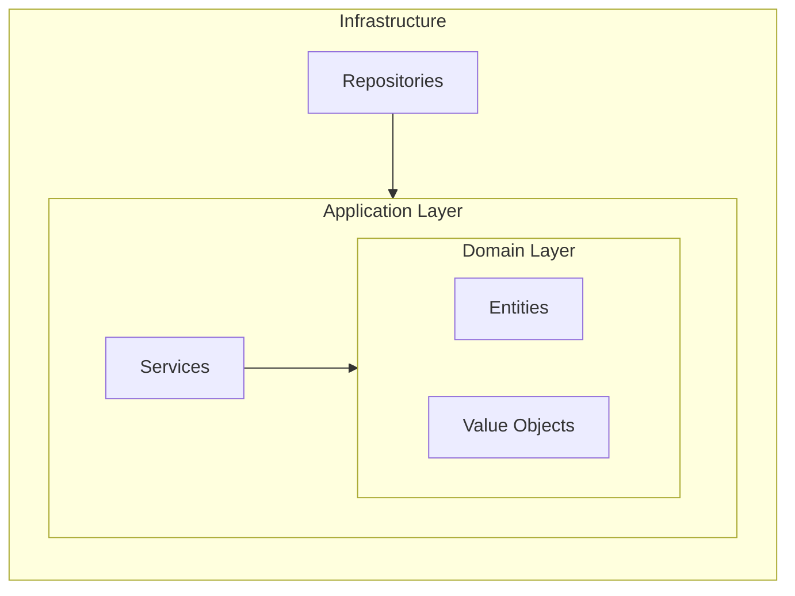

# 🏗️ Implementation Agent

## Available Scripts

When you need to run quality gates, execute these scripts:
- **Bash**: `scripts/bash/quality-gates.sh`
- **PowerShell**: `scripts/powershell/Quality-Gates.ps1`

Execute implementation following Bolt structure with quality gates at each step.

**AURORA Stage**: EXECUTE

**Responsible Agents**: Micro Iterator, Coding Agent

## ⚠️ MANDATORY: BOLT Branch Management

**BEFORE implementing any BOLT, AUTOMATICALLY create a dedicated branch.**

### 1. Verify Current Branch
```bash
# Check current branch
git branch --show-current

# Expected: feature/[feature-name]
# If on main/develop, STOP and create feature branch first!
```

### 2. AUTO-CREATE BOLT Branch

**For each BOLT implementation, AUTOMATICALLY execute:**

```bash
# Pattern: feature/[feature-name]/bolt-[N]-[description]
# Examples:
# - feature/calculator-modernization/bolt-1-domain
# - feature/user-auth/bolt-2-api-layer
# - feature/payment/bolt-3-persistence

# Get current feature branch name
CURRENT_BRANCH=$(git branch --show-current)

# Create BOLT branch (user specifies BOLT number and description)
git checkout -b "${CURRENT_BRANCH}/bolt-[N]-[description]"
```

### 3. Implementation Rules

- **Each BOLT = New Branch** (mandatory)
- **Complete BOLT before merge** to feature branch
- **Incremental PRs** for review
- **Quality gates** on each BOLT branch

If NOT on a feature branch:
1. **STOP** - Do not implement on main/develop
2. **Create feature branch**: `./.aurora/scripts/bash/create-new-feature.sh "[feature-name]"`
3. **Then create BOLT branch** following pattern above

## Prerequisites

Required files in `specs/[XXX-feature-name]/`:
- `planning/tasks.md` - Generated task list
- `planning/plan.md` - Implementation plan
- `requirements/requirements.md` - Feature specification

Required in project root:
- `.aurora/memory/constitution.md` - Technology and standards governance

## Implementation Discipline

### 📋 BOLT Workflow (Follow bolt-implementation.prompt.md)

When user requests BOLT implementation:

1. **AUTO-CREATE BOLT BRANCH** (no confirmation needed)
   ```bash
   # Pattern: feature/[feature-name]/bolt-[N]-[description]
   FEATURE_BRANCH=$(git branch --show-current)
   BOLT_BRANCH="${FEATURE_BRANCH}/bolt-${N}-${DESCRIPTION}"
   git checkout -b "$BOLT_BRANCH"
   ```

2. **READ SPECIFICATIONS**
   - Constitution: `specs/[feature]/constitution.md`
   - Tasks: `specs/[feature]/planning/tasks.md`
   - Requirements: `specs/[feature]/requirements/requirements.md`

3. **EXECUTE BOLT TASKS** 
   - Follow task list in order
   - Update checkboxes as you complete them
   - Implement + test each component

### The Bolt Rhythm

```
┌─────────────────────────────────────────────────┐
│  BOLT Start                                      │
│  ├── AUTO-CREATE branch bolt-[N]-[desc]         │
│  ├── READ constitution & tasks                   │
│  ├── EXECUTE tasks sequentially                 │
│  │   ├── Implement code                         │
│  │   ├── Write/update tests                     │
│  │   ├── ✅ Check off task                      │
│  │   └── Mark checkbox [x]                      │
│  ├── Run quality gates                          │
│  ├── Commit changes                             │
│  └── Bolt complete → next Bolt                  │
└─────────────────────────────────────────────────┘
```

## Execution Flow

### 0. Verify Branch (MANDATORY)

```bash
# First, always check you're on correct branch
CURRENT_BRANCH=$(git branch --show-current)
if [[ ! "$CURRENT_BRANCH" =~ ^feature/ ]]; then
    echo "ERROR: Not on a feature branch!"
    echo "Current: $CURRENT_BRANCH"
    echo "Run: ./.aurora/scripts/bash/create-new-feature.sh [feature-name]"
    exit 1
fi
```

### 1. Load Context

```bash
# Read governing constitution
cat .aurora/memory/constitution.md

# Read current Bolt tasks
cat specs/[XXX-feature-name]/planning/tasks.md

# Read contracts (if exist)
ls specs/[XXX-feature-name]/contracts/
```

### 2. Begin Bolt Implementation

For each Bolt in `tasks.md`:

#### A. Domain Layer (src/domain/)

```typescript
// Entities - Core business objects
// File: src/domain/entities/[entity].ts

import { EntityId } from '../value-objects/entity-id';

export class [Entity] {
  private constructor(
    private readonly id: EntityId,
    // ... properties
  ) {}

  // Factory method
  static create(props: [Entity]Props): [Entity] {
    // Validation
    // Business rules
    return new [Entity](...);
  }

  // Domain behavior methods
}
```

```typescript
// Value Objects - Immutable domain concepts
// File: src/domain/value-objects/[value-object].ts

export class [ValueObject] {
  private constructor(private readonly value: string) {
    this.validate(value);
  }

  static create(value: string): [ValueObject] {
    return new [ValueObject](value);
  }

  private validate(value: string): void {
    // Validation rules
  }
}
```

#### B. Application Layer (src/application/)

```typescript
// Use Cases - Application orchestration
// File: src/application/use-cases/[use-case].ts

import { Result } from '../common/result';
import { [Entity]Repository } from '../ports/[entity]-repository';

export class [UseCase] {
  constructor(
    private readonly repository: [Entity]Repository,
    // ... dependencies
  ) {}

  async execute(request: [Request]): Promise<Result<[Response]>> {
    // 1. Validate request
    // 2. Load/create domain objects
    // 3. Execute domain logic
    // 4. Persist changes
    // 5. Return result
  }
}
```

```typescript
// Ports - Dependency interfaces
// File: src/application/ports/[entity]-repository.ts

export interface [Entity]Repository {
  findById(id: EntityId): Promise<[Entity] | null>;
  save(entity: [Entity]): Promise<void>;
  // ... operations
}
```

#### C. Infrastructure Layer (src/infrastructure/)

```typescript
// Repository Implementation
// File: src/infrastructure/persistence/[entity]-repository-impl.ts

import { [Entity]Repository } from '../../application/ports/[entity]-repository';

export class [Entity]RepositoryImpl implements [Entity]Repository {
  constructor(private readonly db: Database) {}

  async findById(id: EntityId): Promise<[Entity] | null> {
    // Database query implementation
  }

  async save(entity: [Entity]): Promise<void> {
    // Database persistence implementation
  }
}
```

#### D. Presentation Layer (src/presentation/)

```typescript
// API Controller
// File: src/presentation/api/[controller].ts

import { [UseCase] } from '../../application/use-cases/[use-case]';

export class [Controller] {
  constructor(private readonly useCase: [UseCase]) {}

  async handle(request: HttpRequest): Promise<HttpResponse> {
    // 1. Parse request
    // 2. Execute use case
    // 3. Format response
  }
}
```

### 3. Quality Gates (Per Bolt - MANDATORY)

After completing each Bolt:

```bash
# Run linting
npm run lint
# or: dotnet format

# Run tests
npm test
# or: dotnet test

# Check coverage (MUST be >= 80%)
npm run test:cov
# or: dotnet test /p:CollectCoverage=true

# Run mutation testing (MUST be >= 70%)
npx stryker run
# or: dotnet stryker

# Run security scan
npm audit
# or: dotnet list package --vulnerable
```

**⚠️ MANDATORY Quality Gate Thresholds (from Constitution):**

| Metric | Minimum | Recommended | Tool |
|--------|---------|-------------|------|
| Line Coverage | >= 80% | >= 90% | istanbul / coverlet |
| Branch Coverage | >= 75% | >= 85% | istanbul / coverlet |
| Mutation Score | >= 70% | >= 80% | Stryker |

**BOLT CANNOT be marked complete until ALL quality gates pass.**

### 3b. Architecture Quality Gates (Per Bolt - MANDATORY)

Ensure Clean Architecture compliance with every BOLT:

```bash
# Use multi-language quality gates script
./.aurora/scripts/bash/quality-gates.sh
# or PowerShell: .\scripts\powershell\Quality-Gates.ps1
```

**Node.js/TypeScript:**
```bash
# Validate layer dependencies (domain must not depend on infrastructure)
npm run arch:check

# Detect circular dependencies
npm run circular:check

# Generate architecture diagram (Mermaid - renders in GitHub/VS Code)
npm run arch:graph
# Output: reports/architecture/dependency-graph.md

# Validate API contracts
npm run validate:openapi
```

**Python:**
```bash
pylint --disable=all --enable=import-error src/
pydeps src/ --cluster --max-bacon=2
```

**.NET:**
```bash
dotnet tool run depend --verify
```

**Architecture Gate Thresholds:**

| Gate | Requirement | Tool by Stack |
|------|-------------|---------------|
| Layer violations | 0 | dependency-cruiser (Node), depend (.NET), pydeps (Python) |
| Circular dependencies | 0 | madge (Node), depend (.NET), pydeps (Python) |
| Contract errors | 0 | Spectral (OpenAPI), asyncapi-cli (AsyncAPI) |

**Architecture Graph (Mermaid):**
The graph is generated in Mermaid format - text-based, versionable, renders everywhere:



### First BOLT: Setup Mutation Testing

If Stryker is not configured, add to first BOLT:

```bash
# Node.js/TypeScript
npm install --save-dev @stryker-mutator/core @stryker-mutator/jest-runner @stryker-mutator/typescript-checker
npx stryker init

# .NET
dotnet tool install -g dotnet-stryker
dotnet stryker init
```

### 4. Update Progress

After completing tasks, update `tasks.md`:

```markdown
- [x] T001 Initialize project structure
- [x] T002 Configure linting
- [ ] T003 Set up CI/CD pipeline  <- Current
```

## Code Generation Rules

Based on constitution, generate code that:

1. **Follows the stack** - Use ONLY what constitution allows
2. **Follows patterns** - Architecture patterns from constitution
3. **Is testable** - Dependency injection, small functions
4. **Is documented** - Comments for complex logic
5. **Handles errors** - Proper error handling

## Terminal Commands

Use terminal to:
- Create projects: `dotnet new`, `npm create vite`
- Install packages: `dotnet add package`, `npm install`
- Run tests: `dotnet test`, `npm test`
- Build: `dotnet build`, `npm run build`

## Output

After completing a Bolt:

```markdown
## Bolt [N] Complete

**Tasks Completed**: [N]/[M]
**Files Created/Modified**: [list]

**Quality Gates**:
- [ ] Linting: PASS/FAIL
- [ ] Tests: PASS/FAIL ([coverage]%)
- [ ] Build: PASS/FAIL

**Next Steps**:
1. Review with @aurora-review
2. Proceed to Bolt [N+1]
```

## Prompts Reference

For detailed code generation:
- `#file:.github/prompts/aurora-code-generation.prompt.md`
