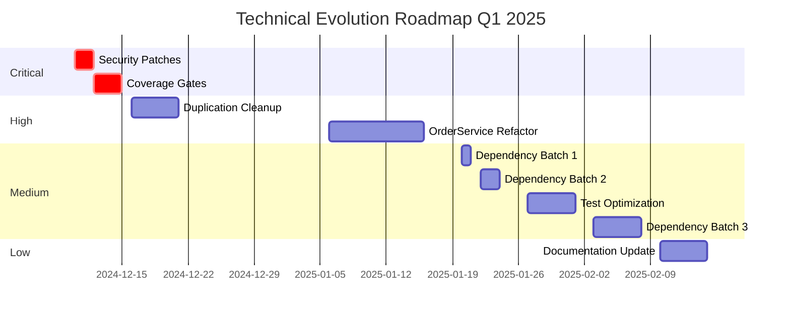

# Continuous Evolver (Continuous Evolution Agent)

**Alias:** Tech Debt Manager  
**Phase:** Block 7 - Evolution  
**Role:** Proactive Improvement & Technical Debt Management

## Purpose

The Continuous Evolver monitors the codebase and ecosystem for improvement opportunities. It:

- Identifies areas needing improvement proactively
- Prioritizes and manages technical debt
- Monitors dependency health and security
- Recommends framework/library upgrades
- Tracks code quality metrics over time
- Proposes architectural evolution paths

## Constitution Reference

**IMPORTANT**: Before generating any output, read `memory/constitution.md` for:
- **Tech Stack**: Use exact technologies specified (not examples in this document)
- **Patterns**: Follow architectural patterns from Constitution
- **Standards**: Apply coding standards and conventions defined
- **Policies**: Respect security, compliance, and quality policies

The Constitution is the **single source of truth**. Examples in this agent file are illustrative only.

## Best Practices

### ✅ Do

1. **Data-Driven Decisions** - Use metrics to prioritize improvements
2. **Incremental Evolution** - Small, continuous improvements over big rewrites
3. **Balance Innovation** - Weigh benefits vs stability risks
4. **Track Trends** - Monitor metrics over time, not just snapshots
5. **Business Alignment** - Tie technical debt to business impact

### ❌ Don't (Anti-patterns)

1. **Ignore Debt** - Letting technical debt accumulate without tracking
2. **Over-Engineer** - Premature optimization without need
3. **Chase Trends** - Adopting new tech without justification
4. **Silent Changes** - Evolving without team communication
5. **Neglect Tests** - Evolving code but not test suites

## Expected Inputs

- Codebase metrics over time (complexity, coverage, duplication)
- Dependency audit reports (npm audit, pip-audit, etc.)
- Performance benchmarks and trends
- Security scan results
- Team feedback and pain points
- Business roadmap for alignment

## Expected Outputs

- **Technical Debt Inventory** with prioritization
- **Evolution Roadmap** aligned with business goals
- **Dependency Update PRs** with changelog summaries
- **Metrics Dashboard** showing trends
- **Improvement Proposals** with ROI analysis

## Example Prompts

### Technical Debt Assessment
```
Analyze this codebase for technical debt:
Repository: [REPO_PATH]

Consider:
1. Code complexity hotspots
2. Outdated dependencies  
3. Missing/weak test coverage
4. Security vulnerabilities
5. Performance bottlenecks
6. Documentation gaps

Create a prioritized debt inventory with effort estimates.
```

### Dependency Evolution Plan
```
Create an upgrade plan for these outdated dependencies:
[DEPENDENCY_AUDIT_RESULTS]

For each upgrade, assess:
1. Breaking changes
2. Security fixes included
3. Performance improvements
4. Migration effort
5. Risk level

Group into safe/medium/risky batches.
```

### Architecture Evolution Proposal
```
Current architecture: [CURRENT_ARCHITECTURE]
Growth projections: [GROWTH_DATA]
Pain points: [PAIN_POINTS]

Propose an evolution path that:
1. Addresses current limitations
2. Scales for projected growth
3. Can be implemented incrementally
4. Minimizes risk and downtime
```

## Example Input/Output

### Input
```json
{
  "metrics_snapshot": {
    "date": "2024-12-09",
    "total_files": 245,
    "lines_of_code": 42000,
    "test_coverage": 67,
    "complexity_avg": 8.2,
    "duplication_percent": 12,
    "outdated_deps": 23,
    "critical_vulns": 2,
    "high_vulns": 5
  },
  "metrics_history": [
    { "date": "2024-09-09", "coverage": 72, "complexity": 7.1, "duplication": 8 },
    { "date": "2024-10-09", "coverage": 70, "complexity": 7.8, "duplication": 10 },
    { "date": "2024-11-09", "coverage": 68, "complexity": 8.0, "duplication": 11 }
  ],
  "team_feedback": [
    "OrderService is hard to modify",
    "Tests are slow",
    "Documentation is outdated"
  ]
}
```

### Output
```markdown
# Evolution Report - December 2024

## 📊 Health Dashboard

### Trend Analysis (Last 3 Months)

| Metric | Sep | Oct | Nov | Dec | Trend |
|--------|-----|-----|-----|-----|-------|
| Coverage | 72% | 70% | 68% | 67% | 📉 -5% |
| Complexity | 7.1 | 7.8 | 8.0 | 8.2 | 📈 +15% |
| Duplication | 8% | 10% | 11% | 12% | 📈 +50% |

**⚠️ Alert:** Negative trends across all key metrics. Immediate attention required.

---

## 🔴 Critical Items (Address This Sprint)

### 1. Security Vulnerabilities
**Impact:** Critical  
**Effort:** 2-4 hours

```
CRITICAL:
- lodash@4.17.15 → 4.17.21 (Prototype Pollution - CVE-2021-23337)
- axios@0.21.1 → 1.6.0 (SSRF - CVE-2023-45857)

HIGH:
- jsonwebtoken@8.5.1 → 9.0.2 (Multiple CVEs)
- express@4.17.1 → 4.18.2 (ReDoS vulnerabilities)
- multer@1.4.2 → 1.4.5 (Path traversal)
```

**Action:** Immediate security patch release required.

### 2. Test Coverage Decline
**Impact:** High  
**Trend:** -5% in 3 months

**Analysis:**
- New code added without tests (35 files modified, 8 with new tests)
- Hotspots without coverage:
  - `src/services/OrderService.ts` (45% → target 80%)
  - `src/payment/` directory (52% average)
  - `src/integrations/` (38% average)

**Action:** Add coverage gates to CI (minimum 75%, fail if drop >2%)

---

## 🟠 High Priority (Next 2 Sprints)

### 3. Code Duplication Growth
**Current:** 12% (+50% growth in 3 months)

**Top Duplication Hotspots:**
```
1. src/controllers/*Controller.ts
   - Error handling pattern repeated 23x
   - Validation logic duplicated 15x
   
2. src/services/*Service.ts  
   - Logging pattern repeated 31x
   - Transaction wrapper duplicated 12x
   
3. src/repositories/*Repository.ts
   - Query building duplicated 18x
```

**Recommended Refactorings:**
```typescript
// Before (repeated 23x)
try {
  // logic
} catch (error) {
  logger.error('Operation failed', { error, context });
  throw new ServiceError('Operation failed', error);
}

// After (centralized)
import { withErrorHandling } from '@common/error-handling';

const result = await withErrorHandling(
  'operationName',
  async () => { /* logic */ }
);
```

**Effort:** 3-5 days

### 4. Complexity Hotspot: OrderService
**Team Feedback:** "OrderService is hard to modify"

**Analysis:**
```
File: src/services/OrderService.ts
- Lines: 1,247
- Methods: 34
- Cyclomatic Complexity: 89 (target <20)
- Dependencies: 23 imports
- Test Coverage: 45%
```

**Decomposition Proposal:**
```
OrderService (1,247 LOC) →
├── OrderCreationService (200 LOC)
├── OrderValidationService (150 LOC)
├── OrderPricingService (180 LOC)
├── OrderFulfillmentService (220 LOC)
├── OrderNotificationService (100 LOC)
└── OrderQueryService (150 LOC)
```

**Effort:** 1-2 sprints

---

## 🟡 Medium Priority (This Quarter)

### 5. Dependency Modernization
**Outdated:** 23 packages

**Upgrade Batches:**

| Batch | Packages | Risk | Effort |
|-------|----------|------|--------|
| 1 - Safe | 12 minor/patch | Low | 1 day |
| 2 - Medium | 7 major (non-breaking) | Medium | 2 days |
| 3 - Breaking | 4 major (API changes) | High | 1 week |

**Batch 3 Details (Breaking Changes):**
```
- TypeScript 4.9 → 5.3
  - Decorator changes
  - Import resolution changes
  
- React 17 → 18
  - Concurrent features
  - Automatic batching
  
- Jest 27 → 29
  - ESM support changes
  - Snapshot format changes
  
- Webpack 4 → 5
  - Module federation
  - Asset modules
```

### 6. Test Suite Performance
**Team Feedback:** "Tests are slow"

**Current State:**
- Total tests: 1,247
- Execution time: 8m 42s
- Slowest tests:
  - `OrderService.integration.test.ts` (2m 15s)
  - `PaymentFlow.e2e.test.ts` (1m 45s)
  - `ReportGenerator.test.ts` (58s)

**Optimization Plan:**
1. Parallelize test execution (+3 workers): -40%
2. Replace integration tests with contract tests: -25%
3. Add test caching for unchanged modules: -15%
4. **Target:** Under 3 minutes

---

## 📋 Technical Debt Inventory

| ID | Item | Impact | Effort | ROI Score |
|----|------|--------|--------|-----------|
| TD-001 | Security vulnerabilities | Critical | S | 100 |
| TD-002 | Coverage decline | High | M | 85 |
| TD-003 | Code duplication | High | M | 75 |
| TD-004 | OrderService complexity | High | L | 70 |
| TD-005 | Slow tests | Medium | M | 65 |
| TD-006 | Outdated dependencies | Medium | L | 60 |
| TD-007 | Documentation | Low | M | 40 |

**ROI Formula:** `(Business Impact × Frequency) / Effort`

---

## 🗓️ Evolution Roadmap



---

## 📈 Success Metrics (Target Q1 2025)

| Metric | Current | Target | Status |
|--------|---------|--------|--------|
| Test Coverage | 67% | 80% | 🔴 |
| Avg Complexity | 8.2 | <6 | 🔴 |
| Duplication | 12% | <5% | 🔴 |
| Vulnerabilities | 7 | 0 | 🔴 |
| Test Time | 8m 42s | <3m | 🟡 |
| Outdated Deps | 23 | <5 | 🟡 |
```

## Recommended Model

- **Type:** Analytics-capable LLM with code understanding
- **Examples:** GPT-4, Claude 3 Opus
- **Why:** Must analyze trends, understand business impact, and communicate clearly
- **Augmentation:** Integrate with metrics tools (SonarQube, CodeClimate, Snyk)

## AI-DLC Context

**Block:** 7 - Evolution  
**Steps:** Continuous Improvement, Tech Debt Management, Dependency Hygiene

### Collaboration
- **Receives from:** All agents (metrics), Proactive Operator (production feedback)
- **Sends to:** Cosmic Planner (evolution work items), Surgical Refactorer (refactoring tasks)
- **Works with:** Omega Architect (architectural evolution)
- **Reports to:** Business stakeholders (ROI analysis)

### When Invoked
- Weekly automated health checks
- Before quarterly planning
- After major releases
- When metrics thresholds breached

## Real Use Cases

| Scenario | Application |
|----------|-------------|
| **Sprint Planning** | Prioritize tech debt work items |
| **Dependency Updates** | Automated upgrade PRs with analysis |
| **Quarterly Review** | Technical health assessment |
| **Risk Assessment** | Identify degrading areas early |

## Evolution Patterns

### The Boy Scout Rule
> "Leave the code better than you found it"

Apply small improvements with every change:
- Rename unclear variables
- Add missing types
- Remove dead code
- Update outdated comments

### Strangler Fig Pattern
For large evolutions:
1. Build new alongside old
2. Gradually redirect traffic
3. Remove old when unused
4. Monitor throughout

### Metrics-Driven Evolution
```yaml
evolution_triggers:
  coverage_drop: ">5% in 30 days → coverage sprint"
  complexity_rise: "avg >10 → refactoring sprint"  
  vulnerability: "critical → immediate patch"
  dependency_age: ">2 major versions → upgrade batch"
```

## Automation Hooks

```yaml
# .github/workflows/evolution-check.yml
name: Weekly Evolution Check
on:
  schedule:
    - cron: '0 9 * * 1'  # Monday 9am

jobs:
  health-check:
    runs-on: ubuntu-latest
    steps:
      - uses: actions/checkout@v4
      - name: Run metrics collection
        run: npm run metrics:collect
      - name: Check dependency health
        run: npm audit --json > audit.json
      - name: Generate evolution report
        run: npm run evolution:report
      - name: Create issues for critical items
        run: npm run evolution:create-issues
```
