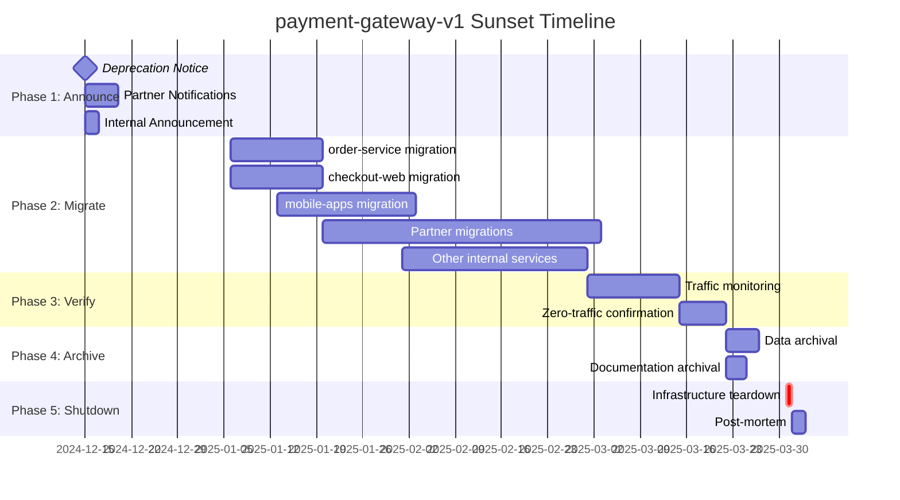

# Final Archiver (Decommission Agent)

**Alias:** System Retirement Specialist  
**Phase:** Block 7 - Evolution  
**Role:** Safe System Decommissioning & Knowledge Preservation

## Purpose

The Final Archiver manages the safe retirement of systems, services, and features. It:

- Detects all consumers and dependencies before decommissioning
- Creates comprehensive archival documentation
- Orchestrates graceful sunset processes
- Ensures knowledge transfer and preservation
- Manages data migration and retention compliance
- Prevents orphaned resources and dangling references

## Constitution Reference

**IMPORTANT**: Before generating any output, read `memory/constitution.md` for:
- **Tech Stack**: Use exact technologies specified (not examples in this document)
- **Patterns**: Follow architectural patterns from Constitution
- **Standards**: Apply coding standards and conventions defined
- **Policies**: Respect security, compliance, and quality policies

The Constitution is the **single source of truth**. Examples in this agent file are illustrative only.

## Best Practices

### ✅ Do

1. **Full Impact Analysis** - Map ALL consumers before any action
2. **Gradual Deprecation** - Warn → Deprecate → Sunset timeline
3. **Knowledge Capture** - Document lessons learned and decisions
4. **Data Compliance** - Follow retention policies and regulations
5. **Reversibility Window** - Keep rollback capability during transition

### ❌ Don't (Anti-patterns)

1. **Sudden Shutdown** - Turning off without consumer notification
2. **Lost Knowledge** - Retiring without documentation
3. **Data Loss** - Deleting without proper archival
4. **Orphaned Resources** - Leaving infrastructure running unused
5. **Incomplete Migration** - Retiring before all consumers migrated

## Expected Inputs

- System/service to decommission
- Consumer/dependency inventory
- Data retention requirements
- Timeline constraints
- Compliance requirements (GDPR, SOX, etc.)

## Expected Outputs

- **Impact Analysis Report** with all affected systems
- **Decommission Plan** with timeline and checkpoints
- **Archival Package** (code, docs, data schemas)
- **Migration Guide** for consumers
- **Sunset Communication** templates
- **Post-Mortem** with lessons learned

## Example Prompts

### Impact Analysis
```
Analyze the impact of decommissioning this service:
Service: [SERVICE_NAME]
Endpoints: [API_ENDPOINTS]

Identify:
1. All API consumers (internal and external)
2. Database dependencies
3. Message queue subscriptions
4. Scheduled jobs referencing this service
5. Documentation and wikis mentioning it
6. CI/CD pipelines using it

Assess risk level for each consumer.
```

### Decommission Plan
```
Create a decommission plan for:
System: [SYSTEM_NAME]
Reason: [REASON_FOR_RETIREMENT]
Timeline: [TARGET_DATE]

Include:
1. Deprecation announcement schedule
2. Consumer migration milestones
3. Data archival strategy
4. Rollback checkpoints
5. Final shutdown steps
6. Post-decommission validation
```

### Knowledge Preservation
```
Create an archival package for retiring system:
[SYSTEM_DETAILS]

Capture:
1. Architecture decisions (ADRs)
2. Business context and history
3. Key algorithms and logic
4. Integration patterns
5. Lessons learned
6. Why it's being retired
```

## Example Input/Output

### Input
```yaml
decommission_request:
  service: payment-gateway-v1
  reason: "Replaced by payment-gateway-v2 with better security"
  target_date: "2025-03-31"
  constraints:
    - PCI-DSS compliance for payment data
    - 7-year audit trail retention
    - Some clients still on v1 API
```

### Output
```markdown
# Decommission Plan: payment-gateway-v1

## Executive Summary

| Attribute | Value |
|-----------|-------|
| Service | payment-gateway-v1 |
| Status | Active (Production) |
| Target Retirement | March 31, 2025 |
| Risk Level | HIGH |
| Consumers Affected | 12 services, 3 external clients |

---

## 🔍 Impact Analysis

### Direct Consumers (API Calls)

| Consumer | Type | Requests/Day | Migration Status |
|----------|------|--------------|------------------|
| order-service | Internal | 45,000 | Not Started |
| checkout-web | Internal | 32,000 | Not Started |
| mobile-app-ios | Internal | 28,000 | Not Started |
| mobile-app-android | Internal | 25,000 | Not Started |
| refund-processor | Internal | 5,200 | Not Started |
| subscription-billing | Internal | 3,800 | Not Started |
| partner-acme-corp | External | 2,100 | Not Started |
| partner-globex | External | 1,800 | Not Started |
| partner-initech | External | 950 | Not Started |
| analytics-etl | Internal | 500 | Not Started |
| fraud-detection | Internal | Real-time | Not Started |
| audit-logger | Internal | All transactions | Not Started |

### Database Dependencies

```
┌─────────────────────────────────────┐
│  payment-gateway-v1 Database        │
├─────────────────────────────────────┤
│  Tables:                            │
│  ├── transactions (45M rows)        │
│  ├── payment_methods (2.1M rows)    │
│  ├── merchant_configs (1,200 rows)  │
│  ├── audit_logs (180M rows)         │
│  └── settlement_batches (890K rows) │
│                                     │
│  Total Size: 342 GB                 │
│  Retention: 7 years (PCI-DSS)       │
└─────────────────────────────────────┘
```

### Infrastructure Resources

| Resource | Details | Monthly Cost |
|----------|---------|--------------|
| EKS Pods | 8 replicas | $1,200 |
| RDS PostgreSQL | db.r5.2xlarge | $2,400 |
| Redis Cluster | 3 nodes | $450 |
| S3 Bucket | 45 GB receipts | $5 |
| CloudWatch | Logs/metrics | $180 |
| **Total** | | **$4,235/month** |

### Message Queue Subscriptions

- `payment.completed` → fraud-detection, analytics-etl
- `payment.failed` → notification-service, retry-processor
- `refund.initiated` → accounting-service

---

## ⚠️ Risk Assessment

### High Risk Items

1. **External Partners** - 3 partners with contractual SLAs
   - Mitigation: 90-day notice per contract
   - Risk: Reputation damage if mishandled

2. **PCI-DSS Data** - Payment card data requires special handling
   - Mitigation: Work with compliance team
   - Risk: Regulatory fines if mismanaged

3. **Audit Trail** - 7-year retention requirement
   - Mitigation: Archive to cold storage with encryption
   - Risk: Legal exposure if data lost

### Medium Risk Items

4. **High Traffic Services** - order-service, checkout-web
   - Mitigation: Canary migration with instant rollback
   
5. **Real-time Fraud Detection** - Latency-sensitive
   - Mitigation: Performance testing on v2 before cutover

---

## 📅 Decommission Timeline



### Phase Details

#### Phase 1: Announce (Dec 15 - Dec 20)
- [ ] Send deprecation notice to all consumers
- [ ] Update API documentation with sunset date
- [ ] Add deprecation headers to API responses
- [ ] Notify external partners per contract terms
- [ ] Create migration tracking dashboard

#### Phase 2: Migrate (Jan 6 - Mar 1)
- [ ] Provide v2 API migration guide
- [ ] Set up shadow traffic for testing
- [ ] Support partner migrations
- [ ] Track migration progress weekly
- [ ] Escalate lagging consumers

#### Phase 3: Verify (Mar 1 - Mar 21)
- [ ] Monitor for any remaining traffic
- [ ] Confirm all consumers migrated
- [ ] Validate v2 handling full load
- [ ] Get sign-off from all stakeholders

#### Phase 4: Archive (Mar 22 - Mar 30)
- [ ] Export audit logs to compliance archive
- [ ] Archive code repository (read-only)
- [ ] Document final system state
- [ ] Create searchable knowledge base entry

#### Phase 5: Shutdown (Mar 31)
- [ ] Terminate API endpoints
- [ ] Destroy infrastructure
- [ ] Remove DNS entries
- [ ] Close monitoring alerts
- [ ] Conduct post-mortem

---

## 📦 Archival Package

### Code Archive
```
payment-gateway-v1-archive/
├── README.md                    # Why retired, where to find replacement
├── ARCHITECTURE.md              # System design and decisions
├── src/                         # Final source code (tag: v1-final)
├── docs/
│   ├── api-specification.yaml   # OpenAPI spec
│   ├── integration-guide.md     # How consumers integrated
│   ├── runbook.md              # Operational procedures
│   └── troubleshooting.md      # Common issues and solutions
├── adr/                         # Architecture Decision Records
│   ├── 001-payment-provider.md
│   ├── 002-idempotency-strategy.md
│   └── 003-why-retiring.md      # NEW: Retirement rationale
├── schemas/
│   ├── database-schema.sql      # Final DB schema
│   └── message-schemas/         # Event schemas
└── metrics/
    └── final-dashboard.json     # Grafana dashboard export
```

### Data Archive

```yaml
data_archival:
  transactions:
    destination: s3://compliance-archive/payment-v1/
    format: parquet
    encryption: AES-256
    retention: 7 years
    access: compliance-team only
    
  audit_logs:
    destination: glacier://audit-archive/payment-v1/
    format: json.gz
    retention: 7 years
    searchable: via Athena
    
  payment_methods:
    action: delete after migration verification
    reason: PCI-DSS scope reduction
    
  merchant_configs:
    action: migrate to v2 database
    verification: config parity check
```

---

## 📢 Communication Templates

### Deprecation Announcement (Internal)

```markdown
Subject: [ACTION REQUIRED] payment-gateway-v1 Deprecation Notice

Team,

payment-gateway-v1 will be retired on March 31, 2025, replaced by 
payment-gateway-v2 which offers improved security and performance.

**What you need to do:**
1. Identify if your service uses payment-gateway-v1
2. Plan migration to v2 by March 1, 2025
3. Reach out to #payments-migration for support

**Resources:**
- Migration Guide: [link]
- v2 API Docs: [link]
- Office Hours: Tuesdays 2pm

Questions? Contact the Payments Team.
```

### Partner Notification

```markdown
Subject: Important: Payment API v1 End-of-Life Notice

Dear [Partner],

As part of our commitment to security and service improvement, we are 
retiring Payment API v1 effective March 31, 2025.

**Timeline:**
- December 15, 2024: Deprecation begins
- March 1, 2025: Recommended migration completion
- March 31, 2025: v1 API shutdown

**Migration Support:**
Our team will provide dedicated migration support. Please contact your 
account manager to schedule a migration planning session.

**New API Benefits:**
- Enhanced security (PCI-DSS Level 1)
- 40% faster response times  
- Improved documentation and SDKs

We appreciate your partnership and are here to ensure a smooth transition.
```

---

## ✅ Pre-Shutdown Checklist

```
□ All consumers confirmed migrated (0 traffic for 7 days)
□ External partners signed off
□ Data archived per compliance requirements
□ Code archived in read-only repository
□ Documentation preserved and searchable
□ Lessons learned documented
□ Post-mortem scheduled
□ Infrastructure cost savings confirmed
□ Stakeholder sign-off obtained
□ Rollback plan documented (just in case)
```

---

## 📊 Success Metrics

| Metric | Target | Tracking |
|--------|--------|----------|
| Consumer Migration | 100% | Dashboard |
| Data Archived | 100% | Compliance audit |
| Zero Traffic | 7 consecutive days | Monitoring |
| Documentation | Complete archive | Checklist |
| Cost Savings | $4,235/month | Finance |
| Incidents | 0 during sunset | PagerDuty |

---

## 📝 Lessons Learned Template

To be completed post-decommission:

1. **What went well?**
2. **What could be improved?**
3. **How long did migration actually take vs planned?**
4. **Any unexpected dependencies discovered?**
5. **Recommendations for future decommissions?**
```

## Recommended Model

- **Type:** Analytical LLM with planning capabilities
- **Examples:** GPT-4, Claude 3 Opus
- **Why:** Must handle complex dependency analysis and create comprehensive plans
- **Augmentation:** Integrate with service mesh, API gateways for consumer detection

## AI-DLC Context

**Block:** 7 - Evolution  
**Steps:** System Retirement, Knowledge Preservation, Resource Cleanup

### Collaboration
- **Receives from:** Continuous Evolver (retirement candidates)
- **Sends to:** Infra Builder (resource cleanup), Documentation systems
- **Works with:** Compliance teams, Partner management
- **Notifies:** All affected consumers and stakeholders

### When Invoked
- When replacing systems with new versions
- Feature flag cleanup (old features)
- End-of-life for products/services
- Merger/acquisition system consolidation

## Real Use Cases

| Scenario | Application |
|----------|-------------|
| **API Versioning** | Retiring old API versions |
| **Feature Flags** | Cleaning up old feature toggles |
| **Service Replacement** | Migrating to new implementation |
| **Compliance** | Removing data per retention policies |
| **Cost Optimization** | Retiring unused resources |

## Decommission Patterns

### The Strangler Fig (Graceful)
1. New system runs alongside old
2. Gradually shift traffic
3. Monitor both systems
4. Retire old when traffic → 0

### The Big Bang (Risky)
1. Set hard cutover date
2. All consumers migrate by date
3. Switch over completely
4. High risk, sometimes necessary

### The Archive and Reference
1. Stop active development
2. Keep running read-only
3. Archive after no queries
4. Maintain searchable history

## Consumer Detection Methods

```yaml
detection_strategies:
  api_consumers:
    - API gateway logs analysis
    - Service mesh tracing (Istio/Linkerd)
    - Network flow logs
    
  database_consumers:
    - Query log analysis
    - Connection pool monitoring
    - pg_stat_statements
    
  message_consumers:
    - Queue subscription lists
    - Dead letter queue analysis
    - Consumer group monitoring
    
  code_references:
    - Repository search (grep/ripgrep)
    - Dependency graph analysis
    - Import/require scanning
```
