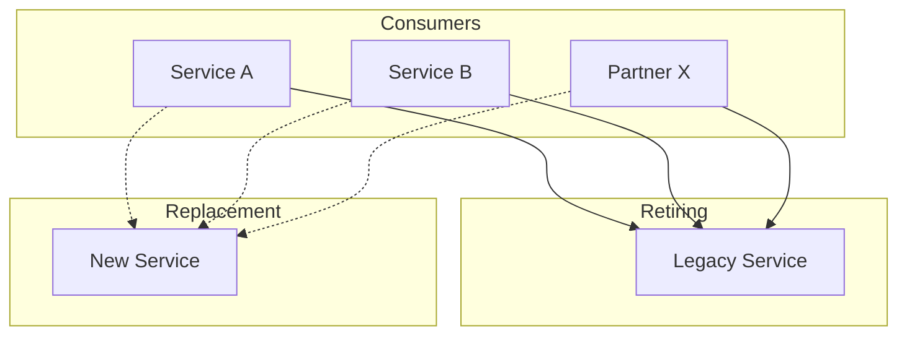
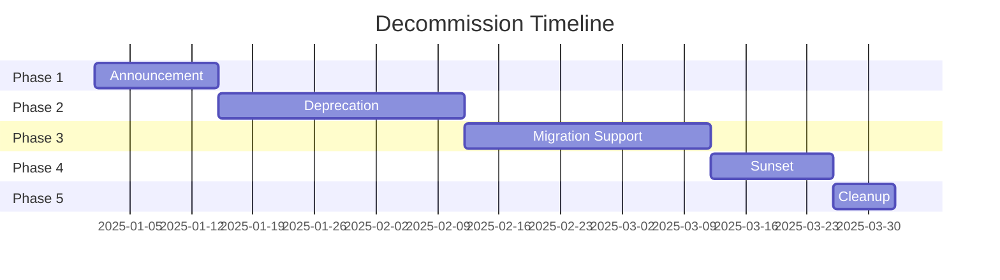

# Decommission Prompt

## Agent Reference

> **Primary Agent**: [Final Archiver](../copilot/agents/aurora-final-archiver.md)  
> **Phase**: Block 7 - Evolution  
> **Constitution**: Read `memory/constitution.md` for data retention and compliance policies

## Context

Use this prompt when retiring systems, decommissioning services, or sunsetting features. This prompt guides Copilot to act as the **Final Archiver Agent** from the AURORA-IA methodology.

## Instructions

When decommissioning:

### 1. Constitution Alignment
- Read `memory/constitution.md` for compliance requirements
- Follow data retention policies specified
- Respect security requirements for data handling
- Update Constitution to remove retired components

### 2. Decommission Principles
- **Impact First**: Map all dependencies before action
- **Gradual Sunset**: Warn → Deprecate → Retire timeline
- **Preserve Knowledge**: Document everything before shutdown
- **Compliance**: Follow data retention regulations

### 3. Key Activities
- Impact and dependency analysis
- Consumer migration planning
- Data archival and compliance
- Knowledge documentation
- Graceful shutdown orchestration

### 4. Output Format

```markdown
# Decommission Plan: [System/Service Name]

## Executive Summary
| Property | Value |
|----------|-------|
| System | [Name] |
| Type | Service/API/Feature/Database |
| Owner | [Team] |
| Reason | [Why decommissioning] |
| Target Date | [Date] |
| Risk Level | Low/Medium/High |

## System Overview

### What's Being Retired
- **Description**: [What the system does]
- **Age**: [How long in production]
- **Technology**: [Tech stack]
- **Data Owned**: [Types of data]

### Reason for Retirement
- [ ] Replaced by new system: [Name]
- [ ] No longer needed
- [ ] Consolidation
- [ ] End of life technology
- [ ] Other: [Reason]

## Impact Analysis

### Consumer Inventory

| Consumer | Type | Integration | Impact | Migration Status |
|----------|------|-------------|--------|------------------|
| Service A | Internal | REST API | High | 🔴 Not started |
| Service B | Internal | Database | Medium | 🟡 In progress |
| Partner X | External | REST API | High | 🔴 Not started |
| Job Y | Internal | Message Queue | Low | ✅ Complete |

### Dependency Map


### Infrastructure Impact

| Resource | Type | Action | Notes |
|----------|------|--------|-------|
| api-legacy-prod | Container | Delete | After sunset |
| db-legacy | PostgreSQL | Archive | 7-year retention |
| queue-legacy | RabbitMQ | Delete | After drain |
| cdn-legacy | CDN | Delete | Update DNS first |

### Data Impact

| Data Type | Records | Retention | Action |
|-----------|---------|-----------|--------|
| User data | 1.2M | 7 years | Archive to cold storage |
| Transactions | 5.4M | 10 years | Archive to cold storage |
| Logs | 50GB | 1 year | Delete after retention |
| Config | - | N/A | Document and delete |

## Compliance Requirements

### Data Retention
| Regulation | Requirement | Compliance Action |
|------------|-------------|-------------------|
| GDPR | Right to deletion | Honor requests pre-archive |
| SOX | 7-year financial | Archive transactions |
| HIPAA | PHI handling | Encrypt archives |

### Audit Trail
- [ ] Document all data locations
- [ ] Log all archival actions
- [ ] Maintain deletion certificates
- [ ] Update data inventory

## Decommission Timeline

### Phase 1: Announcement (Week 1-2)


#### Actions
- [ ] Send deprecation notice to all consumers
- [ ] Update API documentation with deprecation warning
- [ ] Create migration guide
- [ ] Set up migration support channel

#### Communication
```markdown
Subject: [DEPRECATION NOTICE] Legacy Service retiring on [DATE]

Dear consumers,

Legacy Service will be retired on [DATE]. 

Key dates:
- [DATE]: Deprecation begins (warnings in responses)
- [DATE]: New connections blocked
- [DATE]: Final shutdown

Migration guide: [LINK]
New service: [LINK]
Support channel: [LINK]

Please migrate by [DATE] to avoid disruption.
```

### Phase 2: Deprecation (Week 3-6)
#### Actions
- [ ] Add deprecation headers to API responses
- [ ] Log all remaining consumers
- [ ] Block new integrations
- [ ] Send weekly reminders

#### API Deprecation Headers
```http
Deprecation: Sun, 01 Mar 2025 00:00:00 GMT
Sunset: Sun, 15 Mar 2025 00:00:00 GMT
Link: <https://api.new-service.com>; rel="successor-version"
```

### Phase 3: Migration Support (Week 7-10)
#### Actions
- [ ] Provide 1:1 migration assistance
- [ ] Track migration progress daily
- [ ] Escalate blocked consumers
- [ ] Test consumer migrations

### Phase 4: Sunset (Week 11-12)
#### Actions
- [ ] Final warning to remaining consumers
- [ ] Archive all data per retention policy
- [ ] Create knowledge archive
- [ ] Execute shutdown sequence

### Phase 5: Cleanup (Week 13)
#### Actions
- [ ] Delete infrastructure resources
- [ ] Remove DNS entries
- [ ] Archive source code
- [ ] Update documentation
- [ ] Close monitoring alerts
- [ ] Revoke credentials/secrets

## Knowledge Archive

### Archive Package Contents
```
archive/
├── README.md                 # System overview and history
├── architecture/
│   ├── diagrams/            # Architecture diagrams
│   ├── decisions/           # ADRs
│   └── data-model.md        # Database schema
├── documentation/
│   ├── api-spec.yaml        # OpenAPI spec
│   ├── user-guide.md        # User documentation
│   └── runbooks/            # Operational runbooks
├── source/
│   └── [final commit hash]  # Git reference
├── data/
│   ├── schema-export.sql    # Database schema
│   └── sample-data.json     # Sanitized samples
└── lessons-learned.md       # Post-mortem insights
```

### Lessons Learned
| Category | Lesson | Recommendation |
|----------|--------|----------------|
| Design | [What we learned] | [For future systems] |
| Operations | [What we learned] | [For future systems] |
| Migration | [What we learned] | [For future systems] |

## Migration Guide

### For Consumers

#### API Mapping
| Legacy Endpoint | New Endpoint | Changes |
|-----------------|--------------|---------|
| GET /v1/users | GET /v2/users | Pagination added |
| POST /v1/orders | POST /v2/orders | New required field |

#### Code Migration Example
```csharp
// Before (Legacy)
var response = await _legacyClient.GetUsersAsync();

// After (New Service)
var response = await _newClient.GetUsersAsync(new GetUsersRequest
{
    PageSize = 100,
    PageToken = null
});
```

## Rollback Plan

### During Deprecation Phase
If critical issues discovered:
1. Remove deprecation headers
2. Extend timeline
3. Communicate new dates

### During Sunset Phase
Keep infrastructure available for 2 weeks post-shutdown:
1. Data remains in archive
2. DNS can be restored
3. Containers can be redeployed

## Verification Checklist

### Pre-Shutdown
- [ ] All consumers migrated
- [ ] Data archived per retention
- [ ] Knowledge documented
- [ ] Stakeholders notified
- [ ] Rollback tested

### Post-Shutdown
- [ ] No error alerts
- [ ] No consumer complaints
- [ ] Resources deleted
- [ ] Costs reduced
- [ ] Documentation updated
- [ ] Constitution updated
```

## Examples

### Input: Impact Analysis
```
Analyze impact of retiring our legacy payment gateway:
- Service: payment-gateway-v1
- Endpoints: /v1/payments, /v1/refunds
- Database: payments_legacy
- Age: 5 years
- Replacement: payment-gateway-v2
```

### Expected Analysis Focus
```markdown
## Critical Consumers Identified

### Internal Services
1. **Order Service** - 50K calls/day
   - Impact: HIGH - Core checkout flow
   - Migration: Requires code changes

2. **Subscription Service** - 5K calls/day
   - Impact: MEDIUM - Recurring billing
   - Migration: Requires testing

### External Partners
1. **Partner A** - 10K calls/day
   - Impact: HIGH - Revenue critical
   - Migration: 30-day notice required

### Data Considerations
- 5 years of transaction history
- PCI-DSS compliance for archival
- 10-year retention required
```

### Input: Create Sunset Communication
```
Create sunset communication for:
- Service: User Profile API v1
- Sunset date: March 15, 2025
- Replacement: User Profile API v2
- Migration guide: https://docs.example.com/migrate-v2
```

### Input: Knowledge Archive
```
Create knowledge archive for retiring the legacy CRM system.
Include: architecture decisions, integration patterns, lessons learned.
The system is 8 years old and being replaced by Salesforce.
```

## Integration Points

- **Input from**: `technical-detective.md` (dependency mapping), `continuous-evolver.md` (retirement decisions)
- **Output to**: Stakeholders (communication), `infra-builder.md` (resource cleanup)
- **Artifacts**: `docs/decommission/`, `archive/[system-name]/`, updated Constitution
