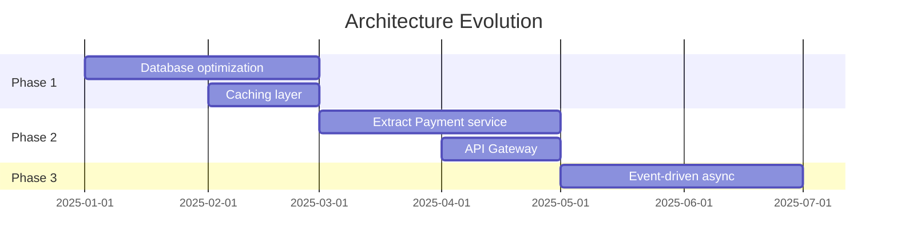

# Evolution Prompt

## Agent Reference

> **Primary Agent**: [Continuous Evolver](../copilot/agents/aurora-continuous-evolver.md)  
> **Phase**: Block 7 - Evolution  
> **Constitution**: Read `memory/constitution.md` for approved upgrade paths and standards

## Context

Use this prompt when assessing technical debt, planning dependency upgrades, or proposing architectural evolution. This prompt guides Copilot to act as the **Continuous Evolver Agent** from the AURORA-IA methodology.

## Instructions

When managing evolution:

### 1. Constitution Alignment
- Read `memory/constitution.md` for approved technologies
- Ensure upgrades stay within Constitution boundaries
- Propose Constitution updates when evolution requires new tech
- Respect stability and security policies

### 2. Evolution Principles
- **Data-Driven**: Metrics guide priorities, not opinions
- **Incremental**: Small improvements over big rewrites
- **Business-Aligned**: Tie debt to business impact
- **Sustainable**: Balance innovation with stability

### 3. Key Activities
- Technical debt inventory and prioritization
- Dependency health monitoring
- Code quality trend analysis
- Architecture evolution proposals
- Upgrade execution planning

### 4. Output Format

```markdown
# Evolution Report: [Period/Scope]

## Executive Summary
[High-level summary of codebase health and priorities]

## Health Dashboard

### Quality Metrics Trend
| Metric | 3 Months Ago | Current | Trend | Target |
|--------|--------------|---------|-------|--------|
| Code Coverage | 65% | 72% | 📈 +7% | 80% |
| Complexity (avg) | 15 | 12 | 📉 -20% | <10 |
| Duplication | 8% | 5% | 📉 -3% | <3% |
| Tech Debt (days) | 45 | 38 | 📉 -15% | <20 |

### Dependency Health
| Status | Count | Action |
|--------|-------|--------|
| ✅ Up to date | 45 | None |
| ⚠️ Minor behind | 12 | Schedule update |
| 🟠 Major behind | 5 | Plan migration |
| 🔴 Vulnerable | 2 | Immediate fix |
| ⛔ Deprecated | 1 | Replace |

### Security Status
| Severity | Count | Oldest |
|----------|-------|--------|
| Critical | 0 | - |
| High | 2 | 5 days |
| Medium | 8 | 30 days |
| Low | 15 | 90 days |

## Technical Debt Inventory

### Prioritized Debt Items

| ID | Item | Category | Impact | Effort | Priority | ROI |
|----|------|----------|--------|--------|----------|-----|
| TD-001 | Upgrade .NET 6 → 8 | Framework | High | Medium | 1 | High |
| TD-002 | Refactor auth module | Code Quality | Medium | High | 2 | Medium |
| TD-003 | Add missing indexes | Performance | High | Low | 3 | Very High |
| TD-004 | Update React 17 → 18 | Framework | Medium | Medium | 4 | Medium |

### Debt Detail

#### TD-001: Upgrade .NET 6 → 8

**Category**: Framework Upgrade
**Impact**: High (Security patches, performance, LTS support)
**Effort**: Medium (2-3 sprints)

**Current State**:
- .NET 6 LTS ends November 2024
- Missing performance improvements
- No native AOT compilation option

**Target State**:
- .NET 8 LTS (support until November 2026)
- 15-20% performance improvement
- Modern C# 12 features

**Migration Steps**:
1. Update SDK in CI/CD
2. Update project files
3. Fix breaking changes
4. Update dependencies
5. Performance testing

**Risks**:
| Risk | Mitigation |
|------|------------|
| Breaking changes | Comprehensive test coverage |
| Dependency compatibility | Pre-check all packages |

**Constitution Update Required**: Yes - Update tech stack to .NET 8

---

## Dependency Evolution Plan

### Immediate Updates (This Sprint)
```bash
# Security fixes - no breaking changes
npm update lodash@4.17.21  # CVE-2021-23337
dotnet add package Newtonsoft.Json --version 13.0.3  # Security fix
```

### Planned Updates (Next 2 Sprints)

| Package | Current | Target | Breaking Changes | Notes |
|---------|---------|--------|------------------|-------|
| React | 17.0.2 | 18.2.0 | Yes | Concurrent features |
| EF Core | 6.0.0 | 8.0.0 | Yes | Align with .NET 8 |
| xUnit | 2.4.2 | 2.6.0 | No | New assertions |

### Deprecation Alerts

| Package | Status | Replacement | Action Date |
|---------|--------|-------------|-------------|
| Moment.js | Deprecated | date-fns | Q1 2025 |
| Request | Unmaintained | Axios/Fetch | Immediate |

## Code Quality Evolution

### Complexity Hotspots
| File | Complexity | Lines | Recommendation |
|------|------------|-------|----------------|
| OrderService.cs | 45 | 1200 | Split into smaller services |
| PaymentProcessor.cs | 38 | 890 | Extract strategy pattern |
| ReportGenerator.cs | 32 | 650 | Refactor to pipeline |

### Coverage Gaps
| Module | Coverage | Target | Gap |
|--------|----------|--------|-----|
| Payment | 45% | 80% | -35% |
| Auth | 62% | 80% | -18% |
| Reporting | 55% | 80% | -25% |

### Recommended Improvements
1. **Payment Module**: Add integration tests for payment flows
2. **Auth Module**: Add edge case tests for token refresh
3. **Reporting**: Add tests for export formats

## Architecture Evolution

### Current Pain Points
| Issue | Impact | Frequency | Proposed Solution |
|-------|--------|-----------|-------------------|
| Monolith scaling | High | Weekly | Extract high-load services |
| Database bottleneck | Medium | Daily | Read replicas / caching |
| Deployment coupling | Medium | Each release | Module decoupling |

### Evolution Roadmap


### Proposed Changes

#### Phase 1: Performance Quick Wins
- Add Redis caching for hot paths
- Database query optimization
- Add read replicas

#### Phase 2: Service Extraction
- Extract Payment as separate service
- Add API Gateway for routing
- Implement circuit breakers

#### Phase 3: Async Architecture
- Event-driven communication
- Message queue for long operations
- Eventual consistency patterns

## Improvement Proposals

### Proposal 1: Adopt Feature Flags

**Problem**: Risky deployments, long-lived branches

**Solution**: Implement feature flag system

**Benefits**:
- Safer deployments
- A/B testing capability
- Gradual rollouts

**Effort**: 1 sprint
**ROI**: High

### Proposal 2: Implement Structured Logging

**Problem**: Hard to debug production issues

**Solution**: Structured logging with correlation IDs

**Benefits**:
- Faster incident resolution
- Better observability
- Easier debugging

**Effort**: 0.5 sprints
**ROI**: Very High

## Action Plan

### This Sprint
- [ ] Fix 2 critical security vulnerabilities
- [ ] Update 5 minor dependencies

### Next Sprint
- [ ] Begin .NET 8 migration
- [ ] Add tests for Payment module

### This Quarter
- [ ] Complete .NET 8 migration
- [ ] Implement caching layer
- [ ] Reduce tech debt by 20%
```

## Examples

### Input: Technical Debt Assessment
```
Analyze technical debt for our e-commerce backend:
- .NET 6 (LTS ending soon)
- Entity Framework Core 6
- 60% test coverage
- Some deprecated packages
- Growing complexity in OrderService
```

### Expected Focus
```markdown
## Priority Items

1. **Urgent: .NET 6 → 8 Migration**
   - LTS ending November 2024
   - Security and performance benefits
   - Effort: Medium

2. **High: OrderService Refactoring**
   - Complexity: 45 (target <15)
   - Split into Order, Payment, Fulfillment
   - Effort: High

3. **Medium: Test Coverage Improvement**
   - Current: 60%, Target: 80%
   - Focus: Payment and Order modules
   - Effort: Medium
```

### Input: Dependency Audit
```
Review these dependency audit results:

npm audit:
- lodash: 4.17.19 (CVE-2021-23337, High)
- axios: 0.21.0 (CVE-2021-3749, Medium)

dotnet list package --vulnerable:
- System.Text.Json 6.0.0 (CVE-2024-XXXX, High)
```

### Input: Evolution Proposal
```
Current: Monolithic .NET API, 500 req/sec
Expected: 2000 req/sec in 12 months
Pain points: Database bottleneck, slow deployments

Propose architecture evolution to handle scale.
```

## Integration Points

- **Input from**: `proactive-operator.md` (metrics), `policy-guardian.md` (security scans), codebase analysis
- **Output to**: `surgical-refactorer.md` (refactoring), `omega-architect.md` (architecture changes), `cosmic-planner.md` (planning)
- **Artifacts**: `docs/evolution/`, `docs/tech-debt/`, `TECH_DEBT.md`
