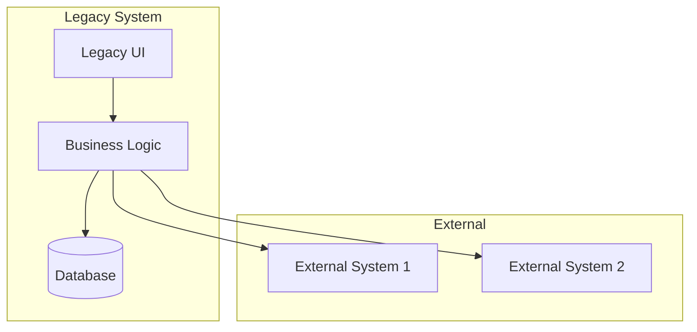
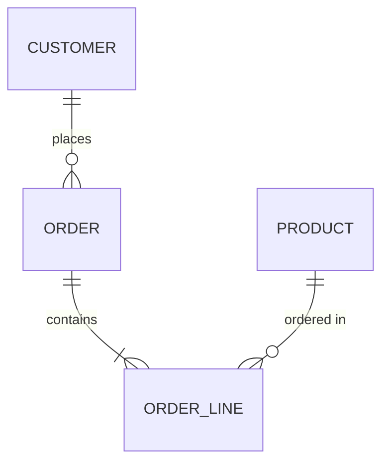
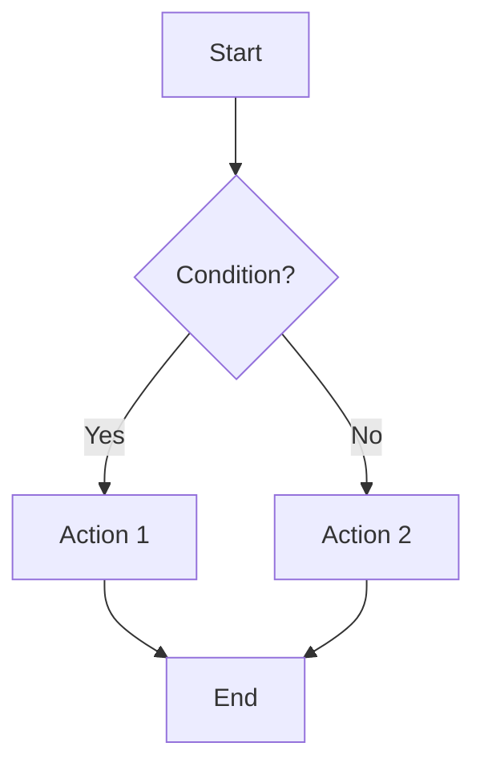

# Legacy Analysis Prompt

## Agent Reference

> **Primary Agent**: [Legacy Archaeologist](../copilot/agents/aurora-legacy-archaeologist.md)  
> **Phase**: Block 2 - Discovery  
> **Constitution**: Always read `memory/constitution.md` for target modernization stack

## Context

Use this prompt when analyzing legacy systems, extracting hidden business rules, and documenting existing behavior for modernization. This prompt guides Copilot to act as the **Legacy Archaeologist Agent** from the AURORA-IA methodology.

## Instructions

When performing legacy analysis:

### 1. Preparation
- Read `memory/constitution.md` for target architecture
- Gather all available legacy artifacts (code, docs, schemas)
- Identify subject matter experts for validation
- Understand the modernization goals

### 2. Analysis Approach
- **Layer by Layer**: Start from UI → Business Logic → Data
- **Evidence-Based**: Every finding must reference specific code/artifact
- **Question Assumptions**: Mark uncertain behaviors for SME validation
- **Preserve Knowledge**: Document even seemingly minor details

### 3. Key Extraction Areas
- Business rules hidden in code
- Data models and relationships
- Integration patterns and dependencies
- Edge cases and exception handling
- Undocumented workflows

### 4. Output Format

```markdown
# Legacy System Analysis: [System Name]

## Executive Summary
[Overview of the legacy system and key findings]

## System Overview

### Technology Stack
| Layer | Technology | Version | Status |
|-------|------------|---------|--------|
| UI | [Tech] | [Ver] | EOL/Active |
| Business | [Tech] | [Ver] | EOL/Active |
| Data | [Tech] | [Ver] | EOL/Active |

### System Boundaries


## Business Rules Extraction

### Rule Catalog

| ID | Rule Name | Description | Source | Confidence |
|----|-----------|-------------|--------|------------|
| BR-001 | [Name] | [Description] | [File:Line] | High/Medium/Low |
| BR-002 | [Name] | [Description] | [File:Line] | High/Medium/Low |

### Rule Details

#### BR-001: [Rule Name]
**Source**: `path/to/file.cs:123-145`
**Confidence**: High

**Description**:
[Detailed explanation of the business rule]

**Code Evidence**:
```csharp
// Original code implementing this rule
if (condition) {
    // business logic
}
```

**Business Intent** (inferred):
[Why this rule likely exists]

**Questions for SME**:
- [ ] Is this behavior intentional?
- [ ] Are there exceptions not in code?

---

## Data Model

### Entity-Relationship Diagram


### Entity Catalog

| Entity | Table Name | Key Fields | Business Purpose |
|--------|------------|------------|------------------|
| Customer | tbl_Customers | CustomerID | Customer master data |
| Order | tbl_Orders | OrderID | Sales transactions |

### Data Quality Observations
| Issue | Table | Impact | Remediation |
|-------|-------|--------|-------------|
| Nullable FK | tbl_Orders | Orphan records | Data cleanup needed |
| No constraints | tbl_Products | Duplicate SKUs | Add unique constraint |

## Process Flows

### [Process Name] Workflow


**Process Description**:
[Detailed explanation]

**Hidden Behaviors**:
- [Behavior 1]: Found in [location]
- [Behavior 2]: Found in [location]

## Integration Points

| System | Protocol | Direction | Purpose | Data Exchanged |
|--------|----------|-----------|---------|----------------|
| [System] | [REST/SOAP/File] | In/Out/Both | [Purpose] | [Data types] |

## Anomalies & Uncertainties

### Potential Bugs Treated as Features
| Location | Behavior | Assessment | SME Validation Needed |
|----------|----------|------------|----------------------|
| [File:Line] | [Description] | Likely bug | Yes |

### Undocumented Behaviors
| Behavior | Location | Impact | Risk if Changed |
|----------|----------|--------|-----------------|
| [Behavior] | [Location] | [Impact] | High/Medium/Low |

## Migration Mapping

### Feature Mapping: Legacy → Modern

| Legacy Component | Modern Equivalent | Migration Complexity | Notes |
|-----------------|-------------------|---------------------|-------|
| [Legacy] | [Modern per Constitution] | High/Medium/Low | [Notes] |

### Data Migration Considerations
| Legacy Table | Target Structure | Transformation | Risks |
|--------------|------------------|----------------|-------|
| [Table] | [Target] | [Transform] | [Risks] |

## SME Validation Checklist

- [ ] BR-001: Discount rule - intentional?
- [ ] BR-002: Special customer handling - still needed?
- [ ] Data: Orphan records - cleanup or migrate?
- [ ] Process: Manual step X - automate or keep?

## Recommendations

### Preserve (Critical Business Logic)
1. [Rule/Logic to preserve exactly]

### Transform (Modernize Pattern)
1. [Logic to rewrite in modern patterns]

### Eliminate (Technical Debt)
1. [Logic that can be removed]
```

## Examples

### Input: Legacy VB6 Code
```vb
' Calculate shipping cost
Function CalcShip(weight, zone, custType)
    Dim cost
    cost = weight * 0.5  ' Base rate
    
    ' Zone multiplier
    Select Case zone
        Case 1: cost = cost * 1.0
        Case 2: cost = cost * 1.5
        Case 3: cost = cost * 2.0
        Case Else: cost = cost * 3.0  ' Unknown = highest
    End Select
    
    ' VIP customers get free shipping over $100
    If custType = "VIP" And cost > 100 Then
        cost = 0
    End If
    
    CalcShip = cost
End Function
```

### Expected Extraction
```markdown
## Business Rules Extraction

### BR-001: Base Shipping Rate
**Source**: `shipping.bas:CalcShip:3`
**Rule**: Shipping cost = weight × $0.50

### BR-002: Zone Multiplier
**Source**: `shipping.bas:CalcShip:6-11`
**Rule**: 
- Zone 1: 1.0× (local)
- Zone 2: 1.5× (regional)
- Zone 3: 2.0× (national)
- Unknown: 3.0× (international/default)

**Question**: Is "Unknown = highest" intentional safety or bug?

### BR-003: VIP Free Shipping
**Source**: `shipping.bas:CalcShip:14-16`
**Rule**: VIP customers get free shipping when cost > $100

**Question**: Is threshold $100 still correct? Seems arbitrary.
```

## Integration Points

- **Input from**: `technical-detective.md` (system overview), legacy SMEs
- **Output to**: `omega-architect.md` (migration architecture), `ddd-master.md` (domain modeling)
- **Artifacts**: `docs/legacy/analysis-report.md`, `docs/legacy/business-rules.md`, `docs/legacy/migration-map.md`
