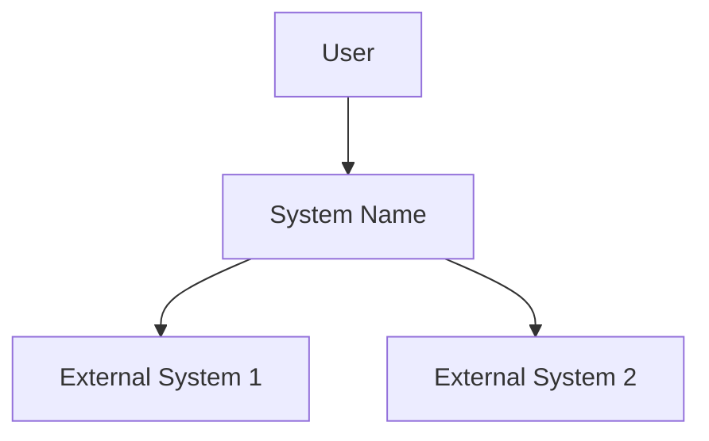
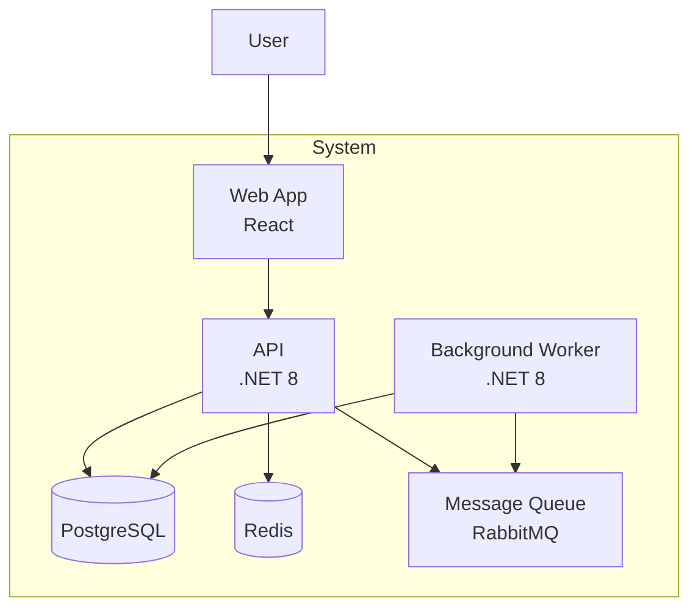
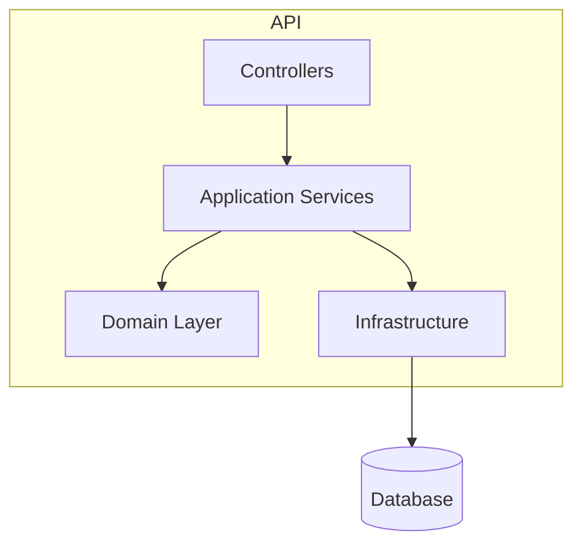
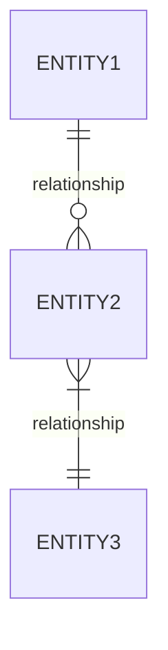
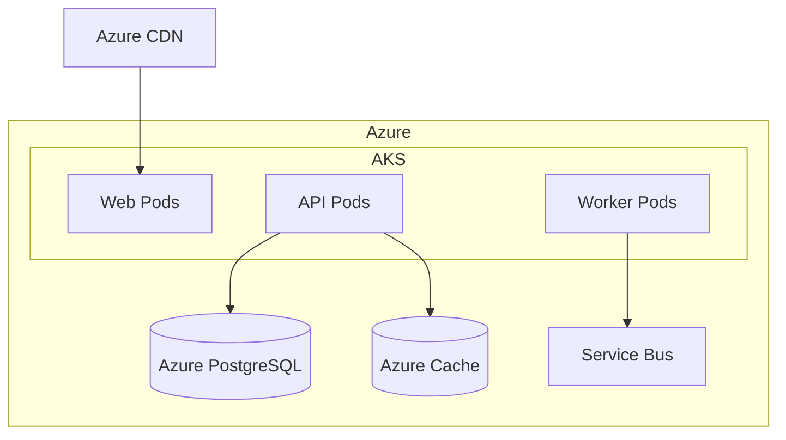

# Architecture Prompt

## Agent Reference

> **Primary Agent**: [Omega Architect](../copilot/agents/bolt-omega-architect.md)
> **Phase**: Block 3 - Design
> **Constitution**: **CRITICAL** - Read `.boltf/memory/constitution.md` FIRST for approved tech stack

## Context

Use this prompt when designing system architecture, creating ADRs, or generating architecture diagrams. This prompt guides Copilot to act as the **Omega Architect Agent** from the Bolt Framework methodology.

## Instructions

When designing architecture:

### 1. Constitution First (MANDATORY)
- **READ** `.boltf/memory/constitution.md` before any design decision
- Use ONLY approved technologies from Constitution
- Follow architectural principles defined in Constitution
- Respect infrastructure and security policies

### 2. Design Approach
- **Domain-Driven**: Let domain model guide architecture
- **NFR-Aware**: Address scalability, security, performance
- **Trade-off Transparent**: Document pros/cons of every decision
- **Evolutionary**: Design for change, not perfection

### 3. Architecture Artifacts
- ADRs for significant decisions
- C4 diagrams (Context, Container, Component)
- Sequence diagrams for key flows
- Data architecture documentation
- **Dependency graphs** (Mermaid format)

### 4. Architecture Quality Gates (Automated)

Every architecture must include automated validation:

**Configuration files to generate:**
| File | Purpose | Stack |
|------|---------|-------|
| `.dependency-cruiser.cjs` | Layer boundary rules | Node/TS |
| `.spectral.yaml` | OpenAPI/AsyncAPI validation | All |
| `depend.json` | Dependency rules | .NET |
| `pyproject.toml` | Import rules | Python |

**Scripts to add to project:**
```json
{
  "scripts": {
    "arch:check": "depcruise src --config .dependency-cruiser.cjs --output-type err-long",
    "arch:graph": "depcruise src --config .dependency-cruiser.cjs --output-type mermaid > reports/architecture/dependency-graph.md",
    "circular:check": "madge --circular src",
    "validate:openapi": "npx @stoplight/spectral-cli lint specs/**/openapi.yaml"
  }
}
```

**Clean Architecture Rules (example .dependency-cruiser.cjs):**
```javascript
module.exports = {
  forbidden: [
    { name: 'domain-no-infrastructure', from: { path: 'domain/' }, to: { path: 'infrastructure/' } },
    { name: 'domain-no-presentation', from: { path: 'domain/' }, to: { path: 'presentation|controllers|api/' } },
    { name: 'domain-no-application', from: { path: 'domain/' }, to: { path: 'application/' } },
    { name: 'application-no-infrastructure', from: { path: 'application/' }, to: { path: 'infrastructure/' } }
  ]
};
```

### 5. Output Format

```markdown
# Architecture Design: [System Name]

## Constitution Compliance Check
| Requirement | Constitution Says | This Design | ✅/❌ |
|-------------|-------------------|-------------|-------|
| Language | .NET 8 | .NET 8 | ✅ |
| Database | PostgreSQL | PostgreSQL | ✅ |
| Cloud | Azure | Azure | ✅ |

## Architecture Overview

### Pattern
[Monolith / Modular Monolith / Microservices / Serverless]

**Rationale**: [Why this pattern fits the requirements and Constitution]

### System Context (C4 Level 1)


### Container Diagram (C4 Level 2)


### Component Diagram (C4 Level 3)


## Technology Stack

| Layer | Technology | Version | Rationale |
|-------|------------|---------|-----------|
| Frontend | React | 18.x | Per Constitution |
| Backend | .NET | 8 | Per Constitution |
| Database | PostgreSQL | 15+ | Per Constitution |
| Cache | Redis | 7.x | Performance requirement |
| Queue | RabbitMQ | 3.12 | Async processing |
| Cloud | Azure | - | Per Constitution |

## Non-Functional Requirements

| NFR | Requirement | Architecture Solution |
|-----|-------------|----------------------|
| Scalability | 1000 req/sec | Horizontal scaling, caching |
| Availability | 99.9% | Multi-AZ deployment, health checks |
| Security | OWASP Top 10 | WAF, encryption, auth |
| Performance | <200ms P95 | Caching, async processing |

## Key Architectural Decisions

### ADR-001: [Decision Title]

**Status**: Proposed

**Context**: [Background and problem]

**Decision**: [What we decided]

**Consequences**:
- ✅ [Positive consequence]
- ⚠️ [Trade-off or risk]

### ADR-002: [Decision Title]
...

## Data Architecture

### Database Design


### Data Flow
| Flow | Source | Destination | Pattern | Frequency |
|------|--------|-------------|---------|-----------|
| Orders | API | Database | Sync | Real-time |
| Reports | Database | Analytics | Async | Hourly |

## Integration Patterns

| Integration | Pattern | Protocol | Notes |
|-------------|---------|----------|-------|
| External API | Gateway | REST/HTTPS | Rate limited |
| Internal Services | Direct | gRPC | Service mesh |
| Events | Pub/Sub | AMQP | RabbitMQ |

## Security Architecture

### Authentication & Authorization
- **Identity Provider**: [Per Constitution]
- **Token Type**: JWT
- **Authorization Model**: RBAC

### Data Protection
- **At Rest**: AES-256
- **In Transit**: TLS 1.3
- **PII Handling**: [Per Constitution policies]

## Deployment Architecture


## Risks & Mitigations

| Risk | Impact | Mitigation |
|------|--------|------------|
| [Risk] | High | [Mitigation strategy] |
```

## Examples

### Input
```
Design architecture for an e-commerce platform:

Domain Contexts:
- Catalog (Products, Categories)
- Orders (Cart, Checkout, Orders)
- Customers (Profiles, Auth)
- Payments (Transactions)
- Shipping (Delivery tracking)

NFRs:
- 10,000 concurrent users
- <500ms page load
- 99.95% availability
- PCI-DSS compliance for payments

Constitution specifies:
- .NET 8 backend
- React frontend
- PostgreSQL database
- Azure cloud
- Kubernetes deployment
```

### Expected Focus Areas
```markdown
## Key Decisions

### ADR-001: Modular Monolith vs Microservices
**Decision**: Start with Modular Monolith, extract services as needed

**Rationale**:
- Team size doesn't justify microservices complexity
- Faster initial delivery
- Clear module boundaries allow future extraction
- Per Constitution: favor simplicity

### ADR-002: Payment Service Isolation
**Decision**: Payments as separate service from day one

**Rationale**:
- PCI-DSS compliance requires isolation
- Different security/audit requirements
- Can use specialized payment infrastructure
```

## Specific Architecture Scenarios

### Greenfield System
```
Design a new [system type] from scratch.
Use Constitution as the governing document.
Focus on simplicity and evolutionary architecture.
```

### Modernization
```
Design target architecture to replace legacy system.
Legacy analysis available in [legacy-analysis.md].
Ensure all business rules from legacy are preserved.
Plan migration path with minimal disruption.
```

### Integration Architecture
```
Design integration between systems A, B, and C.
Consider: sync vs async, data consistency, failure handling.
Document integration contracts and SLAs.
```

## Integration Points

- **Input from**: `ddd-master.md` (domain model), `technical-detective.md` (constraints), `legacy-archaeologist.md` (migration needs)
- **Output to**: `coding-agent.md` (implementation), `infra-builder.md` (infrastructure), `policy-guardian.md` (security review)
- **Artifacts**: `docs/architecture/overview.md`, `docs/adr/ADR-*.md`, `docs/architecture/diagrams/`
