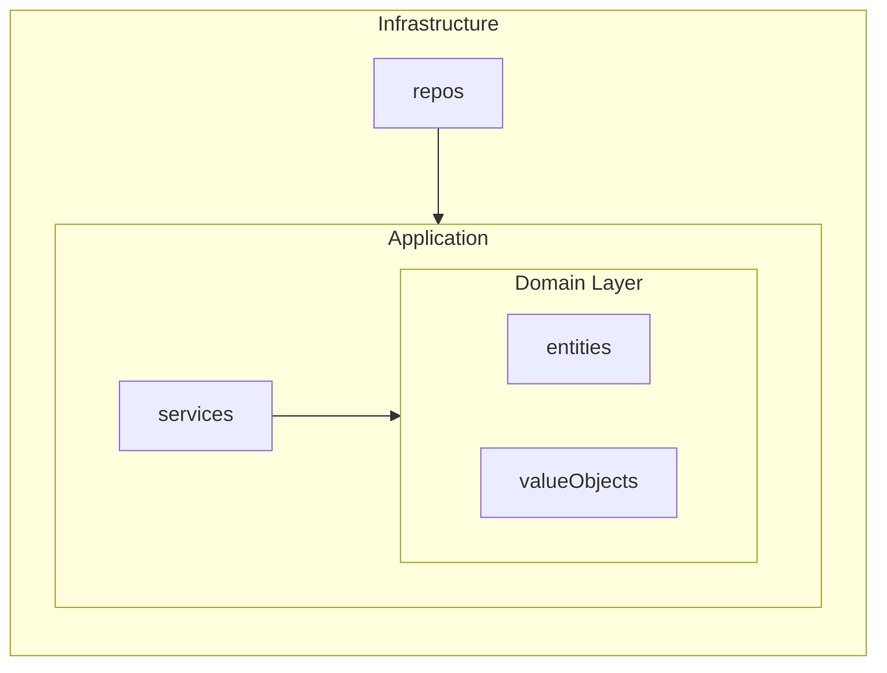

# BOLT Implementation Prompt

> **Context**: Execute a specific BOLT (micro-iteration) of 2-3 days
> **Auto-Actions**: Branch creation, task tracking, quality gates

## BOLT Branch Auto-Creation

**Pattern**: `feature/[feature-name]/bolt-[N]-[description]`

### Examples:

- `feature/calculator-modernization/bolt-1-domain`
- `feature/user-management/bolt-2-api-layer`
- `feature/payment-processing/bolt-3-persistence`

## Automatic Workflow

### 1. BOLT Branch Setup

```bash
# Get current feature branch
FEATURE_BRANCH=$(git branch --show-current)

# Validate it's a feature branch
if [[ $FEATURE_BRANCH != feature/* ]]; then
  echo "❌ Not on feature branch! Current: $FEATURE_BRANCH"
  echo "🔧 Create feature branch first: ./scripts/bash/create-new-feature.sh"
  exit 1
fi

# Create BOLT branch
BOLT_BRANCH="${FEATURE_BRANCH}/bolt-${BOLT_NUMBER}-${BOLT_DESCRIPTION}"
git checkout -b "$BOLT_BRANCH"

echo "✅ Created BOLT branch: $BOLT_BRANCH"
echo "📋 Derived from: $FEATURE_BRANCH"
```

### 2. BOLT Execution

For each BOLT implementation:

1. **Auto-create branch** using pattern above
2. **Read constitution** from `specs/[feature]/constitution.md`
3. **Read tasks** from `specs/[feature]/planning/tasks.md`
4. **Execute BOLT tasks** in order
5. **Update checkboxes** in tasks.md as completed
6. **Run quality gates** after each major task
7. **Commit incrementally** with descriptive messages

### 3. Task Tracking

Update `specs/[feature]/planning/tasks.md`:

- [ ] Task → ✅ Task (completed)
- Update progress counters
- Add implementation notes

### 4. Quality Gates (MANDATORY per BOLT)

Run after each significant implementation:

```bash
# Lint & format
npm run lint
npm run format

# Tests
npm test
npm run test:cov

# Coverage verification (must be >= 80%)
# Check coverage report in coverage/lcov-report/index.html

# Mutation testing (must be >= 70%)
npx stryker run
# Check mutation report in reports/mutation/html/index.html

# Build
npm run build
```

**Quality Gate Thresholds (from Constitution):**
| Metric | Minimum | Command |
|--------|---------|---------|
| Line Coverage | >= 80% | `npm run test:cov` |
| Branch Coverage | >= 75% | `npm run test:cov` |
| Mutation Score | >= 70% | `npx stryker run` |

### 5. Architecture Quality Gates (MANDATORY per BOLT)

Ensure Clean Architecture compliance:

```bash
# Use multi-language quality gates script
./scripts/bash/quality-gates.sh
# or PowerShell: .\scripts\powershell\Quality-Gates.ps1
```

**Node.js/TypeScript specific:**

```bash
# Validate layer dependencies (domain cannot depend on infrastructure)
npm run arch:check

# Detect circular dependencies
npm run circular:check

# Generate architecture diagram (Mermaid format - renders in GitHub/VS Code)
npm run arch:graph
# Output: reports/architecture/dependency-graph.md

# Validate API contracts
npm run validate:openapi
```

**Architecture Gate Thresholds:**
| Gate | Requirement | Tool |
|------|-------------|------|
| Layer violations | 0 | dependency-cruiser |
| Circular dependencies | 0 | madge |
| Contract validation | 0 errors | Spectral |

**Mermaid Architecture Graph:**
The `arch:graph` generates a dependency diagram that renders everywhere:



**⚠️ BOLT cannot be completed until ALL quality gates pass.**

### 6. BOLT Completion

When BOLT is complete:

```bash
# Final commit
git add .
git commit -m "feat(BOLT-${N}): complete ${BOLT_DESCRIPTION}

- All tasks completed
- Tests passing
- Quality gates green

Ready for merge to ${FEATURE_BRANCH}"

# Push BOLT branch
git push origin "$BOLT_BRANCH"

# Return to feature branch for next BOLT
git checkout "$FEATURE_BRANCH"
```

## Usage in Agents

**Bolt Implement** should:

1. **Parse user input** for BOLT number and description
2. **Auto-execute** branch creation workflow
3. **Proceed with implementation** on new BOLT branch
4. **Never ask permission** for branch creation (it's mandatory)

## Examples

### User Input:

> "Ejecuta BOLT 1 Domain Layer"

### Agent Actions:

1. ✅ Create `feature/calculator-modernization/bolt-1-domain`
2. ✅ Read constitution and tasks
3. ✅ Implement domain layer code
4. ✅ Update task checkboxes
5. ✅ Run tests and quality gates
6. ✅ Commit with BOLT completion message

### User Input:

> "Implement BOLT 2 API"

### Agent Actions:

1. ✅ Create `feature/calculator-modernization/bolt-2-api`
2. ✅ Implement API layer
3. ✅ Continue workflow...

---

_Bolt Framework Automation v1.0.0_
