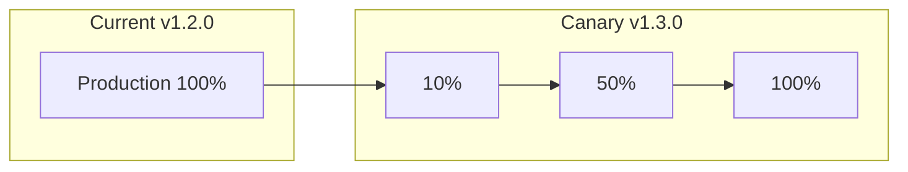

# Release Prompt

## Agent Reference

> **Primary Agent**: [Release Orchestrator](../copilot/agents/bolt-release-orchestrator.md)
> **Phase**: Block 5 - Release
> **Constitution**: Read `.boltf/memory/constitution.md` for CI/CD and deployment policies

## Context

Use this prompt when creating release pipelines, deployment configurations, or generating release notes. This prompt guides Copilot to act as the **Release Orchestrator Agent** from the Bolt Framework methodology.

## Instructions

When managing releases:

### 1. Constitution Alignment
- Read `.boltf/memory/constitution.md` for deployment policies
- Use approved CI/CD platform (GitHub Actions, Azure DevOps, etc.)
- Follow versioning strategy defined
- Respect environment promotion rules

### 2. Release Principles
- **Automate Everything**: No manual deployment steps
- **Progressive Rollouts**: Canary or blue-green strategies
- **Validate Continuously**: Health checks at each stage
- **Rollback Ready**: Always have a quick revert path

### 3. Key Artifacts
- CI/CD pipeline configurations
- Deployment manifests
- Release notes / changelogs
- Rollback procedures

### 4. Output Format

```markdown
# Release Plan: v[VERSION]

## Release Summary
| Property | Value |
|----------|-------|
| Version | [X.Y.Z] |
| Date | [Target Date] |
| Type | Major/Minor/Patch |
| Risk Level | Low/Medium/High |

## Pre-Release Checklist
- [ ] All tests passing
- [ ] Security review approved
- [ ] Performance benchmarks met
- [ ] Documentation updated
- [ ] Release notes prepared
- [ ] Rollback plan documented

## Deployment Strategy

### Strategy: [Blue-Green / Canary / Rolling]



### Rollout Schedule
| Stage | Traffic | Duration | Success Criteria |
|-------|---------|----------|------------------|
| Canary | 10% | 15 min | Error rate < 0.1% |
| Expansion | 50% | 30 min | P95 latency < 200ms |
| Full | 100% | - | All metrics green |

## Health Checks

| Endpoint | Expected | Timeout |
|----------|----------|---------|
| /health | 200 OK | 5s |
| /ready | 200 OK | 10s |
| /metrics | 200 OK | 5s |

## Rollback Plan

### Automatic Triggers
- Error rate > 1%
- P95 latency > 500ms
- Health check failures > 3

### Manual Rollback
```bash
# Kubernetes
kubectl rollout undo deployment/[app-name]

# Azure Container Apps
az containerapp revision activate --name [app] --revision [previous]
```

## Release Notes

### v[VERSION] - [DATE]

#### 🚀 New Features
- [Feature description] (#PR)

#### 🐛 Bug Fixes
- [Fix description] (#PR)

#### ⚠️ Breaking Changes
- [Breaking change] - Migration: [steps]

#### 📦 Dependencies
- Updated [package] to v[X.Y.Z]

#### 🔒 Security
- [Security fix] (CVE-XXXX-YYYY)

## Pipeline Configuration

### GitHub Actions
```yaml
name: Release

on:
  push:
    tags:
      - 'v*'

jobs:
  build:
    runs-on: ubuntu-latest
    steps:
      - uses: actions/checkout@v4

      - name: Build
        run: [build commands]

      - name: Test
        run: [test commands]

      - name: Security Scan
        run: [security scan]

  deploy-staging:
    needs: build
    environment: staging
    steps:
      - name: Deploy to Staging
        run: [deploy commands]

      - name: Health Check
        run: [health check]

  deploy-production:
    needs: deploy-staging
    environment: production
    steps:
      - name: Deploy Canary (10%)
        run: [canary deploy]

      - name: Validate Canary
        run: [validate metrics]

      - name: Full Rollout
        run: [full deploy]
```

## Post-Release

### Monitoring
- [ ] Check error rates in [monitoring tool]
- [ ] Verify key metrics in dashboard
- [ ] Monitor customer feedback channels

### Communication
- [ ] Update status page
- [ ] Notify stakeholders
- [ ] Update documentation site
```

## Examples

### Input: Generate Release Pipeline
```
Create a GitHub Actions release pipeline for:
- .NET 8 API application
- Containerized deployment
- Azure Container Apps target
- Blue-green deployment strategy
- Automatic rollback on failures
```

### Expected Pipeline Structure
```yaml
name: Release Pipeline

on:
  push:
    branches: [main]
    tags: ['v*']

env:
  REGISTRY: ghcr.io
  IMAGE_NAME: ${{ github.repository }}

jobs:
  build-and-test:
    runs-on: ubuntu-latest
    steps:
      - uses: actions/checkout@v4

      - name: Setup .NET
        uses: actions/setup-dotnet@v4
        with:
          dotnet-version: '8.0.x'

      - name: Restore
        run: dotnet restore

      - name: Build
        run: dotnet build --no-restore

      - name: Test
        run: dotnet test --no-build --verbosity normal

      - name: Build Container
        run: docker build -t ${{ env.REGISTRY }}/${{ env.IMAGE_NAME }}:${{ github.sha }} .

      - name: Push Container
        run: docker push ${{ env.REGISTRY }}/${{ env.IMAGE_NAME }}:${{ github.sha }}

  deploy-staging:
    needs: build-and-test
    runs-on: ubuntu-latest
    environment: staging
    steps:
      - name: Deploy to Staging
        uses: azure/container-apps-deploy-action@v1
        with:
          containerAppName: myapp-staging
          resourceGroup: rg-myapp
          imageToDeploy: ${{ env.REGISTRY }}/${{ env.IMAGE_NAME }}:${{ github.sha }}

      - name: Health Check
        run: |
          for i in {1..10}; do
            curl -f https://myapp-staging.azurecontainerapps.io/health && exit 0
            sleep 10
          done
          exit 1

  deploy-production:
    needs: deploy-staging
    runs-on: ubuntu-latest
    environment: production
    steps:
      - name: Deploy Blue-Green
        run: |
          # Deploy to inactive slot
          az containerapp revision copy --name myapp --resource-group rg-myapp

          # Validate new revision
          # ... health checks ...

          # Switch traffic
          az containerapp ingress traffic set --name myapp --resource-group rg-myapp \
            --revision-weight latest=100
```

### Input: Generate Changelog
```
Generate CHANGELOG entry for v2.1.0:

Commits since v2.0.0:
- abc1234 feat: Add OAuth2 support (#123)
- def5678 feat: Add rate limiting (#124)
- ghi9012 fix: Memory leak in connection pool (#125)
- jkl3456 fix: Incorrect date parsing (#126)
- mno7890 chore: Update to .NET 8 (#127)
- pqr1234 docs: Update API documentation (#128)
```

### Expected Changelog
```markdown
## [2.1.0] - 2025-12-09

### Added
- OAuth2 authentication support (#123)
- Rate limiting for API endpoints (#124)

### Fixed
- Memory leak in database connection pool (#125)
- Incorrect date parsing in EU locale (#126)

### Changed
- Upgraded to .NET 8 (#127)

### Documentation
- Updated API documentation with new endpoints (#128)
```

## Specific Release Scenarios

### Hotfix Release
```
Create emergency hotfix release process:
- Current production: v2.1.0
- Hotfix branch from: v2.1.0 tag
- Skip staging (emergency)
- Immediate production with 10% canary
- Extended monitoring period
```

### Major Version Release
```
Plan major version release with breaking changes:
- Migration guide required
- Parallel running of v1 and v2
- Deprecation notices
- Customer communication plan
```

## Integration Points

- **Input from**: `test-inspector.md` (test results), `policy-guardian.md` (security approval), `cosmic-planner.md` (release schedule)
- **Output to**: `proactive-operator.md` (monitoring), stakeholders (release notes)
- **Artifacts**: `.github/workflows/`, `CHANGELOG.md`, `docs/releases/`
