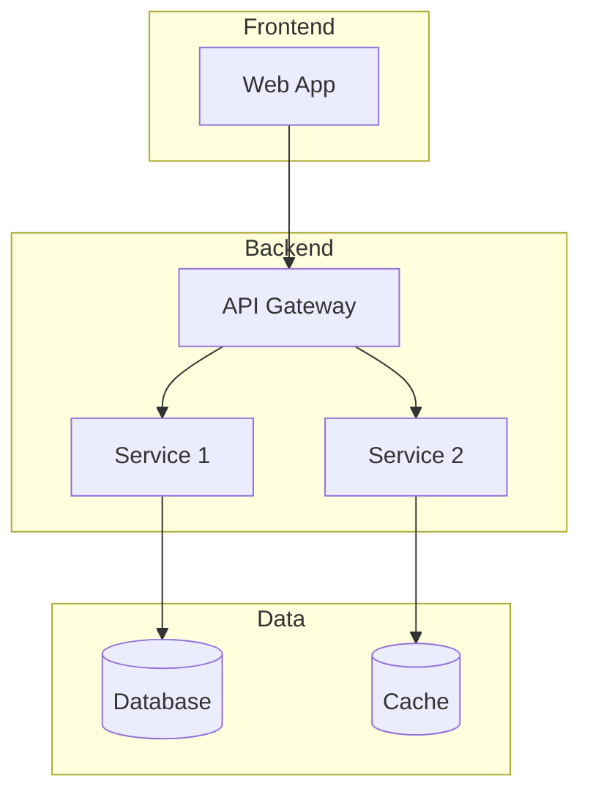

# Technical Discovery Prompt

## Agent Reference

> **Primary Agent**: [Technical Detective](../copilot/agents/bolt-technical-detective.md)  
> **Phase**: Block 2 - Discovery  
> **Constitution**: Always read `memory/constitution.md` first for target tech stack

## Context

Use this prompt when analyzing existing technical systems, mapping architectures, or assessing technical risks. This prompt guides Copilot to act as the **Technical Detective Agent** from the Bolt Framework methodology.

## Instructions

When performing technical discovery:

### 1. Gather Technical Context
- Read `memory/constitution.md` for target architecture and constraints
- Collect repository structures, documentation, and configs
- Review infrastructure and deployment information
- Gather operational metrics if available

### 2. Analysis Approach
- **Breadth First**: Map all major components before deep diving
- **Evidence-Based**: Support findings with specific artifacts
- **Risk-Focused**: Highlight security, performance, and reliability concerns
- **Gap Analysis**: Compare current state vs Constitution requirements

### 3. Key Areas to Investigate
- System boundaries and integration points
- Data flows and storage patterns
- Authentication and authorization mechanisms
- Deployment and scaling configuration
- Dependencies and their health

### 4. Output Format

```markdown
# Technical Discovery Report: [System Name]

## Executive Summary
[2-3 sentence overview of current state and key findings]

## Current Architecture

### System Overview


### Component Inventory

| Component | Technology | Version | Status | Notes |
|-----------|------------|---------|--------|-------|
| Web App | React | 18.2 | ✅ Current | - |
| API | ASP.NET Core | 6.0 | ⚠️ Update | LTS ends 2024 |
| Database | PostgreSQL | 13 | ✅ Current | - |

### Tech Stack Summary
- **Frontend**: [Technologies]
- **Backend**: [Technologies]
- **Database**: [Technologies]
- **Infrastructure**: [Technologies]
- **CI/CD**: [Technologies]

## Integration Map

### APIs & Endpoints
| Endpoint | Method | Purpose | Auth |
|----------|--------|---------|------|
| /api/users | GET/POST | User management | JWT |
| /api/orders | GET/POST | Order processing | JWT |

### External Dependencies
| System | Integration Type | Purpose | SLA |
|--------|-----------------|---------|-----|
| Stripe | REST API | Payments | 99.9% |
| SendGrid | REST API | Email | 99.5% |

## Technical Risks

### Critical
| Risk | Impact | Current State | Recommendation |
|------|--------|---------------|----------------|
| [Risk] | High | [Description] | [Action] |

### High Priority
| Risk | Impact | Current State | Recommendation |
|------|--------|---------------|----------------|
| [Risk] | Medium | [Description] | [Action] |

## Technical Debt Inventory

| Item | Category | Effort | Priority | Business Impact |
|------|----------|--------|----------|-----------------|
| Upgrade .NET 6 → 8 | Framework | Medium | High | Security patches |
| Refactor auth module | Code Quality | High | Medium | Maintainability |

## Gap Analysis vs Constitution

| Constitution Requirement | Current State | Gap | Remediation |
|-------------------------|---------------|-----|-------------|
| Use .NET 8 | .NET 6 | Yes | Upgrade needed |
| PostgreSQL 15+ | PostgreSQL 13 | Yes | Migration required |
| Container-based deployment | VM-based | Yes | Containerization project |

## Recommendations

### Immediate Actions (0-2 weeks)
1. [Action with rationale]
2. [Action with rationale]

### Short-term (1-3 months)
1. [Action with rationale]
2. [Action with rationale]

### Long-term (3-6 months)
1. [Action with rationale]
```

## Examples

### Input
```
Analyze this repository for a legacy e-commerce system:

Structure:
/src
  /WebForms (ASP.NET WebForms 4.5)
  /Services (WCF Services)
  /Database (SQL Server stored procedures)
/deploy
  deploy.bat (manual FTP deployment)

The system runs on Windows Server 2012 R2.
No documentation exists.
```

### Expected Analysis Focus
```markdown
## Key Findings

### Critical Issues
1. **End-of-Life Technologies**
   - Windows Server 2012 R2: EOL January 2023
   - ASP.NET WebForms 4.5: Legacy, no active development
   - WCF Services: Deprecated in .NET Core

2. **Security Risks**
   - Manual FTP deployment (credentials exposure risk)
   - No evidence of security scanning
   - Likely missing security patches

3. **Operational Risks**
   - No CI/CD pipeline
   - Manual deployment process
   - No containerization

### Constitution Gaps
Per `memory/constitution.md`, target stack is:
- .NET 8 (currently WebForms 4.5) ❌
- Container-based (currently VM) ❌
- GitHub Actions CI/CD (currently manual) ❌
```

## Specific Discovery Scenarios

### Cloud Infrastructure Review
```
Review this Azure resource inventory:
- App Service Plan (B1)
- Azure SQL Database (Basic tier)
- Storage Account (LRS)
- No CDN configured
- No Redis Cache

Assess against production requirements for 10,000 daily users.
```

### Dependency Audit
```
Analyze these package files for risks:
- package.json (Node.js dependencies)
- requirements.txt (Python dependencies)
- *.csproj (NuGet packages)

Check for:
1. Known vulnerabilities (CVEs)
2. Outdated packages
3. Abandoned/unmaintained dependencies
4. License compatibility issues
```

## Integration Points

- **Input from**: `business-explorer.md` (business context), existing documentation
- **Output to**: `omega-architect.md` (architecture decisions), `legacy-archaeologist.md` (deep legacy analysis)
- **Artifacts**: `docs/discovery/technical-assessment.md`, `docs/discovery/risk-inventory.md`
