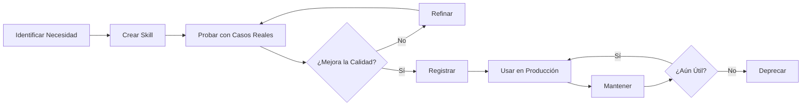

# AURORA Skills - Capacidades Especializadas para GitHub Copilot

Este directorio contiene **skills** personalizados que proporcionan conocimiento de dominio especializado y flujos de trabajo refinados para GitHub Copilot.

## ¿Qué es un Skill?

Un skill es un conjunto de instrucciones especializadas que GitHub Copilot lee ANTES de responder a solicitudes en dominios específicos. Piensa en los skills como "expertos consultores" que Copilot consulta automáticamente cuando trabajas en áreas específicas.

## Skills Disponibles

| Skill                     | Descripción                   | Cuándo Usar               |
| ------------------------- | ----------------------------- | ------------------------- |
| [new-skill](./new-skill/) | Guía para crear nuevos skills | Al crear o mejorar skills |

## Cómo Funcionan los Skills

### 1. Detección Automática

Copilot detecta automáticamente qué skill necesita basándose en:

- Palabras clave en tu solicitud
- Archivos que estás editando
- Contexto del proyecto

### 2. Carga Bloqueante

Cuando un skill aplica, Copilot:

1. **DEBE** leer el archivo `SKILL.md` primero
2. Aplica las instrucciones del skill
3. Genera la respuesta siguiendo el skill

### 3. Combinación de Skills

Múltiples skills pueden activarse simultáneamente para tareas complejas.

## Estructura de un Skill

```
skill-name/
├── SKILL.md           # Instrucciones principales (REQUERIDO)
├── examples/          # Ejemplos de uso (OPCIONAL)
│   ├── example-1.md
│   └── example-2.md
├── templates/         # Plantillas reutilizables (OPCIONAL)
│   └── template.md
└── README.md          # Documentación adicional (OPCIONAL)
```

## Crear un Nuevo Skill

### Opción 1: Usar el Skill de Desarrollo (Recomendado)

```
Pregunta a Copilot: "Ayúdame a crear un skill para [dominio]"
```

Copilot automáticamente:

1. Leerá el skill de desarrollo
2. Te guiará en la creación
3. Seguirá las mejores prácticas

### Opción 2: Usar la Plantilla

```bash
# 1. Crear directorio
mkdir -p .github/skills/nuevo-skill

# 2. Copiar plantilla
cp .github/skills/new-skill/templates/skill-template.md .github/skills/nuevo-skill/SKILL.md

# 3. Editar y personalizar
code .github/skills/nuevo-skill/SKILL.md
```

### Opción 3: Desde Cero

Lee [new-skill/SKILL.md](./new-skill/SKILL.md) para una guía completa.

## Registrar un Skill

Después de crear un skill, regístralo en `.github/copilot-instructions.md`:

```markdown
<skills>
<skill>
<name>nombre-del-skill</name>
<description>Descripción breve y cuándo usarlo</description>
<file>f:\repos\aurora-ai\.github\skills\nombre-del-skill\SKILL.md</file>
</skill>
</skills>
```

## Mejores Prácticas

### ✅ DO - Hacer

- **Específico sobre vago**: "REST API Design" > "Programming"
- **Ejemplos concretos**: Incluye código real, no pseudocódigo
- **Criterios medibles**: "Retorna 404 si no existe" > "Maneja errores bien"
- **Explica el por qué**: No solo QUÉ hacer, sino POR QUÉ
- **Mantén actualizado**: Revisa skills cada 3-6 meses

### ❌ DON'T - Evitar

- **No duplicar constitution**: Si está en `memory/constitution.md`, no va aquí
- **No crear skills genéricos**: "Programación general" es demasiado amplio
- **No olvidar ejemplos**: Cada instrucción necesita al menos un ejemplo
- **No usar lenguaje vago**: Sé prescriptivo y específico
- **No crear sin validar**: Prueba el skill con casos reales primero

## Ciclo de Vida de Skills



## Skills Sugeridos para AURORA

### Alta Prioridad

1. ✅ **new-skill** - Creación de skills (IMPLEMENTADO)
2. 🔲 **aurora-testing** - Testing strategies (TDD, BDD, mutation testing)
3. 🔲 **aurora-api-design** - RESTful API design patterns
4. 🔲 **aurora-ddd** - Domain-Driven Design implementation
5. 🔲 **aurora-security** - Security best practices (OWASP)

### Media Prioridad

6. 🔲 **aurora-performance** - Performance optimization
7. 🔲 **aurora-documentation** - Documentation standards
8. 🔲 **aurora-error-handling** - Error handling patterns
9. 🔲 **aurora-database** - Database design and optimization
10. 🔲 **aurora-ci-cd** - CI/CD pipeline best practices

### Baja Prioridad

11. 🔲 **aurora-monitoring** - Observability and logging
12. {aurora-ux\*\* - UX/UI patterns
13. 🔲 **aurora-accessibility** - Accessibility (WCAG)
14. 🔲 **aurora-i18n** - Internationalization
15. 🔲 **aurora-migration** - Legacy code migration

## Comandos Útiles

### Listar todos los skills

```bash
ls -la .github/skills/
```

### Encontrar skills por palabra clave

```bash
grep -r "testing" .github/skills/*/SKILL.md
```

### Validar formato de skills

```bash
# Verificar secciones requeridas
for skill in .github/skills/*/SKILL.md; do
  echo "Validando: $skill"
  grep -E "^## (Descripción|Cuándo Usar|Instrucciones|Ejemplos)" "$skill"
done
```

### Contar líneas de todos los skills

```bash
find .github/skills -name "SKILL.md" -exec wc -l {} +
```

## Métricas de Calidad

Un skill de alta calidad debe:

| Métrica    | Objetivo                       | Cómo Medir               |
| ---------- | ------------------------------ | ------------------------ |
| Longitud   | 100-500 líneas                 | `wc -l SKILL.md`         |
| Ejemplos   | ≥3 ejemplos concretos          | Contar bloques de código |
| Cobertura  | Cubre 80%+ de casos comunes    | Revisión de pares        |
| Claridad   | Entendible sin contexto        | Prueba con nuevo miembro |
| Actualidad | <6 meses desde última revisión | Check git log            |

## FAQ

### ¿Cuántos skills debería tener mi proyecto?

**Respuesta**: Entre 5-20 skills. Comienza con tus dominios más frecuentes y crece orgánicamente según necesidad.

### ¿Qué tan específico debe ser un skill?

**Respuesta**: Lo suficientemente específico para ser accionable, pero no tanto que solo aplique a un caso. Ejemplo:

- ✅ "REST API Error Handling"
- ❌ "Handling 404 errors in GET /users endpoint"

### ¿Puedo tener skills en diferentes idiomas?

**Respuesta**: Sí, pero mantén consistencia. Si el proyecto es multiidioma, considera:

- Un skill por idioma
- O estructura: `skill-name/en/SKILL.md` y `skill-name/es/SKILL.md`

### ¿Cómo sé si un skill está funcionando?

**Respuesta**:

1. Haz una solicitud que debería activarlo
2. Verifica en el log que Copilot leyó el SKILL.md
3. Compara la calidad de respuesta con/sin el skill

### ¿Debo versionar los skills?

**Respuesta**: Sí, usa:

- Changelog en cada SKILL.md
- Commits semánticos: `feat(skills): add aurora-testing skill`
- Tags de versión en cambios mayores

## Contribuir

### Proponer un Nuevo Skill

1. Abre un issue describiendo:
   - Dominio cubierto
   - Casos de uso frecuentes
   - Por qué no puede ir en constitution o agent

2. Si es aprobado, crea un PR con:
   - Skill completo en carpeta dedicada
   - Ejemplos y tests
   - Actualización de este README

### Mejorar un Skill Existente

1. Identifica el problema o mejora
2. Crea un PR con:
   - Cambios en SKILL.md
   - Actualización del Changelog
   - Ejemplos que validan la mejora

## Recursos

### DOCUMENTACIÓN

- 📖 [Guía detallada de creación](./new-skill/SKILL.md)
- 📝 [Plantilla base](./new-skill/templates/skill-template.md)
- 🏛️ [AURORA Methodology](../copilot-instructions.md)

### Herramientas

- [GitHub Copilot Docs](https://docs.github.com/copilot)
- [VS Code Copilot Customization](https://code.visualstudio.com/docs/copilot/customization)

## Soporte

¿Preguntas? ¿Problemas?

1. Revisa [new-skill/SKILL.md](./new-skill/SKILL.md)
2. Pregunta a `@AURORA` en el chat de Copilot
3. Abre un issue en el repositorio

---

**Última actualización**: 2026-02-12
**Mantenido por**: AURORA Team
**Licencia**: MIT
