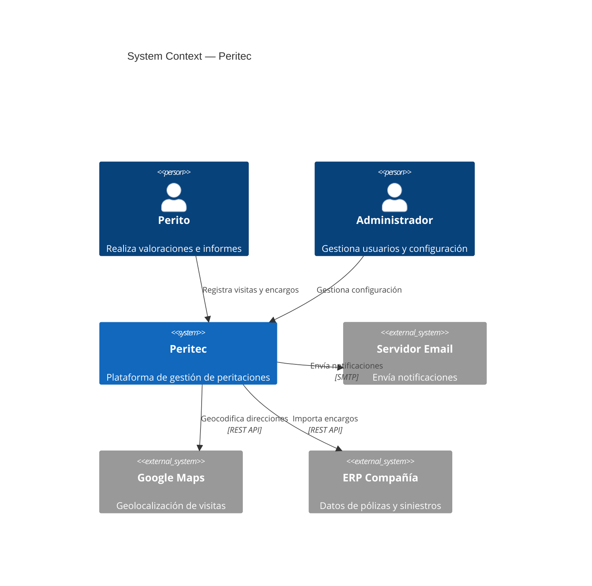
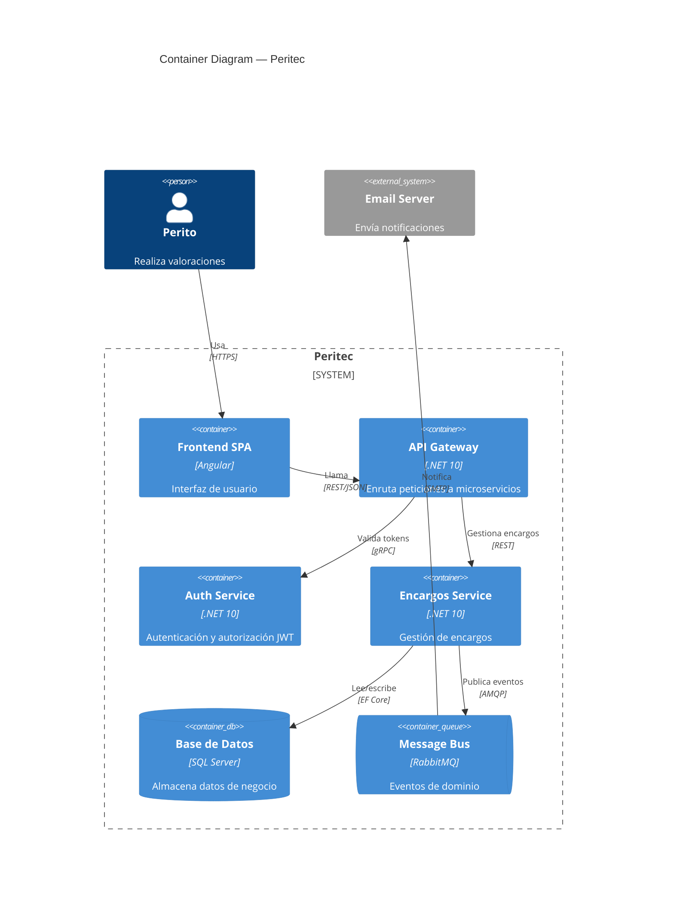
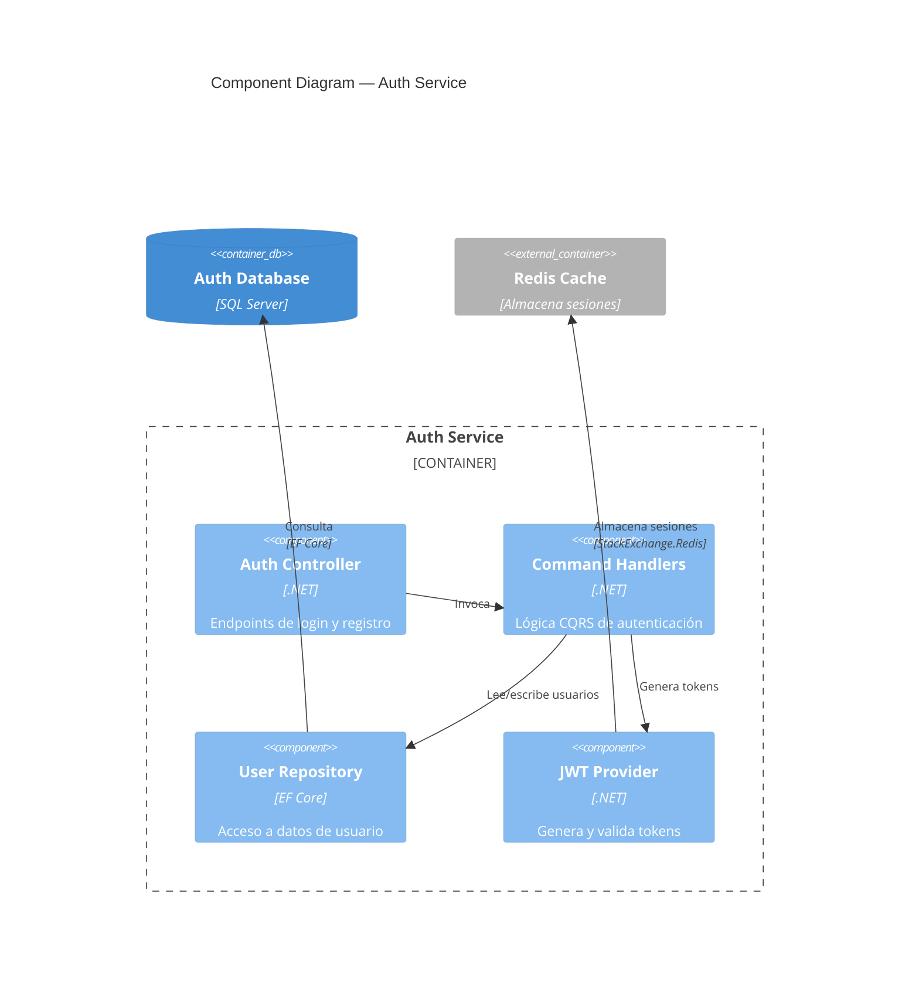

# C4 Architecture Diagrams

C4 diagrams visualize software architecture at four levels of abstraction, from high-level system
context down to code-level detail. They follow the [C4 model](https://c4model.com/) by Simon Brown
and are the preferred diagram type for architecture documentation because teams already understand
the abstraction levels.

## Abstraction Levels

| Level         | Mermaid Keyword   | Shows                                            | Audience               |
| ------------- | ----------------- | ------------------------------------------------ | ---------------------- |
| **Context**   | `C4Context`       | System + external actors and systems              | Everyone               |
| **Container** | `C4Container`     | Applications, databases, services inside a system | Technical stakeholders |
| **Component** | `C4Component`     | Components inside a container                     | Developers             |
| **Code**      | `C4Dynamic`       | Dynamic interactions at code level                | Developers             |

Start at Context level and zoom in only when more detail is needed. Most architecture documentation
needs only Context and Container levels.

## Elements

### People and Systems

```text
Person(alias, "Label", "Description")
Person_Ext(alias, "Label", "Description")

System(alias, "Label", "Description")
System_Ext(alias, "Label", "Description")
SystemDb(alias, "Label", "Description")
SystemQueue(alias, "Label", "Description")
```

- `_Ext` suffix marks external actors or systems (outside your boundary)
- `Db` suffix renders as a database cylinder
- `Queue` suffix renders as a queue shape

### Containers and Components

```text
Container(alias, "Label", "Technology", "Description")
ContainerDb(alias, "Label", "Technology", "Description")
ContainerQueue(alias, "Label", "Technology", "Description")
ContainerQueue_Ext(alias, "Label", "Technology", "Description")

Component(alias, "Label", "Technology", "Description")
ComponentDb(alias, "Label", "Technology", "Description")
```

### Relationships

```text
Rel(from, to, "Label")
Rel(from, to, "Label", "Technology")
BiRel(from, to, "Label")
```

### Boundaries

Group elements inside boundaries to show ownership or deployment context:

```text
Boundary(alias, "Label") {
    System(a, "System A", "Description")
    System(b, "System B", "Description")
}

Enterprise_Boundary(alias, "Label") { ... }
System_Boundary(alias, "Label") { ... }
Container_Boundary(alias, "Label") { ... }
```

## Context Diagram

Shows the system in its environment — who uses it and what external systems it integrates with.
This is the most common starting point:



**Example**: `assets/examples/other/c4-context.mmd`

## Container Diagram

Zooms into a system to show the applications, databases, and services that compose it:



## Component Diagram

Zooms into a container to show its internal components:



## Best Practices

- **Start at Context level** — only zoom in when the audience needs more detail
- **Label all relationships** with the action verb (e.g., "Envía notificaciones", not just "Uses")
- **Include technology** in Container and Component diagrams (the third parameter) — it helps
  readers understand the stack at a glance
- **Mark external systems** with `_Ext` — the visual distinction between internal and external
  systems is the key insight a C4 diagram provides
- **Use boundaries** to group related containers — `System_Boundary`, `Container_Boundary`
- **Keep descriptions short** — one line that explains *what* the element does, not *how*
- **One diagram per level** — don't mix Context-level elements with Component-level detail in the
  same diagram. Each level tells a different story to a different audience
