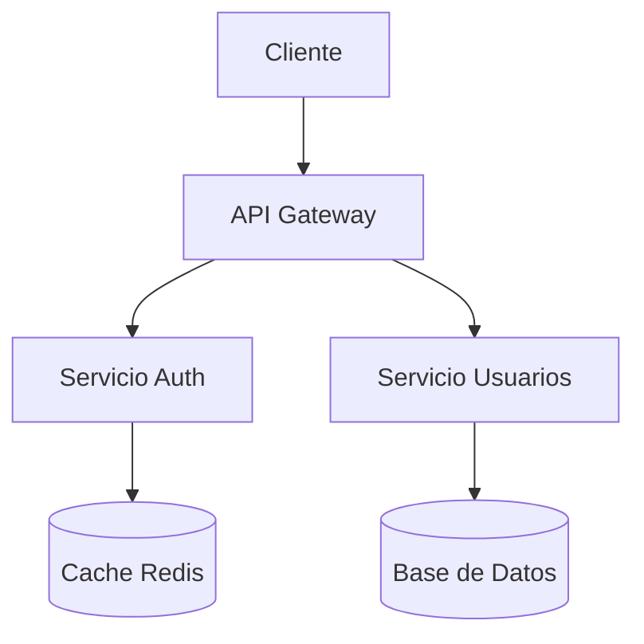
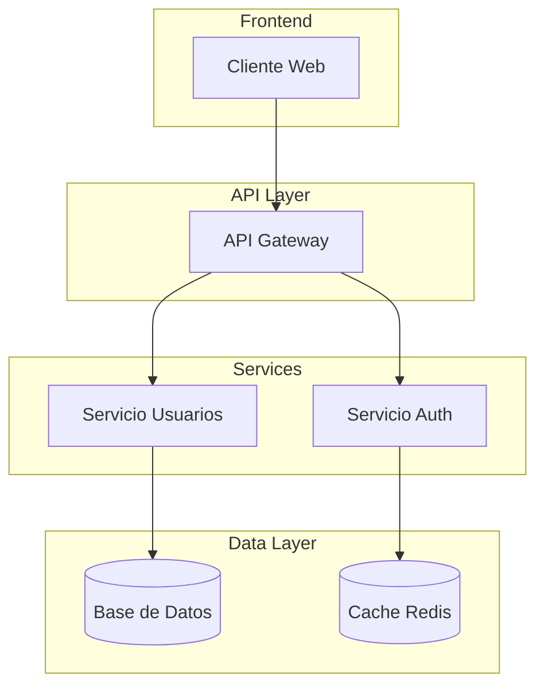
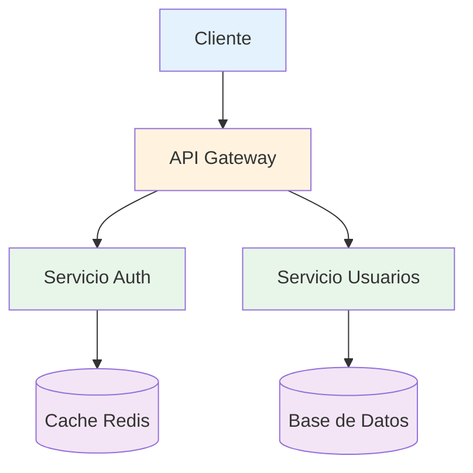

# Ejemplo: Diagrama de Arquitectura Básica

Este es un ejemplo básico de cómo representar una arquitectura simple con servicios y bases de datos usando Mermaid.

## Caso de Uso

Documentar una arquitectura típica de aplicación web con API Gateway, servicios de autenticación y usuarios.

## Diagrama

## Cuándo Usar

- Decisiones sobre arquitectura de servicios
- Mostrar flujo básico de datos
- Documentar componentes principales del sistema
- ADRs sobre patrones arquitectónicos

## Variaciones

### Con Subgrafos (Capas)

### Con Estilos (Colores)

## Referencias

- [Mermaid Flowchart Docs](https://mermaid.js.org/syntax/flowchart.html)
- Usado en: `skill-bolt-adr/SKILL.md`
