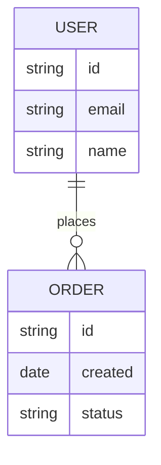
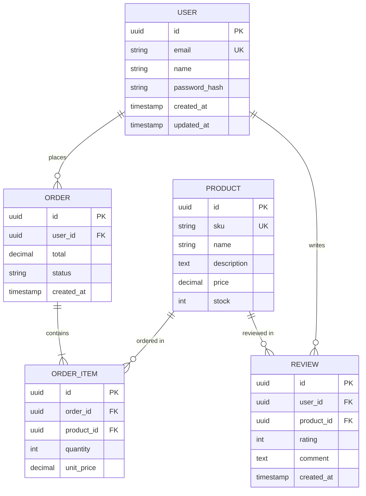
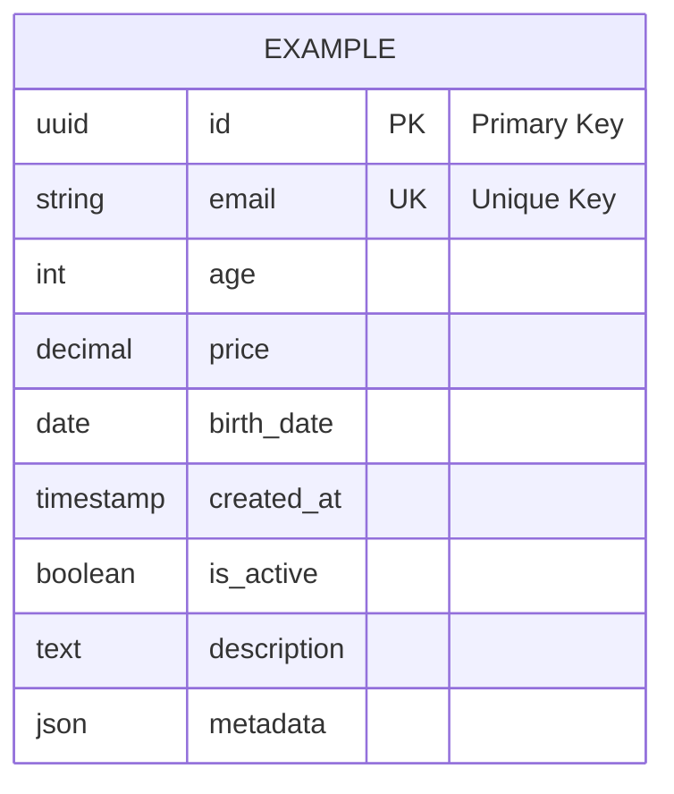
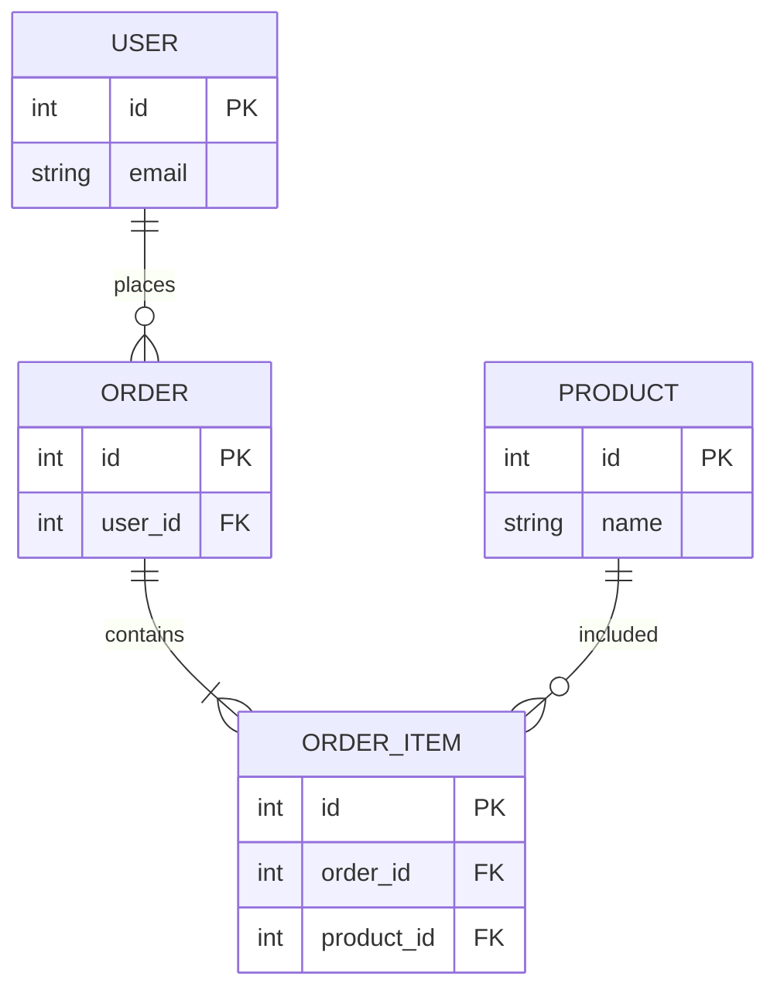

# Ejemplo: Diagrama de Modelo de Datos (ER Diagram)

Ejemplo de cómo documentar decisiones sobre modelos de datos usando diagramas ER (Entity-Relationship) con Mermaid.

## Caso de Uso

ADR que define o modifica el modelo de datos, típicamente para decisiones sobre:

- Elección de base de datos (SQL vs NoSQL)
- Diseño de schemas
- Relaciones entre entidades
- Normalización vs desnormalización

## Diagrama - Modelo Básico Usuario-Pedidos



## Descripción del Modelo

- **USER**: Entidad principal de usuarios
- **ORDER**: Pedidos realizados por usuarios
- **Relación**: Un usuario puede tener cero o muchos pedidos (1:N)

## Modelo Completo - E-commerce



## Cardinalidades en Mermaid ER

| Símbolo      | Significado        | Ejemplo                                |
| ------------ | ------------------ | -------------------------------------- |
| `\|\|--o{`   | One-to-Many        | Un usuario tiene muchos pedidos        |
| `\|\|--\|\|` | One-to-One         | Un usuario tiene un perfil             |
| `}o--o{`     | Many-to-Many       | Productos tienen muchas categorías     |
| `\|\|--o\|`  | One-to-Zero-or-One | Usuario puede tener un avatar opcional |

## Tipos de Datos Comunes



## Modelo con Decisión: SQL vs NoSQL

### Opción 1: SQL Normalizado



**Pros:**

- ✅ Sin duplicación de datos
- ✅ Consistencia fuerte
- ✅ Fácil de actualizar

**Cons:**

- ❌ Múltiples JOINs para consultas
- ❌ Más lento en lectura

### Opción 2: NoSQL Desnormalizado (Documento)

```json
// User Document
{
  "id": "user_123",
  "email": "user@example.com",
  "orders": [
    {
      "id": "order_456",
      "items": [
        {
          "product_id": "prod_789",
          "product_name": "Widget",
          "quantity": 2
        }
      ]
    }
  ]
}
```

**Pros:**

- ✅ Rápido en lectura (1 query)
- ✅ Escala horizontalmente fácil

**Cons:**

- ❌ Duplicación de datos (product_name)
- ❌ Actualización compleja

## Uso en ADRs

### ADR de Base de Datos

```markdown
## Considered Options

### Option 1: PostgreSQL (Relational)

**Data Model:**

[Insertar diagrama ER normalizado]

**Pros:**

- ACID compliance
- Relaciones complejas

### Option 2: MongoDB (Document)

**Data Model:**

[Insertar estructura JSON]

**Pros:**

- Flexible schema
- Alta performance en lectura
```

## Cuándo Usar ER Diagrams

| Tipo de Decisión | Cuándo Usar ER                       |
| ---------------- | ------------------------------------ |
| Elección de DB   | ✅ Mostrar modelo en cada opción     |
| Schema design    | ✅ Visualizar entidades y relaciones |
| Migration        | ✅ Comparar before/after             |
| Data integrity   | ✅ Documentar constraints FK/UK      |

## Tips para ER Diagrams

1. **Claves**: Siempre marcar PK (Primary Key) y FK (Foreign Key)
2. **Tipos**: Incluir tipos de datos para claridad
3. **Cardinalidad**: Ser explícito sobre relaciones (1:1, 1:N, N:M)
4. **Constraints**: Documentar UK (Unique), NOT NULL, etc.
5. **Índices**: Mencionar en descripción si son críticos para la decisión

## Herramientas Complementarias

- **Mermaid ER**: Para documentación en Markdown/GitHub
- **dbdiagram.io**: Para diseño más complejo, exportar a SQL
- **PlantUML**: Alternativa con más opciones de personalización

## Referencias

- [Mermaid ER Diagram Docs](https://mermaid.js.org/syntax/entityRelationshipDiagram.html)
- Usado en: `skill-bolt-adr/SKILL.md`
- Tipo: Decisiones de Datos (DATA)
