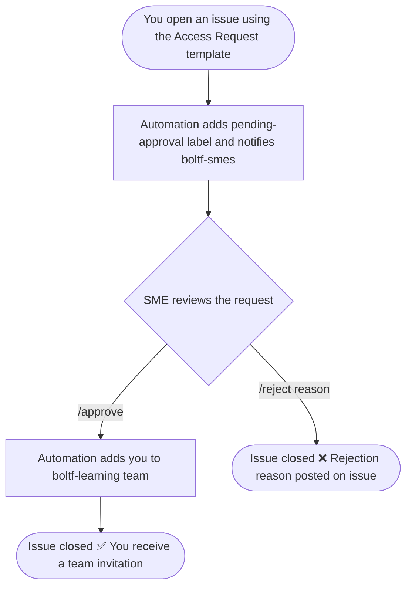

# Requesting Access to the Bolt Framework Repository

This document explains how to request access to this repository and what to expect once your request is submitted.

## Prerequisites

- You must be an **Avanade organisation member** on GitHub.
- You must have a valid **Avanade email address** (`@avanade.com`).

## How to Request Access

### Step 1 — Open an access request issue

Go to the [Issues tab](../../../issues/new/choose) and select the **🔐 Repository Access Request** template.

Fill in all required fields:

| Field                      | Description                                                       |
| -------------------------- | ----------------------------------------------------------------- |
| **Avanade Email**          | Your corporate email address (e.g. `user@avanade.com`)            |
| **GitHub Username**        | Your GitHub handle without the `@` (e.g. `octocat`)               |
| **Requested Access Level** | Choose one: `Read`, `Triage`, `Write (contribute)`, or `Maintain` |

> The issue title is pre-filled as `[Access] Access request for @YOUR_USERNAME`. Replace `YOUR_USERNAME` with your actual GitHub handle before submitting.

### Step 2 — Wait for SME review

Once submitted, automation will:

1. Label the issue as `pending-approval`.
2. Notify the **@Avanade-Region-Spain/boltf-smes** team and assign reviewers.
3. Post a comment on your issue confirming that the review is in progress.

You do not need to take any further action at this point.

### Step 3 — Decision notification

A member of the `boltf-smes` team will review your request and post one of the following commands on the issue:

- `/approve` — your request is approved.
- `/reject <reason>` — your request is rejected with an explanation.

You will receive a GitHub notification when a decision is posted.

### Step 4 — Access granted

If approved, the automation will:

1. Add your GitHub account to the **`boltf-learning`** team, granting the requested access.
2. Add the `access-granted` label and close the issue automatically.

You will receive a **GitHub team invitation** in your notifications. Accept it to complete the process.

## Access Levels Reference

| Level                  | Permissions                                                 |
| ---------------------- | ----------------------------------------------------------- |
| **Read**               | View and clone the repository                               |
| **Triage**             | Read + manage issues and pull requests (no code push)       |
| **Write (contribute)** | Triage + push branches and open pull requests               |
| **Maintain**           | Write + manage repository settings (no destructive actions) |

## Process Overview

## FAQ

**How long does the review take?**
There is no guaranteed SLA. The `boltf-smes` team is notified immediately, but review times depend on team availability.

**My issue was closed without action — what happened?**
Check the comments on your issue for a rejection reason. If the issue was closed in error, re-open it or contact a member of `@Avanade-Region-Spain/boltf-smes` directly.

**I was approved but did not receive a team invitation.**
Ensure the GitHub Username you provided in the issue form is correct. If the problem persists, ask a team member to re-open the issue and reprocess it.

**Can I request a higher access level later?**
Yes. Open a new access request issue selecting the desired level.
