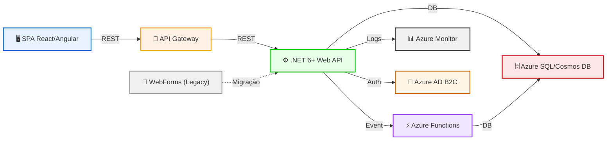

# Arquitetura Proposta
 
## Visão Geral
 
A arquitetura proposta visa modernizar a aplicação, promovendo desacoplamento, segurança, escalabilidade e facilidade de manutenção, alinhada com práticas cloud-native e serviços Azure.
 
## Diagrama de Arquitetura (Mermaid)
 

 
## Componentes Principais
 
- **Frontend SPA:** Aplicação moderna (React/Angular) para UI responsiva
- **API Gateway:** Centraliza autenticação, logging e roteamento
- **Web API (.NET 6+):** Lógica de negócio, exposta via REST
- **Azure Functions:** Processamento assíncrono e integração
- **Base de Dados:** Azure SQL Database ou Cosmos DB
- **Monitorização:** Azure Monitor, Application Insights
- **Autenticação:** Azure AD B2C/Entra ID
- **Integração Legada:** WebForms em modo read-only durante transição
 
## Estratégia de Migração
 
- **Fase 1:** Rehost WebForms em Azure App Service
- **Fase 2:** Extrair APIs e lógica de negócio para .NET 6+
- **Fase 3:** Migrar UI para SPA
- **Fase 4:** Substituir integrações e módulos legados
 
## Benefícios Esperados
 
- Redução de riscos de segurança
- Facilidade de manutenção e evolução
- Escalabilidade horizontal
- Observabilidade e automação
 
## Considerações Técnicas
 
- Utilização de pipelines CI/CD (GitHub Actions/Azure DevOps)
- Infraestrutura como código (Bicep/Terraform)
- Gestão centralizada de segredos (Key Vault)
- Monitorização contínua e alertas
 