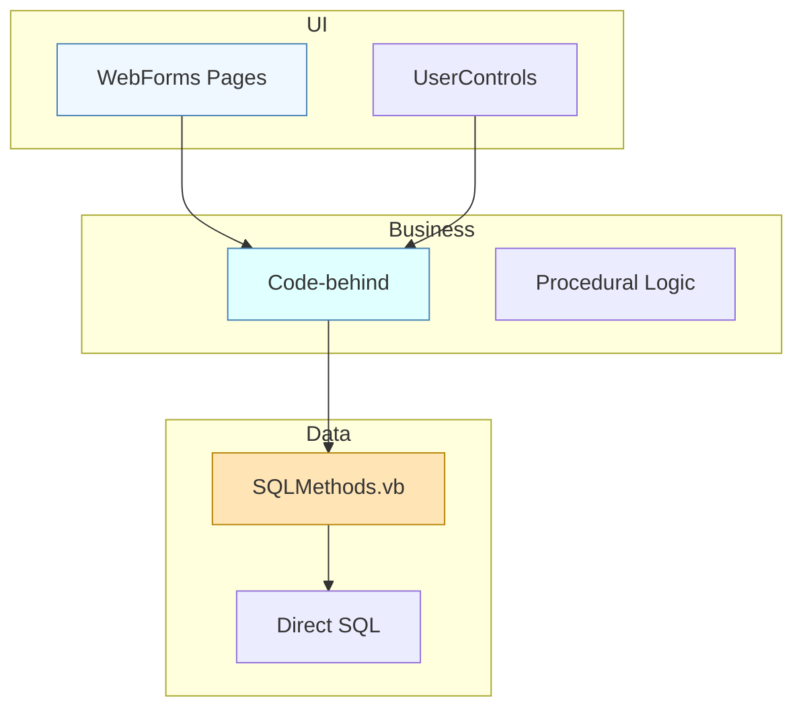

# Arquitetura Atual
 
## Inventário Tecnológico
 
| Linguagem/Framework           | Nº Ficheiros |
|------------------------------|--------------|
| Visual Basic / VB.NET        | 44           |
| ASP.NET Web Forms            | 24           |
| CSS                          | 4            |
| JavaScript                   | 2            |
| C# (markup)                  | 1            |
 
### Principais Dependências
 
| Dependência                                 | Ocorrências |
|---------------------------------------------|-------------|
| System.Configuration.ConfigurationManager   | 17          |
| System.Web.UI                              | 16          |
| System.Data                                | 14          |
| System.Data.SqlClient                      | 7           |
| MasterPage.master                          | 7           |
| SQLMethods (custom data access class)       | 5           |
| RJS.Web.WebControl.PopCalendar.Net.2008     | 2           |
 
## Padrões Arquiteturais Identificados
 
- Monólito WebForms
- Data Access Layer procedural
- Code-behind com lógica de negócio
- Gateway de dados sem ORM
- Elevada duplicação de UserControls e métodos de acesso a dados
 
## Anti-Padrões
 
- Concatenar SQL sem parametrização
- Mistura de lógica de apresentação, negócio e dados
- Ausência de separação de responsabilidades
- Duplicação de ficheiros e lógica
 
## Violações de Código por Severidade
 
| Severidade | Nº Ocorrências |
|------------|---------------|
| Crítico    | 29            |
| Alto       | 20            |
| Médio      | 39            |
| Baixo      | 5             |
 
## Diagrama de Arquitetura Atual
 

 
## Estrutura de Ficheiros
 
- Elevada redundância de ficheiros SQLMethods e UserControls
- Estrutura baseada em pastas por funcionalidade, mas sem isolamento de camadas
 

Ver Lista de Ficheiros Mais Críticos

 
- SQLMethods.vb (várias cópias)
- ActivarCartoes.ascx.vb
- LogHistorico.ascx.vb
- Default.aspx.vb
- DataSync.vb
- PopCalendarAjaxNet.js
- Logs.vb
- Visitantes.ascx.vb
- MonSeg.aspx.vb
- Circuitos.ascx.vb
 

