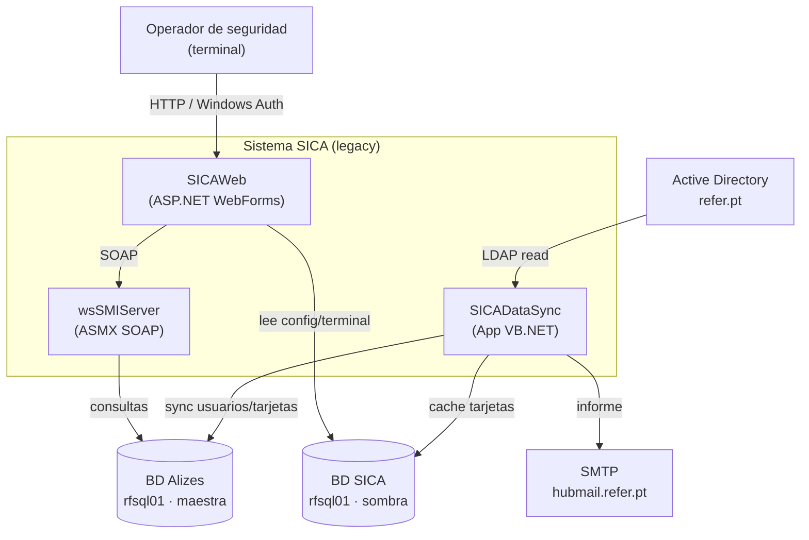
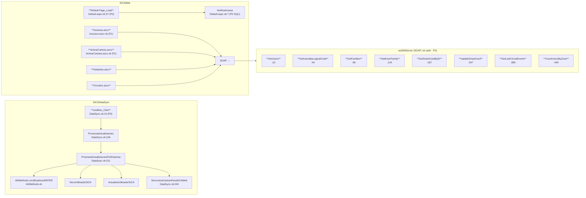
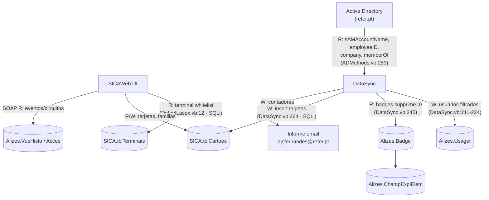
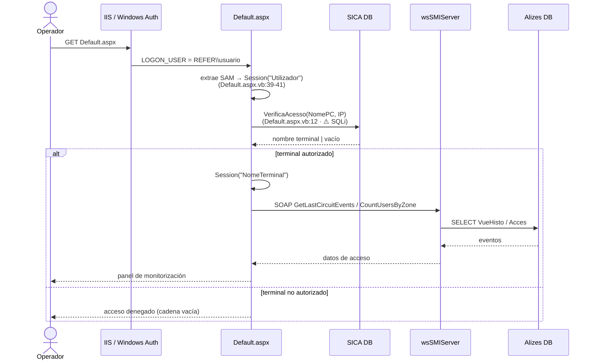
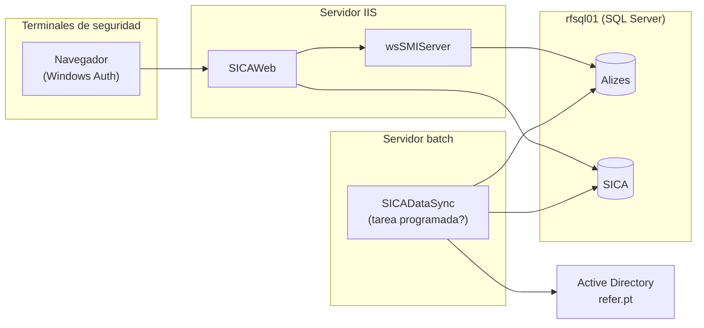

# SICA — Topología del Sistema Legacy

> **Sistema**: SICA (Sistema Integrado de Controlo de Acessos)
> **Fase Bolt**: DISCOVERY (brownfield)
> **Fuente**: `demo/from_old_src/`
> **Propósito**: Mapa de componentes, call graph, data lineage y ruta crítica.

---

## 1. Contexto del sistema (C4 — nivel 1)

---

## 2. Componentes y puntos de entrada (call graph)

Los puntos de entrada se resaltan con **negrita**. Severidad de seguridad entre paréntesis.

---

## 3. Data lineage (flujo de datos extremo a extremo)

| Almacén                | Lectura por                                  | Escritura por                         |
| ---------------------- | -------------------------------------------- | ------------------------------------- |
| Active Directory       | `SICADataSync` (ADMethods)                    | — (solo lectura)                      |
| `Alizes.Usager`        | `SICADataSync`, `wsSMIServer`                 | `SICADataSync`                        |
| `Alizes.Badge`         | `SICADataSync`, `wsSMIServer`                 | `wsSMIServer` (UpdateSmartCard)       |
| `SICA.tblCartoes`      | `SICAWeb`, `SICADataSync`                     | `SICADataSync`, `SICAWeb` (Acessos)   |
| `SICA.tblTerminais`    | `SICAWeb` (VerificaAcesso)                    | — (administración manual)             |
| `Alizes.VueHisto`      | `wsSMIServer` (GetLastCircuitEvents)          | — (solo lectura)                      |

---

## 4. Ruta crítica — Autorización de un acceso en terminal

> ⚠️ La única frontera de autorización efectiva es `VerificaAcesso`. Si la inyección SQL en
> `Default.aspx.vb:12` se explota, se evita **todo** el control de acceso.

---

## 5. Mapa de despliegue (inferido)

---

## 6. Confianza y gaps

- **Confianza**: Alta para componentes y call graph (verificados con `fichero:línea`);
  Media para el mapa de despliegue (inferido, sin acceso a la infraestructura real).
- **Gaps**:
  - La separación física de servidores (IIS vs batch) es una inferencia.
  - No se confirmó si `SICADataSync` corre como servicio Windows o tarea programada.
  - Faltan por mapear los UserControls de detalle (`DetalheLog`, `DetalheUtilizador`, etc.).
