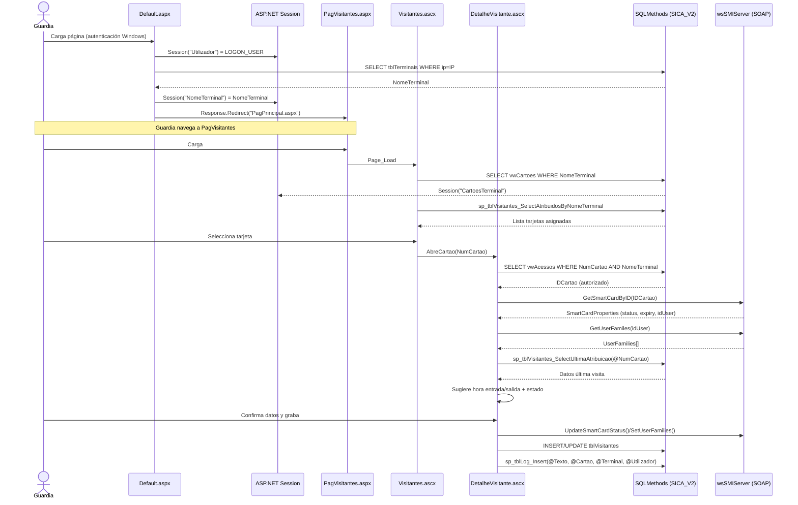

# TOPOLOGY — SICAWeb (Legacy)

> **Fase Bolt**: DISCOVERY (brownfield)
> **Fecha**: 2026-06-24
> **Fuente**: `demo/from_old_src/SICAWeb/SICAWeb/`

---

## 1. Call Graph — agrupado por dominio

```mermaid
graph TB
    subgraph Entry["Puntos de entrada (ASPX)"]
        DEFAULT["Default.aspx\n[Terminal Login]"]
        PAG_PRINCIPAL["PagPrincipal.aspx\n[Dashboard]"]
        PAG_VISITANTES["PagVisitantes.aspx\n[Visitantes]"]
        PAG_ZONAS["PagZonas.aspx\n[Zonas]"]
        PAG_HISTORICO["PagHistorico.aspx\n[Histórico]"]
        PAG_CONFIG["PagConfigAcessos.aspx\n[Config - restringido]"]
        PAG_ALARMES["PagAlarmes.aspx\n[Alarmas]"]
    end

    subgraph UC_Dashboard["UC: Monitorización acceso (PagPrincipal)"]
        CIRCUITOS["Circuitos.ascx\n[Selección circuito]"]
        LOG_PORTA["LogPorta.ascx\n[Eventos recientes]"]
        DETALHE_USER["DetalheUtilizador.ascx\n[Foto + datos empleado]"]
        ACTIVAR["ActivarCartoes.ascx\n[Activar tarjeta visitante]"]
    end

    subgraph UC_Visitantes["UC: Gestión visitantes (PagVisitantes)"]
        VISITANTES["Visitantes.ascx\n[Tarjetas asignadas]"]
        DETALHE_VIS["DetalheVisitante.ascx\n[Detalle + alta visitante]"]
    end

    subgraph UC_Zonas["UC: Zonas (PagZonas)"]
        RESUMO["ResumoZonas.ascx\n[Conteo por zona]"]
        ALARMES["Alarmes.ascx\n[Panel alarmas]"]
    end

    subgraph UC_Historico["UC: Histórico (PagHistorico)"]
        LOG_HIST["LogHistorico.ascx\n[Búsqueda movimientos]"]
    end

    subgraph UC_Config["UC: Config accesos (PagConfigAcessos) - restringida"]
        ACESSOS["Acessos.ascx\n[Gestión tarjetas/familias/circuitos por terminal]"]
    end

    subgraph DAL["DAL - App_Code"]
        SQL["SQLMethods.vb\n[SelectQuery / SP / UpdateQuery]"]
        DNS["DNSClass.vb\n[DNS lookup]"]
    end

    subgraph External["Externos"]
        SMI["SMIMethodsWebService\n(wsSMIServer SOAP)"]
        DB_SICA[("SQL Server\nSICA_V2")]
        DB_AD[("SQL Server\nActiveDirectory")]
        DB_ALIZES[("SQL Server\nAlizes/REFER")]
    end

    DEFAULT -->|"InicializeConnSQL"| SQL
    DEFAULT -->|"Session(NomeTerminal)"| PAG_PRINCIPAL

    PAG_PRINCIPAL --> CIRCUITOS
    PAG_PRINCIPAL --> LOG_PORTA
    PAG_PRINCIPAL --> DETALHE_USER
    PAG_PRINCIPAL --> ACTIVAR

    PAG_VISITANTES --> VISITANTES
    PAG_VISITANTES --> DETALHE_VIS

    PAG_ZONAS --> RESUMO
    PAG_ZONAS --> ALARMES

    PAG_HISTORICO --> LOG_HIST
    PAG_CONFIG --> ACESSOS

    CIRCUITOS -->|"SelectVwCircuitosByNomeTerminal SP"| SQL
    CIRCUITOS -->|"GetLastCircuitEvents()"| SMI
    CIRCUITOS --> LOG_PORTA
    CIRCUITOS --> DETALHE_USER

    LOG_PORTA -->|"GetLastCircuitEvents()"| SMI

    DETALHE_USER -->|"SELECT wWWHomePage"| SQL
    DETALHE_USER --> DB_AD

    ACTIVAR -->|"SELECT vwFamilias / vwREFERVisitantes"| SQL
    ACTIVAR -->|"GetExternalSmartCards()"| SMI
    ACTIVAR -->|"sp_tblLog_Insert"| SQL
    ACTIVAR --> DB_ALIZES

    VISITANTES -->|"sp_tblVisitantes_SelectAtribuidosByNomeTerminal"| SQL
    VISITANTES -->|"sp_tblLog_Insert"| SQL
    VISITANTES --> DB_SICA

    DETALHE_VIS -->|"SELECT vwAcessos"| SQL
    DETALHE_VIS -->|"GetSmartCardByID()"| SMI
    DETALHE_VIS -->|"GetUserFamiles()"| SMI
    DETALHE_VIS -->|"sp_tblVisitantes_SelectUltimaAtribuicao"| SQL
    DETALHE_VIS --> DB_SICA

    RESUMO -->|"CountUsersByZone()"| SMI
    RESUMO -->|"GetUsersByZone()"| SMI

    LOG_HIST -->|"SELECT vwREFERLog"| SQL
    LOG_HIST --> DB_ALIZES

    ACESSOS -->|"SELECT vwTerminais / tblCartoes / tblFamilias / tblCircuitos"| SQL
    ACESSOS -->|"DELETE/INSERT tblCartoesTerminal etc."| SQL
    ACESSOS -->|"GetExternalSmartCards()"| SMI
    ACESSOS -->|"GetFamilies()"| SMI
    ACESSOS -->|"GetCircuits()"| SMI
    ACESSOS --> DB_SICA

    SQL --> DB_SICA
    SQL --> DB_AD
    SQL --> DB_ALIZES
```

---

## 2. Data Lineage — módulos ↔ almacenes

| Módulo | Lee de | Escribe en | BD |
|---|---|---|---|
| `Default.aspx.vb` | `tblTerminais` | — | SICA_V2 |
| `Acessos.ascx.vb` | `vwTerminais`, `tblCartoes`, `tblFamilias`, `tblCircuitos`, `tblCartoesTerminal`, `tblFamiliasTerminal`, `tblCircuitosTerminal` | `tblCartoes`, `tblFamilias`, `tblCircuitos`, `tblCartoesTerminal`, `tblFamiliasTerminal`, `tblCircuitosTerminal` | SICA_V2 + SMI |
| `ActivarCartoes.ascx.vb` | `vwFamilias`, `vwREFERFamilias`, `vwREFERVisitantes`, `Session(CartoesTerminal)` | `tblLog` (via SP) + BD Alizes (via SMI) | SICA_V2, Alizes |
| `Visitantes.ascx.vb` | `vwCartoes`, `sp_tblVisitantes_SelectAtribuidosByNomeTerminal` | `tblLog` (via SP) | SICA_V2 |
| `DetalheVisitante.ascx.vb` | `vwAcessos`, `sp_tblVisitantes_SelectUltimaAtribuicao` | `tblVisitantes`, estado en SMI | SICA_V2 + SMI |
| `LogPorta.ascx.vb` | SMI: `GetLastCircuitEvents()` | — | SMI (hardware) |
| `DetalheUtilizador.ascx.vb` | `tblAD_AD_SQL` (employeeID → wWWHomePage) | — | ActiveDirectory |
| `Circuitos.ascx.vb` | `SelectVwCircuitosByNomeTerminal`, `tblCircuitos` | — | SICA_V2 |
| `ResumoZonas.ascx.vb` | SMI: `CountUsersByZone()`, `GetUsersByZone()` | — | SMI |
| `LogHistorico.ascx.vb` | `vwREFERLog`, `vwREFERCircuitos` | — | Alizes/REFER |

---

## 3. Ruta crítica — flujo end-to-end "Acceso de visitante"

---

## 4. Acoplamientos críticos / SPOFs

| SPOF | Descripción | Riesgo |
|---|---|---|
| **wsSMIServer** | Único punto de integración con el hardware de acceso. Sin él, la aplicación no puede leer eventos, ni actualizar estado de tarjetas, ni consultar zonas. Sin contrato formal ni mock. | 🔴 Crítico |
| **SQL Server `rfsql01`** | Servidor único para tres bases de datos (SICA_V2, ActiveDirectory, Alizes). Sin failover aparente. | 🔴 Crítico |
| **ASP.NET Session** | Estado distribuido en memoria del proceso web. Impide clustering y provoca pérdida de datos en reinicio. | 🟠 Alto |
| **BD Alizes/REFER** | BD externa sobre la que SICAWeb tiene permisos de lectura con la misma cuenta SQL. Acoplamiento oculto. | 🟠 Alto |

---

## 5. Candidatos a extracción prioritaria

| Candidato | Razón |
|---|---|
| **SMI Anti-Corruption Layer** | Aislar el SOAP client detrás de una interfaz — permite mockear, versionar y sustituir el hardware | 
| **TerminalAuthorizationService** | Lógica de `Default.aspx.vb` (validar terminal por IP/nombre) → Service puro sin HTTP |
| **VisitorAssignmentService** | Lógica de `DetalheVisitante.ascx.vb` (~200 LOC) — reglas de negocio más densas del sistema |
| **AccessProfileService** | Lógica de `Acessos.ascx.vb` — sincronización SICA ↔ SMI para cartoes/familias/circuitos |
| **AccessEventQueryService** | `LogHistorico.ascx.vb` — consulta temporal de eventos con lógica de entrada/salida |
